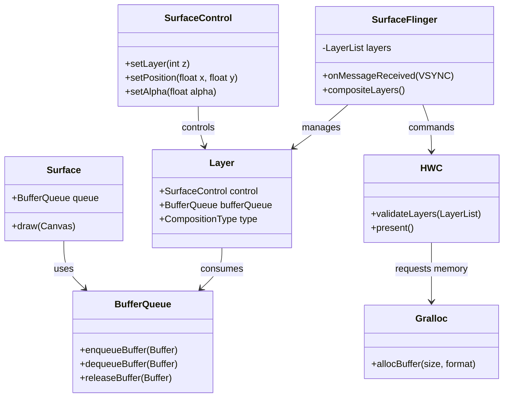
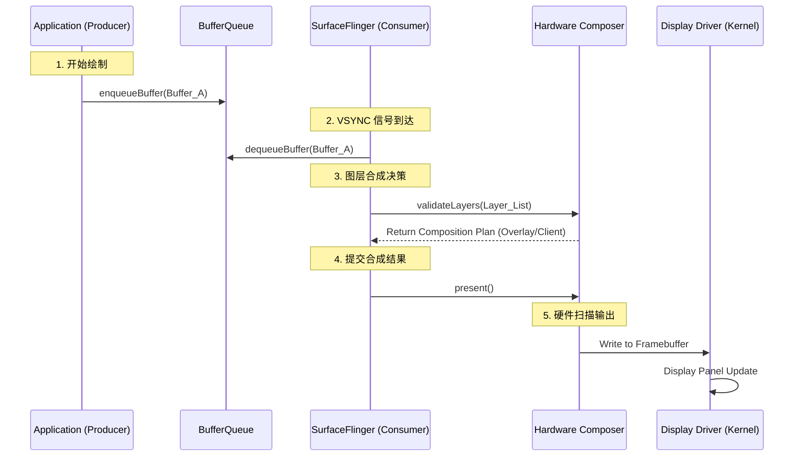

### 文档 2：设计逻辑与 UML 建模 (`Design_Logic.md`)

# Android 显示子系统设计逻辑

## 1. 类图 (Class Diagram)
展示了从应用层到硬件抽象层的类关系。

```mermaid
classDiagram
    class Surface {
        +BufferQueue queue
        +draw(Canvas)
    }
    class SurfaceControl {
        +setLayer(int z)
        +setPosition(float x, float y)
        +setAlpha(float alpha)
    }
    class BufferQueue {
        +enqueueBuffer(Buffer)
        +dequeueBuffer(Buffer)
        +releaseBuffer(Buffer)
    }
    class SurfaceFlinger {
        -LayerList layers
        +onMessageReceived(VSYNC)
        +compositeLayers()
    }
    class Layer {
        +SurfaceControl control
        +BufferQueue bufferQueue
        +CompositionType type
    }
    class HWC {
        +validateLayers(LayerList)
        +present()
    }
    class Gralloc {
        +allocBuffer(size, format)
    }

    Surface --> BufferQueue : uses
    SurfaceControl --> Layer : controls
    SurfaceFlinger --> Layer : manages
    SurfaceFlinger --> HWC : commands
    Layer --> BufferQueue : consumes
    HWC --> Gralloc : requests memory
```

## 2. 渲染流水线时序图 (Sequence Diagram)
展示了一帧从 App 绘制到屏幕显示的过程。

```mermaid
sequenceDiagram
    participant App as Application (Producer)
    participant BQ as BufferQueue
    participant SF as SurfaceFlinger (Consumer)
    participant HWC as Hardware Composer
    participant DR as Display Driver (Kernel)

    Note over App: 1. 开始绘制
    App->>BQ: enqueueBuffer(Buffer_A)

    Note over SF: 2. VSYNC 信号到达
    SF->>BQ: dequeueBuffer(Buffer_A)

    Note over SF: 3. 图层合成决策
    SF->>HWC: validateLayers(Layer_List)
    HWC-->>SF: Return Composition Plan (Overlay/Client)

    Note over SF: 4. 提交合成结果
    SF->>HWC: present()

    Note over HWC: 5. 硬件扫描输出
    HWC->>DR: Write to Framebuffer
    DR->>DR: Display Panel Update
```