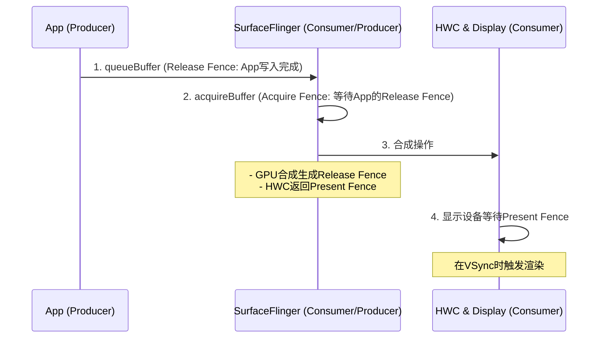

## Android 图形系统中的 Fence 关系

在 Android 图形系统中，**Fence（同步栅栏）** 是确保图形缓冲区（Buffer）在生产者（Producer）和消费者（Consumer）之间正确同步的核心机制。从应用程序（App）到 SurfaceFlinger 再到硬件合成器（HWC）的整个送显流程中，涉及多个 Fence 的创建、传递和同步。

---

### **核心概念**

- **Fence 的作用**：确保缓冲区在不同组件间的读写顺序，避免数据竞争（例如：生产者未完成写入，消费者就开始读取）。
    
- **Fence 的类型**：
    
    - **Acquire Fence**：消费者在读取缓冲区前需要等待的同步信号。
        
    - **Release Fence**：生产者在释放缓冲区后需要等待的同步信号。
        
    - **Present Fence**：用于同步显示设备（Display）的帧提交。
        

---

### **从 App 到 SurfaceFlinger 的流程**

#### **(1) 应用程序生成缓冲区**

- 应用程序通过 `Surface`（生产者）将图形数据写入 `BufferQueue`。
    
- **关键步骤**：
    
    1. **dequeueBuffer**：从 `BufferQueue` 获取一个空闲缓冲区（Buffer）。
        
    2. **queueBuffer**：将绘制完成的缓冲区提交回 `BufferQueue`，并附带一个 **Release Fence**。
        
        - 该 Fence 表示“生产者（App）完成写入操作的时间点”。
            

#### **(2) BufferQueue 的同步**

- 当 `BufferQueue` 的消费者（SurfaceFlinger）准备使用缓冲区时：
    
    - **acquireBuffer**：从 `BufferQueue` 获取已提交的缓冲区，并附带一个 **Acquire Fence**。
        
        - 该 Fence 表示“消费者（SurfaceFlinger）需要等待的时间点”，确保缓冲区已就绪。
            

---

### **SurfaceFlinger 合成阶段**

#### **(1) 合成前的准备**

- SurfaceFlinger 从各个 `BufferQueue` 获取所有图层的缓冲区。
    
- 对每个图层，SurfaceFlinger 需要等待其 **Acquire Fence**，确保缓冲区内容已可用。
    

#### **(2) 合成操作**

- SurfaceFlinger 使用两种合成路径：
    
    - **GPU 合成**：通过 OpenGL/Vulkan 合成图层。
        
    - **HWC 合成**：通过硬件合成器（HWC）直接合成。
        
- **关键 Fence**：
    
    - **GPU 合成的 Release Fence**：当 GPU 完成合成后，生成一个 Release Fence，表示“合成结果已就绪”。
        
    - **HWC 合成的 Present Fence**：HWC 返回一个 Present Fence，表示“该帧何时可以显示”。
        

---

### **HWC 送显阶段**

#### **(1) HWC 处理合成结果**

- HWC 接收 SurfaceFlinger 传递的最终帧（可能包含多个图层）。
    
- HWC 生成一个 **Present Fence**，表示“该帧何时可以被显示设备实际渲染”。
    

#### **(2) 显示设备的同步**

- 显示设备（Display）在每次 VSync 信号到来时，检查 **Present Fence** 是否已触发。
    
    - 若 Fence 已触发，显示设备开始渲染新帧。
        
    - 若未触发，可能丢弃该帧或等待下一个 VSync。
        

---

### **全流程 Fence 关系图**

---

### **Fence 的生命周期与同步**

1. **App 提交缓冲区**：
    
    - App 通过 `queueBuffer` 提交缓冲区，附带 **Release Fence**。
        
    - 该 Fence 表示“App 完成写入的时间”，由 GPU 或 CPU 生成。
        
2. **SurfaceFlinger 消费缓冲区**：
    
    - SurfaceFlinger 在合成前需等待 **Acquire Fence**（即 App 的 Release Fence）。
        
3. **SurfaceFlinger 合成**：
    
    - 若使用 GPU 合成，生成新的 **Release Fence**，表示“GPU 完成合成”。
        
    - 若使用 HWC，直接传递图层给 HWC，HWC 返回 **Present Fence**。
        
4. **HWC 送显**：
    
    - 显示设备等待 **Present Fence** 触发后，在下一个 VSync 渲染帧。
        

---

### **关键问题与优化**

- **Fence 泄露**：未正确释放 Fence 会导致内存泄漏或死锁。
    
- **性能瓶颈**：
    
    - 若 **Acquire Fence** 等待时间过长，会导致 SurfaceFlinger 合成延迟。
        
    - 若 **Present Fence** 未及时触发，会导致丢帧（Jank）。
        
- **调试工具**：
    
    - 使用 `systrace` 查看 Fence 触发时间。
        
    - 通过 `dumpsys SurfaceFlinger` 检查图层和 Fence 状态。
        

---

### **总结**

从 App 到 SurfaceFlinger 再到 HWC 的送显过程中，Fence 的传递和等待是确保图形流水线高效、无冲突运行的核心机制。理解以下关系尤为关键：

1. **Release Fence** 由生产者生成，表示“写入完成”。
    
2. **Acquire Fence** 由消费者等待，表示“可以安全读取”。
    
3. **Present Fence** 由 HWC 生成，表示“帧可显示”。
    

通过合理管理这些 Fence，Android 系统能够在多线程、多进程环境中实现流畅的图形渲染。

---

以上内容以 **Markdown** 和 **Mermaid** 格式呈现，便于阅读和可视化。