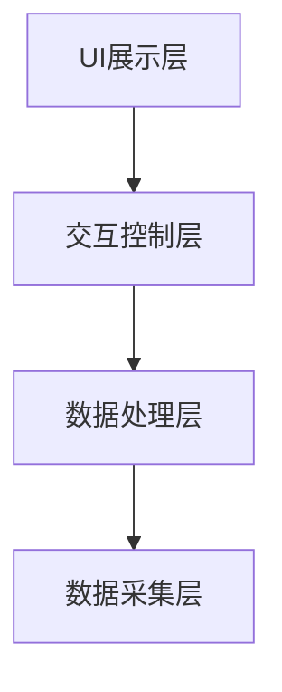
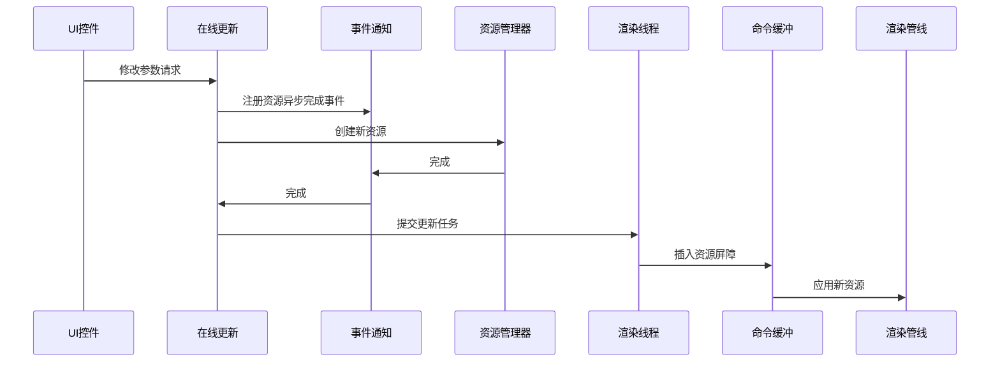
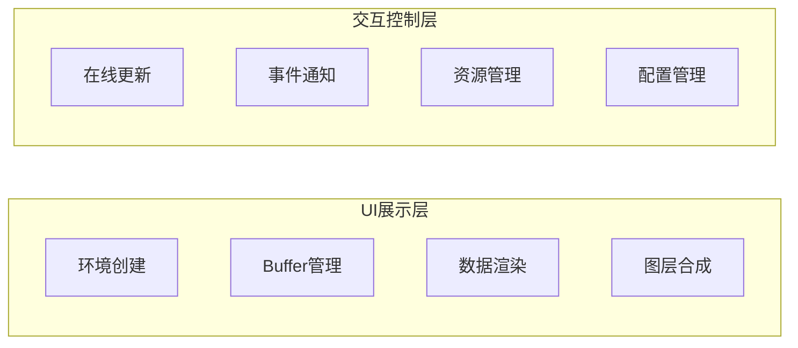
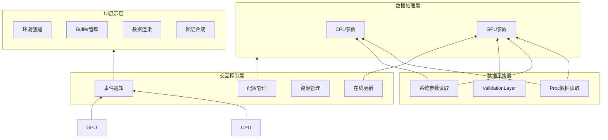
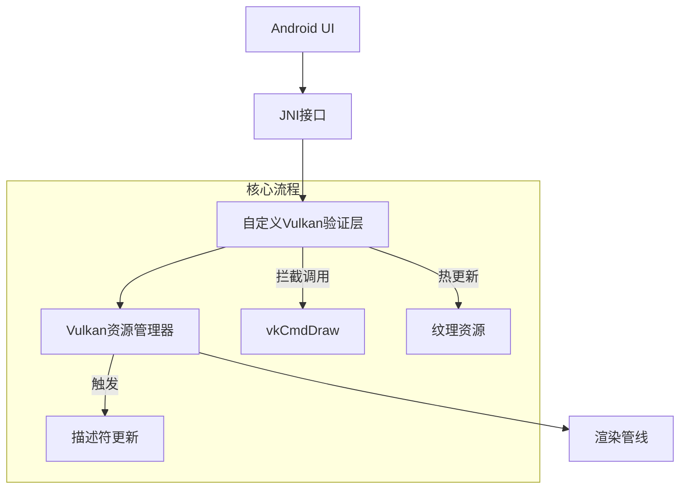
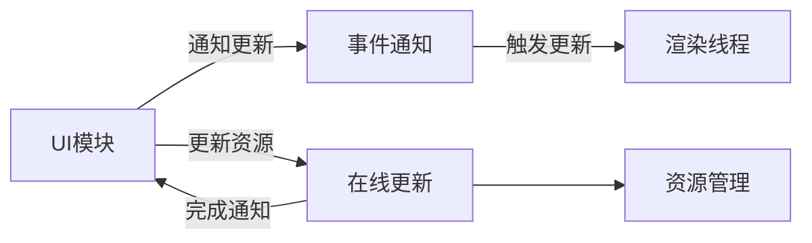
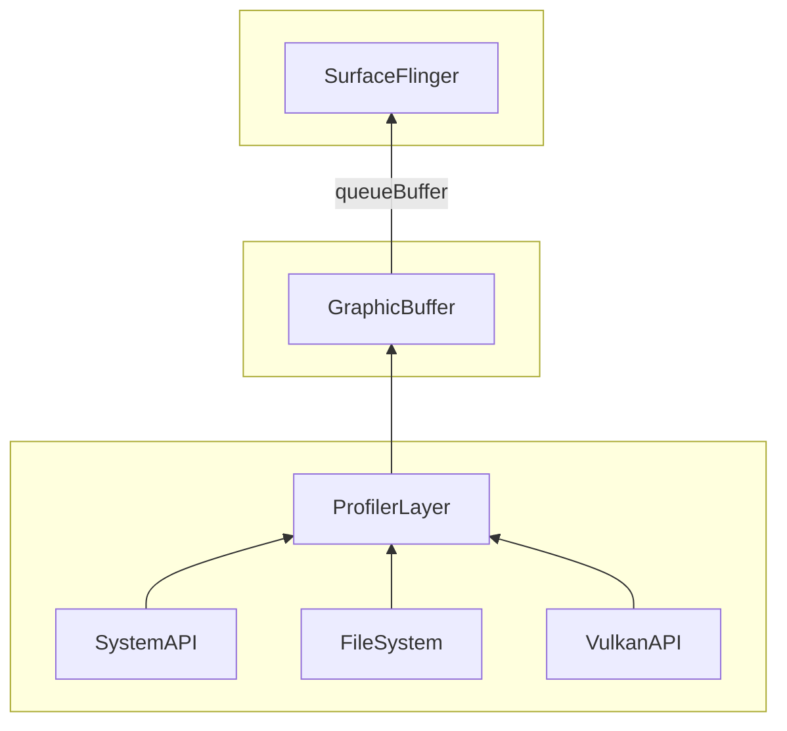
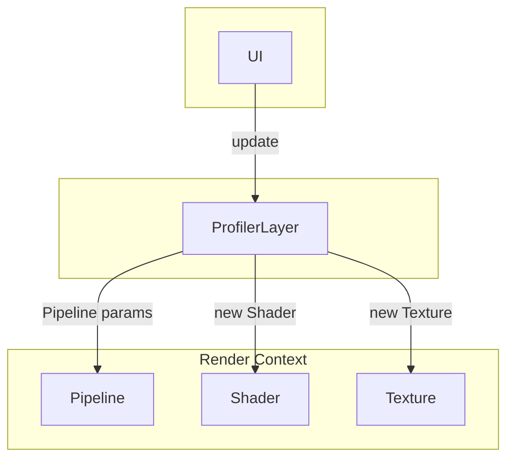
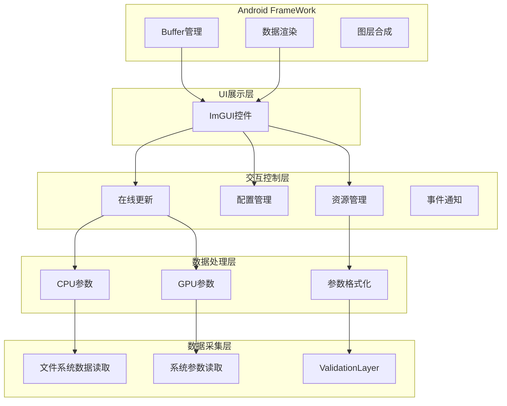

```markmap
# Mindmap1
## Mindmap2
## Mindmap21
### Mindmap213
## Mindmap22
### Mindmap223
```


![[ProfilerLayer方案]]







**创建自定义Validation Layer**：编写一个自定义的Layer，拦截与纹理相关的Vulkan API调用，如vkCmdCopyBufferToImage、vkUpdateDescriptorSets等，以便在运行时修改纹理数据。

**动态纹理更新机制**：在Layer中检测到纹理需要更新时，替换或修改对应的VkImage或VkBuffer数据。需要注意同步问题，确保在渲染过程中修改资源不会导致冲突或崩溃。

**界面更新**：修改纹理后，需要触发界面的重新渲染。可能需要通知应用的主循环或使用Android的Surface机制来请求新的帧。

**Android集成**：将自定义的Layer打包到APK中，并在应用启动时启用它。需要处理Android的权限和文件系统访问，确保Layer可以正确加载和运行。


**线程安全**：Vulkan API调用可能在多个线程中进行，需要确保修改纹理时的线程安全，避免竞争条件。

**资源同步**：修改纹理后，需要正确管理内存屏障和图像布局转换，确保GPU访问新数据时的正确性。

**性能影响**：Validation Layer本身会增加开销，动态修改资源可能会进一步影响性能，需要优化实现以减少延迟。

**兼容性**：不同的Android设备和GPU可能有不同的行为，需要测试和适配多种硬件。









