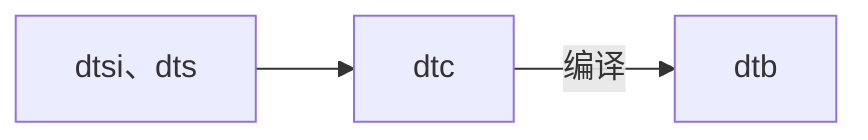

# 基本概念


Dts文件路径：
arch/arm[arm64]/boot/dts/xxx

# 最简单dts

```c my_device_tree.dts
/dts-v1/;
/ {

};
```
编译：
```
dtc -I dts -O dtb -o xxx.dtb xxx.dts
```
反编译：
```
dtc -I dtb -O dts -o xxx.dts xxx.dtb
```
这里我们使用实际环境编译my_device_tree.dts：
```bash
$ ./scripts/dtc/dtc -I dts -O dtb -o my_device_tree.dtb my_device_tree.dts
```
这时，可以看到目录下生成了my_device_tree.dtb文件。
反编译：
```
$ ./scripts/dtc/dtc -I dtb -O dts -o my_device_tree-out.dts my_device_tree.dtb
```

我们可以在目录中使用make dtbs来编译，但需要设置环境变量才能成功。

VSCode中安装DeviceTree插件可以帮助编写DTS:
![[DTS基础-1.png]]