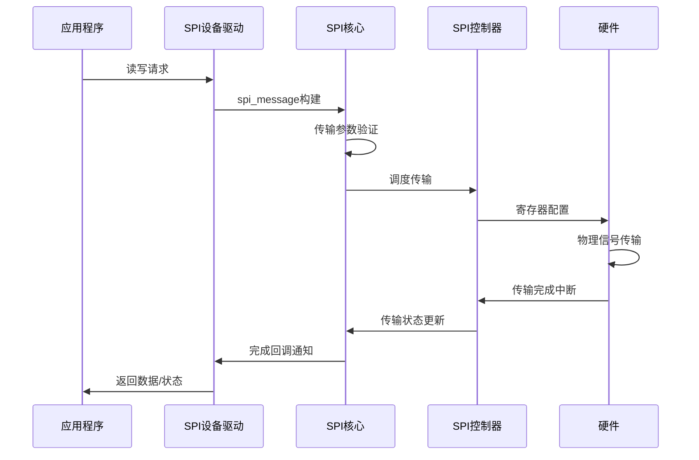
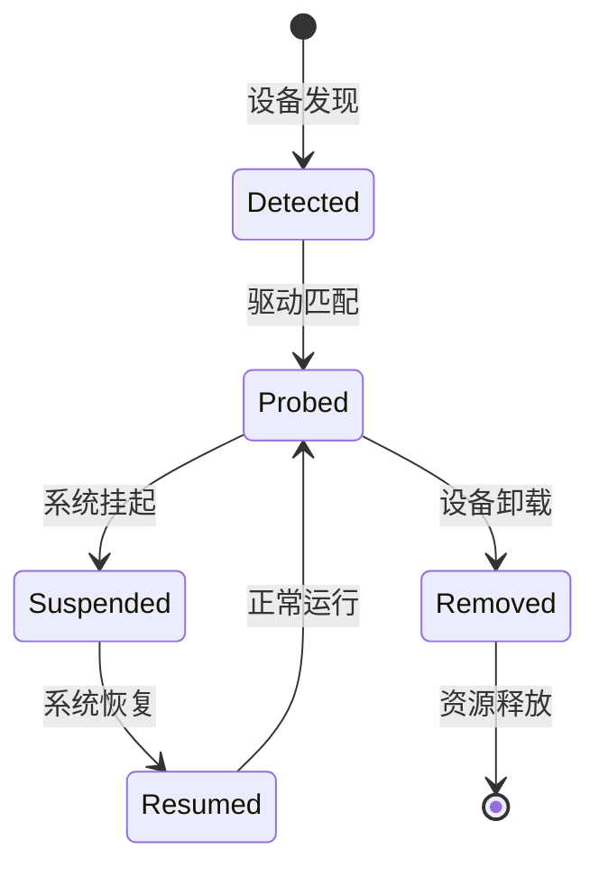

# SPI框架全景图

> 深入理解Linux SPI驱动的分层架构与设计哲学

## 🏗️ 架构总览

### 分层架构设计

```mermaid
graph TB
    subgraph "用户空间"
        APP1[Flash工具]
        APP2[传感器应用]
        APP3[显示应用]
        
        APP1 --> DEV1[/dev/mtd0]
        APP2 --> DEV2[/dev/spidev0.1]
        APP3 --> DEV3[/dev/fb0]
    end
    
    subgraph "内核空间"
        subgraph "SPI设备驱动层"
            DRIVER1[SPI Flash驱动<br/>m25p80.c]
            DRIVER2[SPI传感器驱动<br/>spi-sensor.c]
            DRIVER3[SPI显示驱动<br/>fb_ili9341.c]
            
            subgraph "通用接口"
                SPIDEV[spidev接口<br/>spidev.c]
            end
        end
        
        subgraph "SPI核心层"
            CORE[SPI Core<br/>spi.c]
            BUS[总线管理<br/>bus_type]
            DEVMGR[设备管理<br/>device management]
            TRANS[传输调度<br/>transfer queue]
            
            CORE --> BUS
            CORE --> DEVMGR
            CORE --> TRANS
        end
        
        subgraph "SPI控制器驱动层"
            CTRL1[SPI Master 0<br/>spi-pl022.c]
            CTRL2[SPI Master 1<br/>spi-imx.c]
            CTRL3[SPI Master 2<br/>spi-bitbang.c]
            
            subgraph "硬件抽象接口"
                SETUP[setup]
                TRANSFER[transfer_one]
                PREPARE[prepare_transfer]
            end
        end
        
        subgraph "平台设备层"
            PLATFORM1[平台设备0<br/>platform_device]
            PLATFORM2[平台设备1<br/>platform_device]
            PLATFORM3[平台设备2<br/>platform_device]
        end
    end
    
    subgraph "硬件抽象层"
        HW1[SPI控制器硬件0<br/>PL022]
        HW2[SPI控制器硬件1<br/>i.MX ECSPI]
        HW3[SPI控制器硬件2<br/>GPIO模拟]
    end
    
    subgraph "物理设备层"
        FLASH[SPI Flash<br/>W25Q128]
        SENSOR[SPI传感器<br/>BME280]
        DISPLAY[SPI显示屏<br/>ILI9341]
    end
    
    %% 连接关系
    DRIVER1 --> CORE
    DRIVER2 --> CORE
    DRIVER3 --> CORE
    SPIDEV --> CORE
    
    CORE --> CTRL1
    CORE --> CTRL2
    CORE --> CTRL3
    
    CTRL1 --> PLATFORM1
    CTRL2 --> PLATFORM2
    CTRL3 --> PLATFORM3
    
    PLATFORM1 --> HW1
    PLATFORM2 --> HW2
    PLATFORM3 --> HW3
    
    HW1 --> FLASH
    HW1 --> SENSOR
    HW2 --> DISPLAY
```

## 🎯 设计哲学分析

### 1. 分层解耦原则

| 层级 | 职责 | 设计目标 | 关键接口 |
|-----|------|----------|----------|
| **用户空间** | 应用逻辑 | 统一设备访问 | open/read/write/ioctl |
| **设备驱动** | 设备功能实现 | 硬件无关性 | spi_driver.{probe,remove} |
| **SPI核心** | 总线管理 | 通用抽象层 | spi_register_device |
| **控制器驱动** | 硬件控制 | 平台无关性 | spi_master.{setup,transfer} |
| **硬件层** | 物理传输 | 电信号控制 | 寄存器操作 |

### 2. 组件交互模型



### 3. 数据抽象层次

#### 用户空间视角
- **字符设备**: `/dev/spidevX.Y` 通用SPI接口
- **MTD设备**: `/dev/mtdX` SPI Flash专用接口  
- **FrameBuffer**: `/dev/fbX` SPI显示接口

#### 内核空间视角
- **spi_device**: 逻辑设备抽象
- **spi_message**: 传输请求封装
- **spi_transfer**: 单次传输单元

#### 硬件视角
- **spi_master**: 控制器能力抽象
- **寄存器**: 硬件控制接口
- **GPIO**: 片选和信号线控制

## 🔍 核心组件详解

### SPI核心层 (spi.c)

**主要职责**:
- SPI总线类型管理 (`spi_bus_type`)
- 设备-驱动匹配逻辑
- 传输请求调度
- 全局设备链表维护

**关键数据结构**:
```c
struct bus_type spi_bus_type = {
    .name       = "spi",
    .match      = spi_match_device,
    .dev_groups = spi_dev_groups,
    .uevent     = spi_uevent,
};
```

### SPI控制器抽象

**能力模型**:
- **bus_num**: 总线编号 (系统唯一)
- **num_chipselect**: 支持的片选数量
- **mode_bits**: 支持的SPI模式
- **max_speed_hz**: 最大时钟频率
- **flags**: 特殊能力标志

**传输接口**:
```c
struct spi_master {
    int (*setup)(struct spi_device *spi);
    int (*transfer)(struct spi_device *spi, struct spi_message *mesg);
    int (*transfer_one)(struct spi_master *master, struct spi_message *mesg);
    // ...
};
```

### SPI设备表示

**设备属性**:
- **max_speed_hz**: 设备最大工作频率
- **chip_select**: 硬件片选编号
- **mode**: SPI模式 (CPOL/CPHA/CS_HIGH/...)
- **bits_per_word**: 字长 (通常是8)

**生命周期**:


## ⚡ 数据流路径分析

### 同步传输路径

```c
// 用户空间调用路径
app_read() 
  -> vfs_read()
    -> spi_driver.read()
      -> spi_sync()
        -> __spi_sync()
          -> spi_master->transfer_one_message()
```

### 异步传输路径

```c
// 内核空间异步路径
spi_async()
  -> __spi_async()
    -> spi_queued_transfer()
      -> kthread_queue_work()
        -> spi_master->transfer_one_message()
```

### DMA传输优化


## 🛠️ 架构扩展性

### 新设备支持
1. 实现`spi_driver`接口
2. 定义设备ID表
3. 注册驱动到SPI核心
4. 处理probe/remove回调

### 新控制器支持
1. 实现`spi_master`接口
2. 配置控制器能力
3. 注册控制器到SPI核心
4. 处理传输请求

### 新传输模式
1. 扩展`spi_transfer`结构
2. 在控制器驱动中实现
3. 更新核心层调度逻辑

## 📊 架构优势分析

| 设计特点 | 实现方式 | 带来的好处 |
|---------|----------|------------|
| **分层架构** | 清晰的接口边界 | 易于维护和扩展 |
| **标准化** | 统一的数据结构 | 代码复用性高 |
| **异步支持** | 工作队列机制 | 系统响应性好 |
| **DMA集成** | 零拷贝传输 | 高性能表现 |
| **多控制器** | 总线编号机制 | 支持复杂硬件 |

## 🎯 架构设计启示

### 1. 驱动设计原则
- **关注点分离**: 功能逻辑与硬件控制解耦
- **接口标准化**: 统一的访问接口和行为
- **错误隔离**: 分层错误处理和恢复
- **性能优化**: 多种传输模式适配不同场景

### 2. 代码组织策略
- **模块化**: 核心功能与设备驱动分离
- **可配置**: 通过Kconfig支持条件编译
- **可扩展**: 接口设计预留扩展空间
- **可调试**: 完善的调试和跟踪机制

### 3. 性能考虑
- **缓存友好**: 数据结构对齐和填充
- **锁优化**: 最小化临界区范围
- **批处理**: 合并相关操作减少开销
- **异步化**: 避免阻塞主执行路径

---

**🐕 大菜狗技术洞察**: 

这个架构设计的精髓在于**"抽象分层 + 标准化接口 + 异步优化"**。对于嵌入式开发者来说，理解这种分层思想比死记API更重要。在实际项目中，建议按照这个思路来设计自己的驱动架构 - 先把层次关系想清楚，再动手写代码。

你在实际项目中遇到过SPI相关的技术难题吗？或者想了解哪个具体环节的实现细节？