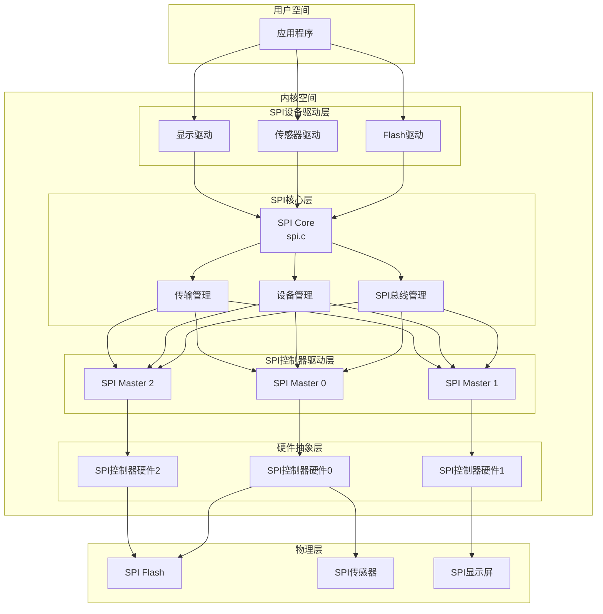

// Linux SPI驱动框架架构图 - Mermaid格式

## 架构说明

### 分层架构
1. **用户空间层** - 应用程序通过设备文件或sysfs接口访问SPI设备
2. **SPI设备驱动层** - 各种SPI外设的功能驱动
3. **SPI核心层** - 提供统一的SPI总线管理和设备管理
4. **SPI控制器驱动层** - 硬件控制器的具体实现
5. **硬件抽象层** - SPI控制器硬件寄存器操作
6. **物理层** - 实际的SPI外设设备

### 核心组件关系
- SPI Core是框架的核心，负责协调各层之间的交互
- 设备驱动通过SPI Core访问控制器驱动
- 控制器驱动负责底层的硬件操作
- 支持多控制器和多设备的并发访问

### 数据流
1. 应用程序发起I/O请求
2. SPI设备驱动封装传输请求
3. SPI Core进行设备匹配和传输调度
4. SPI控制器驱动执行硬件传输
5. 数据在物理层完成实际的信号传输