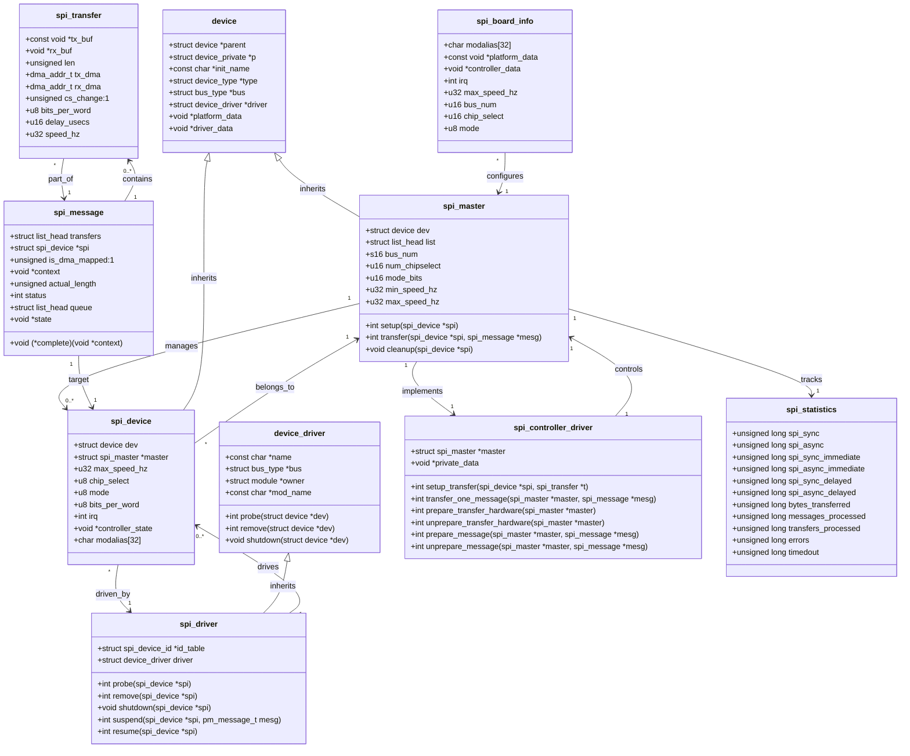

// Linux SPI驱动框架类图 - Mermaid格式

## 类图说明

### 核心类职责

1. **spi_master** - SPI主机控制器
   - 管理SPI总线和所有连接的设备
   - 提供传输接口和硬件抽象
   - 处理多设备并发访问

2. **spi_device** - SPI设备
   - 表示连接到SPI总线的具体设备
   - 包含设备配置参数
   - 维护设备状态信息

3. **spi_driver** - SPI设备驱动
   - 实现具体设备的功能逻辑
   - 处理设备探测和移除
   - 管理设备生命周期

4. **spi_transfer** - SPI传输单元
   - 表示单次SPI数据传输
   - 包含传输缓冲区、长度、时序参数
   - 支持DMA传输

5. **spi_message** - SPI消息
   - 包含一个或多个传输单元
   - 提供传输完成回调机制
   - 支持异步传输

### 设计模式

1. **设备-驱动模型** - Linux标准设备模型
2. **主从模式** - SPI控制器管理多个设备
3. **消息队列** - 异步传输的消息队列机制
4. **策略模式** - 不同的传输策略（同步/异步/DMA）

### 关键关系

- 一个SPI主控制器可以管理多个SPI设备
- 一个SPI设备只能属于一个主控制器
- 一个SPI消息可以包含多个传输单元
- 设备和驱动通过ID表进行匹配