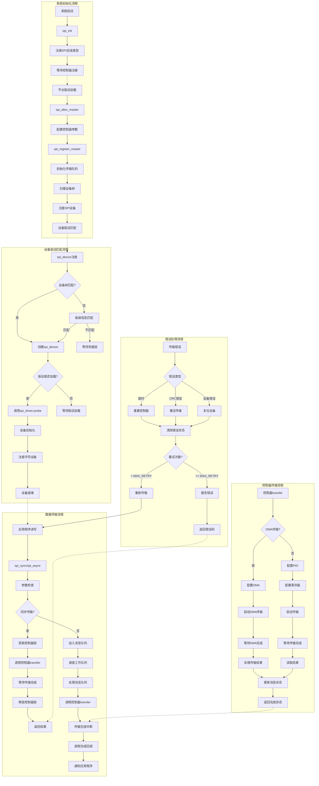

// Linux SPI驱动框架流程图 - Mermaid格式

## 详细流程说明

### 1. 系统初始化流程

1. **SPI总线初始化**
   - `spi_init()`在内核启动时被调用
   - 注册SPI总线类型和设备类
   - 初始化全局SPI设备链表

2. **控制器注册**
   - 平台驱动发现SPI控制器硬件
   - 分配和初始化`spi_master`结构
   - 注册控制器到SPI核心层
   - 扫描并注册所有连接的SPI设备

3. **设备发现**
   - 通过设备树描述SPI设备
   - 为每个设备创建`spi_device`结构
   - 设置设备的CS、频率、模式等参数

### 2. 设备驱动匹配流程

1. **设备注册**
   - SPI设备被添加到系统
   - 设备属性与驱动ID表匹配
   - 匹配成功则调用驱动的probe函数

2. **驱动加载**
   - 驱动模块被加载到内核
   - 注册`spi_driver`结构到SPI核心
   - 匹配所有未驱动的SPI设备

3. **设备初始化**
   - 配置SPI传输参数
   - 初始化设备特定的寄存器
   - 注册设备文件接口

### 3. 数据传输流程

1. **同步传输**
   - 阻塞式传输，等待完成
   - 适合小数据量、低延迟场景
   - 直接调用控制器驱动

2. **异步传输**
   - 非阻塞式传输
   - 使用工作队列处理
   - 传输完成后回调通知

3. **传输参数**
   - 时钟频率配置
   - SPI模式设置
   - 字长和数据格式

### 4. 控制器传输流程

1. **DMA传输**
   - 适合大数据量传输
   - 减少CPU占用
   - 需要硬件DMA支持

2. **PIO传输**
   - 适合小数据量传输
   - 直接寄存器操作
   - 简单但CPU占用高

3. **中断处理**
   - 传输完成中断
   - 错误中断处理
   - 超时机制

### 5. 错误处理流程

1. **错误检测**
   - 传输超时检测
   - CRC错误检查
   - 硬件错误状态

2. **错误恢复**
   - 控制器复位
   - 设备重新初始化
   - 传输重试机制

3. **错误报告**
   - 返回适当的错误码
   - 记录调试信息
   - 通知上层应用

## 性能考虑

1. **并发处理** - 支持多控制器并发传输
2. **缓存优化** - 合理使用DMA缓存
3. **中断优化** - 减少中断处理开销
4. **批处理** - 合并多个小传输