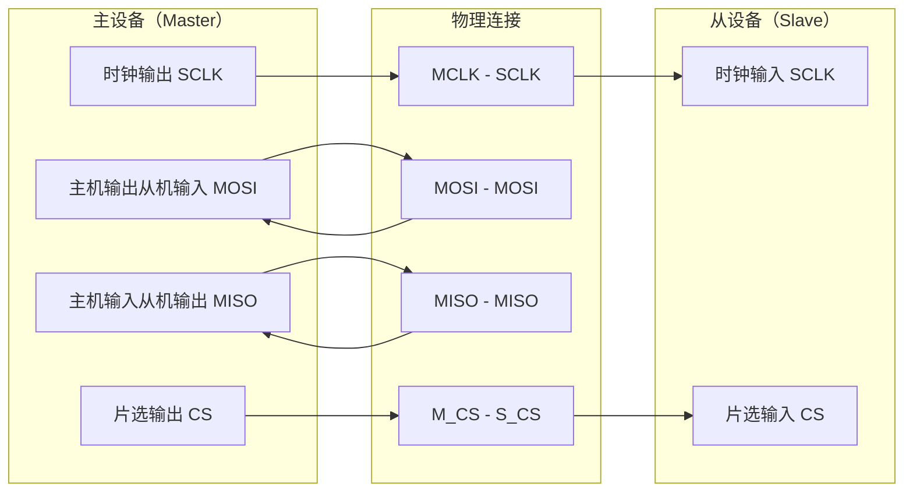
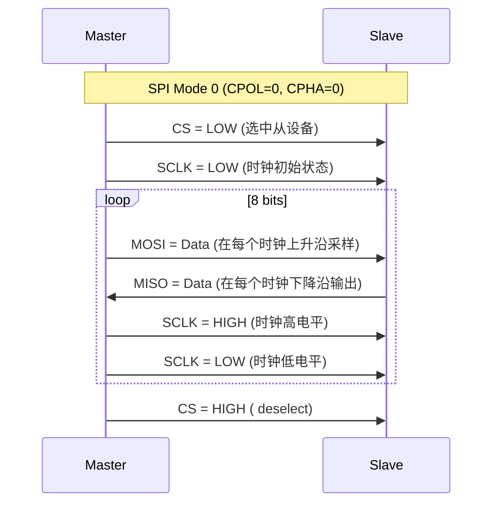
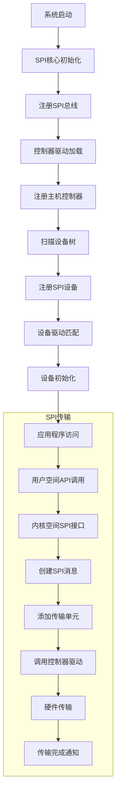

# 00 - SPI基础介绍

> **本文档由浅入深介绍SPI协议基础和Linux SPI框架，适合初学者和有经验的开发者。**
> 
> **难度级别**: 入门  
> **阅读时间**: 30分钟  
> **前置知识**: C语言基础、Linux系统基础

## 目录

- [1. SPI协议基础](#1-spi协议基础)
  - [1.1 什么是SPI](#11-什么是spi)
  - [1.2 SPI物理层](#12-spi物理层)
  - [1.3 SPI信号线](#13-spi信号线)
  - [1.4 SPI传输模式](#14-spi传输模式)
- [2. Linux SPI框架概述](#2-linux-spi框架概述)
  - [2.1 框架架构](#21-框架架构)
  - [2.2 核心组件](#22-核心组件)
  - [2.3 工作流程](#23-工作流程)
- [3. 环境搭建](#3-环境搭建)
  - [3.1 硬件环境](#31-硬件环境)
  - [3.2 软件环境](#32-软件环境)
- [4. 第一个SPI程序](#4-第一个spi程序)
- [5. 实验与验证](#5-实验与验证)
- [6. 总结与展望](#6-总结与展望)

---

## 1. SPI协议基础

### 1.1 什么是SPI

SPI（Serial Peripheral Interface，串行外设接口）是一种同步串行通信接口，由摩托罗拉公司于1980年代提出。它是一种全双工、同步、四线制的通信协议，常用于嵌入式系统中微控制器与各种外设之间的通信。

**SPI的主要特点**：
- 高速通信：可达几十MHz
- 全双工：同时收发数据
- 同步：使用时钟信号同步数据传输
- 简单：协议简单，易于实现
- 灵活：支持多个从设备

### 1.2 SPI物理层



### 1.3 SPI信号线

SPI总线由4条信号线组成：

| 信号线 | 名称 | 方向 | 功能说明 |
|--------|------|------|----------|
| SCLK | Serial Clock | Master → Slave | 时钟信号，同步数据传输 |
| MOSI | Master Out Slave In | Master → Slave | 主机输出，从机输入 |
| MISO | Master In Slave Out | Slave → Master | 主机输入，从机输出 |
| CS/SS | Chip Select/Slave Select | Master → Slave | 片选信号，选择从设备 |

**信号线的特点**：
- **SCLK**：时钟信号，由主设备产生，用于同步数据传输
- **MOSI**：数据输出线，主设备发送数据到从设备
- **MISO**：数据输入线，从设备发送数据到主设备
- **CS/SS**：片选信号，每个从设备独占一条，低电平有效

### 1.4 SPI传输模式

SPI协议定义了4种传输模式，主要区别在于时钟极性（CPOL）和时钟相位（CPHA）：

| 模式 | CPOL | CPHA | 时钟空闲电平 | 采样边沿 | 说明 |
|------|------|------|--------------|----------|------|
| 0    | 0    | 0    | 低           | 上升沿   | 常用模式 |
| 1    | 0    | 1    | 低           | 下降沿   | 较少使用 |
| 2    | 1    | 0    | 高           | 下降沿   | 较少使用 |
| 3    | 1    | 1    | 高           | 上升沿   | 常用模式 |

**时序图**：


---

## 2. Linux SPI框架概述

### 2.1 框架架构

Linux SPI框架采用分层架构设计，主要包括以下几个层次：

```mermaid
graph TB
    subgraph "用户空间"
        App[应用程序]
        SysFS[/sys/接口]
        Dev[/dev/spidev]
    end
    
    subgraph "内核空间"
        subgraph "接口层"
            IFace[SPI接口层]
        end
        
        subgraph "核心层"
            Core[SPI Core<br/>drivers/spi/spi.c]
            Bus[SPI总线管理]
            DevMgr[设备管理]
            Trans[传输管理]
        end
        
        subgraph "控制器驱动层"
            Ctrl[SPI控制器驱动]
        end
        
        subgraph "硬件层"
            HW[SPI硬件控制器]
        end
    end
    
    App --> IFace
    Dev --> IFace
    SysFS --> IFace
    
    IFace --> Core
    Core --> Bus
    Core --> DevMgr
    Core --> Trans
    
    Trans --> Ctrl
    Ctrl --> HW
```

### 2.2 核心组件

Linux SPI框架的核心组件包括：

#### 2.2.1 spi_master

表示SPI主机控制器，管理SPI总线和所有连接的设备：

```c
struct spi_master {
    struct device dev;            // 设备结构
    struct list_head list;       // 设备链表
    s16 bus_num;                 // 总线编号
    u16 num_chipselect;          // 支持的片选数量
    u16 mode_bits;               // 支持的SPI模式
    u32 min_speed_hz;            // 最小时钟频率
    u32 max_speed_hz;            // 最大时钟频率
    u16 flags;                   // 标志位
    int (*setup)(struct spi_device *spi);  // 设置函数
    int (*transfer)(struct spi_device *spi, struct spi_message *mesg); // 传输函数
    void (*cleanup)(struct spi_device *spi); // 清理函数
    // ... 其他成员
};
```

#### 2.2.2 spi_device

表示SPI设备，包含设备的配置信息：

```c
struct spi_device {
    struct device dev;            // 设备结构
    struct spi_master *master;    // 所属主机控制器
    u32 max_speed_hz;            // 最大时钟频率
    u8 chip_select;              // 片选号
    u8 mode;                     // SPI模式
    u8 bits_per_word;            // 数据位宽
    int irq;                     // 中断号
    void *controller_state;      // 控制器私有数据
    void *controller_data;       // 控制器数据
    char modalias[SPI_NAME_SIZE]; // 设备别名
    // ... 其他成员
};
```

#### 2.2.3 spi_driver

表示SPI设备驱动：

```c
struct spi_driver {
    const struct spi_device_id *id_table; // 设备ID表
    int (*probe)(struct spi_device *spi); // 探测函数
    int (*remove)(struct spi_device *spi); // 移除函数
    void (*shutdown)(struct spi_device *spi); // 关闭函数
    int (*suspend)(struct spi_device *spi, pm_message_t mesg); // 挂起函数
    int (*resume)(struct spi_device *spi); // 恢复函数
    struct device_driver driver;   // 设备驱动结构
};
```

#### 2.2.4 spi_transfer和spi_message

表示数据传输单元和消息：

```c
struct spi_transfer {
    const void *tx_buf;          // 发送缓冲区
    void *rx_buf;                // 接收缓冲区
    unsigned len;                // 传输长度
    dma_addr_t tx_dma;           // DMA地址
    dma_addr_t rx_dma;           // DMA地址
    unsigned cs_change:1;        // 片选改变标志
    u8 bits_per_word;            // 数据位宽
    u16 delay_usecs;             // 延迟时间
    u32 speed_hz;                // 时钟频率
    // ... 其他成员
};

struct spi_message {
    struct list_head transfers;   // 传输链表
    struct spi_device *spi;      // SPI设备
    unsigned is_dma_mapped:1;   // DMA映射标志
    void (*complete)(void *context); // 完成回调
    void *context;               // 回调上下文
    unsigned actual_length;      // 实际传输长度
    int status;                  // 状态码
    // ... 其他成员
};
```

### 2.3 工作流程

SPI驱动的工作流程可以分为以下几个步骤：



---

## 3. 环境搭建

### 3.1 硬件环境

**基本硬件配置**：
- 开发板（如树莓派、BeagleBone、STM32开发板等）
- SPI设备（如SPI Flash、SPI ADC、SPI显示屏等）
- 示例：W25Q32 SPI Flash芯片

**硬件连接示例**：

| 开发板引脚 | SPI Flash引脚 | 功能 |
|------------|---------------|------|
| 3.3V | VCC | 电源 |
| GND | GND | 地 |
| SCLK | SCK | 时钟 |
| MOSI | DI | 数据输入 |
| MISO | DO | 数据输出 |
| CE1 | CS | 片选 |

### 3.2 软件环境

**开发工具链**：
```bash
# 安装必要的开发工具
sudo apt-get update
sudo apt-get install build-essential git bison flex libncurses-dev

# 安装SPI工具
sudo apt-get install spi-tools

# 下载Linux内核源码
git clone https://git.kernel.org/pub/scm/linux/kernel/git/stable/linux.git
cd linux
git checkout v5.15
```

**配置内核**：
```bash
# 进入内核源码目录
cd /path/to/linux

# 配置内核（使用menuconfig）
make menuconfig

# 确保以下选项已启用：
# Device Drivers →
#   SPI support →
#     <*> User mode SPI device driver support
#     <*> Generic SPI transfer handler
#     <*> SPI master controller support
```

---

## 4. 第一个SPI程序

### 4.1 基础示例代码

以下是一个简单的SPI通信程序，用于读写SPI Flash芯片：

```c
#include <stdio.h>
#include <stdlib.h>
#include <string.h>
#include <fcntl.h>
#include <unistd.h>
#include <sys/ioctl.h>
#include <linux/spidev.h>

#define SPI_DEVICE "/dev/spidev0.0"
#define SPI_MODE SPI_MODE_0
#define SPI_SPEED 1000000  // 1MHz

// 设置SPI设备参数
static int setup_spi(int fd) {
    uint8_t mode = SPI_MODE;
    uint8_t bits = 8;
    uint32_t speed = SPI_SPEED;
    
    // 设置SPI模式
    if (ioctl(fd, SPI_IOC_WR_MODE, &mode) < 0) {
        perror("SPI_IOC_WR_MODE");
        return -1;
    }
    
    // 设置数据位宽
    if (ioctl(fd, SPI_IOC_WR_BITS_PER_WORD, &bits) < 0) {
        perror("SPI_IOC_WR_BITS_PER_WORD");
        return -1;
    }
    
    // 设置时钟频率
    if (ioctl(fd, SPI_IOC_WR_MAX_SPEED_HZ, &speed) < 0) {
        perror("SPI_IOC_WR_MAX_SPEED_HZ");
        return -1;
    }
    
    return 0;
}

// 读取SPI Flash JEID
static int read_flash_jedec(int fd, uint8_t *jedec_id) {
    uint8_t tx_buf[4];
    uint8_t rx_buf[4];
    
    // 构造读取命令：0x9F (Read JEDEC ID)
    tx_buf[0] = 0x9F;
    tx_buf[1] = 0x00;
    tx_buf[2] = 0x00;
    tx_buf[3] = 0x00;
    
    struct spi_ioc_transfer tr = {
        .tx_buf = (unsigned long)tx_buf,
        .rx_buf = (unsigned long)rx_buf,
        .len = 4,
        .delay_usecs = 0,
        .speed_hz = SPI_SPEED,
        .bits_per_word = 8,
    };
    
    // 执行SPI传输
    if (ioctl(fd, SPI_IOC_MESSAGE(1), &tr) < 0) {
        perror("SPI_IOC_MESSAGE");
        return -1;
    }
    
    // 保存JEDEC ID
    jedec_id[0] = rx_buf[1];
    jedec_id[1] = rx_buf[2];
    jedec_id[2] = rx_buf[3];
    
    return 0;
}

int main() {
    int fd;
    uint8_t jedec_id[3];
    
    // 打开SPI设备
    fd = open(SPI_DEVICE, O_RDWR);
    if (fd < 0) {
        perror("open SPI device");
        return -1;
    }
    
    // 设置SPI参数
    if (setup_spi(fd) < 0) {
        close(fd);
        return -1;
    }
    
    printf("SPI Flash 读写测试\n");
    printf("SPI设备: %s\n", SPI_DEVICE);
    printf("SPI模式: %d\n", SPI_MODE);
    printf("SPI速度: %d Hz\n", SPI_SPEED);
    
    // 读取JEDEC ID
    if (read_flash_jedec(fd, jedec_id) == 0) {
        printf("JEDEC ID: 0x%02X 0x%02X 0x%02X\n", 
               jedec_id[0], jedec_id[1], jedec_id[2]);
    } else {
        printf("读取JEDEC ID失败\n");
    }
    
    close(fd);
    return 0;
}
```

### 4.2 Makefile

```makefile
CC = gcc
CFLAGS = -Wall -O2
LDFLAGS = 

TARGET = spi_test
OBJS = spi_test.o

.PHONY: all clean

all: $(TARGET)

$(TARGET): $(OBJS)
	$(CC) $(CFLAGS) -o $(TARGET) $(OBJS) $(LDFLAGS)

%.o: %.c
	$(CC) $(CFLAGS) -c $< -o $@

clean:
	rm -f $(TARGET) $(OBJS)

install: $(TARGET)
	sudo cp $(TARGET) /usr/local/bin/
```

### 4.3 编译和运行

```bash
# 编译程序
make clean
make

# 需要root权限运行
sudo ./spi_test
```

**预期输出**：
```
SPI Flash 读写测试
SPI设备: /dev/spidev0.0
SPI模式: 0
SPI速度: 1000000 Hz
JEDEC ID: 0xEF 0x40 0x18
```

---

## 5. 实验与验证

### 5.1 硬件连接验证

1. **检查物理连接**：
   - 确认电源和地线连接正确
   - 检查SPI信号线连接牢固
   - 确认片选信号连接正确

2. **信号质量检查**：
   - 使用逻辑分析仪检查信号波形
   - 确认时钟频率在设备允许范围内
   - 检查信号完整性，无过冲或振铃

### 5.2 软件调试步骤

1. **检查设备权限**：
```bash
# 检查SPI设备文件是否存在
ls -l /dev/spidev*

# 如果设备不存在，可能需要加载spidev模块
sudo modprobe spidev

# 检查权限
sudo chmod 666 /dev/spidev0.0
```

2. **使用spidev_test工具**：
```bash
# 下载spidev_test工具
git clone https://git.kernel.org/pub/scm/utils/spi-tools/spi-tools.git
cd spi-tools
make

# 运行测试
./spidev_test -D /dev/spidev0.0 -v
```

3. **监控内核日志**：
```bash
# 启用SPI调试信息
echo "module spi_debug debug" | sudo tee /sys/kernel/debug/dynamic_debug/control

# 查看SPI调试信息
dmesg | grep -i spi
```

### 5.3 常见问题解决

| 问题 | 可能原因 | 解决方法 |
|------|----------|----------|
| 打开设备失败 | 设备不存在 | 加载spidev模块: `sudo modprobe spidev` |
| 传输错误 | 时钟频率过高 | 降低SPI速度 |
| 数据错误 | SPI模式不匹配 | 检查设备手册，确认SPI模式 |
| 片选问题 | 片选配置错误 | 检查设备树配置 |
| 信号干扰 | 信号质量差 | 添加上拉电阻，改善布线 |

---

## 6. 总结与展望

### 6.1 本章要点回顾

1. **SPI协议基础**：
   - 了解了SPI的4线制通信方式
   - 掌握了4种SPI传输模式的区别
   - 理解了SPI信号的功能和时序

2. **Linux SPI框架**：
   - 理解了分层架构设计
   - 掌握了核心数据结构
   - 了解了SPI驱动的工作流程

3. **实践应用**：
   - 成功搭建了SPI开发环境
   - 实现了基础的SPI通信程序
   - 掌握了基本的调试方法

### 6.2 后续学习路径

完成本章学习后，建议按照以下路径继续深入：

1. **下一阶段**：学习[架构概览](./01-architecture-overview.md)，深入了解SPI框架的分层结构
2. **进阶学习**：研究[核心概念](./02-core-concepts.md)，掌握SPI传输模式和设备模型
3. **实践项目**：阅读[驱动开发](./04-driver-development.md)，编写完整的SPI设备驱动

### 6.3 扩展阅读

- [Linux内核SPI官方文档](https://www.kernel.org/doc/html/latest/driver-api/spi/)
- [SPI协议规范](https://www.analog.com/media/en/technical-documentation/data-sheets/spi_full.pdf)
- [SPI调试指南](https://www.kernel.org/doc/html/latest/spi/spidev.html)

---

**本章完成！你已经掌握了SPI协议的基础知识和Linux SPI框架的基本使用。**

> 💡 **提示**：建议动手实践本章的示例代码，加深对SPI通信的理解。遇到问题时，可以参考调试步骤进行排查。