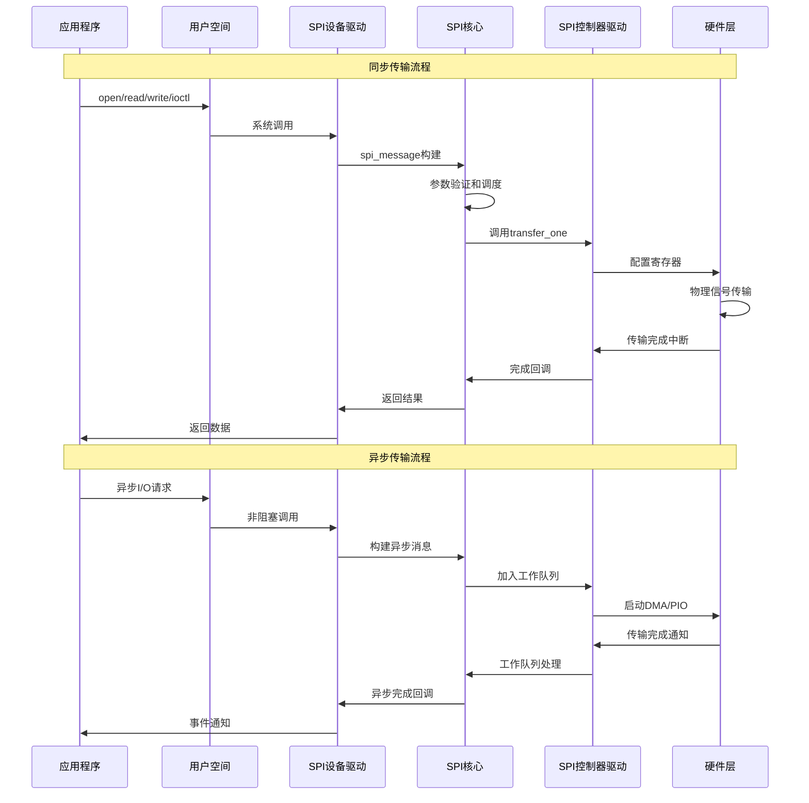
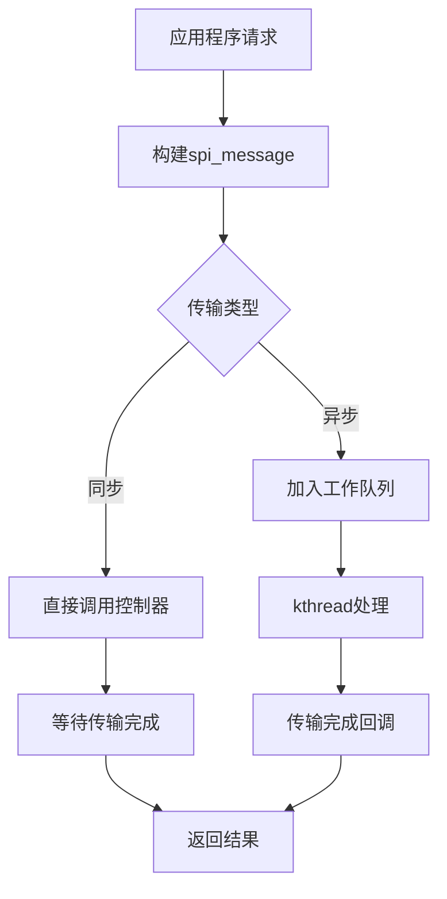
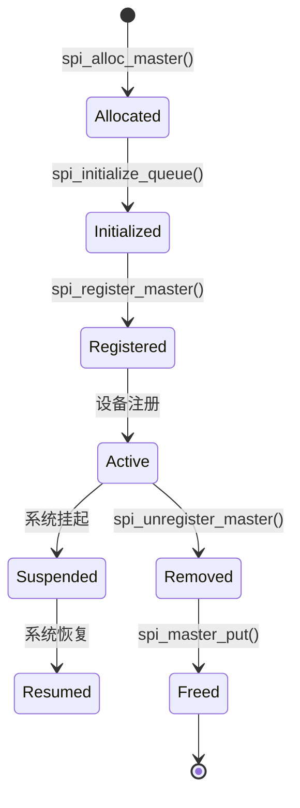
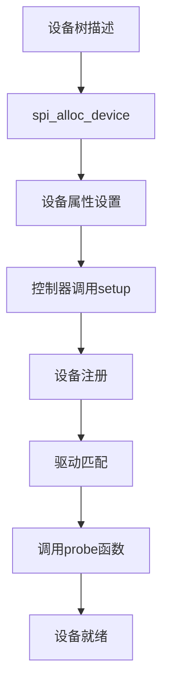
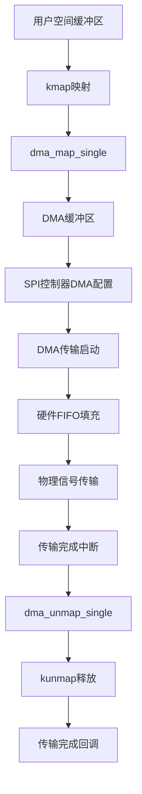

# 01 - SPI框架架构概览

> **深度解析Linux SPI驱动框架的分层架构、设计哲学与核心组件**
> 
> **难度级别**: 基础  
> **阅读时间**: 45分钟  
> **前置知识**: C语言、Linux内核基础、SPI协议基础

## 目录

- [1. 架构总览](#1-架构总览)
  - [1.1 分层架构设计](#11-分层架构设计)
  - [1.2 组件交互模型](#12-组件交互模型)
  - [1.3 数据抽象层次](#13-数据抽象层次)
- [2. 核心组件详解](#2-核心组件详解)
  - [2.1 SPI核心层](#21-spi核心层)
  - [2.2 SPI控制器抽象](#22-spi控制器抽象)
  - [2.3 SPI设备表示](#23-spi设备表示)
  - [2.4 传输机制](#24-传输机制)
- [3. 数据流路径分析](#3-数据流路径分析)
  - [3.1 同步传输路径](#31-同步传输路径)
  - [3.2 异步传输路径](#32-异步传输路径)
  - [3.3 DMA传输优化](#33-dma传输优化)
- [4. 架构扩展性](#4-架构扩展性)
  - [4.1 新设备支持](#41-新设备支持)
  - [4.2 新控制器支持](#42-新控制器支持)
- [5. 实践示例](#5-实践示例)
  - [5.1 简单控制器驱动](#51-简单控制器驱动)
  - [5.2 设备驱动示例](#52-设备驱动示例)
- [6. 架构优势与设计原则](#6-架构优势与设计原则)
- [7. 总结](#7-总结)

---

## 1. 架构总览

### 1.1 分层架构设计

Linux SPI框架采用清晰的分层架构设计，实现了硬件无关性与软件可维护性的平衡：

```mermaid
graph TB
    subgraph "用户空间"
        subgraph "应用层"
            APP1[Flash工具]
            APP2[传感器应用]
            APP3[显示应用]
        end
        
        subgraph "接口层"
            DEV1[/dev/mtd0]
            DEV2[/dev/spidev0.1]
            DEV3[/dev/fb0]
        end
        
        APP1 --> DEV1
        APP2 --> DEV2
        APP3 --> DEV3
    end
    
    subgraph "内核空间"
        subgraph "接口抽象层"
            SPIDEV[spidev接口<br/>spidev.c]
            MTD[MTD接口<br/>mtdcore.c]
            FB[FB接口<br/>fbmem.c]
        end
        
        subgraph "设备驱动层"
            DRIVER1[SPI Flash驱动<br/>m25p80.c]
            DRIVER2[SPI传感器驱动<br/>spi-sensor.c]
            DRIVER3[SPI显示驱动<br/>fb_ili9341.c]
            
            DRIVER1 --> SPIDEV
            DRIVER2 --> SPIDEV
            DRIVER3 --> FB
        end
        
        subgraph "核心服务层"
            CORE[SPI Core<br/>drivers/spi/spi.c]
            BUS[总线管理<br/>bus_type]
            DEVMGR[设备管理<br/>device management]
            TRANS[传输调度<br/>transfer queue]
            
            CORE --> BUS
            CORE --> DEVMGR
            CORE --> TRANS
        end
        
        subgraph "控制器驱动层"
            CTRL1[PL022<br/>spi-pl022.c]
            CTRL2[i.MX ECSPI<br/>spi-imx.c]
            CTRL3[BitBang<br/>spi-bitbang.c]
            
            subgraph "控制器接口"
                SETUP[setup]
                TRANSFER[transfer_one]
                PREPARE[prepare_transfer]
                CS[set_cs]
            end
        end
        
        subgraph "平台抽象层"
            PLATFORM1[platform_device]
            PLATFORM2[platform_device]
            PLATFORM3[platform_device]
            
            CTRL1 --> PLATFORM1
            CTRL2 --> PLATFORM2
            CTRL3 --> PLATFORM3
        end
    end
    
    subgraph "硬件抽象层"
        HW1[PL022控制器]
        HW2[i.MX ECSPI控制器]
        HW3[GPIO模拟SPI]
    end
    
    subgraph "物理设备层"
        FLASH[SPI Flash<br/>W25Q128]
        SENSOR[SPI传感器<br/>BME280]
        DISPLAY[SPI显示屏<br/>ILI9341]
    end
    
    %% 连接关系
    SPIDEV --> CORE
    MTD --> CORE
    FB --> CORE
    
    CORE --> CTRL1
    CORE --> CTRL2
    CORE --> CTRL3
    
    HW1 --> FLASH
    HW1 --> SENSOR
    HW2 --> DISPLAY
```

### 1.2 组件交互模型

SPI框架各组件之间的交互遵循严格的调用层次和时序关系：



### 1.3 数据抽象层次

SPI框架在不同层次提供相应的数据抽象：

| 层次 | 抽象对象 | 数据结构 | 访问接口 |
|------|----------|----------|----------|
| **用户空间** | 字符设备 | `/dev/spidevX.Y` | open/read/write/ioctl |
| **用户空间** | 设备专用 | `/dev/mtdX`, `/dev/fbX` | 专用API |
| **内核设备层** | 设备实体 | `struct spi_device` | spi_device_ops |
| **内核核心层** | 消息单元 | `struct spi_message` | spi_sync/spi_async |
| **内核传输层** | 传输单元 | `struct spi_transfer` | DMA映射/PIO操作 |
| **硬件层** | 控制器 | `struct spi_master` | 寄存器操作 |

---

## 2. 核心组件详解

### 2.1 SPI核心层 (spi.c)

SPI核心层是整个框架的中枢，负责总线管理、设备驱动匹配和传输调度。

#### 2.1.1 核心数据结构

```c
// SPI总线类型定义
struct bus_type spi_bus_type = {
    .name       = "spi",
    .match      = spi_match_device,
    .uevent     = spi_uevent,
    .pm         = &spi_pm_ops,
};

// SPI全局设备链表
static LIST_HEAD(spi_master_list);
static LIST_HEAD(spi_board_list);
static LIST_HEAD(spi_board_list);
```

#### 2.1.2 核心功能函数

```c
// SPI设备匹配函数
static int spi_match_device(struct device *dev, struct device_driver *drv)
{
    struct spi_device *spi = to_spi_device(dev);
    struct spi_driver *sdrv = to_spi_driver(drv);
    
    // 检查设备ID表
    if (sdrv->id_table)
        return spi_match_id(sdrv->id_table, spi) != NULL;
    
    // 按名字匹配
    return strcmp(spi->modalias, drv->name) == 0;
}

// SPI设备注册
int spi_register_device(struct spi_master *master, struct spi_board_info *chip)
{
    struct spi_device *spi;
    int status;
    
    // 分配spi_device结构
    spi = spi_alloc_device(master);
    if (!spi)
        return -ENOMEM;
    
    // 设置设备属性
    spi->chip_select = chip->chip_select;
    spi->max_speed_hz = chip->max_speed_hz;
    spi->mode = chip->mode;
    spi->bits_per_word = chip->bits_per_word;
    
    // 注册设备
    status = device_add(&spi->dev);
    if (status < 0) {
        spi_dev_put(spi);
        return status;
    }
    
    return 0;
}
```

#### 2.1.3 传输调度机制



### 2.2 SPI控制器抽象

SPI控制器抽象层提供统一的硬件控制接口，隐藏底层硬件差异。

#### 2.2.1 spi_master结构

```c
struct spi_master {
    struct device dev;
    struct list_head list;
    
    /* 控制器能力描述 */
    s16 bus_num;                    /* 总线编号 */
    u16 num_chipselect;             /* 支持的片选数量 */
    u16 mode_bits;                  /* 支持的SPI模式 */
    u32 min_speed_hz;               /* 最小时钟频率 */
    u32 max_speed_hz;               /* 最大时钟频率 */
    u16 flags;                      /* 控制器标志 */
    
    /* 设备管理 */
    struct list_head devices;
    
    /* 传输接口 */
    int (*setup)(struct spi_device *spi);
    int (*transfer)(struct spi_device *spi, struct spi_message *mesg);
    int (*transfer_one)(struct spi_master *master, struct spi_message *mesg);
    int (*prepare_transfer_hardware)(struct spi_master *master);
    int (*unprepare_transfer_hardware)(struct spi_master *master);
    
    /* DMA能力 */
    bool can_dma;
    dma_map_ops *dma_dev;
    
    /* 工作队列 */
    struct kthread_worker kworker;
    struct kthread_work pump_messages;
    spinlock_t queue_lock;
    struct list_head queue;
    struct list_head queue_idle;
};
```

#### 2.2.2 控制器能力标志

```c
#define SPI_MASTER_HALF_DUPLEX    BIT(0)  /* 半双工支持 */
#define SPI_MASTER_NO_RX          BIT(1)  /* 无接收能力 */
#define SPI_MASTER_NO_TX          BIT(2)  /* 无发送能力 */
#define SPI_MASTER_MUST_RX         BIT(3)  /* 必须接收 */
#define SPI_MASTER_MUST_TX         BIT(4)  /* 必须发送 */
#define SPI_MASTER_GPIO_SS         BIT(5)  /* 使用GPIO控制片选 */
#define SPI_MASTER_MUST_PRESERVE   BIT(6)  /* 需要保持CS状态 */
#define SPI_MASTER_NEEDS_PREPARE   BIT(7)  /* 需要prepare传输 */
```

#### 2.2.3 控制器生命周期



### 2.3 SPI设备表示

SPI设备表示层描述连接到SPI总线上的具体外设。

#### 2.3.1 spi_device结构

```c
struct spi_device {
    struct device dev;
    struct spi_master *master;
    
    /* 设备配置 */
    u8 chip_select;
    u8 mode;
    u8 bits_per_word;
    u32 max_speed_hz;
    bool cs_active_high;
    
    /* 状态信息 */
    int irq;
    void *controller_state;
    void *controller_data;
    char modalias[SPI_NAME_SIZE];
    
    /* 私有数据 */
    void *host_specific;
    void *driver_data;
    
    /* 设备树信息 */
    const struct spi_device_id *id_entry;
    const struct of_device_id *of_fwnode;
};
```

#### 2.3.2 设备属性配置

```c
// SPI模式定义
#define SPI_MODE_0    0x00    /* CPOL=0, CPHA=0 */
#define SPI_MODE_1    0x01    /* CPOL=0, CPHA=1 */
#define SPI_MODE_2    0x02    /* CPOL=1, CPHA=0 */
#define SPI_MODE_3    0x03    /* CPOL=1, CPHA=1 */
#define SPI_MODE_4    0x04    /* 三线制 (MISO/MOSI共享) */
#define SPI_MODE_5    0x05    /* 三线制反向 */
#define SPI_MODE_6    0x06    /* 高位在前 */
#define SPI_MODE_7    0x07    /* 低位在前 */

// 扩展模式
#define SPI_CS_HIGH   0x04    /* 高电平有效片选 */
#define SPI_LSB_FIRST 0x08    /* 最低位在前 */
#define SPI_3WIRE     0x10    /* 三线制SPI */
#define SPI_LOOP      0x20    /* 回环模式 */
#define SPI_NO_CS     0x40    /* 无片选控制 */
```

#### 2.3.3 设备配置流程



### 2.4 传输机制

SPI传输机制支持多种传输模式，以适应不同的性能和实时性需求。

#### 2.4.1 传输单元和消息

```c
struct spi_transfer {
    const void *tx_buf;         /* 发送缓冲区 */
    void *rx_buf;               /* 接收缓冲区 */
    unsigned len;               /* 传输长度 */
    
    /* DMA相关 */
    dma_addr_t tx_dma;          /* DMA发送地址 */
    dma_addr_t rx_dma;          /* DMA接收地址 */
    struct sg_table tx_sg;      /* 发送散射表 */
    struct sg_table rx_sg;      /* 接收散射表 */
    
    /* 传输控制 */
    unsigned cs_change:1;       /* 片选改变标志 */
    unsigned tx_dma:1;          /* 使用DMA发送 */
    unsigned rx_dma:1;          /* 使用DMA接收 */
    
    /* 时序控制 */
    u8 bits_per_word;          /* 数据位宽 */
    u16 delay_usecs;           /* 延迟时间 */
    u32 speed_hz;              /* 时钟频率 */
    u32 word_delay_us;          /* 字间延迟 */
    
    /* 错误处理 */
    u16 pad_bytes;             /* 填充字节 */
    u16 dummy_bytes;           /* 空字节 */
};

struct spi_message {
    struct list_head transfers;  /* 传输链表 */
    struct spi_device *spi;     /* SPI设备 */
    
    /* 传输控制 */
    unsigned is_dma_mapped:1;   /* DMA映射标志 */
    unsigned frame_length;       /* 帧长度 */
    unsigned actual_length;      /* 实际传输长度 */
    
    /* 异步回调 */
    void (*complete)(void *context);
    void *context;
    
    /* 状态 */
    int status;
    void *state;
    
    /* 锁 */
    struct mutex lock;
};
```

#### 2.4.2 传输模式对比

| 传输模式 | 阻塞性能 | CPU占用 | 适用场景 |
|----------|----------|---------|----------|
| 同步传输 | 高延迟 | 高 | 简单控制、小数据量 |
| 异步传输 | 低延迟 | 低 | 高性能、大数据量 |
| DMA传输 | 最低延迟 | 最低 | 大批量数据传输 |
| 中断驱动 | 中等延迟 | 中等 | 实时要求高的场景 |

---

## 3. 数据流路径分析

### 3.1 同步传输路径

同步传输是最简单的传输方式，应用程序等待传输完成后才继续执行。

```c
// 用户空间调用链
app_read() 
  -> vfs_read()
    -> spidev_read()
      -> __spidev_sync()
        -> __spidev_transfer()
          -> __spidev_one_message()
            -> spi_sync()
              -> __spi_sync()
                -> __spi_pump_message()
                  -> spi_master->transfer_one_message()

// 内核空间实现
int spi_sync(struct spi_device *spi, struct spi_message *message)
{
    int status;
    DECLARE_COMPLETION_ONSTACK(done);
    
    message->complete = spi_complete;
    message->context = &done;
    
    status = __spi_sync(spi, message);
    
    if (status == 0)
        status = message->status;
    
    return status;
}
```

### 3.2 异步传输路径

异步传输允许应用程序在传输进行时执行其他任务，通过回调函数通知传输完成。

```c
// 异步传输调用链
spi_async(struct spi_device *spi, struct spi_message *message)
  -> __spi_async()
    -> spi_queued_transfer()
      -> __spi_pump_messages()
        -> kthread_queue_work()
          -> spi_master->transfer_one_message()

// 异步传输实现
int spi_async(struct spi_device *spi, struct spi_message *message)
{
    int status;
    
    // 检查参数
    if (!spi || !message)
        return -EINVAL;
    
    // 设置完成回调
    if (!message->complete)
        return -EINVAL;
    
    // 获取控制器锁
    mutex_lock(&spi->master->bus_lock_spinlock);
    
    // 添加到传输队列
    status = spi_transfer_queued_message(spi, message);
    
    mutex_unlock(&spi->master->bus_lock_spinlock);
    
    return status;
}
```

### 3.3 DMA传输优化

DMA传输可以大幅提升性能，减少CPU占用，特别适合大数据量传输。



#### DMA传输优化代码示例

```c
// DMA映射示例
static int spi_dma_map(struct spi_master *master, struct spi_transfer *xfer)
{
    struct device *dev = master->dev.parent;
    
    // 映射发送缓冲区
    if (xfer->tx_buf) {
        xfer->tx_dma = dma_map_single(dev, (void *)xfer->tx_buf, 
                                     xfer->len, DMA_TO_DEVICE);
        if (dma_mapping_error(dev, xfer->tx_dma))
            return -ENOMEM;
    }
    
    // 映射接收缓冲区
    if (xfer->rx_buf) {
        xfer->rx_dma = dma_map_single(dev, xfer->rx_buf, 
                                     xfer->len, DMA_FROM_DEVICE);
        if (dma_mapping_error(dev, xfer->rx_dma)) {
            if (xfer->tx_buf)
                dma_unmap_single(dev, xfer->tx_dma, xfer->len, DMA_TO_DEVICE);
            return -ENOMEM;
        }
    }
    
    xfer->is_dma_mapped = 1;
    return 0;
}

// DMA传输回调
static void spi_dma_complete(void *arg)
{
    struct spi_master *master = arg;
    struct spi_message *msg;
    
    // 获取完成的传输
    msg = list_first_entry(&master->queue, struct spi_message, queue);
    
    // 取消DMA映射
    spi_dma_unmap(master, &msg->transfers);
    
    // 通知传输完成
    msg->complete(msg->context);
}
```

---

## 4. 架构扩展性

### 4.1 新设备支持

添加新的SPI设备支持需要遵循以下步骤：

1. **实现设备驱动框架**
```c
static struct spi_driver my_spi_driver = {
    .driver = {
        .name = "my_spi_device",
        .owner = THIS_MODULE,
    },
    .probe = my_spi_probe,
    .remove = my_spi_remove,
    .id_table = my_spi_id_table,
};

static int __init my_spi_init(void)
{
    return spi_register_driver(&my_spi_driver);
}

static void __exit my_spi_exit(void)
{
    spi_unregister_driver(&my_spi_driver);
}
```

2. **实现设备探测函数**
```c
static int my_spi_probe(struct spi_device *spi)
{
    struct my_device *dev;
    
    // 设置设备参数
    spi->mode = SPI_MODE_0;
    spi->bits_per_word = 8;
    spi->max_speed_hz = 1000000;
    
    // 分配设备结构
    dev = devm_kzalloc(&spi->dev, sizeof(*dev), GFP_KERNEL);
    if (!dev)
        return -ENOMEM;
    
    // 保存私有数据
    spi_set_drvdata(spi, dev);
    
    // 初始化硬件
    return my_device_init(dev, spi);
}
```

### 4.2 新控制器支持

添加新的SPI控制器支持需要实现控制器驱动：

1. **分配和初始化控制器**
```c
static int my_spi_probe(struct platform_device *pdev)
{
    struct spi_master *master;
    struct my_spi *my_spi;
    int ret;
    
    // 分配master结构
    master = spi_alloc_master(&pdev->dev, sizeof(*my_spi));
    if (!master)
        return -ENOMEM;
    
    // 初始化控制器数据
    my_spi = spi_master_get_devdata(master);
    my_spi->master = master;
    my_spi->pdev = pdev;
    
    // 配置控制器能力
    master->bus_num = pdev->id;
    master->num_chipselect = 4;
    master->mode_bits = SPI_CPOL | SPI_CPHA | SPI_CS_HIGH;
    master->min_speed_hz = 10000;
    master->max_speed_hz = 50000000;
    
    return 0;
}
```

2. **实现传输接口**
```c
static int my_spi_transfer_one(struct spi_master *master,
                              struct spi_message *msg)
{
    struct my_spi *my_spi = spi_master_get_devdata(master);
    struct spi_device *spi = msg->spi;
    struct spi_transfer *xfer;
    int status = 0;
    
    // 配置SPI控制器参数
    my_spi_setup_transfer(spi);
    
    // 处理每个传输单元
    list_for_each_entry(xfer, &msg->transfers, transfer_list) {
        status = my_spi_transfer_data(my_spi, xfer);
        if (status < 0)
            break;
        
        msg->actual_length += xfer->len;
    }
    
    // 更新消息状态
    msg->status = status;
    
    // 唤等待队列
    if (msg->complete)
        msg->complete(msg->context);
    
    return status;
}
```

---

## 5. 实践示例

### 5.1 简单控制器驱动

以下是一个简单的SPI控制器驱动示例，实现基本的SPI传输功能：

```c
#include <linux/spi/spi.h>
#include <linux/module.h>
#include <linux/platform_device.h>
#include <linux/delay.h>

// 控制器私有数据结构
struct simple_spi {
    struct spi_master *master;
    void __iomem *regs;
    spinlock_t lock;
};

// 设置传输参数
static int simple_spi_setup(struct spi_device *spi)
{
    struct simple_spi *simple = spi_master_get_devdata(spi->master);
    
    pr_info("Setup SPI device: CS=%d, mode=%d, speed=%d\n",
            spi->chip_select, spi->mode, spi->max_speed_hz);
    
    return 0;
}

// 执行单个传输
static int simple_spi_transfer_one(struct spi_master *master,
                                 struct spi_message *msg)
{
    struct simple_spi *simple = spi_master_get_devdata(master);
    struct spi_device *spi = msg->spi;
    struct spi_transfer *xfer;
    unsigned long flags;
    int status = 0;
    
    // 获取锁
    spin_lock_irqsave(&simple->lock, flags);
    
    // 配置SPI参数
    writew(0x01, simple->regs + SPI_CTRL_REG); // 启用SPI
    
    // 处理每个传输
    list_for_each_entry(xfer, &msg->transfers, transfer_list) {
        // 设置时钟频率
        writew(spi->max_speed_hz, simple->regs + SPI_SPEED_REG);
        
        // 设置数据格式
        writew(xfer->bits_per_word, simple->regs + SPI_BITS_REG);
        
        // 执行数据传输
        if (xfer->tx_buf && xfer->rx_buf) {
            // 全双工传输
            for (int i = 0; i < xfer->len; i++) {
                u8 data = ((u8 *)xfer->tx_buf)[i];
                writew(data, simple->regs + SPI_DATA_REG);
                ((u8 *)xfer->rx_buf)[i] = readw(simple->regs + SPI_DATA_REG);
                udelay(1); // 短暂延时
            }
        } else if (xfer->tx_buf) {
            // 仅发送
            for (int i = 0; i < xfer->len; i++) {
                u8 data = ((u8 *)xfer->tx_buf)[i];
                writew(data, simple->regs + SPI_DATA_REG);
                udelay(1);
            }
        } else if (xfer->rx_buf) {
            // 仅接收
            for (int i = 0; i < xfer->len; i++) {
                ((u8 *)xfer->rx_buf)[i] = readw(simple->regs + SPI_DATA_REG);
                udelay(1);
            }
        }
        
        msg->actual_length += xfer->len;
    }
    
    // 更新消息状态
    msg->status = status;
    
    // 释放锁
    spin_unlock_irqrestore(&simple->lock, flags);
    
    // 唤醒等待队列
    if (msg->complete)
        msg->complete(msg->context);
    
    return status;
}

// 控制器驱动
static struct spi_master *simple_spi_master;

static const struct of_device_id simple_spi_dt_ids[] = {
    { .compatible = "simple-spi" },
    { }
};
MODULE_DEVICE_TABLE(of, simple_spi_dt_ids);

static int simple_spi_probe(struct platform_device *pdev)
{
    struct simple_spi *simple;
    int ret;
    
    // 分配master结构
    simple_spi_master = spi_alloc_master(&pdev->dev, sizeof(*simple));
    if (!simple_spi_master)
        return -ENOMEM;
    
    simple = spi_master_get_devdata(simple_spi_master);
    
    // 初始化私有数据
    simple->master = simple_spi_master;
    spin_lock_init(&simple->lock);
    
    // 映射寄存器
    simple->regs = devm_platform_ioremap_resource(pdev, 0);
    if (IS_ERR(simple->regs)) {
        ret = PTR_ERR(simple->regs);
        goto err_put_master;
    }
    
    // 设置master参数
    simple_spi_master->bus_num = pdev->id;
    simple_spi_master->num_chipselect = 4;
    simple_spi_master->mode_bits = SPI_CPOL | SPI_CPHA;
    simple_spi_master->min_speed_hz = 10000;
    simple_spi_master->max_speed_hz = 1000000;
    
    // 设置操作函数
    simple_spi_master->setup = simple_spi_setup;
    simple_spi_master->transfer_one = simple_spi_transfer_one;
    
    // 注册master
    ret = spi_register_master(simple_spi_master);
    if (ret < 0)
        goto err_put_master;
    
    platform_set_drvdata(pdev, simple);
    
    pr_info("Simple SPI controller registered\n");
    return 0;
    
err_put_master:
    spi_master_put(simple_spi_master);
    return ret;
}

static int simple_spi_remove(struct platform_device *pdev)
{
    struct simple_spi *simple = platform_get_drvdata(pdev);
    
    spi_unregister_master(simple->master);
    spi_master_put(simple_spi_master);
    
    pr_info("Simple SPI controller removed\n");
    return 0;
}

static struct platform_driver simple_spi_driver = {
    .probe = simple_spi_probe,
    .remove = simple_spi_remove,
    .driver = {
        .name = "simple-spi",
        .of_match_table = simple_spi_dt_ids,
    },
};

module_platform_driver(simple_spi_driver);

MODULE_LICENSE("GPL");
MODULE_AUTHOR("Simple SPI Driver");
MODULE_DESCRIPTION("Simple SPI controller driver");
```

### 5.2 设备驱动示例

以下是一个简单的SPI设备驱动示例：

```c
#include <linux/spi/spi.h>
#include <linux/module.h>
#include <linux/gpio.h>
#include <linux/delay.h>
#include <linux/of.h>

#define DRIVER_NAME "simple-spi-device"

// 设备私有数据
struct simple_device {
    struct spi_device *spi;
    int irq;
    u8 *buffer;
    size_t buffer_size;
};

// 设备ID表
static const struct spi_device_id simple_device_ids[] = {
    { "simple-spi-device", 0 },
    { }
};
MODULE_DEVICE_TABLE(spi, simple_device_ids);

// 设备树匹配表
static const struct of_device_id simple_device_dt_ids[] = {
    { .compatible = "simple-spi-device" },
    { }
};

// 读取寄存器
static int simple_device_read_reg(struct spi_device *spi, u8 reg, u8 *value)
{
    u8 tx_buf[2] = {reg, 0x00};
    u8 rx_buf[2];
    struct spi_message msg;
    struct spi_transfer xfer = {
        .tx_buf = tx_buf,
        .rx_buf = rx_buf,
        .len = 2,
        .speed_hz = 1000000,
    };
    
    spi_message_init(&msg);
    spi_message_add_tail(&xfer, &msg);
    
    if (spi_sync(spi, &msg) < 0)
        return -EIO;
    
    *value = rx_buf[1];
    return 0;
}

// 写入寄存器
static int simple_device_write_reg(struct spi_device *spi, u8 reg, u8 value)
{
    u8 buf[2] = {reg, value};
    struct spi_message msg;
    struct spi_transfer xfer = {
        .tx_buf = buf,
        .len = 2,
        .speed_hz = 1000000,
    };
    
    spi_message_init(&msg);
    spi_message_add_tail(&xfer, &msg);
    
    return spi_sync(spi, &msg);
}

// 设备探测函数
static int simple_device_probe(struct spi_device *spi)
{
    struct simple_device *dev;
    int ret;
    u8 id;
    
    pr_info("Probing SPI device\n");
    
    // 分配设备数据结构
    dev = devm_kzalloc(&spi->dev, sizeof(*dev), GFP_KERNEL);
    if (!dev)
        return -ENOMEM;
    
    // 保存SPI设备引用
    dev->spi = spi;
    spi_set_drvdata(spi, dev);
    
    // 设置SPI参数
    spi->mode = SPI_MODE_0;
    spi->bits_per_word = 8;
    spi->max_speed_hz = 1000000;
    
    // 设置SPI设备
    ret = spi_setup(spi);
    if (ret < 0) {
        dev_err(&spi->dev, "SPI setup failed: %d\n", ret);
        return ret;
    }
    
    // 读取设备ID
    ret = simple_device_read_reg(spi, 0x00, &id);
    if (ret < 0) {
        dev_err(&spi->dev, "Failed to read device ID\n");
        return ret;
    }
    
    pr_info("Device ID: 0x%02X\n", id);
    
    // 分配缓冲区
    dev->buffer_size = 256;
    dev->buffer = devm_kmalloc(&spi->dev, dev->buffer_size, GFP_KERNEL);
    if (!dev->buffer)
        return -ENOMEM;
    
    // 执行设备初始化
    ret = simple_device_write_reg(spi, 0x01, 0x01); // 启用设备
    if (ret < 0) {
        dev_err(&spi->dev, "Failed to initialize device\n");
        return ret;
    }
    
    return 0;
}

// 设备移除函数
static int simple_device_remove(struct spi_device *spi)
{
    struct simple_device *dev = spi_get_drvdata(spi);
    
    pr_info("Removing SPI device\n");
    
    // 关闭设备
    simple_device_write_reg(spi, 0x01, 0x00);
    
    return 0;
}

// SPI驱动结构
static struct spi_driver simple_device_driver = {
    .driver = {
        .name = DRIVER_NAME,
        .owner = THIS_MODULE,
    },
    .probe = simple_device_probe,
    .remove = simple_device_remove,
    .id_table = simple_device_ids,
    .of_match_table = simple_device_dt_ids,
};

module_spi_driver(simple_device_driver);

MODULE_LICENSE("GPL");
MODULE_AUTHOR("Simple SPI Device Driver");
MODULE_DESCRIPTION("Simple SPI device driver");
```

---

## 6. 架构优势与设计原则

### 6.1 架构优势分析

| 设计特点 | 实现方式 | 带来的好处 |
|---------|----------|------------|
| **分层架构** | 清晰的接口边界 | 易于维护和扩展 |
| **标准化接口** | 统一的数据结构和API | 代码复用性高 |
| **异步支持** | 工作队列机制 | 系统响应性好 |
| **DMA集成** | 零拷贝传输 | 高性能表现 |
| **多控制器** | 总线编号机制 | 支持复杂硬件 |
| **设备树支持** | OF机制 | 配置灵活 |

### 6.2 设计原则

1. **关注点分离**：功能逻辑与硬件控制解耦
2. **接口标准化**：统一的访问接口和行为
3. **错误隔离**：分层错误处理和恢复
4. **性能优化**：多种传输模式适配不同场景
5. **可扩展性**：预留扩展空间，便于添加新功能

### 6.3 代码组织策略

1. **模块化**：核心功能与设备驱动分离
2. **可配置**：通过Kconfig支持条件编译
3. **可扩展**：接口设计预留扩展空间
4. **可调试**：完善的调试和跟踪机制

---

## 7. 总结

Linux SPI驱动框架通过分层架构设计实现了硬件无关性与软件可维护性的完美平衡。其核心特点包括：

1. **清晰的分层架构**：从用户空间到硬件层的完整抽象
2. **标准化的接口**：统一的API和数据结构设计
3. **灵活的传输机制**：支持同步、异步和DMA传输
4. **强大的扩展性**：便于添加新设备和控制器支持

这种架构设计使得Linux SPI框架能够适应各种嵌入式应用场景，从简单的控制接口到高性能的数据传输都能提供良好的支持。

**关键启示**：
- 理解分层思想比记忆API更重要
- 标准化接口是代码复用的基础
- 性能优化需要根据实际场景选择合适的传输模式
- 模块化设计便于维护和扩展

> 💡 **建议**：在实际开发中，建议先理解框架的整体架构，然后再深入具体实现的细节。遇到问题时，可以参考已有的驱动代码，遵循框架的设计模式。

---

**本章完成！你已经深入理解了Linux SPI驱动框架的架构设计。**

> 🚀 **下一步**：继续学习[核心概念](./02-core-concepts.md)，掌握SPI传输模式和设备模型的深入知识。