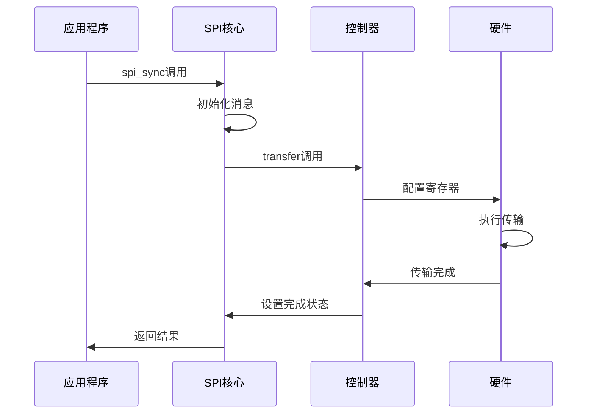
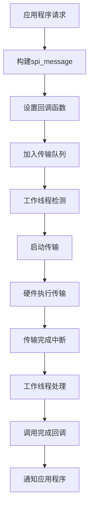
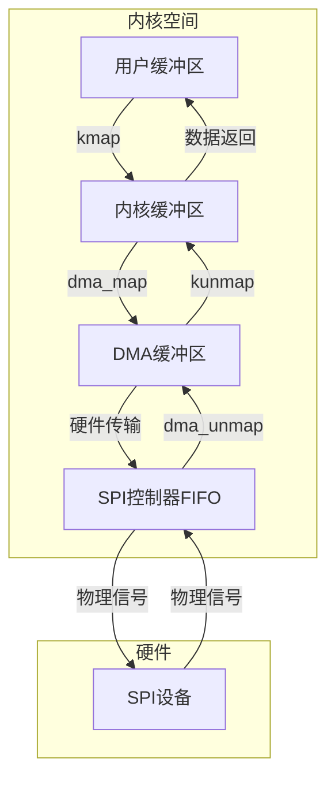
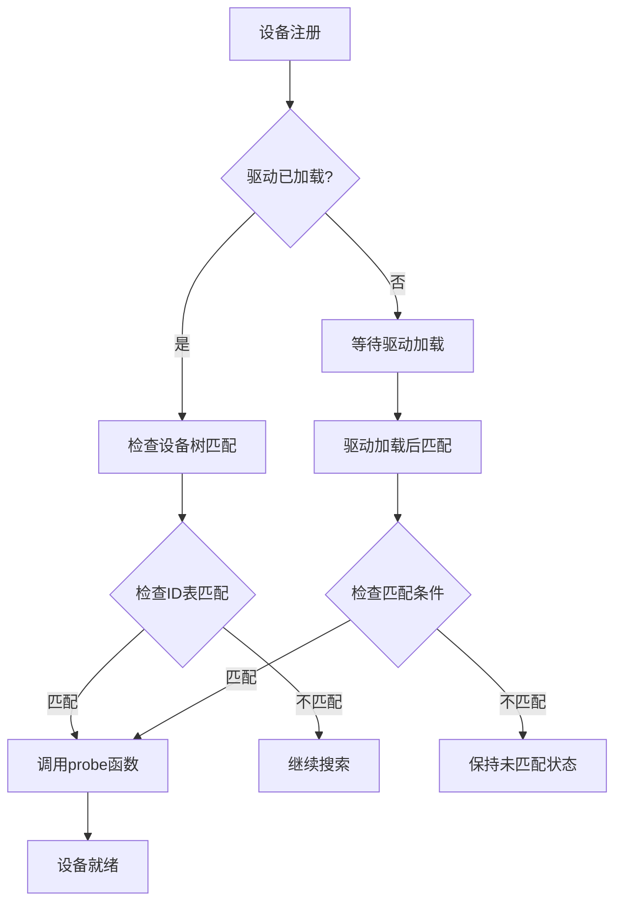
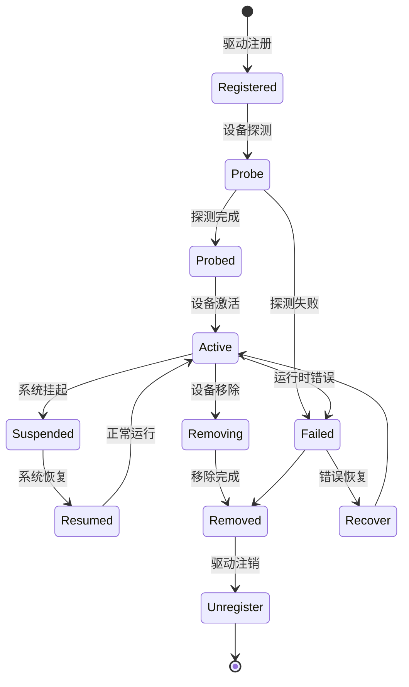
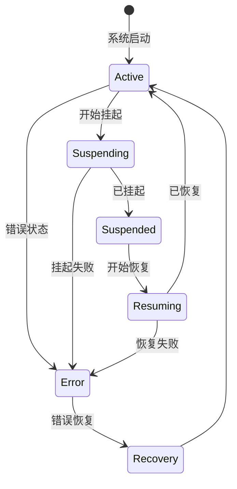

# 02 - SPI核心概念

> **深入理解SPI传输模式、设备模型和驱动模型的工作原理**
> 
> **难度级别**: 进阶  
> **阅读时间**: 60分钟  
> **前置知识**: C语言、Linux内核基础、SPI协议基础、框架架构

## 目录

- [1. SPI传输模式详解](#1-spi传输模式详解)
  - [1.1 同步传输](#11-同步传输)
  - [1.2 异步传输](#12-异步传输)
  - [1.3 DMA传输](#13-dma传输)
- [2. SPI设备模型](#2-spi设备模型)
  - [2.1 设备抽象层次](#21-设备抽象层次)
  - [2.2 设备生命周期](#22-设备生命周期)
  - [2.3 设备树配置](#23-设备树配置)
- [3. SPI驱动模型](#3-spi驱动模型)
  - [3.1 驱动注册机制](#31-驱动注册机制)
  - [3.2 设备驱动匹配](#32-设备驱动匹配)
  - [3.3 驱动生命周期](#33-驱动生命周期)
- [4. 传输调度机制](#4-传输调度机制)
  - [4.1 传输队列管理](#41-传输队列管理)
  - [4.2 传输优先级处理](#42-传输优先级处理)
  - [4.3 并发控制](#43-并发控制)
- [5. 电源管理集成](#5-电源管理集成)
  - [5.1 电源状态转换](#51-电源状态转换)
  - [5.2 唤醒机制](#52-唤醒机制)
- [6. 实践示例](#6-实践示例)
  - [6.1 多传输模式演示](#61-多传输模式演示)
  - [6.2 设备驱动匹配示例](#62-设备驱动匹配示例)
- [7. 总结](#7-总结)

---

## 1. SPI传输模式详解

SPI框架支持多种传输模式，以适应不同的性能和实时性需求。理解这些传输模式对于编写高效稳定的SPI驱动至关重要。

### 1.1 同步传输

同步传输是最简单的传输方式，应用程序等待传输完成后才继续执行。这种方式简单可靠，但会阻塞应用程序。

#### 1.1.1 同步传输实现

```c
/**
 * 同步传输实现
 * @spi: SPI设备
 * @message: 传输消息
 * 
 * 返回值: 成功返回0，失败返回错误码
 */
int spi_sync(struct spi_device *spi, struct spi_message *message)
{
    DECLARE_COMPLETION_ONSTACK(done);
    int status;
    
    /* 设置完成回调 */
    message->complete = spi_complete;
    message->context = &done;
    
    /* 执行同步传输 */
    status = __spi_sync(spi, message);
    
    /* 检查传输状态 */
    if (status == 0)
        status = message->status;
    
    return status;
}

/**
 * 内部同步传输实现
 */
static int __spi_sync(struct spi_device *spi, struct spi_message *message)
{
    struct spi_master *master = spi->master;
    int status;
    
    /* 检查控制器是否支持传输 */
    if (!master || !master->transfer)
        return -ENODEV;
    
    /* 设置消息状态 */
    message->status = -EINPROGRESS;
    message->actual_length = 0;
    
    /* 调用控制器传输函数 */
    status = master->transfer(spi, message);
    
    /* 如果传输未完成，等待完成 */
    if (status == 0)
        wait_for_completion(&message->done);
    
    return message->status;
}
```

#### 1.1.2 同步传输时序图



#### 1.1.3 同步传输优缺点

**优点**：
- 实现简单，代码直观
- 传输顺序确定，易于调试
- 无需管理异步状态
- 适合小数据量、简单操作

**缺点**：
- 会阻塞应用程序执行
- CPU利用率低
- 无法处理高并发场景
- 不适合实时性要求高的场景

#### 1.1.4 同步传输使用场景

- 简单的配置寄存器读写
- 小数据量的传感器数据采集
- 调试和测试阶段
- 实时性要求不高的应用

### 1.2 异步传输

异步传输允许应用程序在传输进行时执行其他任务，通过回调函数通知传输完成。这种方式提高了系统的响应能力，但实现相对复杂。

#### 1.2.1 异步传输实现

```c
/**
 * 异步传输实现
 * @spi: SPI设备
 * @message: 传输消息
 * 
 * 返回值: 成功返回0，失败返回错误码
 */
int spi_async(struct spi_device *spi, struct spi_message *message)
{
    struct spi_master *master = spi->master;
    int status;
    
    /* 参数检查 */
    if (!spi || !message || !message->complete)
        return -EINVAL;
    
    /* 设置消息状态 */
    message->status = -EINPROGRESS;
    message->actual_length = 0;
    
    /* 获取控制器锁 */
    mutex_lock(&master->bus_lock_spinlock);
    
    /* 添加到传输队列 */
    if (master->transfer) {
        status = master->transfer(spi, message);
    } else if (master->transfer_one) {
        status = master->transfer_one(master, message);
    } else {
        status = -ENODEV;
    }
    
    if (status == 0) {
        /* 添加到工作队列 */
        if (master->can_dma)
            status = spi_queued_transfer(spi, message);
        else
            status = spi_transfer_queued_message(spi, message);
    }
    
    mutex_unlock(&master->bus_lock_spinlock);
    
    return status;
}

/**
 * 队列传输实现
 */
static int spi_queued_transfer(struct spi_device *spi, 
                             struct spi_message *message)
{
    struct spi_master *master = spi->master;
    int do_transfer = 0;
    
    /* 消息必须完成回调 */
    if (!message->complete)
        return -EINVAL;
    
    /* 获取传输锁 */
    spin_lock_irq(&master->queue_lock);
    
    /* 添加到队列 */
    list_add_tail(&message->queue, &master->queue);
    
    /* 检查是否需要启动传输 */
    if (master->busy || master->suspended) {
        /* 控制器忙或挂起，等待 */
    } else {
        /* 启动工作线程 */
        do_transfer = 1;
    }
    
    spin_unlock_irq(&master->queue_lock);
    
    /* 启动传输 */
    if (do_transfer) {
        kthread_queue_work(&master->kworker, &master->pump_messages);
    }
    
    return 0;
}
```

#### 1.2.2 异步传输工作队列



#### 1.2.3 异步传输优缺点

**优点**：
- 不阻塞应用程序执行
- 提高系统响应能力
- 支持高并发传输
- 适合实时性要求高的场景

**缺点**：
- 实现复杂，需要处理状态管理
- 需要回调函数支持
- 调试相对困难
- 内存管理要求高

#### 1.2.4 异步传输使用场景

- 高性能数据采集系统
- 实时控制系统
- 多任务并发处理
- 大数据量传输场景

### 1.3 DMA传输

DMA传输通过直接内存访问，减少CPU参与，大幅提升性能。特别适合大数据量传输场景。

#### 1.3.1 DMA传输架构



#### 1.3.2 DMA传输实现

```c
/**
 * DMA传输初始化
 */
static int spi_dma_map(struct spi_master *master, struct spi_message *msg)
{
    struct device *dev = master->dev.parent;
    struct spi_transfer *xfer;
    int ret = 0;
    
    /* 遍历所有传输单元 */
    list_for_each_entry(xfer, &msg->transfers, transfer_list) {
        /* 发送缓冲区DMA映射 */
        if (xfer->tx_buf) {
            xfer->tx_dma = dma_map_single(dev, (void *)xfer->tx_buf,
                                        xfer->len, DMA_TO_DEVICE);
            if (dma_mapping_error(dev, xfer->tx_dma)) {
                ret = -ENOMEM;
                goto err_unmap;
            }
        }
        
        /* 接收缓冲区DMA映射 */
        if (xfer->rx_buf) {
            xfer->rx_dma = dma_map_single(dev, xfer->rx_buf,
                                        xfer->len, DMA_FROM_DEVICE);
            if (dma_mapping_error(dev, xfer->rx_dma)) {
                ret = -ENOMEM;
                goto err_unmap;
            }
        }
        
        xfer->is_dma_mapped = 1;
    }
    
    return 0;
    
err_unmap:
    /* 回滚已映射的缓冲区 */
    list_for_each_entry(xfer, &msg->transfers, transfer_list) {
        if (xfer->tx_dma) {
            dma_unmap_single(dev, xfer->tx_dma, xfer->len, DMA_TO_DEVICE);
            xfer->tx_dma = 0;
        }
        if (xfer->rx_dma) {
            dma_unmap_single(dev, xfer->rx_dma, xfer->len, DMA_FROM_DEVICE);
            xfer->rx_dma = 0;
        }
    }
    return ret;
}

/**
 * DMA传输完成回调
 */
static void spi_dma_complete(void *arg)
{
    struct spi_master *master = arg;
    struct spi_message *msg;
    struct device *dev = master->dev.parent;
    
    /* 获取完成的传输消息 */
    msg = list_first_entry(&master->queue, struct spi_message, queue);
    
    /* 取消DMA映射 */
    struct spi_transfer *xfer;
    list_for_each_entry(xfer, &msg->transfers, transfer_list) {
        if (xfer->tx_dma) {
            dma_unmap_single(dev, xfer->tx_dma, xfer->len, DMA_TO_DEVICE);
            xfer->tx_dma = 0;
        }
        if (xfer->rx_dma) {
            dma_unmap_single(dev, xfer->rx_dma, xfer->len, DMA_FROM_DEVICE);
            xfer->rx_dma = 0;
        }
        xfer->is_dma_mapped = 0;
    }
    
    /* 通知传输完成 */
    msg->complete(msg->context);
}
```

#### 1.3.3 DMA传输控制器配置

```c
/**
 * 配置DMA传输
 */
static int spi_dma_config(struct spi_master *master, 
                         struct spi_message *msg)
{
    struct spi_transfer *xfer;
    
    /* 设置DMA标志 */
    msg->is_dma_mapped = 1;
    
    /* 配置每个传输单元 */
    list_for_each_entry(xfer, &msg->transfers, transfer_list) {
        /* 设置DMA地址 */
        if (xfer->tx_buf)
            xfer->tx_dma = dma_map_single(master->dev.parent,
                                         (void *)xfer->tx_buf,
                                         xfer->len, DMA_TO_DEVICE);
        
        if (xfer->rx_buf)
            xfer->rx_dma = dma_map_single(master->dev.parent,
                                         xfer->rx_buf,
                                         xfer->len, DMA_FROM_DEVICE);
        
        /* 配置控制器DMA寄存器 */
        if (master->dma_setup) {
            int ret = master->dma_setup(master, xfer);
            if (ret < 0)
                return ret;
        }
    }
    
    return 0;
}
```

#### 1.3.4 DMA传输优缺点

**优点**：
- CPU占用率低
- 传输速率高
- 支持大块数据传输
- 减少系统总线负载

**缺点**：
- 实现复杂
- 需要硬件DMA支持
- 内存管理要求高
- 可能增加延迟

#### 1.3.5 DMA传输使用场景

- 大数据块传输（如Flash读写）
- 高性能数据采集
- 网络数据包处理
- 音频/视频数据传输

---

## 2. SPI设备模型

### 2.1 设备抽象层次

Linux SPI框架通过多层抽象来管理SPI设备，从物理硬件到应用程序接口。

#### 2.1.1 设备抽象层次图

```mermaid
graph TB
    subgraph "物理层"
        PHYS_DEV[物理SPI设备]
        HW_CTRL[硬件控制器]
    end
    
    subgraph "驱动层"
        SPI_DEV[struct spi_device]
        SPI_DRV[struct spi_driver]
    end
    
    subgraph "核心层"
        SPI_CORE[SPI Core]
        BUS_MGR[总线管理器]
        DEV_MGR[设备管理器]
    end
    
    subgraph "接口层"
        CHAR_DEV[/dev/spidev]
        MTD_DEV[/dev/mtd]
        FB_DEV[/dev/fb]
    end
    
    subgraph "应用层"
        APP_1[应用1]
        APP_2[应用2]
        APP_3[应用3]
    end
    
    PHYS_DEV --> HW_CTRL
    HW_CTRL --> SPI_DEV
    SPI_DEV --> SPI_DRV
    SPI_DRV --> SPI_CORE
    SPI_CORE --> BUS_MGR
    SPI_CORE --> DEV_MGR
    BUS_MGR --> CHAR_DEV
    DEV_MGR --> MTD_DEV
    DEV_MGR --> FB_DEV
    CHAR_DEV --> APP_1
    MTD_DEV --> APP_2
    FB_DEV --> APP_3
```

#### 2.1.2 设备属性管理

```c
/**
 * SPI设备属性结构
 */
struct spi_device {
    struct device dev;                /* 设备结构 */
    struct spi_master *master;         /* 所属主机控制器 */
    struct list_head devices;         /* 设备链表 */
    
    /* 设备配置属性 */
    u8 chip_select;                   /* 片选号 */
    u8 mode;                          /* SPI模式 */
    u8 bits_per_word;                 /* 数据位宽 */
    u32 max_speed_hz;                 /* 最大时钟频率 */
    bool cs_active_high;              /* 高电平有效片选 */
    
    /* 硬件信息 */
    int irq;                         /* 中断号 */
    void *controller_state;          /* 控制器私有数据 */
    void *controller_data;           /* 控制器数据 */
    
    /* 设备标识 */
    char modalias[SPI_NAME_SIZE];     /* 设备别名 */
    const struct spi_device_id *id_entry; /* 设备ID表项 */
    const struct of_device_id *of_fwnode; /* 设备树节点 */
    
    /* 私有数据 */
    void *host_specific;             /* 主机特定数据 */
    void *driver_data;                /* 驱动私有数据 */
    
    /* 统计信息 */
    struct spi_statistics *statistics; /* 统计信息 */
};

/**
 * 设置SPI设备属性
 */
static int spi_setup(struct spi_device *spi)
{
    struct spi_master *master = spi->master;
    int ret;
    
    /* 调用控制器的setup函数 */
    if (master->setup) {
        ret = master->setup(spi);
        if (ret < 0)
            return ret;
    }
    
    /* 更新设备状态 */
    spi->mode &= master->mode_bits;
    spi->bits_per_word = 8; /* 默认8位 */
    
    /* 设置片选电平 */
    if (spi->cs_active_high && spi->mode & SPI_CS_HIGH) {
        /* 高电平有效 */
    } else {
        /* 低电平有效 */
    }
    
    return 0;
}
```

### 2.2 设备生命周期

SPI设备从创建到销毁的完整生命周期。

#### 2.2.1 设备生命周期状态图

```mermaid
stateDiagram-v2
    [*] --> Created: 设备创建
    Created --> Probing: 开始探测
    Probing --> Probed: 探测完成
    Probed --> Active: 设备激活
    Active --> Suspended: 系统挂起
    Suspended --> Resumed: 系统恢复
    Resumed --> Active: 正常运行
    Active --> Removing: 开始移除
    Removing -> Removed: 设备移除
    Removed --> [*]: 资源释放
    
    Probed --> Error: 探测失败
    Error --> [*]
    
    Active --> Error: 运行时错误
    Error --> Recover: 错误恢复
    Recover --> Active
```

#### 2.2.2 设备创建过程

```c
/**
 * 创建SPI设备
 * @master: SPI主机控制器
 * @chip: 设备信息
 * 
 * 返回值: 成功返回0，失败返回错误码
 */
int spi_new_device(struct spi_master *master, struct spi_board_info *chip)
{
    struct spi_device *spi;
    int status;
    
    /* 分配spi_device结构 */
    spi = spi_alloc_device(master);
    if (!spi)
        return -ENOMEM;
    
    /* 设置设备属性 */
    spi->chip_select = chip->chip_select;
    spi->max_speed_hz = chip->max_speed_hz;
    spi->mode = chip->mode;
    spi->bits_per_word = chip->bits_per_word;
    
    /* 设置设备树信息 */
    if (chip->dev.of_node) {
        spi->dev.of_node = chip->dev.of_node;
        spi->dev.fwnode = of_fwnode_handle(chip->dev.of_node);
    }
    
    /* 设置平台数据 */
    if (chip->platform_data) {
        spi->dev.platform_data = chip->platform_data;
    }
    
    /* 注册设备 */
    status = device_add(&spi->dev);
    if (status < 0) {
        spi_dev_put(spi);
        return status;
    }
    
    /* 设置控制器数据 */
    if (chip->controller_data) {
        spi->controller_data = chip->controller_data;
    }
    
    /* 设置中断 */
    if (chip->irq > 0) {
        spi->irq = chip->irq;
    }
    
    return 0;
}

/**
 * 分配SPI设备结构
 */
struct spi_device *spi_alloc_device(struct spi_master *master)
{
    struct spi_device *spi;
    
    if (!master)
        return NULL;
    
    /* 分配设备结构 */
    spi = kzalloc(sizeof(*spi), GFP_KERNEL);
    if (!spi)
        return NULL;
    
    /* 初始化设备 */
    device_initialize(&spi->dev);
    
    /* 设置设备属性 */
    spi->dev.parent = &master->dev;
    spi->dev.bus = &spi_bus_type;
    spi->dev.release = spi_dev_release;
    spi->dev.init_name = kasprintf(GFP_KERNEL, "spi%d.%d",
                                   master->bus_num, 0);
    
    /* 设置主机控制器 */
    spi->master = master;
    
    /* 初始化链表 */
    INIT_LIST_HEAD(&spi->devices);
    
    return spi;
}
```

#### 2.2.3 设备探测流程

```c
/**
 * SPI设备探测
 * @spi: SPI设备
 * 
 * 返回值: 成功返回0，失败返回错误码
 */
static int spi_probe_device(struct spi_device *spi)
{
    struct spi_driver *sdrv = to_spi_driver(spi->dev.driver);
    int status;
    
    /* 调用驱动的probe函数 */
    if (sdrv->probe) {
        status = sdrv->probe(spi);
        if (status < 0) {
            dev_err(&spi->dev, "probe failed with %d\n", status);
            return status;
        }
    }
    
    /* 设置设备状态 */
    spi->state = SPI_STATE_ACTIVE;
    
    /* 记录统计信息 */
    if (spi->statistics) {
        spi->statistics->spi_sync++;
    }
    
    return 0;
}

/**
 * 设备匹配函数
 */
static int spi_match_device(struct device *dev, struct device_driver *drv)
{
    struct spi_device *spi = to_spi_device(dev);
    struct spi_driver *sdrv = to_spi_driver(drv);
    
    /* 检查设备ID表 */
    if (sdrv->id_table)
        return spi_match_id(sdrv->id_table, spi) != NULL;
    
    /* 检查设备树匹配 */
    if (sdrv->of_match_table && spi->dev.of_node)
        of_match_device(sdrv->of_match_table, &spi->dev) != NULL;
    
    /* 按名字匹配 */
    return strcmp(spi->modalias, drv->name) == 0;
}
```

### 2.3 设备树配置

设备树是现代Linux系统配置SPI设备的主要方式。

#### 2.3.1 设备树节点示例

```dts
// SPI控制器节点
&spi0 {
    compatible = "snps,dw-apb-ssi";
    #address-cells = <1>;
    #size-cells = <0>;
    status = "okay";
    
    pinctrl-names = "default";
    pinctrl-0 = <&spi0_pins>;
    
    clock-frequency = <50000000>;
    cs-gpios = <&gpio1 0 GPIO_ACTIVE_LOW>,
               <&gpio1 1 GPIO_ACTIVE_LOW>;
};

// SPI Flash设备节点
&w25q32: flash@0 {
    compatible = "winbond,w25q32";
    reg = <0>;  // CS0
    spi-max-frequency = <50000000>;
    spi-cpol;
    spi-cpha;
    
    partitions {
        compatible = "fixed-partitions";
        #address-cells = <1>;
        #size-cells = <1>;
        
        partition@0 {
            label = "boot";
            reg = <0x00000000 0x00100000>;
        };
        
        partition@1 {
            label = "system";
            reg = <0x00100000 0x00300000>;
        };
    }
};

// SPI传感器设备节点
&bme280: sensor@1 {
    compatible = "bosch,bme280";
    reg = <1>;  // CS1
    spi-max-frequency = <1000000>;
    interrupt-parent = <&gpio2>;
    interrupts = <5 IRQ_TYPE_EDGE_RISING>;
    
    pressure {
        compatible = "bosch,bme280-press";
    };
    
    temperature {
        compatible = "bosch,bme280-temp";
    };
    
    humidity {
        compatible = "bosch,bme280-humidity";
    };
};
```

#### 2.3.2 设备树解析实现

```c
/**
 * 从设备树解析SPI设备
 * @master: SPI主机控制器
 * @nc: 设备树节点
 * @chip: 设备信息输出
 * 
 * 返回值: 成功返回0，失败返回错误码
 */
static int spi_parse_dt(struct spi_master *master, 
                       struct device_node *nc,
                       struct spi_board_info *chip)
{
    u32 speed;
    u32 mode = 0;
    const char *cs_gpio_name;
    int cs_gpio = -1;
    int ret;
    
    /* 获取设备兼容性 */
    if (of_property_read_string(nc, "compatible", &chip->modalias))
        return -EINVAL;
    
    /* 获取片选号 */
    ret = of_property_read_u32(nc, "reg", &chip->chip_select);
    if (ret) {
        dev_err(&master->dev, "Failed to get chip-select\n");
        return ret;
    }
    
    /* 获取最大频率 */
    if (of_property_read_u32(nc, "spi-max-frequency", &speed)) {
        chip->max_speed_hz = master->max_speed_hz;
    } else {
        chip->max_speed_hz = speed;
    }
    
    /* 解析SPI模式 */
    if (of_property_read_bool(nc, "spi-cpol"))
        mode |= SPI_CPOL;
    if (of_property_read_bool(nc, "spi-cpha"))
        mode |= SPI_CPHA;
    if (of_property_read_bool(nc, "spi-cs-high"))
        mode |= SPI_CS_HIGH;
    
    chip->mode = mode;
    
    /* 解析片选GPIO */
    cs_gpio_name = kasprintf(GFP_KERNEL, "cs-gpios");
    if (cs_gpio_name) {
        of_property_read_u32_array(nc, "cs-gpios", &cs_gpio, 1);
        kfree(cs_gpio_name);
    }
    
    /* 解析中断 */
    if (of_property_read_bool(nc, "interrupt-parent")) {
        chip->irq = irq_of_parse_and_map(nc, 0);
    }
    
    /* 解析平台数据 */
    chip->platform_data = of_device_get_match_data(nc);
    
    return 0;
}

/**
 * 扫描设备树中的SPI设备
 */
static int spi_scan_boardinfo(struct spi_master *master)
{
    struct spi_board_info *bi;
    struct device_node *nc;
    int bus_num = master->bus_num;
    int ret;
    
    /* 遍历SPI控制器下的所有节点 */
    for_each_child_of_node(master->dev.of_node, nc) {
        bi = kzalloc(sizeof(*bi), GFP_KERNEL);
        if (!bi) {
            of_node_put(nc);
            return -ENOMEM;
        }
        
        /* 解析设备树节点 */
        ret = spi_parse_dt(master, nc, bi);
        if (ret) {
            dev_err(&master->dev, "Failed to parse device %s: %d\n",
                    nc->name, ret);
            kfree(bi);
            continue;
        }
        
        /* 设置总线号 */
        bi->bus_num = bus_num;
        
        /* 注册设备 */
        ret = spi_new_device(master, bi);
        if (ret) {
            dev_err(&master->dev, "Failed to add device %s: %d\n",
                    nc->name, ret);
            kfree(bi);
        }
    }
    
    return 0;
}
```

---

## 3. SPI驱动模型

### 3.1 驱动注册机制

SPI驱动注册机制允许内核动态加载和管理SPI设备驱动。

#### 3.1.1 驱动注册接口

```c
/**
 * 注册SPI驱动
 * @drv: SPI驱动结构
 * 
 * 返回值: 成功返回0，失败返回错误码
 */
int spi_register_driver(struct spi_driver *sdrv)
{
    struct device_driver *drv = &sdrv->driver;
    int ret;
    
    /* 设置驱动总线 */
    drv->bus = &spi_bus_type;
    
    /* 注册设备驱动 */
    ret = driver_register(drv);
    if (ret)
        return ret;
    
    /* 自动探测已存在的设备 */
    spi_driver_add_devices(sdrv);
    
    return 0;
}

/**
 * 注销SPI驱动
 * @sdrv: SPI驱动结构
 */
void spi_unregister_driver(struct spi_driver *sdrv)
{
    driver_unregister(&sdrv->driver);
}
```

#### 3.1.2 驱动结构定义

```c
/**
 * SPI驱动结构
 */
struct spi_driver {
    const struct spi_device_id *id_table;  /* 设备ID表 */
    int (*probe)(struct spi_device *spi);  /* 探测函数 */
    int (*remove)(struct spi_device *spi);  /* 移除函数 */
    void (*shutdown)(struct spi_device *spi); /* 关闭函数 */
    int (*suspend)(struct spi_device *spi, pm_message_t mesg); /* 挂起函数 */
    int (*resume)(struct spi_device *spi);   /* 恢复函数 */
    
    /* 设备驱动结构 */
    struct device_driver driver;
    
    /* 内核模块信息 */
    struct module *owner;
    const char *mod_name;
};

/**
 * SPI设备ID表
 */
struct spi_device_id {
    char name[SPI_NAME_SIZE];  /* 设备名称 */
    __kernel_size_t driver_data; /* 驱动私有数据 */
};
```

#### 3.1.3 驱动模块示例

```c
#include <linux/spi/spi.h>
#include <linux/module.h>

#define DRIVER_NAME "my-spi-device"

/* 设备ID表 */
static const struct spi_device_id my_spi_ids[] = {
    { "my-spi-device", 0 },
    { "my-spi-device-v2", 1 },
    { } /* 终止符 */
};
MODULE_DEVICE_TABLE(spi, my_spi_ids);

/* 设备树匹配表 */
static const struct of_device_id my_spi_dt_ids[] = {
    { .compatible = "my-company,my-spi-device" },
    { .compatible = "my-company,my-spi-device-v2" },
    { }
};

/* 设备探测函数 */
static int my_spi_probe(struct spi_device *spi)
{
    struct my_device *dev;
    int ret;
    
    pr_info("Probing SPI device: %s\n", spi->modalias);
    
    /* 设置设备参数 */
    spi->mode = SPI_MODE_0;
    spi->bits_per_word = 8;
    spi->max_speed_hz = 1000000;
    
    /* 分配设备结构 */
    dev = devm_kzalloc(&spi->dev, sizeof(*dev), GFP_KERNEL);
    if (!dev)
        return -ENOMEM;
    
    /* 保存私有数据 */
    spi_set_drvdata(spi, dev);
    
    /* 初始化硬件 */
    ret = my_device_init(dev, spi);
    if (ret < 0) {
        dev_err(&spi->dev, "Failed to initialize device: %d\n", ret);
        return ret;
    }
    
    return 0;
}

/* 设备移除函数 */
static int my_spi_remove(struct spi_device *spi)
{
    struct my_device *dev = spi_get_drvdata(spi);
    
    pr_info("Removing SPI device: %s\n", spi->modalias);
    
    /* 清理硬件 */
    my_device_cleanup(dev);
    
    return 0;
}

/* SPI驱动结构 */
static struct spi_driver my_spi_driver = {
    .driver = {
        .name = DRIVER_NAME,
        .owner = THIS_MODULE,
    },
    .probe = my_spi_probe,
    .remove = my_spi_remove,
    .id_table = my_spi_ids,
    .of_match_table = my_spi_dt_ids,
};

/* 模块初始化 */
static int __init my_spi_init(void)
{
    pr_info("Loading SPI driver: %s\n", DRIVER_NAME);
    return spi_register_driver(&my_spi_driver);
}

/* 模块退出 */
static void __exit my_spi_exit(void)
{
    pr_info("Unloading SPI driver: %s\n", DRIVER_NAME);
    spi_unregister_driver(&my_spi_driver);
}

module_init(my_spi_init);
module_exit(my_spi_exit);

MODULE_LICENSE("GPL");
MODULE_AUTHOR("Your Name");
MODULE_DESCRIPTION("My SPI device driver");
```

### 3.2 设备驱动匹配

设备驱动匹配机制决定了哪些驱动可以控制哪些设备。

#### 3.2.1 匹配规则

```c
/**
 * SPI设备匹配函数
 * @dev: 设备
 * @drv: 驱动
 * 
 * 返回值: 匹配成功返回1，失败返回0
 */
static int spi_match_device(struct device *dev, struct device_driver *drv)
{
    struct spi_device *spi = to_spi_device(dev);
    struct spi_driver *sdrv = to_spi_driver(drv);
    
    /* 检查设备ID表 */
    if (sdrv->id_table)
        return spi_match_id(sdrv->id_table, spi) != NULL;
    
    /* 检查设备树匹配 */
    if (sdrv->of_match_table && spi->dev.of_node)
        of_match_device(sdrv->of_match_table, &spi->dev) != NULL;
    
    /* 按名字匹配 */
    return strcmp(spi->modalias, drv->name) == 0;
}

/**
 * SPI ID匹配
 * @ids: 设备ID表
 * @spi: SPI设备
 * 
 * 返回值: 匹配的ID表项，未匹配返回NULL
 */
const struct spi_device_id *spi_match_id(const struct spi_device_id *ids,
                                         const struct spi_device *spi)
{
    for (; ids->name[0]; ids++)
        if (strcmp(spi->modalias, ids->name) == 0)
            return ids;
    return NULL;
}
```

#### 3.2.2 匹配流程图



### 3.3 驱动生命周期

SPI驱动的完整生命周期，从注册到卸载。

#### 3.3.1 驱动生命周期状态图



#### 3.3.2 驱动注册和注销

```c
/**
 * 注册SPI驱动
 */
int spi_register_driver(struct spi_driver *sdrv)
{
    struct device_driver *drv = &sdrv->driver;
    int ret;
    
    /* 设置驱动总线 */
    drv->bus = &spi_bus_type;
    
    /* 设置设备探测和移除函数 */
    drv->probe = spi_drv_probe;
    drv->remove = spi_drv_remove;
    
    /* 注册设备驱动 */
    ret = driver_register(drv);
    if (ret)
        return ret;
    
    /* 自动探测已存在的设备 */
    spi_driver_add_devices(sdrv);
    
    return 0;
}

/**
 * 注销SPI驱动
 */
void spi_unregister_driver(struct spi_driver *sdrv)
{
    /* 移除所有设备 */
    spi_driver_remove_devices(sdrv);
    
    /* 注销驱动 */
    driver_unregister(&sdrv->driver);
}

/**
 * SPI驱动探测代理
 */
static int spi_drv_probe(struct device *dev)
{
    struct spi_driver *sdrv = to_spi_driver(dev->driver);
    struct spi_device *spi = to_spi_device(dev);
    int ret;
    
    /* 调用驱动特定的probe函数 */
    ret = sdrv->probe(spi);
    if (ret < 0) {
        dev_err(dev, "probe failed with %d\n", ret);
        return ret;
    }
    
    return 0;
}

/**
 * SPI驱动移除代理
 */
static int spi_drv_remove(struct device *dev)
{
    struct spi_driver *sdrv = to_spi_driver(dev->driver);
    struct spi_device *spi = to_spi_device(dev);
    
    /* 调用驱动特定的remove函数 */
    sdrv->remove(spi);
    
    return 0;
}
```

---

## 4. 传输调度机制

### 4.1 传输队列管理

SPI传输队列管理机制负责调度和执行多个SPI传输请求。

#### 4.1.1 传输队列结构

```c
/**
 * SPI传输队列管理结构
 */
struct spi_master {
    /* 传输队列 */
    spinlock_t queue_lock;          /* 队列锁 */
    struct list_head queue;          /* 传输队列 */
    struct list_head queue_idle;    /* 空闲队列 */
    
    /* 工作队列 */
    struct kthread_worker kworker;   /* 工作线程 */
    struct kthread_work pump_messages; /* 消息处理工作 */
    
    /* 状态标志 */
    bool busy;                      /* 控制器忙标志 */
    bool suspended;                 /* 挂起标志 */
    bool running;                   /* 运行标志 */
    
    /* 统计信息 */
    unsigned long messages_processed; /* 处理的消息数 */
    unsigned long transfers_processed; /* 处理的传输数 */
};
```

#### 4.1.2 队列操作实现

```c
/**
 * 添加传输消息到队列
 * @spi: SPI设备
 * @msg: 传输消息
 * 
 * 返回值: 成功返回0，失败返回错误码
 */
static int spi_transfer_queued_message(struct spi_device *spi,
                                      struct spi_message *msg)
{
    struct spi_master *master = spi->master;
    unsigned long flags;
    int do_transfer = 0;
    
    /* 消息必须完成回调 */
    if (!msg->complete)
        return -EINVAL;
    
    /* 获取队列锁 */
    spin_lock_irqsave(&master->queue_lock, flags);
    
    /* 添加到队列 */
    list_add_tail(&msg->queue, &master->queue);
    
    /* 检查是否需要启动传输 */
    if (!master->busy && !master->suspended) {
        /* 控制器空闲，可以启动传输 */
        master->busy = true;
        do_transfer = 1;
    }
    
    spin_unlock_irqrestore(&master->queue_lock, flags);
    
    /* 启动传输 */
    if (do_transfer) {
        if (master->transfer_one) {
            kthread_queue_work(&master->kworker, &master->pump_messages);
        } else {
            /* 同步传输 */
            spi_pump_messages(master);
        }
    }
    
    return 0;
}

/**
 * 处理传输队列
 */
static void spi_pump_messages(struct spi_master *master)
{
    struct spi_message *msg;
    int ret;
    
    /* 获取队列中的第一个消息 */
    msg = list_first_entry_or_null(&master->queue,
                                 struct spi_message,
                                 queue);
    if (!msg) {
        master->busy = false;
        return;
    }
    
    /* 执行传输 */
    if (master->transfer_one) {
        ret = master->transfer_one(master, msg);
    } else {
        ret = master->transfer(msg->spi, msg);
    }
    
    if (ret < 0) {
        /* 传输失败 */
        msg->status = ret;
        msg->complete(msg->context);
    }
}
```

#### 4.1.3 工作线程实现

```c
/**
 * 工作线程函数
 */
static int spi_thread(void *data)
{
    struct spi_master *master = data;
    
    while (!kthread_should_stop()) {
        /* 等待工作 */
        set_current_state(TASK_INTERRUPTIBLE);
        
        if (list_empty(&master->queue))
            schedule();
        else
            __set_current_state(TASK_RUNNING);
        
        /* 处理队列 */
        spi_pump_messages(master);
    }
    
    return 0;
}

/**
 * 初始化工作队列
 */
static int spi_init_queue(struct spi_master *master)
{
    struct task_struct *kworker;
    int ret;
    
    /* 初始化锁 */
    spin_lock_init(&master->queue_lock);
    INIT_LIST_HEAD(&master->queue);
    INIT_LIST_HEAD(&master->queue_idle);
    
    /* 创建工作线程 */
    kworker = kthread_run(spi_thread, master, "spi%d",
                        master->bus_num);
    if (IS_ERR(kworker)) {
        ret = PTR_ERR(kworker);
        return ret;
    }
    
    /* 初始化工作项 */
    INIT_KTHREAD_WORK(&master->pump_messages, spi_pump_messages);
    
    return 0;
}
```

### 4.2 传输优先级处理

SPI传输需要支持优先级处理，确保重要的传输能够及时执行。

#### 4.2.1 优先级队列实现

```c
/**
 * 带优先级的SPI消息队列
 */
struct spi_priority_queue {
    struct list_head high_priority;  /* 高优先级队列 */
    struct list_head normal_priority; /* 普通优先级队列 */
    struct list_head low_priority;   /* 低优先级队列 */
    spinlock_t lock;                 /* 队列锁 */
};

/**
 * 创建优先级队列
 */
static void spi_priority_queue_init(struct spi_priority_queue *queue)
{
    INIT_LIST_HEAD(&queue->high_priority);
    INIT_LIST_HEAD(&queue->normal_priority);
    INIT_LIST_HEAD(&queue->low_priority);
    spin_lock_init(&queue->lock);
}

/**
 * 添加消息到优先级队列
 * @queue: 优先级队列
 * @msg: 传输消息
 * @priority: 优先级 (0=高, 1=普通, 2=低)
 */
static void spi_priority_queue_add(struct spi_priority_queue *queue,
                                  struct spi_message *msg,
                                  int priority)
{
    unsigned long flags;
    
    spin_lock_irqsave(&queue->lock, flags);
    
    /* 根据优先级添加到相应队列 */
    switch (priority) {
    case 0:  /* 高优先级 */
        list_add_tail(&msg->queue, &queue->high_priority);
        break;
    case 1:  /* 普通优先级 */
        list_add_tail(&msg->queue, &queue->normal_priority);
        break;
    case 2:  /* 低优先级 */
    default:
        list_add_tail(&msg->queue, &queue->low_priority);
        break;
    }
    
    spin_unlock_irqrestore(&queue->lock, flags);
}

/**
 * 从优先级队列获取消息
 * @queue: 优先级队列
 * 
 * 返回值: 获取的消息，队列为空返回NULL
 */
static struct spi_message *spi_priority_queue_get(struct spi_priority_queue *queue)
{
    struct spi_message *msg = NULL;
    unsigned long flags;
    
    spin_lock_irqsave(&queue->lock, flags);
    
    /* 按优先级顺序获取消息 */
    if (!list_empty(&queue->high_priority)) {
        msg = list_first_entry(&queue->high_priority,
                              struct spi_message,
                              queue);
        list_del(&msg->queue);
    } else if (!list_empty(&queue->normal_priority)) {
        msg = list_first_entry(&queue->normal_priority,
                              struct spi_message,
                              queue);
        list_del(&msg->queue);
    } else if (!list_empty(&queue->low_priority)) {
        msg = list_first_entry(&queue->low_priority,
                              struct spi_message,
                              queue);
        list_del(&msg->queue);
    }
    
    spin_unlock_irqrestore(&queue->lock, flags);
    
    return msg;
}
```

#### 4.2.2 优先级传输调度

```c
/**
 * 优先级传输调度
 * @master: SPI主机控制器
 */
static void spi_schedule_priority_transfer(struct spi_master *master)
{
    struct spi_priority_queue *queue = &master->priority_queue;
    struct spi_message *msg;
    
    /* 从优先级队列获取消息 */
    msg = spi_priority_queue_get(queue);
    if (!msg)
        return;
    
    /* 执行传输 */
    if (master->transfer_one) {
        master->transfer_one(master, msg);
    } else {
        master->transfer(msg->spi, msg);
    }
}
```

### 4.3 并发控制

SPI传输需要处理并发访问，确保数据一致性和传输完整性。

#### 4.3.1 并发控制机制

```c
/**
 * SPI并发控制结构
 */
struct spi_concurrency {
    struct mutex lock;              /* 主锁 */
    spinlock_t spinlock;           /* 自旋锁 */
    atomic_t active_transfers;     /* 活跃传输计数 */
    wait_queue_head_t wait_queue;  /* 等待队列 */
    
    /* 并发限制 */
    int max_concurrent;            /* 最大并发数 */
    int current_concurrent;        /* 当前并发数 */
};

/**
 * 初始化并发控制
 */
static int spi_concurrency_init(struct spi_concurrency *concurrency,
                               int max_concurrent)
{
    mutex_init(&concurrency->lock);
    spin_lock_init(&concurrency->spinlock);
    atomic_set(&concurrency->active_transfers, 0);
    init_waitqueue_head(&concurrency->wait_queue);
    
    concurrency->max_concurrent = max_concurrent;
    concurrency->current_concurrent = 0;
    
    return 0;
}

/**
 * 获取并发访问权限
 */
static int spi_concurrency_acquire(struct spi_concurrency *concurrency)
{
    DEFINE_WAIT(wait);
    int ret = 0;
    
    /* 获取主锁 */
    mutex_lock(&concurrency->lock);
    
    /* 检查并发限制 */
    while (concurrency->current_concurrent >= concurrency->max_concurrent) {
        prepare_to_wait(&concurrency->wait_queue, &wait,
                       TASK_INTERRUPTIBLE);
        
        mutex_unlock(&concurrency->lock);
        schedule();
        mutex_lock(&concurrency->lock);
        
        if (signal_pending(current)) {
            ret = -ERESTARTSYS;
            break;
        }
    }
    
    finish_wait(&concurrency->wait_queue, &wait);
    
    if (ret == 0) {
        concurrency->current_concurrent++;
    }
    
    mutex_unlock(&concurrency->lock);
    
    return ret;
}

/**
 * 释放并发访问权限
 */
static void spi_concurrency_release(struct spi_concurrency *concurrency)
{
    mutex_lock(&concurrency->lock);
    
    concurrency->current_concurrent--;
    
    /* 唤醒等待的进程 */
    if (concurrency->current_concurrent < concurrency->max_concurrent) {
        wake_up(&concurrency->wait_queue);
    }
    
    mutex_unlock(&concurrency->lock);
}
```

#### 4.3.2 并发传输示例

```c
/**
 * 并发传输处理
 */
static int spi_handle_concurrent_transfer(struct spi_master *master,
                                        struct spi_message *msg)
{
    struct spi_concurrency *concurrency = &master->concurrency;
    int ret;
    
    /* 获取并发访问权限 */
    ret = spi_concurrency_acquire(concurrency);
    if (ret < 0)
        return ret;
    
    /* 执行传输 */
    msg->status = -EINPROGRESS;
    msg->actual_length = 0;
    
    if (master->transfer_one) {
        ret = master->transfer_one(master, msg);
    } else {
        ret = master->transfer(msg->spi, msg);
    }
    
    /* 释放并发访问权限 */
    spi_concurrency_release(concurrency);
    
    return ret;
}
```

---

## 5. 电源管理集成

### 5.1 电源状态转换

SPI框架支持完整的电源管理功能，包括挂起和恢复。

#### 5.1.1 电源状态转换流程



#### 5.1.2 电源管理实现

```c
/**
 * SPI电源管理操作
 */
static const struct dev_pm_ops spi_pm_ops = {
    .suspend = spi_suspend,
    .resume = spi_resume,
    .freeze = spi_suspend,
    .thaw = spi_resume,
    .poweroff = spi_suspend,
    .restore = spi_resume,
};

/**
 * SPI设备挂起
 * @dev: 设备
 * @mesg: 电源消息
 * 
 * 返回值: 成功返回0，失败返回错误码
 */
static int spi_suspend(struct device *dev, pm_message_t mesg)
{
    struct spi_device *spi = to_spi_device(dev);
    struct spi_driver *sdrv = to_spi_driver(dev->driver);
    int ret = 0;
    
    dev_info(dev, "suspending\n");
    
    /* 调用驱动的挂起函数 */
    if (sdrv && sdrv->suspend) {
        ret = sdrv->suspend(spi, mesg);
        if (ret < 0) {
            dev_err(dev, "suspend failed: %d\n", ret);
            return ret;
        }
    }
    
    /* 挂起控制器 */
    if (spi->master && spi->master->suspend) {
        ret = spi->master->suspend(spi->master);
        if (ret < 0) {
            dev_err(dev, "master suspend failed: %d\n", ret);
            return ret;
        }
    }
    
    /* 设置设备状态 */
    spi->state = SPI_STATE_SUSPENDED;
    
    return 0;
}

/**
 * SPI设备恢复
 * @dev: 设备
 * 
 * 返回值: 成功返回0，失败返回错误码
 */
static int spi_resume(struct device *dev)
{
    struct spi_device *spi = to_spi_device(dev);
    struct spi_driver *sdrv = to_spi_driver(dev->driver);
    int ret = 0;
    
    dev_info(dev, "resuming\n");
    
    /* 恢复控制器 */
    if (spi->master && spi->master->resume) {
        ret = spi->master->resume(spi->master);
        if (ret < 0) {
            dev_err(dev, "master resume failed: %d\n", ret);
            return ret;
        }
    }
    
    /* 重新设置设备参数 */
    ret = spi_setup(spi);
    if (ret < 0) {
        dev_err(dev, "setup failed: %d\n", ret);
        return ret;
    }
    
    /* 调用驱动的恢复函数 */
    if (sdrv && sdrv->resume) {
        ret = sdrv->resume(spi);
        if (ret < 0) {
            dev_err(dev, "resume failed: %d\n", ret);
            return ret;
        }
    }
    
    /* 设置设备状态 */
    spi->state = SPI_STATE_ACTIVE;
    
    return 0;
}
```

### 5.2 唤醒机制

SPI设备支持从低功耗状态唤醒，需要处理唤醒源配置。

#### 5.2.1 唤醒源配置

```c
/**
 * 配置SPI设备唤醒源
 * @spi: SPI设备
 * @enable: 是否启用唤醒
 * 
 * 返回值: 成功返回0，失败返回错误码
 */
static int spi_configure_wakeup(struct spi_device *spi, bool enable)
{
    struct spi_master *master = spi->master;
    int ret = 0;
    
    if (!master || !master->set_wakeup)
        return 0;
    
    /* 设置控制器唤醒能力 */
    ret = master->set_wakeup(master, enable);
    if (ret < 0)
        return ret;
    
    /* 配置设备中断为唤醒源 */
    if (spi->irq > 0) {
        if (enable) {
            enable_irq_wake(spi->irq);
        } else {
            disable_irq_wake(spi->irq);
        }
    }
    
    return 0;
}

/**
 * SPI控制器设置唤醒
 */
static int spi_master_set_wakeup(struct spi_master *master, bool enable)
{
    int ret = 0;
    
    /* 设置控制器的唤醒能力 */
    if (enable) {
        /* 启用唤醒 */
        if (master->enable_wakeup) {
            ret = master->enable_wakeup(master);
            if (ret < 0)
                return ret;
        }
    } else {
        /* 禁用唤醒 */
        if (master->disable_wakeup) {
            ret = master->disable_wakeup(master);
            if (ret < 0)
                return ret;
        }
    }
    
    return 0;
}
```

#### 5.2.2 低功耗传输处理

```c
/**
 * 低功耗传输处理
 */
static int spi_low_power_transfer(struct spi_device *spi,
                                 struct spi_message *msg)
{
    int ret;
    
    /* 检查是否可以进入低功耗模式 */
    if (spi->master->can_wakeup && !spi->master->suspended) {
        /* 启用唤醒 */
        ret = spi_configure_wakeup(spi, true);
        if (ret < 0)
            return ret;
    }
    
    /* 执行传输 */
    ret = spi_sync(spi, msg);
    
    /* 禁用唤醒 */
    if (spi->master->can_wakeup) {
        spi_configure_wakeup(spi, false);
    }
    
    return ret;
}
```

---

## 6. 实践示例

### 6.1 多传输模式演示

以下示例演示了同步传输、异步传输和DMA传输的使用方法。

#### 6.1.1 多传输模式测试程序

```c
/**
 * 多传输模式测试程序
 */
#include <linux/spi/spi.h>
#include <linux/module.h>
#include <linux/platform_device.h>
#include <linux/delay.h>
#include <linux/interrupt.h>
#include <linux/completion.h>
#include <linux/workqueue.h>

#define DRIVER_NAME "multi-mode-test"
#define TEST_BUFFER_SIZE 1024

// 测试设备私有数据
struct test_device {
    struct spi_device *spi;
    struct completion completion;
    struct work_struct work;
    u8 *tx_buf;
    u8 *rx_buf;
    size_t buffer_size;
    int test_result;
};

// 同步传输测试
static int test_sync_transfer(struct test_device *dev)
{
    struct spi_message msg;
    struct spi_transfer xfer;
    int ret;
    
    pr_info("开始同步传输测试\n");
    
    // 准备传输数据
    memset(dev->tx_buf, 0xAA, dev->buffer_size);
    memset(dev->rx_buf, 0x00, dev->buffer_size);
    
    // 设置传输参数
    memset(&xfer, 0, sizeof(xfer));
    xfer.tx_buf = dev->tx_buf;
    xfer.rx_buf = dev->rx_buf;
    xfer.len = dev->buffer_size;
    xfer.speed_hz = 1000000;
    xfer.delay_usecs = 10;
    
    // 初始化消息
    spi_message_init(&msg);
    spi_message_add_tail(&xfer, &msg);
    
    // 执行同步传输
    ret = spi_sync(dev->spi, &msg);
    
    if (ret == 0) {
        // 验证数据
        int errors = 0;
        for (int i = 0; i < dev->buffer_size; i++) {
            if (dev->rx_buf[i] != 0xAA) {
                errors++;
            }
        }
        
        if (errors == 0) {
            pr_info("同步传输测试成功\n");
            return 0;
        } else {
            pr_err("同步传输测试失败: %d 个错误\n", errors);
            return -EIO;
        }
    } else {
        pr_err("同步传输测试失败: %d\n", ret);
        return ret;
    }
}

// 异步传输回调函数
static void async_transfer_complete(void *context)
{
    struct test_device *dev = context;
    
    dev->test_result = 0; // 暂时假设成功
    
    // 完成异步传输
    complete(&dev->completion);
}

// 异步传输测试
static int test_async_transfer(struct test_device *dev)
{
    struct spi_message msg;
    struct spi_transfer xfer;
    int ret;
    
    pr_info("开始异步传输测试\n");
    
    // 准备传输数据
    memset(dev->tx_buf, 0x55, dev->buffer_size);
    memset(dev->rx_buf, 0x00, dev->buffer_size);
    
    // 设置传输参数
    memset(&xfer, 0, sizeof(xfer));
    xfer.tx_buf = dev->tx_buf;
    xfer.rx_buf = dev->rx_buf;
    xfer.len = dev->buffer_size;
    xfer.speed_hz = 2000000;
    xfer.delay_usecs = 5;
    
    // 初始化消息
    spi_message_init(&msg);
    spi_message_add_tail(&xfer, &msg);
    
    // 设置完成回调
    init_completion(&dev->completion);
    msg.complete = async_transfer_complete;
    msg.context = dev;
    
    // 执行异步传输
    ret = spi_async(dev->spi, &msg);
    if (ret < 0) {
        pr_err("异步传输启动失败: %d\n", ret);
        return ret;
    }
    
    // 等待传输完成
    if (!wait_for_completion_timeout(&dev->completion,
                                  msecs_to_jiffies(5000))) {
        pr_err("异步传输超时\n");
        return -ETIMEDOUT;
    }
    
    // 验证数据
    int errors = 0;
    for (int i = 0; i < dev->buffer_size; i++) {
        if (dev->rx_buf[i] != 0x55) {
            errors++;
        }
    }
    
    if (errors == 0) {
        pr_info("异步传输测试成功\n");
        return 0;
    } else {
        pr_err("异步传输测试失败: %d 个错误\n", errors);
        return -EIO;
    }
}

// 工作队列处理函数
static void test_work_handler(struct work_struct *work)
{
    struct test_device *dev = container_of(work, struct test_device, work);
    
    // 执行异步传输测试
    dev->test_result = test_async_transfer(dev);
}

// DMA传输测试
static int test_dma_transfer(struct test_device *dev)
{
    struct spi_message msg;
    struct spi_transfer xfer;
    int ret;
    
    pr_info("开始DMA传输测试\n");
    
    // 分配DMA缓冲区
    dev->tx_buf = kmalloc(dev->buffer_size, GFP_KERNEL);
    dev->rx_buf = kmalloc(dev->buffer_size, GFP_KERNEL);
    
    if (!dev->tx_buf || !dev->rx_buf) {
        pr_err("DMA缓冲区分配失败\n");
        return -ENOMEM;
    }
    
    // 准备传输数据
    for (int i = 0; i < dev->buffer_size; i++) {
        dev->tx_buf[i] = (i & 0xFF);
    }
    memset(dev->rx_buf, 0x00, dev->buffer_size);
    
    // 设置传输参数
    memset(&xfer, 0, sizeof(xfer));
    xfer.tx_buf = dev->tx_buf;
    xfer.rx_buf = dev->rx_buf;
    xfer.len = dev->buffer_size;
    xfer.speed_hz = 5000000; // 更高的速度
    xfer.delay_usecs = 1;
    xfer.cs_change = 0;
    
    // 启用DMA
    if (dev->spi->master->can_dma) {
        msg.is_dma_mapped = 1;
    }
    
    // 初始化消息
    spi_message_init(&msg);
    spi_message_add_tail(&xfer, &msg);
    
    // 执行传输
    ret = spi_sync(dev->spi, &msg);
    
    if (ret == 0) {
        // 验证数据
        int errors = 0;
        for (int i = 0; i < dev->buffer_size; i++) {
            if (dev->rx_buf[i] != (i & 0xFF)) {
                errors++;
            }
        }
        
        if (errors == 0) {
            pr_info("DMA传输测试成功\n");
            ret = 0;
        } else {
            pr_err("DMA传输测试失败: %d 个错误\n", errors);
            ret = -EIO;
        }
    } else {
        pr_err("DMA传输测试失败: %d\n", ret);
    }
    
    // 释放DMA缓冲区
    kfree(dev->tx_buf);
    kfree(dev->rx_buf);
    
    return ret;
}

// 设备探测函数
static int test_probe(struct spi_device *spi)
{
    struct test_device *dev;
    int ret;
    
    pr_info("探测测试设备\n");
    
    // 分配设备数据结构
    dev = devm_kzalloc(&spi->dev, sizeof(*dev), GFP_KERNEL);
    if (!dev)
        return -ENOMEM;
    
    // 保存SPI设备引用
    dev->spi = spi;
    spi_set_drvdata(spi, dev);
    
    // 设置SPI参数
    spi->mode = SPI_MODE_0;
    spi->bits_per_word = 8;
    spi->max_speed_hz = 1000000;
    
    // 设置SPI设备
    ret = spi_setup(spi);
    if (ret < 0) {
        dev_err(&spi->dev, "SPI设置失败: %d\n", ret);
        return ret;
    }
    
    // 分配缓冲区
    dev->buffer_size = TEST_BUFFER_SIZE;
    dev->tx_buf = kmalloc(dev->buffer_size, GFP_KERNEL);
    dev->rx_buf = kmalloc(dev->buffer_size, GFP_KERNEL);
    
    if (!dev->tx_buf || !dev->rx_buf) {
        dev_err(&spi->dev, "缓冲区分配失败\n");
        kfree(dev->tx_buf);
        kfree(dev->rx_buf);
        return -ENOMEM;
    }
    
    // 初始化工作队列
    INIT_WORK(&dev->work, test_work_handler);
    
    // 执行测试
    pr_info("开始执行传输测试\n");
    
    // 同步传输测试
    ret = test_sync_transfer(dev);
    if (ret < 0) {
        pr_err("同步传输测试失败\n");
        goto err_free_buf;
    }
    
    // 异步传输测试
    ret = test_async_transfer(dev);
    if (ret < 0) {
        pr_err("异步传输测试失败\n");
        goto err_free_buf;
    }
    
    // DMA传输测试
    if (dev->spi->master->can_dma) {
        ret = test_dma_transfer(dev);
        if (ret < 0) {
            pr_err("DMA传输测试失败\n");
            goto err_free_buf;
        }
    } else {
        pr_info("控制器不支持DMA，跳过DMA测试\n");
    }
    
    pr_info("所有测试完成\n");
    
err_free_buf:
    kfree(dev->tx_buf);
    kfree(dev->rx_buf);
    return ret;
}

// 设备移除函数
static int test_remove(struct spi_device *spi)
{
    struct test_device *dev = spi_get_drvdata(spi);
    
    pr_info("移除测试设备\n");
    
    // 取消待处理的工作
    cancel_work_sync(&dev->work);
    
    // 释放资源
    kfree(dev->tx_buf);
    kfree(dev->rx_buf);
    
    return 0;
}

// 设备ID表
static const struct spi_device_id test_ids[] = {
    { "multi-mode-test", 0 },
    { }
};
MODULE_DEVICE_TABLE(spi, test_ids);

// 设备树匹配表
static const struct of_device_id test_dt_ids[] = {
    { .compatible = "test,multi-mode-test" },
    { }
};

// SPI驱动结构
static struct spi_driver test_driver = {
    .driver = {
        .name = DRIVER_NAME,
        .owner = THIS_MODULE,
    },
    .probe = test_probe,
    .remove = test_remove,
    .id_table = test_ids,
    .of_match_table = test_dt_ids,
};

module_spi_driver(test_driver);

MODULE_LICENSE("GPL");
MODULE_AUTHOR("Test Driver");
MODULE_DESCRIPTION("Multi-mode SPI transfer test driver");
```

### 6.2 设备驱动匹配示例

以下示例演示了如何实现一个支持设备树和ID表匹配的SPI设备驱动。

#### 6.2.1 多模式设备驱动

```c
/**
 * 多模式设备驱动
 */
#include <linux/spi/spi.h>
#include <linux/module.h>
#include <linux/of.h>
#include <linux/gpio.h>
#include <linux/interrupt.h>
#include <linux/irq.h>
#include <linux/workqueue.h>
#include <linux/delay.h>

#define DRIVER_NAME "multi-mode-device"

// 设备私有数据
struct multi_device {
    struct spi_device *spi;
    int irq;
    struct work_struct work;
    struct mutex lock;
    u8 device_id;
    u8 status;
    u8 *data_buffer;
    size_t buffer_size;
};

// 设备状态定义
#define DEVICE_STATUS_IDLE      0x00
#define DEVICE_STATUS_BUSY      0x01
#define DEVICE_STATUS_ERROR      0x02
#define DEVICE_STATUS_READY     0x03

// 设备寄存器定义
#define REG_ID                  0x00
#define REG_STATUS              0x01
#define REG_CONTROL             0x02
#define REG_DATA                0x03

// 设备ID表
static const struct spi_device_id multi_device_ids[] = {
    { "multi-mode-device-v1", 0x01 },
    { "multi-mode-device-v2", 0x02 },
    { "multi-mode-device-v3", 0x03 },
    { }
};
MODULE_DEVICE_TABLE(spi, multi_device_ids);

// 设备树匹配表
static const struct of_device_id multi_device_dt_ids[] = {
    { .compatible = "company,multi-mode-device-v1" },
    { .compatible = "company,multi-mode-device-v2" },
    { .compatible = "company,multi-mode-device-v3" },
    { }
};

// 读取设备寄存器
static int multi_device_read_reg(struct multi_device *dev,
                                 u8 reg, u8 *value)
{
    u8 tx_buf[2] = {reg, 0x00};
    u8 rx_buf[2];
    struct spi_message msg;
    struct spi_transfer xfer = {
        .tx_buf = tx_buf,
        .rx_buf = rx_buf,
        .len = 2,
        .speed_hz = 1000000,
        .delay_usecs = 10,
    };
    
    spi_message_init(&msg);
    spi_message_add_tail(&xfer, &msg);
    
    if (spi_sync(dev->spi, &msg) < 0)
        return -EIO;
    
    *value = rx_buf[1];
    return 0;
}

// 写入设备寄存器
static int multi_device_write_reg(struct multi_device *dev,
                                  u8 reg, u8 value)
{
    u8 buf[2] = {reg, value};
    struct spi_message msg;
    struct spi_transfer xfer = {
        .tx_buf = buf,
        .len = 2,
        .speed_hz = 1000000,
        .delay_usecs = 10,
    };
    
    spi_message_init(&msg);
    spi_message_add_tail(&xfer, &msg);
    
    return spi_sync(dev->spi, &msg);
}

// 读取设备ID
static int multi_device_read_id(struct multi_device *dev, u8 *id)
{
    int ret;
    
    ret = multi_device_read_reg(dev, REG_ID, id);
    if (ret < 0)
        return ret;
    
    pr_info("设备ID: 0x%02X\n", *id);
    return 0;
}

// 初始化设备
static int multi_device_init(struct multi_device *dev)
{
    u8 id, status;
    int ret;
    
    // 读取设备ID
    ret = multi_device_read_id(dev, &dev->device_id);
    if (ret < 0) {
        dev_err(&dev->spi->dev, "读取设备ID失败\n");
        return ret;
    }
    
    // 验证设备ID
    if (dev->device_id < 0x01 || dev->device_id > 0x03) {
        dev_err(&dev->spi->dev, "无效的设备ID: 0x%02X\n", dev->device_id);
        return -EINVAL;
    }
    
    // 读取设备状态
    ret = multi_device_read_reg(dev, REG_STATUS, &status);
    if (ret < 0) {
        dev_err(&dev->spi->dev, "读取设备状态失败\n");
        return ret;
    }
    
    pr_info("设备状态: 0x%02X\n", status);
    
    // 设置设备控制寄存器
    ret = multi_device_write_reg(dev, REG_CONTROL, 0x01);
    if (ret < 0) {
        dev_err(&dev->spi->dev, "设置控制寄存器失败\n");
        return ret;
    }
    
    // 等待设备就绪
    msleep(50);
    
    // 再次检查状态
    ret = multi_device_read_reg(dev, REG_STATUS, &dev->status);
    if (ret < 0) {
        dev_err(&dev->spi->dev, "检查设备状态失败\n");
        return ret;
    }
    
    if (dev->status != DEVICE_STATUS_READY) {
        dev_err(&dev->spi->dev, "设备未就绪，状态: 0x%02X\n", dev->status);
        return -EIO;
    }
    
    pr_info("设备初始化完成\n");
    return 0;
}

// 写入数据
static int multi_device_write_data(struct multi_device *dev,
                                  u8 *data, size_t len)
{
    struct spi_message msg;
    struct spi_transfer xfer;
    int ret;
    
    // 设置设备为忙状态
    dev->status = DEVICE_STATUS_BUSY;
    multi_device_write_reg(dev, REG_STATUS, dev->status);
    
    // 准备传输数据
    memset(dev->data_buffer, 0, dev->buffer_size);
    memcpy(dev->data_buffer, data, len);
    
    // 设置传输参数
    memset(&xfer, 0, sizeof(xfer));
    xfer.tx_buf = dev->data_buffer;
    xfer.len = len;
    xfer.speed_hz = 2000000;
    xfer.delay_usecs = 5;
    
    // 初始化消息
    spi_message_init(&msg);
    spi_message_add_tail(&xfer, &msg);
    
    // 执行传输
    ret = spi_sync(dev->spi, &msg);
    if (ret < 0) {
        dev_err(&dev->spi->dev, "数据传输失败: %d\n", ret);
        goto err_restore_status;
    }
    
    // 验证传输
    msleep(10);
    ret = multi_device_read_reg(dev, REG_STATUS, &dev->status);
    if (ret < 0) {
        dev_err(&dev->spi->dev, "验证传输失败\n");
        goto err_restore_status;
    }
    
    if (dev->status != DEVICE_STATUS_READY) {
        dev_err(&dev->spi->dev, "设备状态异常: 0x%02X\n", dev->status);
        ret = -EIO;
        goto err_restore_status;
    }
    
    pr_info("数据写入成功\n");
    return 0;
    
err_restore_status:
    // 恢复设备状态
    dev->status = DEVICE_STATUS_READY;
    multi_device_write_reg(dev, REG_STATUS, dev->status);
    return ret;
}

// 读取数据
static int multi_device_read_data(struct multi_device *dev,
                                 u8 *data, size_t len)
{
    struct spi_message msg;
    struct spi_transfer xfer;
    int ret;
    
    // 设置设备为忙状态
    dev->status = DEVICE_STATUS_BUSY;
    multi_device_write_reg(dev, REG_STATUS, dev->status);
    
    // 准备传输数据
    memset(dev->data_buffer, 0, dev->buffer_size);
    
    // 设置传输参数
    memset(&xfer, 0, sizeof(xfer));
    xfer.tx_buf = dev->data_buffer;
    xfer.rx_buf = data;
    xfer.len = len;
    xfer.speed_hz = 2000000;
    xfer.delay_usecs = 5;
    
    // 初始化消息
    spi_message_init(&msg);
    spi_message_add_tail(&xfer, &msg);
    
    // 执行传输
    ret = spi_sync(dev->spi, &msg);
    if (ret < 0) {
        dev_err(&dev->spi->dev, "数据读取失败: %d\n", ret);
        goto err_restore_status;
    }
    
    // 验证传输
    msleep(10);
    ret = multi_device_read_reg(dev, REG_STATUS, &dev->status);
    if (ret < 0) {
        dev_err(&dev->spi->dev, "验证读取失败\n");
        goto err_restore_status;
    }
    
    if (dev->status != DEVICE_STATUS_READY) {
        dev_err(&dev->spi->dev, "设备状态异常: 0x%02X\n", dev->status);
        ret = -EIO;
        goto err_restore_status;
    }
    
    pr_info("数据读取成功\n");
    return 0;
    
err_restore_status:
    // 恢复设备状态
    dev->status = DEVICE_STATUS_READY;
    multi_device_write_reg(dev, REG_STATUS, dev->status);
    return ret;
}

// 工作队列处理函数
static void multi_device_work_handler(struct work_struct *work)
{
    struct multi_device *dev = container_of(work, struct multi_device, work);
    u8 data[64];
    int ret;
    
    mutex_lock(&dev->lock);
    
    // 执行设备操作
    pr_info("执行设备操作\n");
    
    // 写入测试数据
    memset(data, 0x55, sizeof(data));
    ret = multi_device_write_data(dev, data, sizeof(data));
    if (ret < 0) {
        dev_err(&dev->spi->dev, "写入数据失败\n");
        goto out;
    }
    
    // 读取数据
    ret = multi_device_read_data(dev, data, sizeof(data));
    if (ret < 0) {
        dev_err(&dev->spi->dev, "读取数据失败\n");
        goto out;
    }
    
    // 验证数据
    int errors = 0;
    for (int i = 0; i < sizeof(data); i++) {
        if (data[i] != 0x55) {
            errors++;
        }
    }
    
    if (errors == 0) {
        pr_info("数据验证成功\n");
    } else {
        pr_err("数据验证失败: %d 个错误\n", errors);
    }
    
out:
    mutex_unlock(&dev->lock);
}

// 中断处理函数
static irqreturn_t multi_device_irq_handler(int irq, void *dev_id)
{
    struct multi_device *dev = dev_id;
    
    // 唤醒工作队列
    schedule_work(&dev->work);
    
    return IRQ_HANDLED;
}

// 设备探测函数
static int multi_device_probe(struct spi_device *spi)
{
    struct multi_device *dev;
    int ret;
    
    pr_info("探测多模式设备\n");
    
    // 分配设备数据结构
    dev = devm_kzalloc(&spi->dev, sizeof(*dev), GFP_KERNEL);
    if (!dev)
        return -ENOMEM;
    
    // 保存SPI设备引用
    dev->spi = spi;
    spi_set_drvdata(spi, dev);
    
    // 设置SPI参数
    spi->mode = SPI_MODE_0;
    spi->bits_per_word = 8;
    spi->max_speed_hz = 1000000;
    
    // 设置SPI设备
    ret = spi_setup(spi);
    if (ret < 0) {
        dev_err(&spi->dev, "SPI设置失败: %d\n", ret);
        return ret;
    }
    
    // 初始化互斥锁
    mutex_init(&dev->lock);
    
    // 分配缓冲区
    dev->buffer_size = 256;
    dev->data_buffer = devm_kmalloc(&spi->dev, dev->buffer_size,
                                   GFP_KERNEL);
    if (!dev->data_buffer)
        return -ENOMEM;
    
    // 初始化工作队列
    INIT_WORK(&dev->work, multi_device_work_handler);
    
    // 初始化设备
    ret = multi_device_init(dev);
    if (ret < 0) {
        dev_err(&spi->dev, "设备初始化失败: %d\n", ret);
        return ret;
    }
    
    // 配置中断
    if (spi->irq > 0) {
        ret = request_irq(spi->irq, multi_device_irq_handler,
                         IRQF_TRIGGER_FALLING, "multi-device", dev);
        if (ret < 0) {
            dev_err(&spi->dev, "请求中断失败: %d\n", ret);
            return ret;
        }
        dev->irq = spi->irq;
    }
    
    pr_info("多模式设备驱动加载成功\n");
    return 0;
}

// 设备移除函数
static int multi_device_remove(struct spi_device *spi)
{
    struct multi_device *dev = spi_get_drvdata(spi);
    
    pr_info("移除多模式设备\n");
    
    // 释放中断
    if (dev->irq > 0) {
        free_irq(dev->irq, dev);
    }
    
    // 取消工作队列
    cancel_work_sync(&dev->work);
    
    // 清理设备
    mutex_destroy(&dev->lock);
    
    return 0;
}

// SPI驱动结构
static struct spi_driver multi_device_driver = {
    .driver = {
        .name = DRIVER_NAME,
        .owner = THIS_MODULE,
    },
    .probe = multi_device_probe,
    .remove = multi_device_remove,
    .id_table = multi_device_ids,
    .of_match_table = multi_device_dt_ids,
};

module_spi_driver(multi_device_driver);

MODULE_LICENSE("GPL");
MODULE_AUTHOR("Multi-Mode Device Driver");
MODULE_DESCRIPTION("Multi-mode SPI device driver with ID table and device tree support");
```

---

## 7. 总结

本章深入介绍了Linux SPI框架的核心概念，包括：

1. **传输模式**：详细分析了同步传输、异步传输和DMA传输的实现原理、使用场景和优缺点。

2. **设备模型**：介绍了SPI设备的抽象层次、生命周期管理和设备树配置机制。

3. **驱动模型**：阐述了驱动注册机制、设备驱动匹配过程和驱动生命周期管理。

4. **传输调度**：讲解了传输队列管理、优先级处理和并发控制机制。

5. **电源管理**：说明了电源状态转换和唤醒机制的实现。

6. **实践示例**：提供了多传输模式演示和设备驱动匹配的完整代码示例。

**关键启示**：
- 不同的传输模式适用于不同的场景，需要根据实际需求选择合适的传输方式
- 设备驱动匹配机制支持多种匹配方式，提高了驱动的兼容性
- 传输调度机制确保了系统的实时性和可靠性
- 电源管理功能对于嵌入式系统至关重要

> 💡 **建议**：在实际开发中，建议充分理解这些核心概念，特别是传输模式和驱动匹配机制，这对于编写稳定高效的SPI驱动非常重要。

---

**本章完成！你已经掌握了SPI传输模式、设备模型和驱动模型的核心知识。**

> 🚀 **下一步**：继续学习[数据结构](./03-data-structures.md)，深入了解SPI核心数据结构和实现细节。