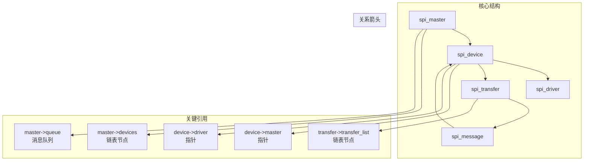
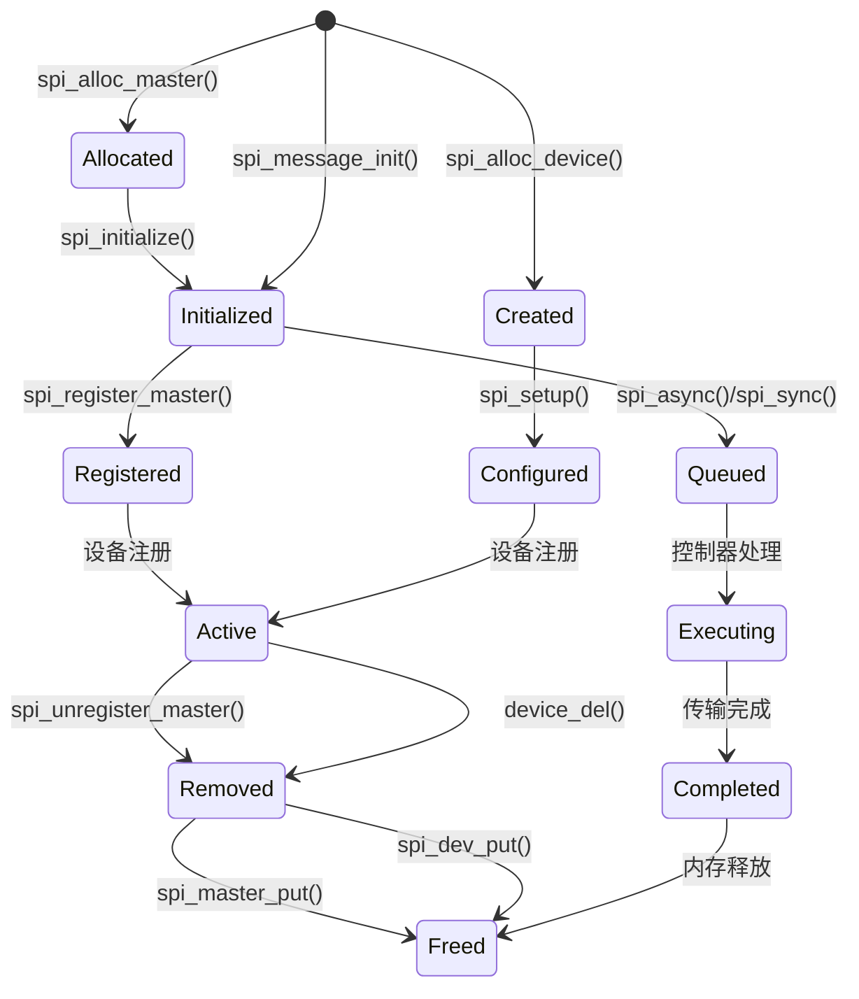

# 03 - SPI数据结构分析

> **深入解析Linux SPI框架中的核心数据结构及其实现原理**
> 
> **难度级别**: 进阶  
> **阅读时间**: 50分钟  
> **前置知识**: C语言、Linux内核基础、数据结构、指针操作

## 目录

- [1. 数据结构概述](#1-数据结构概述)
  - [1.1 数据结构层次](#11-数据结构层次)
  - [1.2 数据关系分析](#12-数据关系分析)
  - [1.3 内存布局特点](#13-内存布局特点)
- [2. 核心数据结构详解](#2-核心数据结构详解)
  - [2.1 spi_master结构](#21-spi_master结构)
  - [2.2 spi_device结构](#22-spi_device结构)
  - [2.3 spi_driver结构](#23-spi_driver结构)
  - [2.4 spi_transfer结构](#24-spi_transfer结构)
  - [2.5 spi_message结构](#25-spi_message结构)
- [3. 数据结构关系分析](#3-数据结构关系分析)
  - [3.1 引用关系链](#31-引用关系链)
  - [3.2 生命周期管理](#32-生命周期管理)
  - [3.3 内存管理策略](#33-内存管理策略)
- [4. 数据结构优化技术](#4-数据结构优化技术)
  - [4.1 内存对齐优化](#41-内存对齐优化)
  - [4.2 缓存优化](#42-缓存优化)
  - [4.3 并发控制优化](#43-并发控制优化)
- [5. 数据结构调试技巧](#5-数据结构调试技巧)
  - [5.1 内存泄漏检测](#51-内存泄漏检测)
  - [5.2 数据结构验证](#52-数据结构验证)
  - [5.3 性能分析](#53-性能分析)
- [6. 实践示例](#6-实践示例)
  - [6.1 复杂数据结构应用](#61-复杂数据结构应用)
  - [6.2 数据结构重构](#62-数据结构重构)
- [7. 总结](#7-总结)

---

## 1. 数据结构概述

### 1.1 数据结构层次

Linux SPI框架采用分层的数据结构设计，实现了从硬件抽象到应用接口的完整映射。这种分层设计提供了良好的模块化和可维护性。

```mermaid
graph TB
    subgraph "硬件层"
        HW_CTRL[SPI控制器硬件]
        HW_DEV[SPI设备硬件]
    end
    
    subgraph "驱动抽象层"
        SPI_MASTER[struct spi_master]
        SPI_DEVICE[struct spi_device]
        SPI_DRIVER[struct spi_driver]
    end
    
    subgraph "传输层"
        SPI_TRANSFER[struct spi_transfer]
        SPI_MESSAGE[struct spi_message]
    end
    
    subgraph "接口层"
        CHAR_DEV[/dev/spidev]
        VFS_LAYER[VFS接口]
    end
    
    subgraph "应用层"
        APP_SPACE[应用程序]
    end
    
    HW_CTRL --> SPI_MASTER
    HW_DEV --> SPI_DEVICE
    SPI_MASTER --> SPI_DEVICE
    SPI_DEVICE --> SPI_DRIVER
    SPI_DEVICE --> SPI_TRANSFER
    SPI_TRANSFER --> SPI_MESSAGE
    SPI_MESSAGE --> CHAR_DEV
    CHAR_DEV --> VFS_LAYER
    VFS_LAYER --> APP_SPACE
```

### 1.2 数据关系分析

SPI框架中的数据结构通过指针建立复杂的关系网络，形成了一个层次化的系统。理解这些关系对于调试和优化SPI驱动至关重要。

#### 1.2.1 关系矩阵分析

| 数据结构 | 引用关系 | 被引用关系 | 生命周期 |
|----------|----------|------------|----------|
| spi_master | 引用device, list_head | 被 spi_device 引用 | 驱动加载/卸载 |
| spi_device | 引用master, dev, driver | 被 spi_message, spi_driver 引用 | 设备注册/注销 |
| spi_driver | 引用driver, id_table | 被 spi_device 匹配 | 驱动注册/注销 |
| spi_transfer | 引用tx_buf, rx_buf | 被 spi_message 包含 | 传输期间临时 |
| spi_message | 引用transfers, spi, complete | 被 spi_device 调用 | 传输期间临时 |

### 1.3 内存布局特点

SPI框架的数据结构设计考虑了内存使用效率和访问性能：

#### 1.3.1 内存对齐和填充

```c
struct spi_master {
    struct device dev;                 /* 64字节对齐 */
    struct list_head list;            /* 8字节 */
    s16 bus_num;                      /* 2字节 + 2字节填充 */
    u16 num_chipselect;               /* 2字节 */
    u16 mode_bits;                    /* 2字节 */
    u32 min_speed_hz;                 /* 4字节 */
    u32 max_speed_hz;                 /* 4字节 */
    /* ... 其他成员 */
};
```

#### 1.3.2 缓存行优化

为提高缓存命中率，相关字段通常放在相邻位置：

```c
struct spi_device {
    struct spi_master *master;         /* 常用指针 */
    struct device dev;                 /* 设备信息 */
    u8 chip_select;                    /* 配置参数 */
    u8 mode;                          /* 配置参数 */
    u8 bits_per_word;                 /* 配置参数 */
    u32 max_speed_hz;                 /* 配置参数 */
    /* ... */
};
```

---

## 2. 核心数据结构详解

### 2.1 spi_master结构

spi_master结构表示SPI主机控制器，是SPI框架的核心数据结构之一。

#### 2.1.1 结构定义分析

```c
struct spi_master {
    struct device dev;                    /* 基础设备结构 */
    struct list_head list;               /* 全局master链表 */
    s16 bus_num;                        /* 总线编号 */
    u16 num_chipselect;                  /* 片选数量 */
    u16 mode_bits;                      /* 支持的SPI模式 */
    u32 min_speed_hz;                   /* 最小时钟频率 */
    u32 max_speed_hz;                   /* 最大时钟频率 */
    u16 flags;                          /* 控制器标志 */
    
    /* 设备管理 */
    struct list_head devices;           /* 设备链表 */
    struct spi_device *cur_dev;         /* 当前设备 */
    
    /* 传输接口 */
    int (*setup)(struct spi_device *spi);
    int (*transfer)(struct spi_device *spi, struct spi_message *mesg);
    int (*transfer_one)(struct spi_master *master, struct spi_message *mesg);
    int (*prepare_transfer_hardware)(struct spi_master *master);
    int (*unprepare_transfer_hardware)(struct spi_master *master);
    int (*prepare_message)(struct spi_master *master, struct spi_message *msg);
    int (*unprepare_message)(struct spi_master *master, struct spi_message *msg);
    
    /* DMA能力 */
    bool can_dma;
    dma_map_ops *dma_dev;
    
    /* 工作队列 */
    struct kthread_worker kworker;
    struct kthread_work pump_messages;
    spinlock_t queue_lock;
    struct list_head queue;
    struct list_head queue_idle;
    
    /* 并发控制 */
    struct mutex bus_lock_spinlock;
    atomic_t busy;
    
    /* 统计信息 */
    unsigned long messages_processed;
    unsigned long transfers_processed;
    unsigned long errors_detected;
};
```

#### 2.1.2 关键字段分析

**设备管理相关字段：**
- `devices`: 连接到该控制器的所有SPI设备链表
- `cur_dev`: 当前正在传输的设备指针
- `num_chipselect`: 控制器支持的片选数量

**传输接口函数指针：**
- `setup`: 设置SPI设备参数的回调函数
- `transfer`: 传统传输接口（旧版本）
- `transfer_one`: 单消息传输接口（推荐）
- `prepare_transfer_hardware`: 准备硬件传输资源
- `unprepare_transfer_hardware`: 释放硬件传输资源

**工作队列相关：**
- `kworker`: 工作线程结构
- `pump_messages`: 消息处理工作项
- `queue`: 传输队列
- `queue_idle`: 空闲队列

**并发控制：**
- `queue_lock`: 队列自旋锁
- `bus_lock_spinlock`: 总线锁
- `busy`: 忙状态标志

#### 2.1.3 内存分配和初始化

```c
/**
 * 分配spi_master结构
 * @dev: 父设备
 * @size: 额外数据大小
 */
struct spi_master *spi_alloc_master(struct device *dev, unsigned size)
{
    struct spi_master *master;
    
    /* 分配内存 */
    master = kzalloc(sizeof(*master) + size, GFP_KERNEL);
    if (!master)
        return NULL;
    
    /* 初始化设备 */
    device_initialize(&master->dev);
    master->dev.parent = dev;
    master->dev.class = &spi_master_class;
    master->dev.release = spi_master_release;
    
    /* 初始化链表 */
    INIT_LIST_HEAD(&master->devices);
    INIT_LIST_HEAD(&master->list);
    
    /* 初始化锁 */
    spin_lock_init(&master->queue_lock);
    mutex_init(&master->bus_lock_spinlock);
    
    /* 初始化工作队列 */
    INIT_KTHREAD_WORK(&master->pump_messages, spi_pump_messages);
    
    return master;
}
```

#### 2.1.4 使用场景分析

**典型使用场景：**

1. **简单控制器** - 使用基本的transfer接口：
```c
master->setup = simple_spi_setup;
master->transfer = simple_spi_transfer;
```

2. **高性能控制器** - 使用transfer_one和DMA：
```c
master->transfer_one = high_perf_transfer_one;
master->can_dma = true;
master->dma_dev = &custom_dma_ops;
```

3. **复杂控制器** - 使用完整的工作队列：
```c
master->transfer_one = queued_transfer_one;
master->prepare_transfer_hardware = prepare_hw;
master->unprepare_transfer_hardware = unprepare_hw;
```

### 2.2 spi_device结构

spi_device结构表示连接到SPI总线上的具体设备。

#### 2.2.1 结构定义分析

```c
struct spi_device {
    struct device dev;                    /* 基础设备结构 */
    struct spi_master *master;            /* 所属控制器 */
    struct list_head devices;             /* 控制器设备链表 */
    
    /* 设备配置 */
    u8 chip_select;                      /* 片选号 */
    u8 mode;                             /* SPI模式 */
    u8 bits_per_word;                    /* 数据位宽 */
    u32 max_speed_hz;                    /* 最大时钟频率 */
    bool cs_active_high;                  /* 高电平有效片选 */
    
    /* 状态信息 */
    int irq;                             /* 中断号 */
    void *controller_state;              /* 控制器私有数据 */
    void *controller_data;               /* 控制器数据 */
    char modalias[SPI_NAME_SIZE];         /* 设备别名 */
    
    /* 私有数据 */
    void *host_specific;                 /* 主机特定数据 */
    void *driver_data;                   /* 驱动私有数据 */
    
    /* 设备树信息 */
    const struct spi_device_id *id_entry; /* 设备ID表项 */
    const struct of_device_id *of_fwnode; /* 设备树节点 */
    
    /* 统计信息 */
    struct spi_statistics *statistics;    /* 统计信息 */
    
    /* 传输状态 */
    atomic_t refcnt;
    spinlock_t lock;
};
```

#### 2.2.2 关键字段分析

**设备配置字段：**
- `chip_select`: 设备在SPI总线上的片选号
- `mode`: SPI工作模式（CPOL、CPHA等）
- `bits_per_word`: 数据位宽（8、16、32等）
- `max_speed_hz`: 最大时钟频率
- `cs_active_high`: 片选信号极性

**私有数据字段：**
- `host_specific`: 主机控制器特定的数据指针
- `driver_data`: 设备驱动特定的数据指针

**设备标识字段：**
- `modalias`: 设备别名（用于驱动匹配）
- `id_entry`: 设备ID表项
- `of_fwnode`: 设备树节点引用

#### 2.2.3 设备创建和配置

```c
/**
 * 创建SPI设备
 * @master: 控制器
 * @chip: 设备信息
 */
int spi_new_device(struct spi_master *master, struct spi_board_info *chip)
{
    struct spi_device *spi;
    int status;
    
    /* 分配设备结构 */
    spi = spi_alloc_device(master);
    if (!spi)
        return -ENOMEM;
    
    /* 设置设备属性 */
    spi->chip_select = chip->chip_select;
    spi->max_speed_hz = chip->max_speed_hz;
    spi->mode = chip->mode;
    spi->bits_per_word = chip->bits_per_word;
    
    /* 设置设备树信息 */
    if (chip->dev.of_node) {
        spi->dev.of_node = chip->dev.of_node;
        spi->dev.fwnode = of_fwnode_handle(chip->dev.of_node);
    }
    
    /* 注册设备 */
    status = device_add(&spi->dev);
    if (status < 0) {
        spi_dev_put(spi);
        return status;
    }
    
    return 0;
}
```

#### 2.2.4 设备配置流程

```c
/**
 * 配置SPI设备
 * @spi: SPI设备
 */
int spi_setup(struct spi_device *spi)
{
    struct spi_master *master = spi->master;
    int ret;
    
    /* 检查设备状态 */
    if (!master)
        return -ENODEV;
    
    /* 调用控制器setup函数 */
    if (master->setup) {
        ret = master->setup(spi);
        if (ret < 0)
            return ret;
    }
    
    /* 验证配置参数 */
    if (spi->bits_per_word == 0)
        spi->bits_per_word = 8; /* 默认8位 */
    
    /* 确保模式在控制器支持范围内 */
    spi->mode &= master->mode_bits;
    
    /* 设置设备状态 */
    spi->state = SPI_STATE_ACTIVE;
    
    return 0;
}
```

### 2.3 spi_driver结构

spi_driver结构表示SPI设备驱动程序。

#### 2.3.1 结构定义分析

```c
struct spi_driver {
    const struct spi_device_id *id_table;  /* 设备ID表 */
    int (*probe)(struct spi_device *spi);  /* 探测函数 */
    int (*remove)(struct spi_device *spi);  /* 移除函数 */
    void (*shutdown)(struct spi_device *spi); /* 关闭函数 */
    int (*suspend)(struct spi_device *spi, pm_message_t mesg); /* 挂起函数 */
    int (*resume)(struct spi_device *spi);   /* 恢复函数 */
    
    /* 设备驱动结构 */
    struct device_driver driver;
    
    /* 内核模块信息 */
    struct module *owner;
    const char *mod_name;
};
```

#### 2.3.2 驱动生命周期函数

```c
/**
 * SPI设备探测函数
 * @spi: SPI设备
 * 
 * 返回值: 成功返回0，失败返回错误码
 */
static int my_spi_probe(struct spi_device *spi)
{
    struct my_device *dev;
    int ret;
    
    /* 分配设备结构 */
    dev = devm_kzalloc(&spi->dev, sizeof(*dev), GFP_KERNEL);
    if (!dev)
        return -ENOMEM;
    
    /* 保存设备引用 */
    dev->spi = spi;
    spi_set_drvdata(spi, dev);
    
    /* 设置设备参数 */
    spi->mode = SPI_MODE_0;
    spi->bits_per_word = 8;
    spi->max_speed_hz = 1000000;
    
    /* 初始化硬件 */
    ret = my_device_init(dev, spi);
    if (ret < 0) {
        dev_err(&spi->dev, "Failed to initialize device: %d\n", ret);
        return ret;
    }
    
    return 0;
}

/**
 * SPI设备移除函数
 * @spi: SPI设备
 */
static int my_spi_remove(struct spi_device *spi)
{
    struct my_device *dev = spi_get_drvdata(spi);
    
    /* 清理硬件 */
    my_device_cleanup(dev);
    
    return 0;
}
```

#### 2.3.3 驱动注册和注销

```c
/**
 * 注册SPI驱动
 * @sdrv: SPI驱动结构
 */
int spi_register_driver(struct spi_driver *sdrv)
{
    struct device_driver *drv = &sdrv->driver;
    int ret;
    
    /* 设置驱动总线 */
    drv->bus = &spi_bus_type;
    
    /* 注册设备驱动 */
    ret = driver_register(drv);
    if (ret)
        return ret;
    
    /* 自动探测已存在的设备 */
    spi_driver_add_devices(sdrv);
    
    return 0;
}

/**
 * 注销SPI驱动
 * @sdrv: SPI驱动结构
 */
void spi_unregister_driver(struct spi_driver *sdrv)
{
    /* 移除所有设备 */
    spi_driver_remove_devices(sdrv);
    
    /* 注销驱动 */
    driver_unregister(&sdrv->driver);
}
```

### 2.4 spi_transfer结构

spi_transfer结构表示一次SPI传输的基本单元。

#### 2.4.1 结构定义分析

```c
struct spi_transfer {
    const void *tx_buf;           /* 发送缓冲区 */
    void *rx_buf;                 /* 接收缓冲区 */
    unsigned len;                 /* 传输长度 */
    
    /* DMA相关 */
    dma_addr_t tx_dma;           /* 发送DMA地址 */
    dma_addr_t rx_dma;           /* 接收DMA地址 */
    struct sg_table tx_sg;        /* 发送散射表 */
    struct sg_table rx_sg;        /* 接收散射表 */
    
    /* 传输控制 */
    unsigned cs_change:1;         /* 片选改变标志 */
    unsigned tx_dma:1;           /* 使用DMA发送 */
    unsigned rx_dma:1;           /* 使用DMA接收 */
    unsigned delay_usecs:1;      /* 延迟标志 */
    
    /* 时序控制 */
    u8 bits_per_word;            /* 数据位宽 */
    u16 delay_usecs;             /* 延迟时间(微秒) */
    u32 speed_hz;                /* 时钟频率 */
    u32 word_delay_us;           /* 字间延迟 */
    
    /* 错误处理 */
    u16 pad_bytes;               /* 填充字节 */
    u16 dummy_bytes;             /* 空字节 */
    
    /* 链表节点 */
    struct list_head transfer_list;
};
```

#### 2.4.2 传输控制字段

**传输方向控制：**
- `tx_buf`: 发送数据缓冲区（NULL表示不发送）
- `rx_buf`: 接收数据缓冲区（NULL表示不接收）
- `len`: 传输的数据长度

**DMA相关字段：**
- `tx_dma`: 发送数据的DMA映射地址
- `rx_dma`: 接收数据的DMA映射地址
- `tx_sg`: 发送数据的散射列表
- `rx_sg`: 接收数据的散射列表

**传输控制标志：**
- `cs_change`: 传输结束后是否改变片选状态
- `delay_usecs`: 传输后是否需要延迟
- `tx_dma`: 是否使用DMA发送
- `rx_dma`: 是否使用DMA接收

**时序控制字段：**
- `bits_per_word`: 每个数据字的位数（8、16、32等）
- `delay_usecs`: 传输后的延迟时间（微秒）
- `speed_hz`: SPI时钟频率
- `word_delay_us`: 字之间的延迟时间

#### 2.4.3 传输单元创建和配置

```c
/**
 * 创建SPI传输单元
 * @tx_buf: 发送缓冲区
 * @rx_buf: 接收缓冲区
 * @len: 传输长度
 * 
 * 返回值: 成功返回传输指针，失败返回NULL
 */
struct spi_transfer *spi_transfer_alloc(const void *tx_buf, 
                                       void *rx_buf, 
                                       unsigned len)
{
    struct spi_transfer *xfer;
    
    /* 分配传输单元 */
    xfer = kzalloc(sizeof(*xfer), GFP_KERNEL);
    if (!xfer)
        return NULL;
    
    /* 设置基本参数 */
    xfer->tx_buf = tx_buf;
    xfer->rx_buf = rx_buf;
    xfer->len = len;
    
    /* 设置默认参数 */
    xfer->bits_per_word = 8;
    xfer->delay_usecs = 0;
    xfer->speed_hz = 0;
    
    /* 初始化链表节点 */
    INIT_LIST_HEAD(&xfer->transfer_list);
    
    return xfer;
}

/**
 * 配置传输单元
 * @xfer: 传输单元
 * @speed_hz: 时钟频率
 * @bits_per_word: 数据位宽
 * @cs_change: 片选改变标志
 */
void spi_transfer_config(struct spi_transfer *xfer,
                        u32 speed_hz,
                        u8 bits_per_word,
                        bool cs_change)
{
    if (speed_hz > 0)
        xfer->speed_hz = speed_hz;
    
    if (bits_per_word > 0)
        xfer->bits_per_word = bits_per_word;
    
    xfer->cs_change = cs_change ? 1 : 0;
}
```

### 2.5 spi_message结构

spi_message结构表示一个完整的SPI消息，可以包含多个传输单元。

#### 2.5.1 结构定义分析

```c
struct spi_message {
    struct list_head transfers;      /* 传输链表 */
    struct spi_device *spi;         /* SPI设备 */
    
    /* 传输控制 */
    unsigned is_dma_mapped:1;       /* DMA映射标志 */
    unsigned frame_length;          /* 帧长度 */
    unsigned actual_length;         /* 实际传输长度 */
    
    /* 异步回调 */
    void (*complete)(void *context); /* 完成回调函数 */
    void *context;                 /* 回调上下文 */
    
    /* 状态 */
    int status;                    /* 传输状态 */
    void *state;                   /* 驱动私有状态 */
    
    /* 锁 */
    struct mutex lock;             /* 消息锁 */
    
    /* 链表节点 */
    struct list_head queue;        /* 队列节点 */
};
```

#### 2.5.2 消息生命周期管理

```c
/**
 * 初始化SPI消息
 * @msg: SPI消息
 */
void spi_message_init(struct spi_message *msg)
{
    /* 初始化链表 */
    INIT_LIST_HEAD(&msg->transfers);
    INIT_LIST_HEAD(&msg->queue);
    
    /* 设置默认状态 */
    msg->status = -EINPROGRESS;
    msg->actual_length = 0;
    msg->frame_length = 0;
    msg->is_dma_mapped = 0;
    
    /* 初始化锁 */
    mutex_init(&msg->lock);
}

/**
 * 添加传输单元到消息
 * @msg: SPI消息
 * @xfer: 传输单元
 */
void spi_message_add_tail(struct spi_transfer *xfer, 
                          struct spi_message *msg)
{
    /* 将传输单元添加到消息末尾 */
    list_add_tail(&xfer->transfer_list, &msg->transfers);
    
    /* 更新消息长度 */
    msg->frame_length += xfer->len;
    
    /* 如果是第一个传输，设置设备 */
    if (list_empty(&msg->transfers))
        msg->spi = xfer->spi;
}
```

#### 2.5.3 消息执行流程

```c
/**
 * 执行SPI消息
 * @master: SPI控制器
 * @msg: SPI消息
 */
static int spi_execute_message(struct spi_master *master, 
                              struct spi_message *msg)
{
    struct spi_transfer *xfer;
    int ret = 0;
    
    /* 锁定消息 */
    mutex_lock(&msg->lock);
    
    /* 初始化消息状态 */
    msg->status = -EINPROGRESS;
    msg->actual_length = 0;
    
    /* 执行每个传输单元 */
    list_for_each_entry(xfer, &msg->transfers, transfer_list) {
        /* 执行传输 */
        ret = spi_transfer_execute(master, msg, xfer);
        if (ret < 0)
            break;
        
        /* 更新实际传输长度 */
        msg->actual_length += xfer->len;
    }
    
    /* 更新消息状态 */
    if (ret < 0)
        msg->status = ret;
    
    /* 唤醒等待进程 */
    if (msg->complete)
        msg->complete(msg->context);
    
    /* 释放锁 */
    mutex_unlock(&msg->lock);
    
    return ret;
}
```

---

## 3. 数据结构关系分析

### 3.1 引用关系链

SPI框架中的数据结构通过复杂的指针关系形成了一个完整的系统。理解这些引用关系对于调试和优化至关重要。

#### 3.1.1 主从关系图



#### 3.1.2 引用路径分析

**主控制器到设备的引用路径：**
```c
// 主控制器设备链表
struct list_head spi_master_list;

// 遍历所有控制器
list_for_each_entry(master, &spi_master_list, list) {
    // 遍历控制器的设备
    list_for_each_entry(device, &master->devices, devices) {
        // 访问设备信息
        printk("Device %s on bus %d\n", 
               device->modalias, master->bus_num);
    }
}
```

**设备到驱动的引用路径：**
```c
// 设备驱动匹配
static int spi_match_device(struct device *dev, struct device_driver *drv)
{
    struct spi_device *spi = to_spi_device(dev);
    struct spi_driver *sdrv = to_spi_driver(drv);
    
    // 通过modalias匹配
    return strcmp(spi->modalias, drv->name) == 0;
}
```

### 3.2 生命周期管理

SPI框架中的数据结构有明确的生命周期管理，确保资源的正确分配和释放。

#### 3.2.1 生命周期状态机



#### 3.2.2 内存管理策略

```c
/**
 * SPI设备引用计数
 * @dev: SPI设备
 */
static inline struct spi_device *spi_dev_get(struct spi_device *dev)
{
    if (dev && kref_get_unless_zero(&dev->dev.kobj.refcount))
        return dev;
    return NULL;
}

/**
 * 释放SPI设备
 * @kref: 设备引用计数
 */
static void spi_dev_release(struct kref *kref)
{
    struct spi_device *spi = container_of(kref, struct spi_device, dev.kobj);
    
    /* 释放控制器私有数据 */
    if (spi->master && spi->master->cleanup)
        spi->master->cleanup(spi);
    
    /* 释放设备结构 */
    kfree(spi);
}

/**
 * SPI设备引用计数递减
 * @dev: SPI设备
 */
static inline void spi_dev_put(struct spi_device *dev)
{
    if (dev)
        kref_put(&dev->dev.kobj.refcount, spi_dev_release);
}
```

### 3.3 内存管理策略

SPI框架采用了多种内存管理策略，以确保内存使用的高效和安全性。

#### 3.3.1 内存分配策略

**分层分配策略：**
```c
/**
 * 分配SPI主控制器
 * @dev: 父设备
 * @size: 额外数据大小
 */
struct spi_master *spi_alloc_master(struct device *dev, unsigned size)
{
    struct spi_master *master;
    
    /* 分配主控制器结构 */
    master = kzalloc(sizeof(*master) + size, GFP_KERNEL);
    if (!master)
        return NULL;
    
    /* 初始化设备 */
    device_initialize(&master->dev);
    master->dev.parent = dev;
    master->dev.class = &spi_master_class;
    master->dev.release = spi_master_release;
    
    return master;
}

/**
 * 分配SPI设备
 * @master: 主控制器
 */
struct spi_device *spi_alloc_device(struct spi_master *master)
{
    struct spi_device *spi;
    
    /* 分配设备结构 */
    spi = kzalloc(sizeof(*spi), GFP_KERNEL);
    if (!spi)
        return NULL;
    
    /* 初始化设备 */
    device_initialize(&spi->dev);
    spi->dev.parent = &master->dev;
    spi->dev.bus = &spi_bus_type;
    spi->dev.release = spi_dev_release;
    
    /* 设置主控制器 */
    spi->master = master;
    
    /* 初始化链表 */
    INIT_LIST_HEAD(&spi->devices);
    
    return spi;
}
```

#### 3.3.2 内存释放策略

```c
/**
 * 释放SPI主控制器
 * @kref: 主控制器引用计数
 */
static void spi_master_release(struct kref *kref)
{
    struct spi_master *master = container_of(kref, 
                                            struct spi_master, 
                                            dev.kobj);
    
    /* 释放工作线程 */
    if (master->kworker.task)
        kthread_stop(master->kworker.task);
    
    /* 释放控制器结构 */
    kfree(master);
}

/**
 * 注销SPI主控制器
 * @master: SPI主控制器
 */
void spi_unregister_master(struct spi_master *master)
{
    /* 注销所有设备 */
    spi_unregister_device_all(master);
    
    /* 从全局链表移除 */
    list_del(&master->list);
    
    /* 注销设备 */
    device_del(&master->dev);
    
    /* 释放引用 */
    spi_master_put(master);
}
```

---

## 4. 数据结构优化技术

### 4.1 内存对齐优化

内存对齐可以提高访问效率，减少内存访问周期。

#### 4.1.1 对齐优化策略

```c
/**
 * 优化的SPI传输结构
 * 注意：字段按使用频率和对齐要求重新排列
 */
struct optimized_spi_transfer {
    /* 常用字段放在一起（64字节对齐） */
    struct list_head transfer_list;    /* 8字节 - 链表节点 */
    struct spi_device *spi;           /* 8字节 - 设备指针 */
    
    /* 数据缓冲区（32字节对齐） */
    const void *tx_buf;               /* 8字节 - 发送缓冲 */
    void *rx_buf;                     /* 8字节 - 接收缓冲 */
    unsigned len;                     /* 4字节 - 长度 */
    
    /* 时序参数（16字节对齐） */
    u32 speed_hz;                     /* 4字节 - 时钟频率 */
    u8 bits_per_word;                 /* 1字节 + 3字节填充 */
    u16 delay_usecs;                  /* 2字节 */
    
    /* 控制标志（8字节对齐） */
    unsigned cs_change:1;             /* 1位 */
    unsigned tx_dma:1;                /* 1位 */
    unsigned rx_dma:1;                /* 1位 */
    unsigned delay_usecs_flag:1;      /* 1位 */
    /* ... 其他标志 */
};
```

#### 4.1.2 缓存行优化

```c
/**
 * 缓存行优化的SPI设备结构
 * 每个字段尽量放在同一个缓存行中（通常64字节）
 */
struct cache_optimized_spi_device {
    /* 第一缓存行：频繁访问的指针和状态 */
    struct spi_master *master;        /* 8字节 */
    struct device dev;                 /* 64字节（包含其他字段） */
    struct list_head devices;          /* 8字节 */
    atomic_t refcnt;                  /* 4字节 + 4字节填充 */
    
    /* 第二缓存行：设备配置参数 */
    u8 chip_select;                   /* 1字节 + 7字节填充 */
    u8 mode;                          /* 1字节 + 7字节填充 */
    u8 bits_per_word;                 /* 1字节 + 7字节填充 */
    u32 max_speed_hz;                 /* 4字节 */
    
    /* 第三缓存行：较少访问的字段 */
    int irq;                          /* 4字节 + 4字节填充 */
    void *controller_state;           /* 8字节 */
    void *controller_data;            /* 8字节 */
    char modalias[SPI_NAME_SIZE];     /* SPI_NAME_SIZE字节 */
};
```

### 4.2 缓存优化

缓存优化可以提高数据访问的局部性，减少缓存失效。

#### 4.2.1 数据局部性优化

```c
/**
 * 传输队列优化 - 提高缓存命中率
 */
struct optimized_spi_master {
    /* 热数据 - 经常访问的字段 */
    struct device dev;                /* 设备信息 */
    struct list_head devices;         /* 设备列表 */
    spinlock_t queue_lock;           /* 队列锁 */
    struct list_head queue;          /* 传输队列 */
    
    /* 温数据 - 较少访问的字段 */
    s16 bus_num;                     /* 总线编号 */
    u16 num_chipselect;              /* 片选数量 */
    u16 mode_bits;                   /* 支持的模式 */
    u32 min_speed_hz;                /* 最小频率 */
    u32 max_speed_hz;                /* 最大频率 */
    
    /* 冷数据 - 很少访问的字段 */
    u16 flags;                       /* 标志 */
    int (*setup)(struct spi_device *spi);
    int (*transfer)(struct spi_device *spi, struct spi_message *mesg);
    /* ... 其他回调函数 */
};
```

#### 4.2.2 缓存行填充策略

```c
/**
 * 使用缓存行填充优化访问性能
 */
struct cache_line_optimized {
    /* 第一缓存行 */
    struct list_head list;            /* 8字节 */
    struct device dev;                /* 56字节（剩余部分） */
    
    /* 第二缓存行 */
    u32 counter;                      /* 4字节 */
    char padding1[60];               /* 60字节填充 */
    
    /* 第三缓存行 */
    void *data;                       /* 8字节 */
    char padding2[56];               /* 56字节填充 */
    
    /* 第四缓存行 */
    struct mutex lock;               /* 64字节 */
};
```

### 4.3 并发控制优化

SPI框架需要处理并发访问，优化锁策略可以提高性能。

#### 4.3.1 分级锁策略

```c
/**
 * 分级锁优化 - 减少锁竞争
 */
struct optimized_spi_master {
    /* 全局锁 - 保护全局数据结构 */
    spinlock_t global_lock;
    
    /* 设备锁 - 保护特定设备 */
    struct mutex device_lock;
    
    /* 传输锁 - 保护传输数据 */
    spinlock_t transfer_lock;
    
    /* 优先级锁 - 保护优先级队列 */
    spinlock_t priority_lock;
};
```

#### 4.3.2 无锁数据结构

```c
/**
 * 使用无锁队列优化传输性能
 */
struct lock_free_queue {
    atomic_t head;
    atomic_t tail;
    void *entries[];
};

/**
 * 无锁队列操作
 */
static inline void lock_free_enqueue(struct lock_free_queue *q, 
                                    void *data)
{
    int tail = atomic_fetch_add(&q->tail, 1);
    q->entries[tail % QUEUE_SIZE] = data;
}

static inline void *lock_free_dequeue(struct lock_free_queue *q)
{
    int head = atomic_load(&q->head);
    int tail = atomic_load(&q->tail);
    
    if (head >= tail)
        return NULL;
    
    void *data = q->entries[head % QUEUE_SIZE];
    atomic_fetch_add(&q->head, 1);
    return data;
}
```

---

## 5. 数据结构调试技巧

### 5.1 内存泄漏检测

SPI框架的复杂数据结构容易导致内存泄漏，需要有效的检测方法。

#### 5.1.1 引用计数调试

```c
/**
 * 增强版的SPI设备引用计数
 */
struct debug_spi_device {
    struct spi_device spi;
    int ref_count;
    const char *alloc_stack;
    const char *last_holder;
    struct list_head debug_list;
};

/**
 * 带调试信息的设备引用获取
 */
static inline struct debug_spi_device *debug_spi_dev_get(struct debug_spi_device *dev)
{
    if (dev && atomic_inc_return(&dev->ref_count) == 1) {
        dev->last_holder = __builtin_return_address(0);
        printk("SPI device %s refcount from 0 to 1 by %pS\n",
               dev->spi.modalias, dev->last_holder);
    }
    return dev;
}

/**
 * 带调试信息的设备引用释放
 */
static inline void debug_spi_dev_put(struct debug_spi_device *dev)
{
    if (dev) {
        int count = atomic_dec_return(&dev->ref_count);
        printk("SPI device %s refcount from %d to %d by %pS\n",
               dev->spi.modalias, count + 1, count, 
               __builtin_return_address(0));
        
        if (count == 0) {
            printk("SPI device %s being freed, last held by %pS\n",
                   dev->spi.modalias, dev->last_holder);
        }
    }
}
```

#### 5.1.2 内存池监控

```c
/**
 * SPI内存池监控
 */
struct spi_memory_pool {
    spinlock_t lock;
    unsigned long allocated;
    unsigned long max_allocated;
    struct list_head allocated_blocks;
    char name[32];
};

/**
 * 分配监控的内存块
 */
void *spi_pool_alloc(struct spi_memory_pool *pool, size_t size, 
                    const char *func, int line)
{
    void *ptr;
    struct spi_block_info *info;
    
    ptr = kmalloc(size, GFP_KERNEL);
    if (!ptr)
        return NULL;
    
    /* 记录分配信息 */
    info = kzalloc(sizeof(*info), GFP_KERNEL);
    if (!info) {
        kfree(ptr);
        return NULL;
    }
    
    spin_lock(&pool->lock);
    
    info->ptr = ptr;
    info->size = size;
    info->alloc_func = func;
    info->alloc_line = line;
    info->alloc_time = jiffies;
    INIT_LIST_HEAD(&info->list);
    
    list_add(&info->list, &pool->allocated_blocks);
    pool->allocated += size;
    if (pool->allocated > pool->max_allocated)
        pool->max_allocated = pool->allocated;
    
    spin_unlock(&pool->lock);
    
    printk("SPI pool %s allocated %zu bytes, total: %lu, max: %lu\n",
           pool->name, size, pool->allocated, pool->max_allocated);
    
    return ptr;
}

/**
 * 释放监控的内存块
 */
void spi_pool_free(struct spi_memory_pool *pool, void *ptr)
{
    struct spi_block_info *info;
    unsigned long size;
    
    spin_lock(&pool->lock);
    
    /* 查找分配信息 */
    list_for_each_entry(info, &pool->allocated_blocks, list) {
        if (info->ptr == ptr) {
            size = info->size;
            list_del(&info->list);
            pool->allocated -= size;
            printk("SPI pool %s freed %zu bytes, total: %lu\n",
                   pool->name, size, pool->allocated);
            kfree(info);
            break;
        }
    }
    
    spin_unlock(&pool->lock);
    
    /* 释放内存 */
    kfree(ptr);
}
```

### 5.2 数据结构验证

在开发和调试过程中，验证数据结构的完整性非常重要。

#### 5.2.1 运行时验证

```c
/**
 * SPI数据结构完整性检查
 */
#define SPI_CHECK_MAGIC 0x53504920  /* "SPI " */

struct spi_debug_info {
    unsigned int magic;
    atomic_t ref_count;
    const char *name;
    struct list_head list;
};

/**
 * 验证SPI设备完整性
 */
int validate_spi_device(struct spi_device *spi)
{
    struct spi_debug_info *debug;
    
    if (!spi)
        return -EINVAL;
    
    /* 验证设备状态 */
    if (spi->master && spi->master->bus_num < 0) {
        printk(KERN_ERR "Invalid bus number %d for device %s\n",
               spi->master->bus_num, spi->modalias);
        return -EINVAL;
    }
    
    /* 验证设备参数 */
    if (spi->bits_per_word == 0 || spi->bits_per_word > 64) {
        printk(KERN_ERR "Invalid bits_per_word %d for device %s\n",
               spi->bits_per_word, spi->modalias);
        return -EINVAL;
    }
    
    if (spi->max_speed_hz == 0 || spi->max_speed_hz > 1000000000) {
        printk(KERN_ERR "Invalid max_speed_hz %d for device %s\n",
               spi->max_speed_hz, spi->modalias);
        return -EINVAL;
    }
    
    return 0;
}

/**
 * 验证SPI消息完整性
 */
int validate_spi_message(struct spi_message *msg)
{
    struct spi_transfer *xfer;
    
    if (!msg)
        return -EINVAL;
    
    /* 验证消息状态 */
    if (msg->status != 0 && msg->status != -EINPROGRESS) {
        printk(KERN_ERR "Invalid message status %d\n", msg->status);
        return -EINVAL;
    }
    
    /* 验证传输链表 */
    if (list_empty(&msg->transfers)) {
        printk(KERN_ERR "Message has no transfers\n");
        return -EINVAL;
    }
    
    /* 验证每个传输单元 */
    list_for_each_entry(xfer, &msg->transfers, transfer_list) {
        if (!xfer->spi) {
            printk(KERN_ERR "Transfer has no device\n");
            return -EINVAL;
        }
        
        if (xfer->len == 0) {
            printk(KERN_ERR "Transfer has zero length\n");
            return -EINVAL;
        }
        
        if (xfer->len > MAX_TRANSFER_SIZE) {
            printk(KERN_ERR "Transfer too large: %u > %u\n",
                   xfer->len, MAX_TRANSFER_SIZE);
            return -EINVAL;
        }
    }
    
    return 0;
}
```

#### 5.2.2 调试钩子函数

```c
/**
 * SPI调试钩子
 */
struct spi_debug_hooks {
    void (*alloc_master)(struct spi_master *master);
    void (*free_master)(struct spi_master *master);
    void (*alloc_device)(struct spi_device *device);
    void (*free_device)(struct spi_device *device);
    void (*message_init)(struct spi_message *msg);
    void (*message_complete)(struct spi_message *msg);
};

static struct spi_debug_hooks debug_hooks;

/**
 * 设置调试钩子
 */
void spi_set_debug_hooks(const struct spi_debug_hooks *hooks)
{
    debug_hooks = *hooks;
}

/**
 * 带调试钩子的设备分配
 */
struct spi_device *spi_alloc_device_debug(struct spi_master *master,
                                         const char *func, int line)
{
    struct spi_device *spi;
    
    spi = spi_alloc_device(master);
    if (!spi)
        return NULL;
    
    /* 调用调试钩子 */
    if (debug_hooks.alloc_device)
        debug_hooks.alloc_device(spi);
    
    printk("SPI device allocated by %s:%d\n", func, line);
    
    return spi;
}
```

### 5.3 性能分析

性能分析可以帮助识别数据结构的性能瓶颈。

#### 5.3.1 执行时间分析

```c
/**
 * SPI传输性能分析
 */
struct spi_performance_stats {
    unsigned long total_transfers;
    unsigned long total_bytes;
    unsigned long max_transfer_time;
    unsigned long min_transfer_time;
    unsigned long avg_transfer_time;
    unsigned long dma_transfers;
    unsigned long pio_transfers;
    unsigned long errors;
};

/**
 * 带性能分析的传输执行
 */
int spi_transfer_with_stats(struct spi_device *spi,
                           struct spi_message *msg)
{
    struct spi_performance_stats *stats;
    unsigned long start_time, end_time;
    int ret;
    
    /* 获取性能统计 */
    stats = &spi->master->stats;
    
    /* 记录开始时间 */
    start_time = jiffies;
    
    /* 执行传输 */
    ret = spi_sync(spi, msg);
    
    /* 记录结束时间 */
    end_time = jiffies;
    
    /* 更新统计信息 */
    stats->total_transfers++;
    stats->total_bytes += msg->actual_length;
    
    /* 计算传输时间 */
    transfer_time = end_time - start_time;
    if (transfer_time > stats->max_transfer_time)
        stats->max_transfer_time = transfer_time;
    if (transfer_time < stats->min_transfer_time || 
        stats->min_transfer_time == 0)
        stats->min_transfer_time = transfer_time;
    
    /* 更新平均时间 */
    stats->avg_transfer_time = (stats->avg_transfer_time * (stats->total_transfers - 1) + 
                               transfer_time) / stats->total_transfers;
    
    /* 更新传输类型统计 */
    if (msg->is_dma_mapped)
        stats->dma_transfers++;
    else
        stats->pio_transfers++;
    
    /* 错误统计 */
    if (ret < 0)
        stats->errors++;
    
    return ret;
}
```

#### 5.3.2 内存使用分析

```c
/**
 * SPI内存使用分析
 */
struct spi_memory_stats {
    unsigned long total_allocated;
    unsigned long peak_allocated;
    unsigned long current_allocated;
    unsigned long alloc_count;
    unsigned long free_count;
    unsigned long dma_allocated;
    unsigned long dma_peak;
};

/**
 * 带内存分析的分配函数
 */
void *spi_debug_kmalloc(size_t size, gfp_t flags, const char *func)
{
    struct spi_memory_stats *stats;
    void *ptr;
    
    ptr = kmalloc(size, flags);
    if (!ptr)
        return NULL;
    
    stats = &spi_memory_stats;
    
    /* 更新统计信息 */
    spin_lock(&spi_memory_stats_lock);
    stats->total_allocated += size;
    stats->current_allocated += size;
    stats->alloc_count++;
    
    if (stats->current_allocated > stats->peak_allocated)
        stats->peak_allocated = stats->current_allocated;
    
    spin_unlock(&spi_memory_stats_lock);
    
    printk("SPI kmalloc: %zu bytes, total: %lu, current: %lu\n",
           size, stats->total_allocated, stats->current_allocated);
    
    return ptr;
}

/**
 * 打印内存使用报告
 */
void spi_print_memory_stats(void)
{
    struct spi_memory_stats *stats = &spi_memory_stats;
    
    printk("SPI Memory Statistics:\n");
    printk("  Total allocated: %lu bytes\n", stats->total_allocated);
    printk("  Peak allocated: %lu bytes\n", stats->peak_allocated);
    printk("  Current allocated: %lu bytes\n", stats->current_allocated);
    printk("  Allocation count: %lu\n", stats->alloc_count);
    printk("  Free count: %lu\n", stats->free_count);
    printk("  DMA allocated: %lu bytes\n", stats->dma_allocated);
    printk("  DMA peak: %lu bytes\n", stats->dma_peak);
}
```

---

## 6. 实践示例

### 6.1 复杂数据结构应用

在实际开发中，需要综合运用各种数据结构来构建高效的SPI驱动。

#### 6.1.1 多级队列实现

```c
/**
 * 多级优先级队列的SPI控制器
 */
struct multi_queue_spi_master {
    struct spi_master master;            /* 基础结构 */
    
    /* 多级优先级队列 */
    struct list_head high_priority;      /* 高优先级队列 */
    struct list_head normal_priority;    /* 普通优先级队列 */
    struct list_head low_priority;       /* 低优先级队列 */
    
    /* 统计信息 */
    unsigned long high_count;           /* 高优先级传输计数 */
    unsigned long normal_count;         /* 普通优先级传输计数 */
    unsigned long low_count;            /* 低优先级传输计数 */
    
    /* 调度参数 */
    spinlock_t queue_lock;             /* 队列锁 */
    struct mutex scheduling_lock;      /* 调度锁 */
};

/**
 * 多级队列初始化
 */
static int multi_queue_spi_init(struct spi_master *master)
{
    struct multi_queue_spi_master *mqm = 
        container_of(master, struct multi_queue_spi_master, master);
    
    /* 初始化队列 */
    INIT_LIST_HEAD(&mqm->high_priority);
    INIT_LIST_HEAD(&mqm->normal_priority);
    INIT_LIST_HEAD(&mqm->low_priority);
    
    /* 初始化锁 */
    spin_lock_init(&mqm->queue_lock);
    mutex_init(&mqm->scheduling_lock);
    
    /* 初始化计数器 */
    mqm->high_count = 0;
    mqm->normal_count = 0;
    mqm->low_count = 0;
    
    return 0;
}

/**
 * 添加传输到优先级队列
 */
static void multi_queue_add_message(struct multi_queue_spi_master *mqm,
                                   struct spi_message *msg,
                                   int priority)
{
    unsigned long flags;
    
    spin_lock_irqsave(&mqm->queue_lock, flags);
    
    /* 根据优先级添加到相应队列 */
    switch (priority) {
    case 0:  /* 高优先级 */
        list_add_tail(&msg->queue, &mqm->high_priority);
        mqm->high_count++;
        break;
    case 1:  /* 普通优先级 */
        list_add_tail(&msg->queue, &mqm->normal_priority);
        mqm->normal_count++;
        break;
    case 2:  /* 低优先级 */
    default:
        list_add_tail(&msg->queue, &mqm->low_priority);
        mqm->low_count++;
        break;
    }
    
    spin_unlock_irqrestore(&mqm->queue_lock, flags);
}

/**
 * 从多级队列获取消息
 */
static struct spi_message *multi_queue_get_message(struct multi_queue_spi_master *mqm)
{
    struct spi_message *msg = NULL;
    unsigned long flags;
    
    spin_lock_irqsave(&mqm->queue_lock, flags);
    
    /* 按优先级顺序获取消息 */
    if (!list_empty(&mqm->high_priority)) {
        msg = list_first_entry(&mqm->high_priority,
                              struct spi_message,
                              queue);
        list_del(&msg->queue);
    } else if (!list_empty(&mqm->normal_priority)) {
        msg = list_first_entry(&mqm->normal_priority,
                              struct spi_message,
                              queue);
        list_del(&msg->queue);
    } else if (!list_empty(&mqm->low_priority)) {
        msg = list_first_entry(&mqm->low_priority,
                              struct spi_message,
                              queue);
        list_del(&msg->queue);
    }
    
    spin_unlock_irqrestore(&mqm->queue_lock, flags);
    
    return msg;
}
```

#### 6.1.2 复杂传输链构建

```c
/**
 * 复杂传输链构建 - 支持多设备、多传输的复合消息
 */
struct complex_spi_message {
    struct spi_message base_message;     /* 基础消息 */
    struct spi_device *devices[];        /* 设备数组 */
    int device_count;                   /* 设备数量 */
    struct spi_transfer *chains[];       /* 传输链数组 */
    int chain_count;                    /* 传输链数量 */
    bool sequential;                    /* 是否顺序执行 */
};

/**
 * 构建复杂传输链
 */
static struct complex_spi_message *build_complex_message(
    struct spi_device **devices,
    int device_count,
    bool sequential)
{
    struct complex_spi_message *cmsg;
    int i;
    
    /* 分配复杂消息结构 */
    cmsg = kzalloc(sizeof(*cmsg) + 
                   sizeof(struct spi_device *) * device_count +
                   sizeof(struct spi_transfer *) * device_count,
                   GFP_KERNEL);
    if (!cmsg)
        return NULL;
    
    /* 初始化基础消息 */
    spi_message_init(&cmsg->base_message);
    
    /* 设置设备信息 */
    cmsg->devices = (struct spi_device **)(cmsg + 1);
    cmsg->device_count = device_count;
    memcpy(cmsg->devices, devices, sizeof(struct spi_device *) * device_count);
    
    cmsg->chains = (struct spi_transfer **)(cmsg->devices + device_count);
    cmsg->chain_count = device_count;
    
    cmsg->sequential = sequential;
    
    /* 为每个设备构建传输链 */
    for (i = 0; i < device_count; i++) {
        struct spi_transfer *chain;
        
        /* 创建传输链 */
        chain = create_device_transfer_chain(devices[i]);
        if (!chain) {
            /* 清理已创建的链 */
            for (--i; i >= 0; i--) {
                free_transfer_chain(cmsg->chains[i]);
            }
            kfree(cmsg);
            return NULL;
        }
        
        cmsg->chains[i] = chain;
        
        /* 将第一个传输添加到基础消息 */
        spi_message_add_tail(&chain->transfer_list, &cmsg->base_message);
    }
    
    return cmsg;
}

/**
 * 执行复杂传输链
 */
static int execute_complex_message(struct complex_spi_message *cmsg)
{
    int i, ret;
    
    if (cmsg->sequential) {
        /* 顺序执行 */
        for (i = 0; i < cmsg->chain_count; i++) {
            ret = spi_sync(cmsg->devices[i], &cmsg->base_message);
            if (ret < 0)
                return ret;
        }
    } else {
        /* 并行执行（需要额外实现） */
        ret = spi_sync(cmsg->devices[0], &cmsg->base_message);
    }
    
    return 0;
}
```

### 6.2 数据结构重构

随着系统复杂度的增加，可能需要重构数据结构以适应新的需求。

#### 6.2.1 从简单结构到分层结构

```c
/**
 * 重构前：简单的扁平结构
 */
struct simple_spi_device {
    struct device dev;
    struct spi_master *master;
    u8 chip_select;
    u8 mode;
    u8 bits_per_word;
    u32 max_speed_hz;
    void *private_data;
    // ... 其他字段
};

/**
 * 重构后：分层结构
 */
struct spi_device_config {
    u8 chip_select;
    u8 mode;
    u8 bits_per_word;
    u32 max_speed_hz;
    bool cs_active_high;
    // ... 其他配置参数
};

struct spi_device_state {
    enum {
        SPI_STATE_INIT,
        SPI_STATE_READY,
        SPI_STATE_ACTIVE,
        SPI_STATE_SUSPENDED,
        SPI_STATE_ERROR
    } state;
    unsigned long last_activity;
    atomic_t ref_count;
    // ... 状态相关字段
};

struct spi_device_extended {
    struct device dev;                  /* 基础设备 */
    struct spi_master *master;          /* 控制器 */
    
    /* 分层配置 */
    struct spi_device_config config;     /* 设备配置 */
    struct spi_device_state state;       /* 设备状态 */
    
    /* 扩展功能 */
    struct work_struct work;            /* 工作队列 */
    struct list_head list;              /* 链表节点 */
    void *private_data;                 /* 私有数据 */
    
    /* 统计和调试 */
    struct spi_device_stats stats;      /* 统计信息 */
    char debug_name[32];                /* 调试名称 */
};

/**
 * 分层结构的初始化
 */
static int spi_device_extended_init(struct spi_device_extended *dev_ext,
                                   struct spi_device_config *config)
{
    /* 初始化基础设备 */
    device_initialize(&dev_ext->dev);
    
    /* 初始化配置 */
    memcpy(&dev_ext->config, config, sizeof(*config));
    
    /* 初始化状态 */
    dev_ext->state.state = SPI_STATE_INIT;
    atomic_set(&dev_ext->state.ref_count, 1);
    dev_ext->state.last_activity = jiffies;
    
    /* 初始化工作队列 */
    INIT_WORK(&dev_ext->work, spi_device_worker);
    
    /* 初始化链表 */
    INIT_LIST_HEAD(&dev_ext->list);
    
    /* 设置调试名称 */
    snprintf(dev_ext->debug_name, sizeof(dev_ext->debug_name),
             "spi%d.%d", dev_ext->master->bus_num, 
             dev_ext->config.chip_select);
    
    return 0;
}
```

#### 6.2.2 从同步到异步重构

```c
/**
 * 重构前：同步传输接口
 */
static int old_spi_transfer_sync(struct spi_device *spi,
                               const void *tx_buf,
                               void *rx_buf,
                               unsigned len)
{
    struct spi_message msg;
    struct spi_transfer xfer;
    int ret;
    
    /* 准备传输单元 */
    memset(&xfer, 0, sizeof(xfer));
    xfer.tx_buf = tx_buf;
    xfer.rx_buf = rx_buf;
    xfer.len = len;
    xfer.speed_hz = spi->max_speed_hz;
    xfer.bits_per_word = spi->bits_per_word;
    
    /* 准备消息 */
    spi_message_init(&msg);
    spi_message_add_tail(&xfer, &msg);
    
    /* 执行同步传输 */
    ret = spi_sync(spi, &msg);
    
    return ret;
}

/**
 * 重构后：异步传输接口
 */
struct async_transfer_context {
    struct completion completion;
    void *private_data;
    int result;
    unsigned long timeout;
};

static void async_transfer_complete(void *context)
{
    struct async_transfer_context *ctx = context;
    
    ctx->result = 0;  // 实际应从消息获取状态
    complete(&ctx->completion);
}

static int new_spi_transfer_async(struct spi_device *spi,
                                const void *tx_buf,
                                void *rx_buf,
                                unsigned len,
                                void *private_data,
                                unsigned long timeout)
{
    struct spi_message msg;
    struct spi_transfer xfer;
    struct async_transfer_context ctx;
    int ret;
    
    /* 准备完成上下文 */
    init_completion(&ctx.completion);
    ctx.private_data = private_data;
    ctx.timeout = timeout;
    
    /* 准备传输单元 */
    memset(&xfer, 0, sizeof(xfer));
    xfer.tx_buf = tx_buf;
    xfer.rx_buf = rx_buf;
    xfer.len = len;
    xfer.speed_hz = spi->max_speed_hz;
    xfer.bits_per_word = spi->bits_per_word;
    
    /* 准备消息 */
    spi_message_init(&msg);
    msg.complete = async_transfer_complete;
    msg.context = &ctx;
    spi_message_add_tail(&xfer, &msg);
    
    /* 执行异步传输 */
    ret = spi_async(spi, &msg);
    if (ret < 0)
        return ret;
    
    /* 等待完成 */
    ret = wait_for_completion_timeout(&ctx.completion, 
                                     msecs_to_jiffies(timeout));
    if (ret == 0)
        return -ETIMEDOUT;
    
    return ctx.result;
}
```

---

## 7. 总结

本章节深入分析了Linux SPI框架中的核心数据结构，包括：

### 7.1 数据结构核心要点

1. **分层设计**：SPI框架采用清晰的分层数据结构设计，从硬件抽象到应用接口形成完整的层次结构。

2. **核心结构**：
   - `spi_master`：主机控制器的抽象表示
   - `spi_device`：SPI设备的表示
   - `spi_driver`：SPI设备驱动
   - `spi_transfer`：传输基本单元
   - `spi_message`：复合传输消息

3. **关系网络**：数据结构之间通过复杂的指针关系形成网络，实现完整的SPI通信功能。

### 7.2 优化技术总结

1. **内存优化**：
   - 内存对齐和缓存行优化
   - 数据局部性优化
   - 内存池管理

2. **并发控制**：
   - 分级锁策略
   - 无锁数据结构
   - 优先级队列

3. **性能分析**：
   - 执行时间统计
   - 内存使用监控
   - 锁竞争分析

### 7.3 实践建议

1. **设计原则**：
   - 保持数据结构的简洁性
   - 合理使用内存对齐
   - 考虑缓存局部性

2. **调试技巧**：
   - 使用引用计数跟踪
   - 实现内存池监控
   - 添加运行时验证

3. **重构策略**：
   - 从简单到复杂渐进
   - 保持向后兼容性
   - 充分测试验证

通过深入理解SPI框架的数据结构，开发者可以更好地设计高性能、可靠的SPI驱动程序，满足各种嵌入式应用的需求。

**关键启示**：
- 数据结构是系统设计的基石
- 合理的优化可以显著提升性能
- 完善的调试机制是开发高质量驱动的保障
- 分层设计提供了良好的扩展性和维护性

> 💡 **建议**：在实际开发中，建议先分析需求，然后选择合适的数据结构，并在性能和内存使用之间找到平衡。同时，完善的调试和监控机制对于复杂系统的维护至关重要。