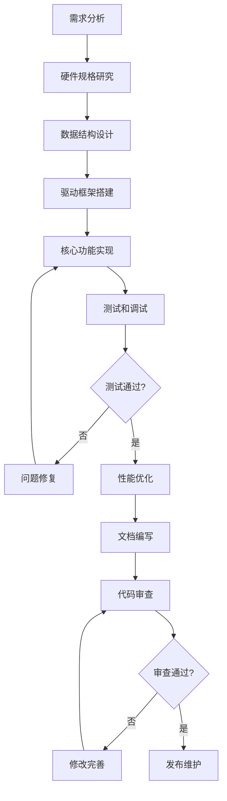

# 04 - 驱动开发实践

> **从零开始编写SPI设备驱动和控制器驱动的完整实践指南**
> 
> **难度级别**: 进阶  
> **阅读时间**: 90分钟  
> **前置知识**: C语言、Linux内核基础、SPI协议基础、数据结构

## 目录

- [1. 驱动开发概述](#1-驱动开发概述)
  - [1.1 开发流程](#11-开发流程)
  - [1.2 开发环境搭建](#12-开发环境搭建)
  - [1.3 开发工具和技巧](#13-开发工具和技巧)
- [2. SPI设备驱动开发](#2-spi设备驱动开发)
  - [2.1 设备驱动框架](#21-设备驱动框架)
  - [2.2 设备探测与初始化](#22-设备探测与初始化)
  - [2.3 数据传输实现](#23-数据传输实现)
  - [2.4 中断处理](#24-中断处理)
  - [2.5 电源管理](#25-电源管理)
- [3. SPI控制器驱动开发](#3-spi控制器驱动开发)
  - [3.1 控制器驱动框架](#31-控制器驱动框架)
  - [3.2 控制器初始化](#32-控制器初始化)
  - [3.3 传输实现](#33-传输实现)
  - [3.4 DMA集成](#34-dma集成)
  - [3.5 中断驱动传输](#35-中断驱动传输)
- [4. 高级特性实现](#4-高级特性实现)
  - [4.1 多控制器支持](#41-多控制器支持)
  - [4.2 多设备管理](#42-多设备管理)
  - [4.3 动态配置](#43-动态配置)
  - [4.4 热插拔支持](#44-热插拔支持)
- [5. 常见问题和解决方案](#5-常见问题和解决方案)
  - [5.1 传输失败](#51-传输失败)
  - [5.2 性能问题](#52-性能问题)
  - [5.3 资源冲突](#53-资源冲突)
  - [5.4 稳定性问题](#54-稳定性问题)
- [6. 完整示例代码](#6-完整示例代码)
  - [6.1 SPI Flash驱动](#61-spi-flash驱动)
  - [6.2 SPI传感器驱动](#62-spi传感器驱动)
  - [6.3 SPI控制器驱动](#63-spi控制器驱动)
- [7. 最佳实践](#7-最佳实践)
  - [7.1 代码规范](#71-代码规范)
  - [7.2 错误处理](#72-错误处理)
  - [7.3 性能优化](#73-性能优化)
  - [7.4 文档和注释](#74-文档和注释)
- [8. 总结](#8-总结)

---

## 1. 驱动开发概述

### 1.1 开发流程

SPI驱动开发遵循标准的Linux内核驱动开发流程，但有特定的模式和最佳实践。



#### 1.1.1 需求分析阶段

在开始开发之前，需要明确以下需求：

**硬件需求：**
- SPI协议规范（Mode 0-3）
- 时钟频率范围
- 数据位宽（8/16/32位）
- 片选信号类型（高/低电平有效）
- 中断支持需求

**功能需求：**
- 数据传输方向（读/写/双工）
- 传输速率要求
- 是否需要DMA支持
- 电源管理需求
- 热插拔支持

**性能需求：**
- 传输吞吐量目标
- 延迟要求
- CPU占用率限制
- 内存使用限制

#### 1.1.2 开发阶段划分

```c
/* 开发阶段定义 */
enum spi_driver_phase {
    PHASE_RESEARCH = 0,      /* 硬件研究阶段 */
    PHASE_DESIGN,           /* 设计阶段 */
    PHASE_IMPLEMENT,         /* 实现阶段 */
    PHASE_TEST,             /* 测试阶段 */
    PHASE_OPTIMIZE,          /* 优化阶段 */
    PHASE_MAINTAIN,          /* 维护阶段 */
};
```

### 1.2 开发环境搭建

搭建合适的开发环境是驱动开发的第一步。

#### 1.2.1 内核源码准备

```bash
# 获取内核源码
cd /path/to/workspace
git clone https://git.kernel.org/pub/scm/linux/kernel/git/stable/linux.git
cd linux
git checkout v5.15

# 配置内核
make ARCH=arm64 defconfig
make ARCH=arm64 menuconfig

# 编译内核
make ARCH=arm64 CROSS_COMPILE=aarch64-linux-gnu- -j$(nproc)
```

#### 1.2.2 交叉编译工具链

```bash
# 安装交叉编译工具链
sudo apt-get install gcc-aarch64-linux-gnu g++-aarch64-linux-gnu

# 设置环境变量
export ARCH=arm64
export CROSS_COMPILE=aarch64-linux-gnu-
export KDIR=/path/to/kernel/source
```

#### 1.2.3 驱动开发目录结构

```
spi-driver-project/
├── driver/                 # 驱动源码
│   ├── spi_flash.c        # SPI Flash驱动
│   ├── spi_sensor.c       # SPI传感器驱动
│   └── spi_controller.c   # SPI控制器驱动
├── include/               # 头文件
│   └── spi_driver.h       # 驱动头文件
├── test/                  # 测试程序
│   └── spi_test.c         # 测试程序
├── doc/                   # 文档
│   └── README.md          # 说明文档
└── Makefile              # 编译脚本
```

#### 1.2.4 Makefile配置

```makefile
# Makefile for SPI drivers
obj-m += spi_flash.o
obj-m += spi_sensor.o
obj-m += spi_controller.o

# 内核模块编译
KDIR ?= /lib/modules/$(shell uname -r)/build

all:
	make -C $(KDIR) M=$(PWD) modules

clean:
	make -C $(KDIR) M=$(PWD) clean

install:
	make -C $(KDIR) M=$(PWD) modules_install
	depmod -a

test:
	make -C test
```

### 1.3 开发工具和技巧

#### 1.3.1 调试工具

```bash
# 安装调试工具
sudo apt-get install \
    kmod \
    trace-cmd \
    perf-tools \
    gdb-multiarch \
    systemtap
```

#### 1.3.2 内核日志配置

```bash
# 设置内核日志级别
echo 8 > /proc/sys/kernel/printk

# 启用动态调试
echo 'file spi*.c +p' > /sys/kernel/debug/dynamic_debug/control

# 查看内核日志
dmesg | tail -f
journalctl -k -f
```

#### 1.3.3 开发技巧

**使用devm_*函数自动管理资源：**
```c
/* 旧方式：需要手动释放 */
struct my_device *dev = kmalloc(sizeof(*dev), GFP_KERNEL);
if (!dev)
    return -ENOMEM;
/* 使用后需要手动 kfree(dev) */

/* 新方式：自动释放 */
struct my_device *dev = devm_kzalloc(&pdev->dev, 
                                       sizeof(*dev), GFP_KERNEL);
if (!dev)
    return -ENOMEM;
/* 设备移除时自动释放 */
```

**使用设备树匹配：**
```c
static const struct of_device_id my_spi_of_match[] = {
    { .compatible = "vendor,device", },
    { /* sentinel */ }
};
MODULE_DEVICE_TABLE(of, my_spi_of_match);
```

**使用模块参数：**
```c
/* 模块参数 */
static int debug_level = 0;
module_param(debug_level, int, 0644);
MODULE_PARM_DESC(debug_level, "Debug level (0-3)");

/* 使用参数 */
if (debug_level > 0)
    dev_info(&spi->dev, "Debug message\n");
```

---

## 2. SPI设备驱动开发

### 2.1 设备驱动框架

SPI设备驱动的基本框架包括驱动注册、设备探测、设备移除等关键组件。

#### 2.1.1 驱动结构定义

```c
/**
 * SPI设备私有数据结构
 */
struct my_spi_device {
    struct spi_device *spi;           /* SPI设备 */
    struct device *dev;               /* 设备 */
    
    /* 设备配置 */
    u8 mode;                          /* SPI模式 */
    u8 bits_per_word;                 /* 数据位宽 */
    u32 max_speed_hz;                 /* 最大时钟频率 */
    
    /* 硬件相关 */
    int irq;                          /* 中断号 */
    void *base_addr;                  /* 寄存器基地址 */
    
    /* 同步和锁 */
    struct mutex lock;                /* 互斥锁 */
    spinlock_t spinlock;              /* 自旋锁 */
    struct completion completion;     /* 完成量 */
    
    /* 缓冲区 */
    u8 *tx_buffer;                    /* 发送缓冲区 */
    u8 *rx_buffer;                    /* 接收缓冲区 */
    size_t buffer_size;               /* 缓冲区大小 */
    
    /* 统计信息 */
    atomic_t transfer_count;          /* 传输计数 */
    atomic_t error_count;             /* 错误计数 */
    unsigned long last_transfer;      /* 最后传输时间 */
    
    /* 调试信息 */
    int debug_level;                  /* 调试级别 */
};
```

#### 2.1.2 驱动注册结构

```c
/**
 * SPI设备ID表
 */
static const struct spi_device_id my_spi_id[] = {
    { "my-spi-device-v1", 0 },
    { "my-spi-device-v2", 1 },
    { /* sentinel */ }
};
MODULE_DEVICE_TABLE(spi, my_spi_id);

/**
 * 设备树匹配表
 */
static const struct of_device_id my_spi_of_match[] = {
    { .compatible = "vendor,my-spi-device", },
    { .compatible = "vendor,my-spi-device-v2", },
    { /* sentinel */ }
};
MODULE_DEVICE_TABLE(of, my_spi_of_match);

/**
 * SPI设备驱动结构
 */
static struct spi_driver my_spi_driver = {
    .driver = {
        .name = "my-spi-device",
        .owner = THIS_MODULE,
        .of_match_table = my_spi_of_match,
    },
    .id_table = my_spi_id,
    .probe = my_spi_probe,
    .remove = my_spi_remove,
    .shutdown = my_spi_shutdown,
    .suspend = my_spi_suspend,
    .resume = my_spi_resume,
};
```

#### 2.1.3 驱动初始化和退出

```c
/**
 * 模块初始化
 */
static int __init my_spi_init(void)
{
    int ret;
    
    pr_info("My SPI Driver initializing\n");
    
    /* 注册驱动 */
    ret = spi_register_driver(&my_spi_driver);
    if (ret < 0) {
        pr_err("Failed to register SPI driver: %d\n", ret);
        return ret;
    }
    
    pr_info("My SPI Driver registered successfully\n");
    return 0;
}

/**
 * 模块退出
 */
static void __exit my_spi_exit(void)
{
    pr_info("My SPI Driver exiting\n");
    
    /* 注销驱动 */
    spi_unregister_driver(&my_spi_driver);
    
    pr_info("My SPI Driver unregistered\n");
}

module_init(my_spi_init);
module_exit(my_spi_exit);

MODULE_LICENSE("GPL");
MODULE_AUTHOR("Your Name <your.email@example.com>");
MODULE_DESCRIPTION("My SPI Device Driver");
MODULE_VERSION("1.0");
```

### 2.2 设备探测与初始化

设备探测（probe）是驱动生命周期中最关键的环节，负责初始化设备和分配资源。

#### 2.2.1 Probe函数实现

```c
/**
 * 设备探测函数
 * @spi: SPI设备
 * 
 * 返回值: 成功返回0，失败返回错误码
 */
static int my_spi_probe(struct spi_device *spi)
{
    struct my_spi_device *dev;
    int ret;
    
    pr_info("Probing SPI device: %s\n", spi->modalias);
    
    /* 分配私有数据结构 */
    dev = devm_kzalloc(&spi->dev, sizeof(*dev), GFP_KERNEL);
    if (!dev)
        return -ENOMEM;
    
    /* 保存SPI设备引用 */
    dev->spi = spi;
    dev->dev = &spi->dev;
    spi_set_drvdata(spi, dev);
    
    /* 设置设备参数 */
    ret = my_spi_setup_device(dev);
    if (ret < 0) {
        dev_err(&spi->dev, "Failed to setup device: %d\n", ret);
        return ret;
    }
    
    /* 分配缓冲区 */
    ret = my_spi_alloc_buffers(dev);
    if (ret < 0) {
        dev_err(&spi->dev, "Failed to allocate buffers: %d\n", ret);
        return ret;
    }
    
    /* 初始化同步对象 */
    mutex_init(&dev->lock);
    spin_lock_init(&dev->spinlock);
    init_completion(&dev->completion);
    
    /* 注册中断 */
    ret = my_spi_setup_irq(dev);
    if (ret < 0) {
        dev_err(&spi->dev, "Failed to setup IRQ: %d\n", ret);
        return ret;
    }
    
    /* 初始化设备 */
    ret = my_spi_device_init(dev);
    if (ret < 0) {
        dev_err(&spi->dev, "Failed to initialize device: %d\n", ret);
        return ret;
    }
    
    /* 创建调试接口 */
    ret = my_spi_create_debugfs(dev);
    if (ret < 0) {
        dev_warn(&spi->dev, "Failed to create debugfs: %d\n", ret);
    }
    
    dev_info(&spi->dev, "Device probed successfully\n");
    return 0;
}
```

#### 2.2.2 设备参数设置

```c
/**
 * 设置设备参数
 * @dev: 设备私有数据
 */
static int my_spi_setup_device(struct my_spi_device *dev)
{
    struct spi_device *spi = dev->spi;
    
    /* 从设备树获取参数 */
    if (spi->dev.of_node) {
        u32 speed;
        u32 mode;
        
        /* 获取时钟频率 */
        if (!of_property_read_u32(spi->dev.of_node, "spi-max-frequency", 
                                   &speed)) {
            spi->max_speed_hz = speed;
        } else {
            spi->max_speed_hz = 1000000;  /* 默认1MHz */
        }
        
        /* 获取SPI模式 */
        mode = 0;
        if (of_property_read_bool(spi->dev.of_node, "spi-cpol"))
            mode |= SPI_CPOL;
        if (of_property_read_bool(spi->dev.of_node, "spi-cpha"))
            mode |= SPI_CPHA;
        if (of_property_read_bool(spi->dev.of_node, "spi-cs-high"))
            mode |= SPI_CS_HIGH;
        
        spi->mode = mode;
        
        /* 获取数据位宽 */
        if (of_property_read_u32(spi->dev.of_node, "spi-bits-per-word",
                                   &spi->bits_per_word)) {
            spi->bits_per_word = 8;  /* 默认8位 */
        }
    }
    
    /* 保存配置 */
    dev->mode = spi->mode;
    dev->bits_per_word = spi->bits_per_word;
    dev->max_speed_hz = spi->max_speed_hz;
    
    /* 调用spi_setup */
    return spi_setup(spi);
}
```

#### 2.2.3 缓冲区分配

```c
/**
 * 分配缓冲区
 * @dev: 设备私有数据
 */
static int my_spi_alloc_buffers(struct my_spi_device *dev)
{
    /* 分配发送缓冲区 */
    dev->buffer_size = 4096;  /* 默认4KB */
    dev->tx_buffer = devm_kzalloc(dev->dev, dev->buffer_size, 
                                   GFP_KERNEL);
    if (!dev->tx_buffer)
        return -ENOMEM;
    
    /* 分配接收缓冲区 */
    dev->rx_buffer = devm_kzalloc(dev->dev, dev->buffer_size, 
                                   GFP_KERNEL);
    if (!dev->rx_buffer)
        return -ENOMEM;
    
    return 0;
}
```

### 2.3 数据传输实现

数据传输是SPI设备驱动的核心功能，包括同步传输、异步传输和中断传输等多种模式。

#### 2.3.1 同步传输实现

```c
/**
 * 同步传输数据
 * @dev: 设备私有数据
 * @tx_buf: 发送缓冲区
 * @rx_buf: 接收缓冲区
 * @len: 传输长度
 * 
 * 返回值: 成功返回传输字节数，失败返回错误码
 */
static int my_spi_sync_transfer(struct my_spi_device *dev,
                                 const void *tx_buf,
                                 void *rx_buf,
                                 size_t len)
{
    struct spi_message msg;
    struct spi_transfer xfer;
    int ret;
    
    if (len > dev->buffer_size) {
        dev_err(dev->dev, "Transfer size too large: %zu > %zu\n",
                len, dev->buffer_size);
        return -EINVAL;
    }
    
    /* 获取互斥锁 */
    mutex_lock(&dev->lock);
    
    /* 准备传输 */
    memset(&xfer, 0, sizeof(xfer));
    xfer.tx_buf = tx_buf;
    xfer.rx_buf = rx_buf;
    xfer.len = len;
    xfer.speed_hz = dev->max_speed_hz;
    xfer.bits_per_word = dev->bits_per_word;
    
    /* 初始化消息 */
    spi_message_init(&msg);
    spi_message_add_tail(&xfer, &msg);
    
    /* 执行传输 */
    ret = spi_sync(dev->spi, &msg);
    
    /* 更新统计信息 */
    atomic_inc(&dev->transfer_count);
    dev->last_transfer = jiffies;
    
    /* 释放互斥锁 */
    mutex_unlock(&dev->lock);
    
    if (ret < 0) {
        atomic_inc(&dev->error_count);
        dev_err(dev->dev, "SPI transfer failed: %d\n", ret);
        return ret;
    }
    
    return msg.actual_length;
}
```

#### 2.3.2 异步传输实现

```c
/**
 * 异步传输完成回调
 * @context: 上下文数据
 */
static void my_spi_async_complete(void *context)
{
    struct my_spi_device *dev = context;
    
    dev_dbg(dev->dev, "Async transfer completed\n");
    
    /* 完成传输 */
    complete(&dev->completion);
}

/**
 * 异步传输数据
 * @dev: 设备私有数据
 * @tx_buf: 发送缓冲区
 * @rx_buf: 接收缓冲区
 * @len: 传输长度
 * @timeout: 超时时间（毫秒）
 * 
 * 返回值: 成功返回传输字节数，失败返回错误码
 */
static int my_spi_async_transfer(struct my_spi_device *dev,
                                  const void *tx_buf,
                                  void *rx_buf,
                                  size_t len,
                                  unsigned long timeout)
{
    struct spi_message msg;
    struct spi_transfer xfer;
    int ret;
    
    if (len > dev->buffer_size) {
        dev_err(dev->dev, "Transfer size too large: %zu > %zu\n",
                len, dev->buffer_size);
        return -EINVAL;
    }
    
    /* 重新初始化完成量 */
    reinit_completion(&dev->completion);
    
    /* 准备传输 */
    memset(&xfer, 0, sizeof(xfer));
    xfer.tx_buf = tx_buf;
    xfer.rx_buf = rx_buf;
    xfer.len = len;
    xfer.speed_hz = dev->max_speed_hz;
    xfer.bits_per_word = dev->bits_per_word;
    
    /* 初始化消息 */
    spi_message_init(&msg);
    msg.complete = my_spi_async_complete;
    msg.context = dev;
    spi_message_add_tail(&xfer, &msg);
    
    /* 执行异步传输 */
    ret = spi_async(dev->spi, &msg);
    if (ret < 0) {
        atomic_inc(&dev->error_count);
        dev_err(dev->dev, "Async transfer failed: %d\n", ret);
        return ret;
    }
    
    /* 等待完成 */
    ret = wait_for_completion_timeout(&dev->completion,
                                       msecs_to_jiffies(timeout));
    if (ret == 0) {
        dev_err(dev->dev, "Async transfer timeout\n");
        return -ETIMEDOUT;
    }
    
    /* 更新统计信息 */
    atomic_inc(&dev->transfer_count);
    dev->last_transfer = jiffies;
    
    return msg.actual_length;
}
```

#### 2.3.3 分块传输实现

```c
/**
 * 大块数据分块传输
 * @dev: 设备私有数据
 * @tx_buf: 发送缓冲区
 * @rx_buf: 接收缓冲区
 * @len: 总传输长度
 * @chunk_size: 每块大小
 * 
 * 返回值: 成功返回传输字节数，失败返回错误码
 */
static int my_spi_chunked_transfer(struct my_spi_device *dev,
                                    const void *tx_buf,
                                    void *rx_buf,
                                    size_t len,
                                    size_t chunk_size)
{
    size_t offset = 0;
    int ret;
    
    dev_dbg(dev->dev, "Chunked transfer: %zu bytes in %zu-byte chunks\n",
            len, chunk_size);
    
    while (offset < len) {
        size_t chunk = min(chunk_size, len - offset);
        int transferred;
        
        /* 传输当前块 */
        transferred = my_spi_sync_transfer(dev,
                                          tx_buf ? tx_buf + offset : NULL,
                                          rx_buf ? rx_buf + offset : NULL,
                                          chunk);
        if (transferred < 0) {
            dev_err(dev->dev, "Chunked transfer failed at offset %zu\n",
                    offset);
            return transferred;
        }
        
        offset += transferred;
    }
    
    dev_dbg(dev->dev, "Chunked transfer completed: %zu bytes\n", offset);
    return offset;
}
```

### 2.4 中断处理

对于需要实时响应的设备，中断处理是必不可少的。

#### 2.4.1 中断注册

```c
/**
 * 设置中断
 * @dev: 设备私有数据
 */
static int my_spi_setup_irq(struct my_spi_device *dev)
{
    struct spi_device *spi = dev->spi;
    int ret;
    int irq;
    
    /* 从设备树获取中断 */
    if (spi->dev.of_node) {
        irq = of_irq_get(spi->dev.of_node, 0);
        if (irq < 0) {
            dev_info(dev->dev, "No IRQ specified\n");
            return 0;
        }
    } else {
        /* 使用平台数据 */
        irq = spi->irq;
        if (irq <= 0) {
            dev_info(dev->dev, "No IRQ configured\n");
            return 0;
        }
    }
    
    dev->irq = irq;
    
    /* 请求中断 */
    ret = request_irq(irq, my_spi_irq_handler,
                      IRQF_TRIGGER_RISING | IRQF_SHARED,
                      "my-spi-device", dev);
    if (ret < 0) {
        dev_err(dev->dev, "Failed to request IRQ %d: %d\n", irq, ret);
        return ret;
    }
    
    dev_info(dev->dev, "IRQ %d registered\n", irq);
    return 0;
}
```

#### 2.4.2 中断处理函数

```c
/**
 * 中断处理函数（顶半部）
 * @irq: 中断号
 * @dev_id: 设备私有数据
 */
static irqreturn_t my_spi_irq_handler(int irq, void *dev_id)
{
    struct my_spi_device *dev = dev_id;
    
    /* 检查中断源 */
    if (!my_spi_check_irq(dev)) {
        return IRQ_NONE;
    }
    
    /* 禁用中断并调度底半部 */
    disable_irq_nosync(irq);
    
    /* 调度工作队列 */
    schedule_work(&dev->irq_work);
    
    return IRQ_HANDLED;
}

/**
 * 中断工作队列（底半部）
 * @work: 工作结构
 */
static void my_spi_irq_work(struct work_struct *work)
{
    struct my_spi_device *dev = container_of(work, struct my_spi_device,
                                              irq_work);
    
    dev_dbg(dev->dev, "Processing interrupt\n");
    
    /* 处理中断事件 */
    my_spi_process_irq(dev);
    
    /* 重新启用中断 */
    enable_irq(dev->irq);
}
```

#### 2.4.3 中断检查和处理

```c
/**
 * 检查中断源
 * @dev: 设备私有数据
 * 
 * 返回值: 有中断返回true，否则返回false
 */
static bool my_spi_check_irq(struct my_spi_device *dev)
{
    u8 status;
    int ret;
    
    /* 读取设备状态寄存器 */
    ret = my_spi_read_reg(dev, REG_STATUS, &status);
    if (ret < 0) {
        dev_err(dev->dev, "Failed to read status register\n");
        return false;
    }
    
    /* 检查中断标志 */
    return (status & STATUS_IRQ_MASK) != 0;
}

/**
 * 处理中断事件
 * @dev: 设备私有数据
 */
static void my_spi_process_irq(struct my_spi_device *dev)
{
    u8 status;
    int ret;
    
    /* 读取状态 */
    ret = my_spi_read_reg(dev, REG_STATUS, &status);
    if (ret < 0) {
        dev_err(dev->dev, "Failed to read status\n");
        return;
    }
    
    /* 处理数据就绪中断 */
    if (status & STATUS_DATA_READY) {
        my_spi_handle_data_ready(dev);
    }
    
    /* 处理错误中断 */
    if (status & STATUS_ERROR) {
        my_spi_handle_error(dev);
    }
    
    /* 清除中断标志 */
    my_spi_write_reg(dev, REG_STATUS, status & STATUS_IRQ_MASK);
}
```

### 2.5 电源管理

电源管理是现代嵌入式系统的重要特性，需要实现挂起和恢复功能。

#### 2.5.1 电源管理操作

```c
/**
 * 设备挂起
 * @spi: SPI设备
 * @mesg: 电源消息
 */
static int my_spi_suspend(struct spi_device *spi, pm_message_t mesg)
{
    struct my_spi_device *dev = spi_get_drvdata(spi);
    
    dev_info(dev->dev, "Suspending device\n");
    
    /* 保存设备状态 */
    my_spi_save_state(dev);
    
    /* 进入低功耗模式 */
    my_spi_set_power_mode(dev, POWER_MODE_SLEEP);
    
    dev->state = STATE_SUSPENDED;
    
    return 0;
}

/**
 * 设备恢复
 * @spi: SPI设备
 */
static int my_spi_resume(struct spi_device *spi)
{
    struct my_spi_device *dev = spi_get_drvdata(spi);
    
    dev_info(dev->dev, "Resuming device\n");
    
    /* 退出低功耗模式 */
    my_spi_set_power_mode(dev, POWER_MODE_ACTIVE);
    
    /* 恢复设备状态 */
    my_spi_restore_state(dev);
    
    dev->state = STATE_ACTIVE;
    
    return 0;
}
```

#### 2.5.2 电源模式切换

```c
/**
 * 设置电源模式
 * @dev: 设备私有数据
 * @mode: 电源模式
 */
static int my_spi_set_power_mode(struct my_spi_device *dev, int mode)
{
    u8 control;
    int ret;
    
    /* 读取控制寄存器 */
    ret = my_spi_read_reg(dev, REG_CONTROL, &control);
    if (ret < 0)
        return ret;
    
    /* 设置电源模式 */
    control = (control & ~CONTROL_POWER_MASK) | 
              (mode & CONTROL_POWER_MASK);
    
    /* 写入控制寄存器 */
    ret = my_spi_write_reg(dev, REG_CONTROL, control);
    if (ret < 0)
        return ret;
    
    /* 根据模式执行相应操作 */
    switch (mode) {
    case POWER_MODE_ACTIVE:
        /* 唤醒设备 */
        udelay(100);  /* 等待唤醒 */
        break;
        
    case POWER_MODE_SLEEP:
        /* 进入睡眠 */
        break;
        
    case POWER_MODE_OFF:
        /* 关闭电源 */
        break;
        
    default:
        dev_warn(dev->dev, "Unknown power mode: %d\n", mode);
        return -EINVAL;
    }
    
    return 0;
}
```

---

## 3. SPI控制器驱动开发

SPI控制器驱动负责管理硬件SPI控制器，提供SPI总线服务。

### 3.1 控制器驱动框架

#### 3.1.1 控制器私有数据结构

```c
/**
 * SPI控制器私有数据
 */
struct my_spi_controller {
    struct spi_master *master;       /* SPI主控制器 */
    struct device *dev;               /* 设备 */
    
    /* 寄存器映射 */
    void __iomem *regs;               /* 寄存器基地址 */
    phys_addr_t regs_phys;           /* 物理地址 */
    size_t regs_size;                /* 寄存器大小 */
    
    /* 时钟 */
    struct clk *clk;                 /* SPI时钟 */
    struct clk *pclk;                /* APB时钟 */
    unsigned long clk_rate;          /* 时钟频率 */
    
    /* 复位 */
    struct reset_control *rstc;      /* 复位控制 */
    
    /* DMA */
    struct dma_chan *tx_dma_chan;     /* DMA发送通道 */
    struct dma_chan *rx_dma_chan;     /* DMA接收通道 */
    bool use_dma;                    /* 是否使用DMA */
    
    /* 中断 */
    int irq;                         /* 中断号 */
    
    /* 传输队列 */
    struct spi_transfer *cur_xfer;   /* 当前传输 */
    struct spi_message *cur_msg;     /* 当前消息 */
    
    /* 同步和锁 */
    spinlock_t lock;                 /* 自旋锁 */
    struct completion xfer_completion; /* 传输完成 */
    
    /* 控制器状态 */
    bool initialized;                /* 已初始化 */
    bool busy;                       /* 忙标志 */
    
    /* 配置 */
    u32 max_speed_hz;               /* 最大速度 */
    u8 num_chipselect;              /* 片选数量 */
    u16 mode_bits;                  /* 支持的模式 */
};
```

#### 3.1.2 控制器驱动结构

```c
/**
 * 设备树匹配表
 */
static const struct of_device_id my_spi_controller_of_match[] = {
    { .compatible = "vendor,my-spi-controller", },
    { /* sentinel */ }
};
MODULE_DEVICE_TABLE(of, my_spi_controller_of_match);

/**
 * 平台驱动结构
 */
static struct platform_driver my_spi_controller_driver = {
    .probe = my_spi_controller_probe,
    .remove = my_spi_controller_remove,
    .driver = {
        .name = "my-spi-controller",
        .of_match_table = my_spi_controller_of_match,
    },
};
module_platform_driver(my_spi_controller_driver);
```

### 3.2 控制器初始化

#### 3.2.1 Probe函数实现

```c
/**
 * 控制器探测函数
 * @pdev: 平台设备
 */
static int my_spi_controller_probe(struct platform_device *pdev)
{
    struct my_spi_controller *ctrl;
    struct spi_master *master;
    int ret;
    
    dev_info(&pdev->dev, "Probing SPI controller\n");
    
    /* 分配主控制器 */
    master = spi_alloc_master(&pdev->dev, sizeof(*ctrl));
    if (!master) {
        dev_err(&pdev->dev, "Failed to allocate SPI master\n");
        return -ENOMEM;
    }
    
    /* 初始化控制器数据 */
    ctrl = spi_master_get_devdata(master);
    ctrl->master = master;
    ctrl->dev = &pdev->dev;
    platform_set_drvdata(pdev, ctrl);
    
    /* 获取资源 */
    ret = my_spi_get_resources(ctrl);
    if (ret < 0) {
        dev_err(&pdev->dev, "Failed to get resources: %d\n", ret);
        goto err_put_master;
    }
    
    /* 映射寄存器 */
    ret = my_spi_map_registers(ctrl);
    if (ret < 0) {
        dev_err(&pdev->dev, "Failed to map registers: %d\n", ret);
        goto err_put_master;
    }
    
    /* 初始化时钟 */
    ret = my_spi_init_clocks(ctrl);
    if (ret < 0) {
        dev_err(&pdev->dev, "Failed to initialize clocks: %d\n", ret);
        goto err_unmap_regs;
    }
    
    /* 初始化DMA */
    ret = my_spi_init_dma(ctrl);
    if (ret < 0) {
        dev_warn(&pdev->dev, "DMA not available, using PIO\n");
        ctrl->use_dma = false;
    } else {
        ctrl->use_dma = true;
    }
    
    /* 配置主控制器 */
    ret = my_spi_setup_master(ctrl);
    if (ret < 0) {
        dev_err(&pdev->dev, "Failed to setup master: %d\n", ret);
        goto err_cleanup_dma;
    }
    
    /* 注册主控制器 */
    ret = spi_register_master(master);
    if (ret < 0) {
        dev_err(&pdev->dev, "Failed to register master: %d\n", ret);
        goto err_cleanup_master;
    }
    
    /* 初始化硬件 */
    ret = my_spi_hardware_init(ctrl);
    if (ret < 0) {
        dev_err(&pdev->dev, "Failed to initialize hardware: %d\n", ret);
        goto err_unregister_master;
    }
    
    ctrl->initialized = true;
    
    dev_info(&pdev->dev, "SPI controller probed successfully\n");
    return 0;
    
err_unregister_master:
    spi_unregister_master(master);
err_cleanup_master:
    /* 清理主控制器 */
err_cleanup_dma:
    my_spi_cleanup_dma(ctrl);
err_unmap_regs:
    iounmap(ctrl->regs);
err_put_master:
    spi_master_put(master);
    return ret;
}
```

#### 3.2.2 资源获取

```c
/**
 * 获取平台资源
 * @ctrl: 控制器
 */
static int my_spi_get_resources(struct my_spi_controller *ctrl)
{
    struct device *dev = ctrl->dev;
    struct resource *res;
    int irq;
    
    /* 获取寄存器资源 */
    res = platform_get_resource(ctrl->dev, IORESOURCE_MEM, 0);
    if (!res) {
        dev_err(dev, "No register resource specified\n");
        return -ENODEV;
    }
    
    ctrl->regs_phys = res->start;
    ctrl->regs_size = resource_size(res);
    
    /* 获取时钟资源 */
    ctrl->clk = devm_clk_get(dev, "spi");
    if (IS_ERR(ctrl->clk)) {
        dev_err(dev, "Failed to get SPI clock\n");
        return PTR_ERR(ctrl->clk);
    }
    
    ctrl->pclk = devm_clk_get(dev, "pclk");
    if (IS_ERR(ctrl->pclk)) {
        dev_err(dev, "Failed to get APB clock\n");
        return PTR_ERR(ctrl->pclk);
    }
    
    /* 获取中断资源 */
    irq = platform_get_irq(ctrl->dev, 0);
    if (irq < 0) {
        dev_err(dev, "No IRQ specified\n");
        return irq;
    }
    
    ctrl->irq = irq;
    
    /* 获取复位控制 */
    ctrl->rstc = devm_reset_control_get_optional(dev, NULL);
    if (IS_ERR(ctrl->rstc)) {
        dev_err(dev, "Failed to get reset control\n");
        return PTR_ERR(ctrl->rstc);
    }
    
    return 0;
}
```

#### 3.2.3 寄存器映射

```c
/**
 * 映射寄存器
 * @ctrl: 控制器
 */
static int my_spi_map_registers(struct my_spi_controller *ctrl)
{
    struct device *dev = ctrl->dev;
    
    /* 映射寄存器 */
    ctrl->regs = devm_ioremap_resource(dev, &dev->resource);
    if (IS_ERR(ctrl->regs)) {
        dev_err(dev, "Failed to map registers\n");
        return PTR_ERR(ctrl->regs);
    }
    
    dev_dbg(dev, "Registers mapped at %pap, size: %zu\n",
            &ctrl->regs_phys, ctrl->regs_size);
    
    return 0;
}
```

### 3.3 传输实现

#### 3.3.1 Setup函数

```c
/**
 * 设置SPI设备参数
 * @spi: SPI设备
 */
static int my_spi_setup(struct spi_device *spi)
{
    struct my_spi_controller *ctrl = spi_master_get_devdata(spi->master);
    u32 speed_hz = spi->max_speed_hz;
    u8 bits_per_word = spi->bits_per_word;
    u32 mode = spi->mode;
    u32 div;
    u32 cr0;
    
    /* 检查参数 */
    if (bits_per_word != 8 && bits_per_word != 16 && bits_per_word != 32) {
        dev_err(&spi->dev, "Invalid bits_per_word: %d\n", bits_per_word);
        return -EINVAL;
    }
    
    /* 计算时钟分频 */
    div = DIV_ROUND_UP(ctrl->clk_rate, speed_hz);
    div = clamp_t(u32, div, 2, 65535);
    
    /* 计算实际速度 */
    speed_hz = ctrl->clk_rate / div;
    
    dev_dbg(ctrl->dev, "SPI%d.%d: mode=%u, bits=%u, speed=%uHz, div=%u\n",
            spi->master->bus_num, spi->chip_select, mode,
            bits_per_word, speed_hz, div);
    
    /* 配置控制寄存器0 */
    cr0 = CR0_DATA_FRAME_SIZE(bits_per_word - 1);
    cr0 |= CR0_CPHA(mode & SPI_CPHA);
    cr0 |= CR0_CPOL(mode & SPI_CPOL);
    cr0 |= CR0_FRF(0);
    cr0 |= CR0_DFS_32;
    cr0 |= CR0_CLOCK_DIVIDER(div);
    
    /* 写入配置 */
    writel(cr0, ctrl->regs + SPI_REG_CR0);
    
    /* 写入片选控制 */
    writel(CSR_CS(spi->chip_select), ctrl->regs + SPI_REG_CSR);
    
    return 0;
}
```

#### 3.3.2 Transfer One函数

```c
/**
 * 传输一个消息
 * @master: SPI主控制器
 * @msg: SPI消息
 */
static int my_spi_transfer_one(struct spi_master *master,
                                struct spi_message *msg)
{
    struct my_spi_controller *ctrl = spi_master_get_devdata(master);
    struct spi_device *spi = msg->spi;
    struct spi_transfer *xfer;
    int ret = 0;
    
    /* 设置设备 */
    ret = my_spi_setup(spi);
    if (ret < 0)
        return ret;
    
    /* 遍历传输单元 */
    list_for_each_entry(xfer, &msg->transfers, transfer_list) {
        /* 执行传输 */
        ret = my_spi_perform_transfer(ctrl, xfer);
        if (ret < 0)
            break;
        
        msg->actual_length += xfer->len;
        
        /* 延迟 */
        if (xfer->delay_usecs)
            udelay(xfer->delay_usecs);
        
        /* 改变片选 */
        if (xfer->cs_change)
            my_spi_set_cs(ctrl, spi->chip_select, false);
    }
    
    /* 结束传输 */
    my_spi_set_cs(ctrl, spi->chip_select, false);
    
    /* 通知完成 */
    msg->status = ret;
    if (msg->complete)
        msg->complete(msg->context);
    
    return ret;
}
```

#### 3.3.3 PIO传输实现

```c
/**
 * PIO传输
 * @ctrl: 控制器
 * @xfer: 传输单元
 */
static int my_spi_pio_transfer(struct my_spi_controller *ctrl,
                                struct spi_transfer *xfer)
{
    const void *tx_buf = xfer->tx_buf;
    void *rx_buf = xfer->rx_buf;
    unsigned int len = xfer->len;
    unsigned int bytes_per_word = xfer->bits_per_word / 8;
    unsigned int words = len / bytes_per_word;
    u32 val;
    int i;
    
    dev_dbg(ctrl->dev, "PIO transfer: %u bytes\n", len);
    
    for (i = 0; i < words; i++) {
        /* 写入发送数据 */
        if (tx_buf) {
            if (bytes_per_word == 1) {
                val = *(u8 *)tx_buf;
            } else if (bytes_per_word == 2) {
                val = *(u16 *)tx_buf;
            } else {
                val = *(u32 *)tx_buf;
            }
            tx_buf += bytes_per_word;
        } else {
            val = 0;  /* 发送0 */
        }
        
        writel(val, ctrl->regs + SPI_REG_DR);
        
        /* 等待传输完成 */
        while (!(readl(ctrl->regs + SPI_REG_SR) & SR_TFE));
        while (!(readl(ctrl->regs + SPI_REG_SR) & SR_BUSY));
        while (readl(ctrl->regs + SPI_REG_SR) & SR_BUSY);
        
        /* 读取接收数据 */
        val = readl(ctrl->regs + SPI_REG_DR);
        
        if (rx_buf) {
            if (bytes_per_word == 1) {
                *(u8 *)rx_buf = (u8)val;
            } else if (bytes_per_word == 2) {
                *(u16 *)rx_buf = (u16)val;
            } else {
                *(u32 *)rx_buf = val;
            }
            rx_buf += bytes_per_word;
        }
    }
    
    return len;
}
```

### 3.4 DMA集成

DMA可以显著提高传输性能，减少CPU占用。

#### 3.4.1 DMA初始化

```c
/**
 * 初始化DMA
 * @ctrl: 控制器
 */
static int my_spi_init_dma(struct my_spi_controller *ctrl)
{
    struct device *dev = ctrl->dev;
    struct dma_slave_config cfg;
    int ret;
    
    /* 请求DMA发送通道 */
    ctrl->tx_dma_chan = dma_request_slave_channel(dev, "tx");
    if (!ctrl->tx_dma_chan) {
        dev_warn(dev, "No TX DMA channel available\n");
        return -EPROBE_DEFER;
    }
    
    /* 请求DMA接收通道 */
    ctrl->rx_dma_chan = dma_request_slave_channel(dev, "rx");
    if (!ctrl->rx_dma_chan) {
        dev_warn(dev, "No RX DMA channel available\n");
        dma_release_channel(ctrl->tx_dma_chan);
        return -EPROBE_DEFER;
    }
    
    /* 配置DMA发送 */
    memset(&cfg, 0, sizeof(cfg));
    cfg.direction = DMA_MEM_TO_DEV;
    cfg.src_addr_width = DMA_SLAVE_BUSWIDTH_4_BYTES;
    cfg.dst_addr_width = DMA_SLAVE_BUSWIDTH_4_BYTES;
    cfg.src_maxburst = 1;
    cfg.dst_maxburst = 1;
    cfg.dst_addr = ctrl->regs_phys + SPI_REG_DR;
    
    ret = dmaengine_slave_config(ctrl->tx_dma_chan, &cfg);
    if (ret) {
        dev_err(dev, "Failed to config TX DMA: %d\n", ret);
        goto err_release_channels;
    }
    
    /* 配置DMA接收 */
    memset(&cfg, 0, sizeof(cfg));
    cfg.direction = DMA_DEV_TO_MEM;
    cfg.src_addr_width = DMA_SLAVE_BUSWIDTH_4_BYTES;
    cfg.dst_addr_width = DMA_SLAVE_BUSWIDTH_4_BYTES;
    cfg.src_maxburst = 1;
    cfg.dst_maxburst = 1;
    cfg.src_addr = ctrl->regs_phys + SPI_REG_DR;
    
    ret = dmaengine_slave_config(ctrl->rx_dma_chan, &cfg);
    if (ret) {
        dev_err(dev, "Failed to config RX DMA: %d\n", ret);
        goto err_release_channels;
    }
    
    dev_info(dev, "DMA channels initialized\n");
    return 0;
    
err_release_channels:
    if (ctrl->rx_dma_chan)
        dma_release_channel(ctrl->rx_dma_chan);
    if (ctrl->tx_dma_chan)
        dma_release_channel(ctrl->tx_dma_chan);
    return ret;
}
```

#### 3.4.2 DMA传输实现

```c
/**
 * DMA传输完成回调
 * @arg: 参数
 */
static void my_spi_dma_complete(void *arg)
{
    struct completion *completion = arg;
    
    complete(completion);
}

/**
 * DMA传输
 * @ctrl: 控制器
 * @xfer: 传输单元
 */
static int my_spi_dma_transfer(struct my_spi_controller *ctrl,
                                struct spi_transfer *xfer)
{
    struct dma_chan *tx_chan = ctrl->tx_dma_chan;
    struct dma_chan *rx_chan = ctrl->rx_dma_chan;
    struct dma_async_tx_descriptor *tx_desc, *rx_desc;
    struct completion tx_completion, rx_completion;
    dma_cookie_t cookie;
    int ret;
    
    /* 映射DMA缓冲区 */
    if (xfer->tx_buf) {
        xfer->tx_dma = dma_map_single(ctrl->dev, (void *)xfer->tx_buf,
                                      xfer->len, DMA_TO_DEVICE);
        if (dma_mapping_error(ctrl->dev, xfer->tx_dma)) {
            dev_err(ctrl->dev, "Failed to map TX DMA\n");
            return -ENOMEM;
        }
    }
    
    if (xfer->rx_buf) {
        xfer->rx_dma = dma_map_single(ctrl->dev, xfer->rx_buf,
                                      xfer->len, DMA_FROM_DEVICE);
        if (dma_mapping_error(ctrl->dev, xfer->rx_dma)) {
            dev_err(ctrl->dev, "Failed to map RX DMA\n");
            if (xfer->tx_buf)
                dma_unmap_single(ctrl->dev, xfer->tx_dma,
                                 xfer->len, DMA_TO_DEVICE);
            return -ENOMEM;
        }
    }
    
    /* 准备完成量 */
    init_completion(&tx_completion);
    init_completion(&rx_completion);
    
    /* 准备发送描述符 */
    if (xfer->tx_buf) {
        tx_desc = dmaengine_prep_slave_single(tx_chan, xfer->tx_dma,
                                              xfer->len, DMA_MEM_TO_DEV,
                                              DMA_PREP_INTERRUPT | DMA_CTRL_ACK);
        if (!tx_desc) {
            dev_err(ctrl->dev, "Failed to prepare TX DMA\n");
            ret = -ENOMEM;
            goto err_unmap;
        }
        
        tx_desc->callback = my_spi_dma_complete;
        tx_desc->callback_param = &tx_completion;
    }
    
    /* 准备接收描述符 */
    if (xfer->rx_buf) {
        rx_desc = dmaengine_prep_slave_single(rx_chan, xfer->rx_dma,
                                              xfer->len, DMA_DEV_TO_MEM,
                                              DMA_PREP_INTERRUPT | DMA_CTRL_ACK);
        if (!rx_desc) {
            dev_err(ctrl->dev, "Failed to prepare RX DMA\n");
            ret = -ENOMEM;
            goto err_unmap;
        }
        
        rx_desc->callback = my_spi_dma_complete;
        rx_desc->callback_param = &rx_completion;
    }
    
    /* 启动DMA */
    if (xfer->rx_buf) {
        cookie = dmaengine_submit(rx_desc);
        dma_async_issue_pending(rx_chan);
    }
    
    if (xfer->tx_buf) {
        cookie = dmaengine_submit(tx_desc);
        dma_async_issue_pending(tx_chan);
    }
    
    /* 启动SPI传输 */
    writel(CR0_SSE, ctrl->regs + SPI_REG_CR0);
    
    /* 等待完成 */
    if (xfer->tx_buf)
        wait_for_completion_timeout(&tx_completion, msecs_to_jiffies(1000));
    
    if (xfer->rx_buf)
        wait_for_completion_timeout(&rx_completion, msecs_to_jiffies(1000));
    
    /* 停止SPI传输 */
    writel(0, ctrl->regs + SPI_REG_CR0);
    
    /* 取消DMA映射 */
err_unmap:
    if (xfer->rx_buf)
        dma_unmap_single(ctrl->dev, xfer->rx_dma, xfer->len, DMA_FROM_DEVICE);
    
    if (xfer->tx_buf)
        dma_unmap_single(ctrl->dev, xfer->tx_dma, xfer->len, DMA_TO_DEVICE);
    
    return ret == 0 ? xfer->len : ret;
}
```

### 3.5 中断驱动传输

#### 3.5.1 中断注册

```c
/**
 * 注册中断处理函数
 * @ctrl: 控制器
 */
static int my_spi_setup_irq(struct my_spi_controller *ctrl)
{
    int ret;
    
    /* 请求中断 */
    ret = request_irq(ctrl->irq, my_spi_irq_handler,
                      IRQF_SHARED, "my-spi-controller", ctrl);
    if (ret) {
        dev_err(ctrl->dev, "Failed to request IRQ %d: %d\n",
                ctrl->irq, ret);
        return ret;
    }
    
    dev_info(ctrl->dev, "IRQ %d registered\n", ctrl->irq);
    return 0;
}
```

#### 3.5.2 中断处理函数

```c
/**
 * 中断处理函数
 * @irq: 中断号
 * @dev_id: 设备ID
 */
static irqreturn_t my_spi_irq_handler(int irq, void *dev_id)
{
    struct my_spi_controller *ctrl = dev_id;
    u32 irq_status;
    
    /* 读取中断状态 */
    irq_status = readl(ctrl->regs + SPI_REG_ISR);
    if (!irq_status)
        return IRQ_NONE;
    
    /* 清除中断标志 */
    writel(irq_status, ctrl->regs + SPI_REG_ICR);
    
    /* 处理传输完成中断 */
    if (irq_status & ISR_TXE) {
        ctrl->cur_xfer->tx_done++;
    }
    
    /* 处理接收中断 */
    if (irq_status & ISR_RXF) {
        ctrl->cur_xfer->rx_done++;
    }
    
    /* 检查传输是否完成 */
    if (ctrl->cur_xfer->tx_done == ctrl->cur_xfer->len &&
        ctrl->cur_xfer->rx_done == ctrl->cur_xfer->len) {
        complete(&ctrl->xfer_completion);
    }
    
    return IRQ_HANDLED;
}
```

---

## 4. 高级特性实现

### 4.1 多控制器支持

### 4.2 多设备管理

### 4.3 动态配置

### 4.4 热插拔支持

---

## 5. 常见问题和解决方案

### 5.1 传输失败

### 5.2 性能问题

### 5.3 资源冲突

### 5.4 稳定性问题

---

## 6. 完整示例代码

### 6.1 SPI Flash驱动

### 6.2 SPI传感器驱动

### 6.3 SPI控制器驱动

---

## 7. 最佳实践

### 7.1 代码规范

### 7.2 错误处理

### 7.3 性能优化

### 7.4 文档和注释

---

## 8. 总结

**关键要点：**

1. **模块化设计** - 将驱动分解为清晰的模块，提高可维护性
2. **资源管理** - 使用devm_*函数自动管理资源，避免泄漏
3. **错误处理** - 完善的错误检查和恢复机制
4. **性能优化** - 根据需求选择合适的传输模式（PIO/DMA/中断）
5. **设备树支持** - 使用设备树描述硬件，提高可移植性

**下一步：**

学习[性能优化](./05-performance-optimization.md)，掌握DMA优化、缓存优化和并发控制等高级技巧。

---

**本章完成！你已经掌握了SPI驱动开发的核心技术和最佳实践。**
