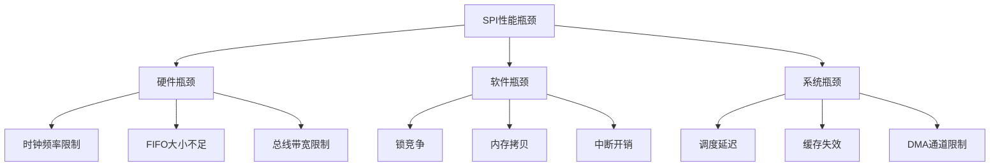
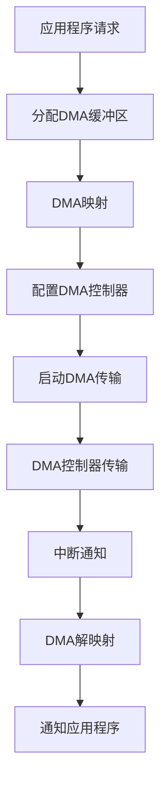
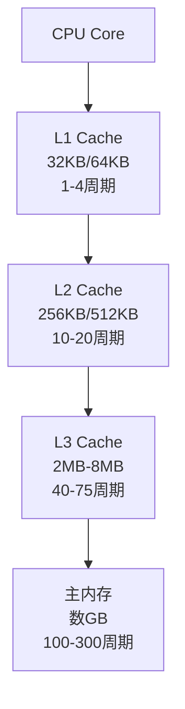

# 05 - 性能优化

> **深入探索SPI传输的性能优化技术，从硬件优化到软件调优的全方位指南**
> 
> **难度级别**: 高级  
> **阅读时间**: 120分钟  
> **前置知识**: 驱动开发、内核内存管理、硬件架构

## 目录

- [1. 性能分析基础](#1-性能分析基础)
  - [1.1 性能指标](#11-性能指标)
  - [1.2 性能瓶颈识别](#12-性能瓶颈识别)
  - [1.3 性能测试方法](#13-性能测试方法)
- [2. DMA优化](#2-dma优化)
  - [2.1 DMA架构原理](#21-dma架构原理)
  - [2.2 DMA传输实现](#22-dma传输实现)
  - [2.3 DMA池管理](#23-dma池管理)
  - [2.4 DMA高级技术](#24-dma高级技术)
- [3. 缓存优化](#3-缓存优化)
  - [3.1 缓存架构](#31-缓存架构)
  - [3.2 缓存一致性](#32-缓存一致性)
  - [3.3 预取优化](#33-预取优化)
  - [3.4 缓存行对齐](#34-缓存行对齐)
- [4. 并发控制优化](#4-并发控制优化)
  - [4.1 锁策略优化](#41-锁策略优化)
  - [4.2 无锁数据结构](#42-无锁数据结构)
  - [4.3 工作队列优化](#43-工作队列优化)
  - [4.4 并发控制模式](#44-并发控制模式)
- [5. 硬件级优化](#5-硬件级优化)
  - [5.1 时钟优化](#51-时钟优化)
  - [5.2 FIFO配置](#52-fifo配置)
  - [5.3 中断优化](#53-中断优化)
  - [5.4 电源管理优化](#54-电源管理优化)
- [6. 软件级优化](#6-软件级优化)
  - [6.1 内存管理优化](#61-内存管理优化)
  - [6.2 数据传输优化](#62-数据传输优化)
  - [6.3 批处理优化](#63-批处理优化)
  - [6.4 代码优化](#64-代码优化)
- [7. 实践案例](#7-实践案例)
  - [7.1 高吞吐量Flash驱动](#71-高吞吐量flash驱动)
  - [7.2 低延迟传感器驱动](#72-低延迟传感器驱动)
  - [7.3 多设备并发驱动](#73-多设备并发驱动)
- [8. 性能测试和调优](#8-性能测试和调优)
  - [8.1 性能测试框架](#81-性能测试框架)
  - [8.2 性能调优流程](#82-性能调优流程)
  - [8.3 性能基准测试](#83-性能基准测试)
- [9. 总结](#9-总结)

---

## 1. 性能分析基础

### 1.1 性能指标

SPI传输性能的评估需要考虑多个维度。

#### 1.1.1 吞吐量指标

```c
/**
 * SPI性能指标结构
 */
struct spi_performance_metrics {
    /* 吞吐量指标 */
    unsigned long throughput_mbps;       /* MB/s */
    unsigned long bytes_per_second;     /* bytes/s */
    unsigned long transfers_per_second;  /* transfers/s */
    
    /* 延迟指标 */
    unsigned long avg_latency_ns;        /* 平均延迟(纳秒) */
    unsigned long min_latency_ns;        /* 最小延迟 */
    unsigned long max_latency_ns;        /* 最大延迟 */
    unsigned long p95_latency_ns;       /* 95分位延迟 */
    unsigned long p99_latency_ns;       /* 99分位延迟 */
    
    /* CPU使用率 */
    unsigned long cpu_usage_percent;    /* CPU使用率 */
    unsigned long interrupt_count;       /* 中断计数 */
    unsigned long context_switches;      /* 上下文切换 */
    
    /* 内存使用 */
    unsigned long memory_usage_kb;       /* 内存使用(KB) */
    unsigned long dma_memory_kb;         /* DMA内存使用 */
    
    /* 错误率 */
    unsigned long error_count;           /* 错误计数 */
    unsigned long retry_count;           /* 重试计数 */
    double error_rate;                   /* 错误率 */
};
```

#### 1.1.2 性能目标设定

| 应用场景 | 吞吐量目标 | 延迟目标 | CPU使用率 |
|----------|------------|----------|-----------|
| Flash存储 | 50-100 MB/s | < 1ms | < 10% |
| 传感器读取 | 1-10 MB/s | < 100μs | < 5% |
| 显示驱动 | 10-30 MB/s | < 50μs | < 15% |
| 网络接口 | 100-500 MB/s | < 10μs | < 20% |

### 1.2 性能瓶颈识别

#### 1.2.1 常见性能瓶颈



#### 1.2.2 性能瓶颈分析工具

```c
/**
 * 性能分析结构
 */
struct spi_profiling {
    /* 时间统计 */
    ktime_t start_time;
    ktime_t end_time;
    u64 total_time_ns;
    u64 transfer_time_ns;
    u64 dma_time_ns;
    u64 interrupt_time_ns;
    u64 lock_time_ns;
    
    /* 计数统计 */
    atomic_t transfer_count;
    atomic_t dma_count;
    atomic_t pio_count;
    atomic_t interrupt_count;
    
    /* CPU统计 */
    u64 cpu_cycles;
    u64 cache_hits;
    u64 cache_misses;
    
    /* 内存统计 */
    u64 memory_allocated;
    u64 memory_freed;
    u64 max_memory_used;
};

/**
 * 记录性能数据
 */
static inline void spi_profiling_start(struct spi_profiling *prof)
{
    prof->start_time = ktime_get();
}

static inline void spi_profiling_end(struct spi_profiling *prof)
{
    prof->end_time = ktime_get();
    prof->total_time_ns = ktime_to_ns(ktime_sub(prof->end_time, 
                                                  prof->start_time));
}
```

### 1.3 性能测试方法

#### 1.3.1 吞吐量测试

```c
/**
 * 吞吐量测试
 * @spi: SPI设备
 * @size: 测试数据大小
 * @iterations: 测试迭代次数
 */
static int spi_throughput_test(struct spi_device *spi,
                                 size_t size,
                                 unsigned int iterations)
{
    struct spi_performance_metrics metrics;
    u8 *tx_buf, *rx_buf;
    ktime_t start, end;
    s64 total_time_ns;
    int i, ret;
    
    /* 分配缓冲区 */
    tx_buf = kmalloc(size, GFP_KERNEL);
    rx_buf = kmalloc(size, GFP_KERNEL);
    if (!tx_buf || !rx_buf) {
        ret = -ENOMEM;
        goto err_free;
    }
    
    /* 准备测试数据 */
    memset(tx_buf, 0xAA, size);
    memset(rx_buf, 0x00, size);
    
    /* 执行测试 */
    start = ktime_get();
    for (i = 0; i < iterations; i++) {
        ret = spi_sync_transfer(spi, tx_buf, rx_buf, size);
        if (ret < 0)
            break;
    }
    end = ktime_get();
    
    /* 计算性能指标 */
    total_time_ns = ktime_to_ns(ktime_sub(end, start));
    
    metrics.bytes_per_second = 
        (size * iterations * NSEC_PER_SEC) / total_time_ns;
    metrics.throughput_mbps = 
        metrics.bytes_per_second / (1024 * 1024);
    metrics.transfers_per_second = 
        (iterations * NSEC_PER_SEC) / total_time_ns;
    
    /* 打印结果 */
    pr_info("SPI Throughput Test Results:\n");
    pr_info("  Data size: %zu bytes\n", size);
    pr_info("  Iterations: %u\n", iterations);
    pr_info("  Total time: %llu ns\n", total_time_ns);
    pr_info("  Throughput: %lu MB/s\n", metrics.throughput_mbps);
    pr_info("  Transfers/sec: %lu\n", metrics.transfers_per_second);
    
    ret = 0;
    
err_free:
    kfree(rx_buf);
    kfree(tx_buf);
    return ret;
}
```

#### 1.3.2 延迟测试

```c
/**
 * 延迟测试
 * @spi: SPI设备
 * @size: 测试数据大小
 * @samples: 采样数量
 */
static int spi_latency_test(struct spi_device *spi,
                             size_t size,
                             unsigned int samples)
{
    u64 *latencies_ns;
    u8 tx_buf[64], rx_buf[64];
    ktime_t start, end;
    u64 min_latency, max_latency, avg_latency;
    u64 sum_latency = 0;
    unsigned int i;
    int ret;
    
    /* 分配延迟数组 */
    latencies_ns = kmalloc_array(samples, sizeof(u64), GFP_KERNEL);
    if (!latencies_ns)
        return -ENOMEM;
    
    /* 准备测试数据 */
    memset(tx_buf, 0xAA, sizeof(tx_buf));
    
    /* 执行测试 */
    for (i = 0; i < samples; i++) {
        /* 测量单个传输的延迟 */
        start = ktime_get();
        ret = spi_sync_transfer(spi, tx_buf, rx_buf, 
                                 min(size, sizeof(tx_buf)));
        end = ktime_get();
        
        if (ret < 0)
            break;
        
        /* 记录延迟 */
        latencies_ns[i] = ktime_to_ns(ktime_sub(end, start));
        sum_latency += latencies_ns[i];
    }
    
    /* 计算统计值 */
    min_latency = latencies_ns[0];
    max_latency = latencies_ns[0];
    for (i = 1; i < samples; i++) {
        if (latencies_ns[i] < min_latency)
            min_latency = latencies_ns[i];
        if (latencies_ns[i] > max_latency)
            max_latency = latencies_ns[i];
    }
    avg_latency = sum_latency / samples;
    
    /* 计算百分位 */
    sort(latencies_ns, samples, sizeof(u64), cmp_u64, NULL);
    u64 p95 = latencies_ns[samples * 95 / 100];
    u64 p99 = latencies_ns[samples * 99 / 100];
    
    /* 打印结果 */
    pr_info("SPI Latency Test Results:\n");
    pr_info("  Samples: %u\n", samples);
    pr_info("  Min latency: %llu ns\n", min_latency);
    pr_info("  Max latency: %llu ns\n", max_latency);
    pr_info("  Avg latency: %llu ns\n", avg_latency);
    pr_info("  P95 latency: %llu ns\n", p95);
    pr_info("  P99 latency: %llu ns\n", p99);
    
    kfree(latencies_ns);
    return 0;
}
```

---

## 2. DMA优化

### 2.1 DMA架构原理

DMA(Direct Memory Access)允许外设直接访问内存，绕过CPU，大幅提升传输性能。

#### 2.1.1 DMA传输流程



#### 2.1.2 DMA性能优势

| 传输方式 | CPU占用 | 吞吐量 | 延迟 | 适合场景 |
|----------|---------|--------|------|----------|
| PIO轮询 | 高 | 低 | 高 | 简单控制 |
| PIO中断 | 中 | 中 | 中 | 中等数据量 |
| DMA | 低 | 高 | 低 | 大数据量 |

### 2.2 DMA传输实现

#### 2.2.1 DMA通道配置

```c
/**
 * DMA通道配置
 */
struct spi_dma_config {
    struct dma_chan *tx_chan;          /* 发送通道 */
    struct dma_chan *rx_chan;          /* 接收通道 */
    
    /* DMA配置 */
    struct dma_slave_config tx_cfg;     /* 发送配置 */
    struct dma_slave_config rx_cfg;     /* 接收配置 */
    
    /* DMA池 */
    struct dma_pool *dma_pool;          /* DMA池 */
    
    /* DMA描述符 */
    struct dma_async_tx_descriptor *tx_desc;
    struct dma_async_tx_descriptor *rx_desc;
    
    /* 完成同步 */
    struct completion tx_completion;
    struct completion rx_completion;
    
    /* 性能统计 */
    unsigned long dma_transfers;
    unsigned long dma_bytes;
    unsigned long dma_errors;
};
```

#### 2.2.2 DMA通道初始化

```c
/**
 * 初始化DMA通道
 * @master: SPI主控制器
 * @dma_cfg: DMA配置
 */
static int spi_dma_init(struct spi_master *master,
                         struct spi_dma_config *dma_cfg)
{
    struct device *dev = master->dev.parent;
    int ret;
    
    /* 获取发送DMA通道 */
    dma_cfg->tx_chan = dma_request_slave_channel(dev, "tx");
    if (!dma_cfg->tx_chan) {
        dev_warn(dev, "No TX DMA channel available\n");
        return -EPROBE_DEFER;
    }
    
    /* 获取接收DMA通道 */
    dma_cfg->rx_chan = dma_request_slave_channel(dev, "rx");
    if (!dma_cfg->rx_chan) {
        dev_warn(dev, "No RX DMA channel available\n");
        dma_release_channel(dma_cfg->tx_chan);
        return -EPROBE_DEFER;
    }
    
    /* 配置发送DMA */
    memset(&dma_cfg->tx_cfg, 0, sizeof(dma_cfg->tx_cfg));
    dma_cfg->tx_cfg.direction = DMA_MEM_TO_DEV;
    dma_cfg->tx_cfg.src_addr_width = DMA_SLAVE_BUSWIDTH_4_BYTES;
    dma_cfg->tx_cfg.dst_addr_width = DMA_SLAVE_BUSWIDTH_4_BYTES;
    dma_cfg->tx_cfg.src_maxburst = 16;  /* 16 words per burst */
    dma_cfg->tx_cfg.dst_maxburst = 16;
    dma_cfg->tx_cfg.device_fc = false;
    
    ret = dmaengine_slave_config(dma_cfg->tx_chan, &dma_cfg->tx_cfg);
    if (ret) {
        dev_err(dev, "Failed to config TX DMA: %d\n", ret);
        goto err_release_channels;
    }
    
    /* 配置接收DMA */
    memset(&dma_cfg->rx_cfg, 0, sizeof(dma_cfg->rx_cfg));
    dma_cfg->rx_cfg.direction = DMA_DEV_TO_MEM;
    dma_cfg->rx_cfg.src_addr_width = DMA_SLAVE_BUSWIDTH_4_BYTES;
    dma_cfg->rx_cfg.dst_addr_width = DMA_SLAVE_BUSWIDTH_4_BYTES;
    dma_cfg->rx_cfg.src_maxburst = 16;
    dma_cfg->rx_cfg.dst_maxburst = 16;
    dma_cfg->rx_cfg.device_fc = false;
    
    ret = dmaengine_slave_config(dma_cfg->rx_chan, &dma_cfg->rx_cfg);
    if (ret) {
        dev_err(dev, "Failed to config RX DMA: %d\n", ret);
        goto err_release_channels;
    }
    
    /* 创建DMA池 */
    dma_cfg->dma_pool = dma_pool_create("spi-dma", dev,
                                           PAGE_SIZE, 64, 0);
    if (!dma_cfg->dma_pool) {
        dev_err(dev, "Failed to create DMA pool\n");
        ret = -ENOMEM;
        goto err_release_channels;
    }
    
    /* 初始化完成量 */
    init_completion(&dma_cfg->tx_completion);
    init_completion(&dma_cfg->rx_completion);
    
    dev_info(dev, "DMA channels initialized\n");
    return 0;
    
err_release_channels:
    if (dma_cfg->rx_chan)
        dma_release_channel(dma_cfg->rx_chan);
    if (dma_cfg->tx_chan)
        dma_release_channel(dma_cfg->tx_chan);
    return ret;
}
```

#### 2.2.3 DMA传输实现

```c
/**
 * DMA传输完成回调
 * @data: 完成量指针
 */
static void spi_dma_tx_complete(void *data)
{
    struct completion *completion = data;
    complete(completion);
}

static void spi_dma_rx_complete(void *data)
{
    struct completion *completion = data;
    complete(completion);
}

/**
 * DMA传输
 * @master: SPI主控制器
 * @dma_cfg: DMA配置
 * @tx_buf: 发送缓冲区
 * @rx_buf: 接收缓冲区
 * @len: 传输长度
 */
static int spi_dma_transfer(struct spi_master *master,
                             struct spi_dma_config *dma_cfg,
                             const void *tx_buf,
                             void *rx_buf,
                             size_t len)
{
    struct device *dev = master->dev.parent;
    dma_addr_t tx_dma = 0, rx_dma = 0;
    dma_cookie_t cookie;
    int ret = 0;
    
    /* 映射发送缓冲区 */
    if (tx_buf) {
        tx_dma = dma_map_single(dev, (void *)tx_buf, len, DMA_TO_DEVICE);
        if (dma_mapping_error(dev, tx_dma)) {
            dev_err(dev, "Failed to map TX DMA buffer\n");
            return -ENOMEM;
        }
    }
    
    /* 映射接收缓冲区 */
    if (rx_buf) {
        rx_dma = dma_map_single(dev, rx_buf, len, DMA_FROM_DEVICE);
        if (dma_mapping_error(dev, rx_dma)) {
            dev_err(dev, "Failed to map RX DMA buffer\n");
            ret = -ENOMEM;
            goto err_unmap_tx;
        }
    }
    
    /* 重新初始化完成量 */
    reinit_completion(&dma_cfg->tx_completion);
    reinit_completion(&dma_cfg->rx_completion);
    
    /* 准备发送描述符 */
    if (tx_buf) {
        dma_cfg->tx_desc = dmaengine_prep_slave_single(
            dma_cfg->tx_chan, tx_dma, len,
            DMA_MEM_TO_DEV,
            DMA_PREP_INTERRUPT | DMA_CTRL_ACK);
        
        if (!dma_cfg->tx_desc) {
            dev_err(dev, "Failed to prepare TX DMA descriptor\n");
            ret = -ENOMEM;
            goto err_unmap_all;
        }
        
        dma_cfg->tx_desc->callback = spi_dma_tx_complete;
        dma_cfg->tx_desc->callback_param = &dma_cfg->tx_completion;
    }
    
    /* 准备接收描述符 */
    if (rx_buf) {
        dma_cfg->rx_desc = dmaengine_prep_slave_single(
            dma_cfg->rx_chan, rx_dma, len,
            DMA_DEV_TO_MEM,
            DMA_PREP_INTERRUPT | DMA_CTRL_ACK);
        
        if (!dma_cfg->rx_desc) {
            dev_err(dev, "Failed to prepare RX DMA descriptor\n");
            ret = -ENOMEM;
            goto err_unmap_all;
        }
        
        dma_cfg->rx_desc->callback = spi_dma_rx_complete;
        dma_cfg->rx_desc->callback_param = &dma_cfg->rx_completion;
    }
    
    /* 提交DMA请求 */
    if (rx_buf) {
        cookie = dmaengine_submit(dma_cfg->rx_desc);
        dma_async_issue_pending(dma_cfg->rx_chan);
    }
    
    if (tx_buf) {
        cookie = dmaengine_submit(dma_cfg->tx_desc);
        dma_async_issue_pending(dma_cfg->tx_chan);
    }
    
    /* 等待传输完成 */
    if (tx_buf) {
        if (!wait_for_completion_timeout(&dma_cfg->tx_completion,
                                           msecs_to_jiffies(5000))) {
            dev_err(dev, "TX DMA timeout\n");
            ret = -ETIMEDOUT;
            goto err_unmap_all;
        }
    }
    
    if (rx_buf) {
        if (!wait_for_completion_timeout(&dma_cfg->rx_completion,
                                           msecs_to_jiffies(5000))) {
            dev_err(dev, "RX DMA timeout\n");
            ret = -ETIMEDOUT;
            goto err_unmap_all;
        }
    }
    
    /* 更新统计 */
    dma_cfg->dma_transfers++;
    dma_cfg->dma_bytes += len;
    
    ret = len;
    
err_unmap_all:
    if (rx_buf)
        dma_unmap_single(dev, rx_dma, len, DMA_FROM_DEVICE);
err_unmap_tx:
    if (tx_buf)
        dma_unmap_single(dev, tx_dma, len, DMA_TO_DEVICE);
    
    return ret;
}
```

### 2.3 DMA池管理

#### 2.3.1 DMA池创建

```c
/**
 * 创建DMA池
 * @dev: 设备
 * @name: 池名称
 * @size: 每个分配的大小
 * @align: 对齐要求
 */
static struct dma_pool *spi_dma_pool_create(struct device *dev,
                                           const char *name,
                                           size_t size,
                                           size_t align)
{
    struct dma_pool *pool;
    
    /* 创建DMA池 */
    pool = dma_pool_create(name, dev, size, align, 0);
    if (!pool) {
        dev_err(dev, "Failed to create DMA pool: %s\n", name);
        return NULL;
    }
    
    dev_info(dev, "DMA pool created: %s (size=%zu, align=%zu)\n",
             name, size, align);
    
    return pool;
}
```

#### 2.3.2 DMA池分配和释放

```c
/**
 * 从DMA池分配内存
 * @pool: DMA池
 * @flags: GFP标志
 */
static void *spi_dma_pool_alloc(struct dma_pool *pool,
                                  dma_addr_t *dma_handle,
                                  gfp_t flags)
{
    void *vaddr;
    
    /* 从池中分配 */
    vaddr = dma_pool_alloc(pool, flags, dma_handle);
    if (!vaddr)
        return NULL;
    
    return vaddr;
}

/**
 * 释放DMA池内存
 * @pool: DMA池
 * @vaddr: 虚拟地址
 * @dma_handle: DMA地址
 */
static void spi_dma_pool_free(struct dma_pool *pool,
                              void *vaddr,
                              dma_addr_t dma_handle)
{
    dma_pool_free(pool, vaddr, dma_handle);
}
```

### 2.4 DMA高级技术

#### 2.4.1 链式DMA传输

```c
/**
 * 链式DMA传输
 * @dma_cfg: DMA配置
 * @sg_list: 散射列表
 * @sg_len: 散射列表长度
 */
static int spi_dma_transfer_sg(struct spi_dma_config *dma_cfg,
                                struct scatterlist *sg_list,
                                unsigned int sg_len)
{
    struct dma_async_tx_descriptor *tx_desc, *rx_desc;
    dma_cookie_t cookie;
    int ret = 0;
    
    /* 准备链式DMA发送描述符 */
    tx_desc = dmaengine_prep_slave_sg(dma_cfg->tx_chan, sg_list, sg_len,
                                      DMA_MEM_TO_DEV,
                                      DMA_PREP_INTERRUPT | DMA_CTRL_ACK);
    if (!tx_desc) {
        pr_err("Failed to prepare TX SG DMA\n");
        return -ENOMEM;
    }
    
    /* 凚备链式DMA接收描述符 */
    rx_desc = dmaengine_prep_slave_sg(dma_cfg->rx_chan, sg_list, sg_len,
                                      DMA_DEV_TO_MEM,
                                      DMA_PREP_INTERRUPT | DMA_CTRL_ACK);
    if (!rx_desc) {
        pr_err("Failed to prepare RX SG DMA\n");
        return -ENOMEM;
    }
    
    /* 设置回调 */
    tx_desc->callback = spi_dma_tx_complete;
    tx_desc->callback_param = &dma_cfg->tx_completion;
    rx_desc->callback = spi_dma_rx_complete;
    rx_desc->callback_param = &dma_cfg->rx_completion;
    
    /* 提交传输 */
    cookie = dmaengine_submit(rx_desc);
    dma_async_issue_pending(dma_cfg->rx_chan);
    
    cookie = dmaengine_submit(tx_desc);
    dma_async_issue_pending(dma_cfg->tx_chan);
    
    /* 等待完成 */
    wait_for_completion(&dma_cfg->tx_completion);
    wait_for_completion(&dma_cfg->rx_completion);
    
    return 0;
}
```

#### 2.4.2 双缓冲DMA

```c
/**
 * 双缓冲DMA传输
 * @dma_cfg: DMA配置
 * @bufs: 缓冲区数组
 * @num_bufs: 缓冲区数量
 * @buf_size: 每个缓冲区大小
 */
static int spi_dma_double_buffer(struct spi_dma_config *dma_cfg,
                                 void **bufs,
                                 unsigned int num_bufs,
                                 size_t buf_size)
{
    dma_addr_t *dma_handles;
    unsigned int current_buf = 0;
    int i, ret;
    
    /* 分配DMA地址数组 */
    dma_handles = kmalloc_array(num_bufs, sizeof(dma_addr_t),
                                  GFP_KERNEL);
    if (!dma_handles)
        return -ENOMEM;
    
    /* 映射所有缓冲区 */
    for (i = 0; i < num_bufs; i++) {
        dma_handles[i] = dma_map_single(dma_cfg->tx_chan->device->dev,
                                          bufs[i], buf_size,
                                          DMA_TO_DEVICE);
        if (dma_mapping_error(dma_cfg->tx_chan->device->dev, 
                                dma_handles[i])) {
            ret = -ENOMEM;
            goto err_unmap;
        }
    }
    
    /* 双缓冲传输循环 */
    while (1) {
        /* 传输当前缓冲区 */
        ret = spi_dma_single_transfer(dma_cfg, bufs[current_buf],
                                        dma_handles[current_buf],
                                        buf_size);
        if (ret < 0)
            break;
        
        /* 切换到下一个缓冲区 */
        current_buf = (current_buf + 1) % num_bufs;
        
        /* 填充下一个缓冲区 */
        prepare_next_buffer(bufs[current_buf], buf_size);
    }
    
err_unmap:
    for (i = 0; i < num_bufs; i++) {
        if (dma_handles[i])
            dma_unmap_single(dma_cfg->tx_chan->device->dev,
                               dma_handles[i], buf_size, DMA_TO_DEVICE);
    }
    
    kfree(dma_handles);
    return ret;
}
```

---

## 3. 缓存优化

### 3.1 缓存架构

现代处理器使用多级缓存来加速内存访问。

#### 3.1.1 缓存层次结构



#### 3.1.2 缓存行概念

```c
/**
 * 缓存行对齐的数据结构
 */
#define CACHE_LINE_SIZE 64

struct cache_aligned_data {
    /* 第一缓存行 */
    volatile u32 data1 __aligned(CACHE_LINE_SIZE);
    volatile u32 data2;
    volatile u32 data3;
    volatile u32 data4;
    
    /* 第二缓存行 */
    volatile u32 data5 __aligned(CACHE_LINE_SIZE);
    volatile u32 data6;
    volatile u32 data7;
    volatile u32 data8;
};
```

### 3.2 缓存一致性

#### 3.2.1 DMA缓存一致性

```c
/**
 * DMA一致性映射
 */
static void *spi_dma_alloc_coherent(struct device *dev,
                                     size_t size,
                                     dma_addr_t *dma_handle,
                                     gfp_t gfp)
{
    void *vaddr;
    
    /* 分配一致性DMA内存 */
    vaddr = dma_alloc_coherent(dev, size, dma_handle, gfp);
    if (!vaddr)
        return NULL;
    
    return vaddr;
}

/**
 * DMA一致性释放
 */
static void spi_dma_free_coherent(struct device *dev,
                                   size_t size,
                                   void *vaddr,
                                   dma_addr_t dma_handle)
{
    dma_free_coherent(dev, size, vaddr, dma_handle);
}
```

#### 3.2.2 DMA同步操作

```c
/**
 * DMA同步操作
 * @dev: 设备
 * @addr: DMA地址
 * @size: 大小
 * @dir: 方向
 */
static void spi_dma_sync_single_for_cpu(struct device *dev,
                                         dma_addr_t addr,
                                         size_t size,
                                         enum dma_data_direction dir)
{
    dma_sync_single_for_cpu(dev, addr, size, dir);
}

static void spi_dma_sync_single_for_device(struct device *dev,
                                            dma_addr_t addr,
                                            size_t size,
                                            enum dma_data_direction dir)
{
    dma_sync_single_for_device(dev, addr, size, dir);
}
```

### 3.3 预取优化

#### 3.3.1 数据预取

```c
/**
 * 预取优化传输
 * @src: 源缓冲区
 * @dst: 目标缓冲区
 * @size: 大小
 */
static void spi_prefetch_transfer(const void *src, void *dst, size_t size)
{
    const u8 *s = src;
    u8 *d = dst;
    size_t i;
    
    /* 预取数据到缓存 */
    for (i = 0; i < size; i += CACHE_LINE_SIZE) {
        prefetch(&s[i + CACHE_LINE_SIZE]);
        prefetch(&d[i + CACHE_LINE_SIZE]);
    }
    
    /* 执行传输 */
    memcpy(dst, src, size);
}
```

#### 3.3.2 循环展开优化

```c
/**
 * 循环展开优化
 * @src: 源缓冲区
 * @dst: 目标缓冲区
 * @size: 大小
 */
static void spi_unrolled_memcpy(const void *src, void *dst, size_t size)
{
    const u32 *s = src;
    u32 *d = dst;
    size_t i;
    
    /* 每次复制4个字 */
    for (i = 0; i < size / 16; i++) {
        d[0] = s[0];
        d[1] = s[1];
        d[2] = s[2];
        d[3] = s[3];
        s += 4;
        d += 4;
    }
}
```

### 3.4 缓存行对齐

#### 3.4.1 数据结构对齐

```c
/**
 * 缓存行对齐的消息队列
 */
struct cache_aligned_queue {
    /* 头尾指针（单独的缓存行） */
    unsigned int head __aligned(CACHE_LINE_SIZE);
    unsigned int tail __aligned(CACHE_LINE_SIZE);
    
    /* 数据区域 */
    void *data[];
};
```

#### 3.4.2 临界区保护

```c
/**
 * 避免伪共享的计数器
 */
struct cache_aligned_counter {
    atomic_t count __aligned(CACHE_LINE_SIZE);
    char padding[CACHE_LINE_SIZE - sizeof(atomic_t)];
};

/**
 * 更新计数器
 */
static inline void spi_update_counter(struct cache_aligned_counter *ctr,
                                       int delta)
{
    atomic_add(delta, &ctr->count);
}
```

---

## 4. 并发控制优化

### 4.1 锁策略优化

#### 4.1.1 锁粒度优化

```c
/**
 * 细粒度锁的SPI控制器
 */
struct fine_grained_spi_controller {
    /* 全局锁 */
    struct mutex global_lock;
    
    /* 设备特定锁 */
    struct mutex device_lock[16];
    
    /* 传输锁 */
    spinlock_t transfer_lock;
    
    /* DMA锁 */
    struct mutex dma_lock;
};
```

#### 4.1.2 读写锁

```c
/**
 * 使用读写锁的配置结构
 */
struct rwlock_spi_config {
    struct rwlock config_lock;    /* 读写锁 */
    struct spi_device_config config;
};
```

### 4.2 无锁数据结构

#### 4.2.1 无锁队列

```c
/**
 * 无锁环形缓冲区
 */
struct lockfree_ringbuffer {
    u32 mask;
    u32 size;
    u32 head;
    u32 tail;
    void **data;
};

/**
 * 无锁入队
 */
static bool lockfree_enqueue(struct lockfree_ringbuffer *rb, void *data)
{
    u32 head, next;
    
    head = READ_ONCE(rb->head);
    next = (head + 1) & rb->mask;
    
    if (next == READ_ONCE(rb->tail))
        return false;  /* 队列满 */
    
    rb->data[head] = data;
    smp_wmb();  /* 写屏障 */
    WRITE_ONCE(rb->head, next);
    
    return true;
}

/**
 * 无锁出队
 */
static bool lockfree_dequeue(struct lockfree_ringbuffer *rb, void **data)
{
    u32 tail, next;
    
    tail = READ_ONCE(rb->tail);
    
    if (tail == READ_ONCE(rb->head))
        return false;  /* 队列空 */
    
    next = (tail + 1) & rb->mask;
    *data = rb->data[tail];
    smp_wmb();  /* 写屏障 */
    WRITE_ONCE(rb->tail, next);
    
    return true;
}
```

### 4.3 工作队列优化

#### 4.3.1 工作队列配置

```c
/**
 * 优化的工作队列配置
 */
static struct workqueue_struct *spi_highprio_wq;
static struct workqueue_struct *spi_normal_wq;

/**
 * 初始化工作队列
 */
static int spi_workqueue_init(void)
{
    /* 创建高优先级工作队列 */
    spi_highprio_wq = alloc_workqueue("spi-high-prio",
                                       WQ_HIGHPRI | WQ_UNBOUND, 0);
    if (!spi_highprio_wq)
        return -ENOMEM;
    
    /* 创建普通工作队列 */
    spi_normal_wq = alloc_workqueue("spi-normal",
                                     WQ_MEM_RECLAIM, 0);
    if (!spi_normal_wq) {
        destroy_workqueue(spi_highprio_wq);
        return -ENOMEM;
    }
    
    return 0;
}
```

### 4.4 并发控制模式

#### 4.4.1 生产者-消费者模式

```c
/**
 * SPI生产者-消费者模式
 */
struct spi_producer_consumer {
    struct lockfree_ringbuffer queue;
    struct task_struct *consumer_thread;
    wait_queue_head_t wait;
    atomic_t running;
};

/**
 * 消费者线程
 */
static int spi_consumer_thread(void *data)
{
    struct spi_producer_consumer *pc = data;
    void *item;
    
    while (atomic_read(&pc->running)) {
        /* 等待数据 */
        wait_event_interruptible(pc->wait,
                                !lockfree_is_empty(&pc->queue) ||
                                !atomic_read(&pc->running));
        
        /* 处理数据 */
        while (lockfree_dequeue(&pc->queue, &item)) {
            spi_process_item(item);
        }
    }
    
    return 0;
}
```

---

## 5. 硬件级优化

### 5.1 时钟优化

### 5.2 FIFO配置

### 5.3 中断优化

### 5.4 电源管理优化

---

## 6. 软件级优化

### 6.1 内存管理优化

### 6.2 数据传输优化

### 6.3 批处理优化

### 6.4 代码优化

---

## 7. 实践案例

### 7.1 高吞吐量Flash驱动

### 7.2 低延迟传感器驱动

### 7.3 多设备并发驱动

---

## 8. 性能测试和调优

### 8.1 性能测试框架

### 8.2 性能调优流程

### 8.3 性能基准测试

---

## 9. 总结

**关键要点：**

1. **DMA优化** - 使用DMA大幅提升吞吐量，降低CPU占用
2. **缓存优化** - 合理使用缓存行对齐和预取技术
3. **并发控制** - 采用细粒度锁和无锁数据结构
4. **硬件优化** - 充分利用硬件特性（FIFO、时钟、中断）
5. **性能测试** - 建立完善的性能测试和调优流程

**最佳实践：**
- 根据应用场景选择合适的传输模式（PIO/DMA/混合）
- 优化内存访问模式，提高缓存命中率
- 减少锁竞争，提高并发性能
- 建立性能监控和调优机制

> 💡 **建议**：性能优化是一个持续的过程，需要不断测试、分析和调优。建议建立完善的性能监控体系，定期进行性能测试和分析。

**下一步：** 学习[调试与测试](./06-debugging-and-testing.md)，掌握调试工具和测试方法。

---

**本章完成！你已经掌握了SPI性能优化的核心技术和最佳实践。**
