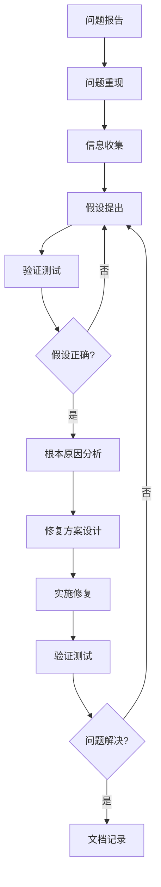
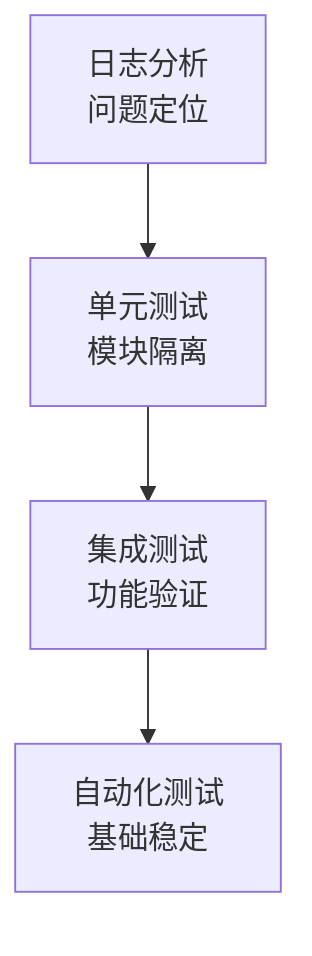
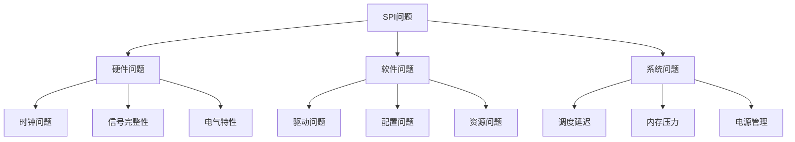

# 06 - 调试与测试

> **SPI驱动调试工具、测试方法和问题分析的完整指南**
> 
> **难度级别**: 进阶  
> **阅读时间**: 100分钟  
> **前置知识**: 驱动开发、Linux内核调试、硬件测试

## 目录

- [1. 调试概述](#1-调试概述)
  - [1.1 调试方法论](#11-调试方法论)
  - [1.2 调试环境配置](#12-调试环境配置)
  - [1.3 调试工具准备](#13-调试工具准备)
- [2. 内核调试工具](#2-内核调试工具)
  - [2.1 dmesg和printk](#21-dmesg和printk)
  - [2.2 ftrace跟踪](#22-ftrace跟踪)
  - [2.3 trace-cmd](#23-trace-cmd)
  - [2.4 perf性能分析](#24-perf性能分析)
- [3. 用户空间调试](#3-用户空间调试)
  - [3.1 strace系统调用跟踪](#31-strace系统调用跟踪)
  - [3.2 lsof文件描述符](#32-lsof文件描述符)
  - [3.3 gdb调试](#33-gdb调试)
  - [3.4 valgrind内存检查](#34-valgrind内存检查)
- [4. 硬件调试工具](#4-硬件调试工具)
  - [4.1 逻辑分析仪](#41-逻辑分析仪)
  - [4.2 示波器](#42-示波器)
  - [4.3 SPI分析仪](#43-spi分析仪)
  - [4.4 协议分析](#44-协议分析)
- [5. 测试框架](#5-测试框架)
  - [5.1 单元测试](#51-单元测试)
  - [5.2 集成测试](#52-集成测试)
  - [5.3 压力测试](#53-压力测试)
  - [5.4 回归测试](#54-回归测试)
- [6. 问题分析方法](#6-问题分析方法)
  - [6.1 常见问题分类](#61-常见问题分类)
  - [6.2 问题诊断流程](#62-问题诊断流程)
  - [6.3 根本原因分析](#63-根本原因分析)
  - [6.4 问题修复验证](#64-问题修复验证)
- [7. 调试实践案例](#7-调试实践案例)
  - [7.1 传输失败调试](#71-传输失败调试)
  - [7.2 性能问题调试](#72-性能问题调试)
  - [7.3 内存泄漏调试](#73-内存泄漏调试)
  - [7.4 并发问题调试](#74-并发问题调试)
- [8. 最佳实践](#8-最佳实践)
  - [8.1 调试友好代码](#81-调试友好代码)
  - [8.2 日志规范](#82-日志规范)
  - [8.3 测试策略](#83-测试策略)
  - [8.4 文档记录](#84-文档记录)
- [9. 总结](#9-总结)

---

## 1. 调试概述

### 1.1 调试方法论

#### 1.1.1 系统化调试流程



#### 1.1.2 调试金字塔



### 1.2 调试环境配置

#### 1.2.1 内核配置

```bash
# 启用调试选项
CONFIG_DEBUG_KERNEL=y
CONFIG_DEBUG_INFO=y
CONFIG_DEBUG_FS=y
CONFIG_DYNAMIC_DEBUG=y
CONFIG_KGDB=y
CONFIG_MAGIC_SYSRQ=y

# SPI调试选项
CONFIG_SPI_DEBUG=y
CONFIG_SPI_MASTER=y
CONFIG_SPIDEV=y

# 启用ftrace
CONFIG_FTRACE=y
CONFIG_FUNCTION_TRACER=y
CONFIG_SCHED_TRACER=y
```

#### 1.2.2 调试内核编译

```bash
# 编译带调试信息的内核
make ARCH=arm64 CROSS_COMPILE=aarch64-linux-gnu- \
     KCFLAGS="-O0 -g3" -j$(nproc)

# 安装调试符号
make ARCH=arm64 CROSS_COMPILE=aarch64-linux-gnu- \
     modules_install install
```

#### 1.2.3 调试文件系统

```bash
# 挂载调试文件系统
mount -t debugfs none /sys/kernel/debug
mount -t tracefs none /sys/kernel/tracing

# 创建调试工具目录
mkdir -p /root/spi-debug
cd /root/spi-debug
```

### 1.3 调试工具准备

#### 1.3.1 必备工具安装

```bash
# 调试工具
sudo apt-get install \
    gdb-multiarch \
    strace \
    ltrace \
    valgrind

# 性能分析工具
sudo apt-get install \
    perf \
    trace-cmd \
    kernelshark

# 硬件调试工具
sudo apt-get install \
    i2c-tools \
    spi-tools
```

#### 1.3.2 调试脚本准备

```bash
#!/bin/bash
# spi-debug.sh - SPI调试脚本

set -e

# 清理之前的日志
dmesg -c > /dev/null

# 设置日志级别
echo 8 > /proc/sys/kernel/printk

# 启用动态调试
echo 'file spi*.c +p' > /sys/kernel/debug/dynamic_debug/control

# 跟踪函数
echo function_graph > /sys/kernel/tracing/current_tracer
echo 'spi*' > /sys/kernel/tracing/set_ftrace_filter

echo "SPI调试环境已准备就绪"
```

---

## 2. 内核调试工具

### 2.1 dmesg和printk

#### 2.1.1 日志级别设置

```c
/**
 * SPI驱动日志宏定义
 */
#define SPI_LOG_LEVEL_DEBUG  7
#define SPI_LOG_LEVEL_INFO   6
#define SPI_LOG_LEVEL_WARN   4
#define SPI_LOG_LEVEL_ERROR  3

#define SPI_LOG(level, fmt, ...) \
    do { \
        if (level <= spi_debug_level) { \
            pr_##level("spi: " fmt, ##__VA_ARGS__); \
        } \
    } while (0)

#define SPI_DEBUG(fmt, ...) SPI_LOG(DEBUG, fmt, ##__VA_ARGS__)
#define SPI_INFO(fmt, ...)  SPI_LOG(INFO, fmt, ##__VA_ARGS__)
#define SPI_WARN(fmt, ...)  SPI_LOG(WARN, fmt, ##__VA_ARGS__)
#define SPI_ERR(fmt, ...)   SPI_LOG(ERR, fmt, ##__VA_ARGS__)
```

#### 2.1.2 结构化日志

```c
/**
 * 结构化日志输出
 */
static void spi_log_transfer(struct spi_device *spi,
                              const void *tx_buf,
                              const void *rx_buf,
                              size_t len)
{
    SPI_INFO("Transfer: bus=%d cs=%d len=%zu speed=%d mode=0x%x\n",
             spi->master->bus_num, spi->chip_select, len,
             spi->max_speed_hz, spi->mode);
    
    if (spi_debug_level >= SPI_LOG_LEVEL_DEBUG) {
        print_hex_dump_debug("TX: ", DUMP_PREFIX_OFFSET, 16, 1,
                             tx_buf, len, false);
        print_hex_dump_debug("RX: ", DUMP_PREFIX_OFFSET, 16, 1,
                             rx_buf, len, false);
    }
}
```

#### 2.1.3 实时日志查看

```bash
# 查看实时内核日志
dmesg -w -T

# 过滤SPI相关日志
dmesg -T | grep -i spi

# 保存日志到文件
dmesg -T > /root/spi-debug/kernel.log

# 查看最近的100条SPI日志
dmesg -T | grep -i spi | tail -100
```

### 2.2 ftrace跟踪

#### 2.2.1 启用ftrace

```bash
# 挂载tracing文件系统
mount -t tracefs nodev /sys/kernel/tracing

# 查看可用的tracer
cat /sys/kernel/tracing/available_tracers

# 选择function_graph跟踪器
echo function_graph > /sys/kernel/tracing/current_tracer

# 设置过滤函数
echo 'spi*' > /sys/kernel/tracing/set_ftrace_filter

# 启用跟踪
echo 1 > /sys/kernel/tracing/tracing_on
```

#### 2.2.2 分析跟踪结果

```bash
# 查看跟踪结果
cat /sys/kernel/tracing/trace

# 格式化输出
cat /sys/kernel/tracing/trace | grep spi_sync

# 保存跟踪结果
cat /sys/kernel/tracing/trace > /root/spi-debug/trace.txt

# 使用kernelshark分析
kernelshark /root/spi-debug/trace.txt
```

#### 2.2.3 动态调试

```c
/**
 * 动态调试支持
 */
#define spi_dbg(dev, fmt, ...) \
    dev_dbg(dev, fmt, ##__VA_ARGS__)

/**
 * 使用动态调试
 */
static void spi_debug_message(struct spi_device *spi,
                             const char *msg)
{
    spi_dbg(&spi->dev, "Message: %s\n", msg);
}

/* 启用特定文件的调试 */
echo 'file spi_transfer.c +p' > /sys/kernel/debug/dynamic_debug/control

/* 禁用特定函数的调试 */
echo 'func spi_setup -p' > /sys/kernel/debug/dynamic_debug/control
```

### 2.3 trace-cmd

#### 2.3.1 trace-cmd基础使用

```bash
# 开始跟踪
trace-cmd record -e spi:* -p function_graph -a

# 执行测试程序
./spi_test

# 停止跟踪
trace-cmd stop

# 查看报告
trace-cmd report

# 图形化显示
trace-cmd report -i | less
```

#### 2.3.2 高级跟踪选项

```bash
# 跟踪特定事件
trace-cmd record -e spi:* -e sched:* \
              -p function_graph -a

# 设置缓冲区大小
trace-cmd record -e spi:* -B 10M -a

# 跟踪指定进程
trace-cmd record -p function_graph -P 1234

# 实时跟踪
trace-cmd show -e spi:*
```

#### 2.3.3 跟踪数据分析

```bash
# 导出为图形
trace-cmd report -i trace.dat | \
    gnuplot -p -e "set terminal png; \
    set output 'trace.png'; \
    plot '-'"

# 分析延迟
trace-cmd report -i trace.dat | \
    grep spi_sync | awk '{print $NF}' | \
    sort -n > latency.txt

# 统计函数调用
trace-cmd report -i trace.dat | \
    grep spi_ | awk '{print $1}' | \
    sort | uniq -c | sort -rn
```

### 2.4 perf性能分析

#### 2.4.1 perf基本使用

```bash
# 记录性能数据
perf record -e cycles,instructions,cache-misses -g ./spi_test

# 分析报告
perf report

# 图形化显示
perf report --stdio --call-graph none

# 显示热点函数
perf report --stdio --sort=overhead | head -20
```

#### 2.4.2 SPI特定分析

```bash
# 跟踪SPI相关函数
perf record -e 'spi:*' -a sleep 10

# 分析缓存性能
perf stat -e cache-references,cache-misses,cycles,instructions \
        ./spi_test

# 分析调度延迟
perf sched record ./spi_test
perf sched latency

# 分析锁竞争
perf lock record ./spi_test
perf lock report
```

#### 2.4.3 性能对比

```bash
# 基准测试
perf bench sched pipe -l 10000

# 对比优化前后
perf stat -e cycles,instructions ./spi_test_original
perf stat -e cycles,instructions ./spi_test_optimized

# 生成火焰图
perf record -g -F 99 ./spi_test
perf script | stackcollapse-perf.pl | \
    flamegraph.pl > spi_flamegraph.svg
```

---

## 3. 用户空间调试

### 3.1 strace系统调用跟踪

#### 3.1.1 基本使用

```bash
# 跟踪所有系统调用
strace ./spi_test

# 只跟踪SPI相关的系统调用
strace -e ioctl,read,write ./spi_test

# 统计系统调用
strace -c ./spi_test

# 显示时间戳
strace -T ./spi_test
```

#### 3.1.2 高级选项

```bash
# 跟踪特定进程
strace -p 1234

# 保存输出
strace -o spi_trace.log ./spi_test

# 显示详细输出
strace -s 200 -v ./spi_test

# 跟踪子进程
strace -f ./spi_test
```

#### 3.1.3 SPI设备跟踪

```bash
# 跟踪SPI设备操作
strace -e ioctl,read,write,open,close \
        /dev/spidev0.0

# 分析ioctl调用
strace -e ioctl ./spi_test 2>&1 | \
    grep SPI

# 跟踪多次调用
strace -c -e ioctl ./spi_test
```

### 3.2 lsof文件描述符

#### 3.2.1 查看SPI设备使用情况

```bash
# 查看SPI设备打开的进程
lsof /dev/spidev0.*

# 查看所有打开的SPI设备
lsof | grep spi

# 持续监控
watch -n 1 'lsof /dev/spidev0.*'
```

#### 3.2.2 文件描述符分析

```bash
# 查看进程的文件描述符
lsof -p 1234

# 查看网络连接（如果有网络SPI）
lsof -i

# 查看内存映射
lsof -p 1234 | grep mem
```

### 3.3 gdb调试

#### 3.3.1 GDB基础调试

```bash
# 启动GDB
gdb ./spi_test

# 设置断点
(gdb) break spi_transfer
(gdb) break spi_sync

# 运行程序
(gdb) run

# 单步执行
(gdb) step
(gdb) next

# 查看变量
(gdb) print len
(gdb) print buffer[0]
```

#### 3.3.2 内核调试

```bash
# 连接到KGDB
gdb vmlinux
(gdb) target remote /dev/ttyS0

# 查看内核模块
(gdb) info sharedlibrary

# 查看函数
(gdb) print spi_sync

# 设置断点
(gdb) break spi_master_setup
```

#### 3.3.3 调试脚本

```bash
# spi.gdb - SPI调试脚本
# 断点设置
break spi_transfer
commands
  silent
  print spi->master->bus_num
  print spi->chip_select
  print len
  continue
end

# 条件断点
break spi_setup if spi->mode == 0x03

# 运行脚本
gdb -x spi.gdb ./spi_test
```

### 3.4 valgrind内存检查

#### 3.4.1 内存泄漏检测

```bash
# 检测内存泄漏
valgrind --leak-check=full --show-leak-kinds=all \
         --track-origins=yes ./spi_test

# 详细输出
valgrind --leak-check=full -v ./spi_test

# 生成报告
valgrind --leak-check=full --log-file=valgrind.log \
         ./spi_test
```

#### 3.4.2 内存错误检测

```bash
# 检测内存错误
valgrind --tool=memcheck ./spi_test

# 检测线程错误
valgrind --tool=helgrind ./spi_test

# 检测缓存性能
valgrind --tool=cachegrind ./spi_test
```

---

## 4. 硬件调试工具

### 4.1 逻辑分析仪

#### 4.1.1 SPI信号捕获

```python
# spi_logic_analyzer.py - SPI信号分析脚本
import saleae
import time

def capture_spi_signals(duration_seconds):
    # 连接到逻辑分析仪
    s = saleae.Saleae()
    
    # 设置采样率
    s.set_sample_rate(10000000)  # 10 MHz
    
    # 配置SPI通道
    s.enable_channel(0)  # SCK
    s.enable_channel(1)  # MOSI
    s.enable_channel(2)  # MISO
    s.enable_channel(3)  # CS
    
    # 开始捕获
    s.capture_start()
    time.sleep(duration_seconds)
    s.capture_stop()
    
    # 保存数据
    s.export_data('spi_capture.csv')
    
    return s.get_data()
```

#### 4.1.2 SPI协议解码

```python
# decode_spi.py - SPI协议解码
import pandas as pd

def decode_spi_protocol(csv_file):
    # 读取捕获数据
    df = pd.read_csv(csv_file)
    
    # 解码SPI时钟和数据
    sck = df['Channel 0']
    mosi = df['Channel 1']
    miso = df['Channel 2']
    cs = df['Channel 3']
    
    # 查找时钟边沿
    clock_edges = sck.diff().ne(0)
    
    # 采样数据
    data_samples = []
    for i, edge in enumerate(clock_edges):
        if edge:
            sample = {
                'time': df['Time'][i],
                'sck': sck[i],
                'mosi': mosi[i],
                'miso': miso[i],
                'cs': cs[i]
            }
            data_samples.append(sample)
    
    return data_samples
```

### 4.2 示波器

#### 4.2.1 时序测量

```bash
# 使用scopy命令行工具
scopy --instrument oscilloscope \
      --channel 0 --enable \
      --channel 1 --enable \
      --trigger-level 1.6 \
      --trigger-channel 0

# 捕获数据
scopy --instrument oscilloscope --capture
```

### 4.3 SPI分析仪

#### 4.3.1 专用SPI分析仪

```bash
# 使用sigrok cli
sigrok-cli --driver fx2lafw \
           --config samplerate=10m \
           --continuous \
           --output spi.sr

# 解码SPI信号
sigrok-cli -i spi.sr -P spi:cs=0:mosi=1:miso=2:sck=3
```

### 4.4 协议分析

#### 4.4.1 SPI协议验证

```python
# validate_spi.py - SPI协议验证
def validate_spi_protocol(data_samples):
    errors = []
    
    # 验证片选信号
    cs_stable = True
    for i in range(1, len(data_samples)):
        if data_samples[i]['cs'] != data_samples[i-1]['cs']:
            cs_stable = False
            errors.append(f"CS signal changed at {data_samples[i]['time']}")
    
    # 验证时钟边沿
    for i in range(1, len(data_samples)):
        if data_samples[i]['sck'] == data_samples[i-1]['sck']:
            errors.append(f"Invalid clock edge at {data_samples[i]['time']}")
    
    return errors
```

---

## 5. 测试框架

### 5.1 单元测试

#### 5.1.1 KUnit测试

```c
#include <kunit/test.h>

/* SPI单元测试 */
static void spi_test_basic_transfer(struct kunit *test)
{
    struct spi_device *spi;
    u8 tx_buf[4] = {0xAA, 0xBB, 0xCC, 0xDD};
    u8 rx_buf[4];
    int ret;
    
    /* 设置测试环境 */
    spi = setup_test_spi_device(test);
    KUNIT_ASSERT_NOT_ERR_OR_NULL(test, spi);
    
    /* 执行传输 */
    ret = spi_sync_transfer(spi, tx_buf, rx_buf, 4);
    KUNIT_ASSERT_EQ(test, ret, 4);
    
    /* 验证数据 */
    KUNIT_EXPECT_MEMEQ(test, tx_buf, rx_buf, 4);
}

static struct kunit_case spi_test_cases[] = {
    KUNIT_CASE(spi_test_basic_transfer),
    KUNIT_CASE(spi_test_dma_transfer),
    KUNIT_CASE(spi_test_error_handling),
    {}
};

static struct kunit_suite spi_test_suite = {
    .name = "spi",
    .test_cases = spi_test_cases,
};

kunit_test_suite(spi_test_suite);
```

#### 5.1.2 用户空间单元测试

```c
/* spi_test.c - SPI单元测试 */
#include <stdio.h>
#include <string.h>
#include <assert.h>
#include <linux/spi/spidev.h>

#define TEST_PASS 0
#define TEST_FAIL 1

int test_basic_transfer(int fd)
{
    u8 tx_buf[4] = {0xAA, 0xBB, 0xCC, 0xDD};
    u8 rx_buf[4] = {0x00};
    struct spi_ioc_transfer tr;
    int ret;
    
    memset(&tr, 0, sizeof(tr));
    tr.tx_buf = (unsigned long)tx_buf;
    tr.rx_buf = (unsigned long)rx_buf;
    tr.len = 4;
    
    ret = ioctl(fd, SPI_IOC_MESSAGE(1), &tr);
    assert(ret == 4);
    
    if (memcmp(tx_buf, rx_buf, 4) == 0)
        return TEST_PASS;
    else
        return TEST_FAIL;
}

int main(void)
{
    int fd, tests_passed = 0, tests_failed = 0;
    
    fd = open("/dev/spidev0.0", O_RDWR);
    assert(fd >= 0);
    
    if (test_basic_transfer(fd) == TEST_PASS)
        tests_passed++;
    else
        tests_failed++;
    
    close(fd);
    
    printf("Tests passed: %d\n", tests_passed);
    printf("Tests failed: %d\n", tests_failed);
    
    return tests_failed;
}
```

### 5.2 集成测试

#### 5.2.1 SPI控制器集成测试

```bash
#!/bin/bash
# spi_integration_test.sh - SPI集成测试脚本

test_controller() {
    local bus_num=$1
    
    echo "Testing SPI controller $bus_num"
    
    # 检查设备是否存在
    if [ ! -e "/dev/spidev$bus_num.0" ]; then
        echo "FAIL: Device not found"
        return 1
    fi
    
    # 执行传输测试
    ./spi_test /dev/spidev$bus_num.0
    if [ $? -ne 0 ]; then
        echo "FAIL: Transfer test"
        return 1
    fi
    
    echo "PASS"
    return 0
}

# 测试所有控制器
for bus in 0 1 2; do
    test_controller $bus
done
```

#### 5.2.2 多设备集成测试

```c
/* spi_multi_device_test.c - 多设备测试 */
int test_multi_devices(void)
{
    int fd0, fd1;
    u8 tx_buf0[8], rx_buf0[8];
    u8 tx_buf1[8], rx_buf1[8];
    int ret;
    
    fd0 = open("/dev/spidev0.0", O_RDWR);
    fd1 = open("/dev/spidev0.1", O_RDWR);
    
    /* 同时传输到多个设备 */
    ret = spi_async_transfer(fd0, tx_buf0, rx_buf0, 8);
    ret = spi_async_transfer(fd1, tx_buf1, rx_buf1, 8);
    
    /* 等待完成 */
    spi_wait_complete(fd0);
    spi_wait_complete(fd1);
    
    close(fd0);
    close(fd1);
    
    return 0;
}
```

### 5.3 压力测试

#### 5.3.1 吞吐量压力测试

```c
/* spi_stress_test.c - SPI压力测试 */
int spi_stress_test(int fd, size_t size, unsigned int iterations)
{
    u8 *tx_buf, *rx_buf;
    struct timespec start, end;
    double throughput;
    int ret, i;
    
    /* 分配缓冲区 */
    tx_buf = malloc(size);
    rx_buf = malloc(size);
    
    /* 准备数据 */
    memset(tx_buf, 0xAA, size);
    
    /* 开始计时 */
    clock_gettime(CLOCK_MONOTONIC, &start);
    
    /* 执行传输 */
    for (i = 0; i < iterations; i++) {
        ret = spi_sync_transfer(fd, tx_buf, rx_buf, size);
        if (ret < 0) {
            printf("Transfer failed at iteration %d\n", i);
            break;
        }
    }
    
    /* 结束计时 */
    clock_gettime(CLOCK_MONOTONIC, &end);
    
    /* 计算吞吐量 */
    double total_time = (end.tv_sec - start.tv_sec) + 
                       (end.tv_nsec - start.tv_nsec) / 1e9;
    throughput = (size * iterations) / total_time / (1024 * 1024);
    
    printf("Throughput: %.2f MB/s\n", throughput);
    
    free(rx_buf);
    free(tx_buf);
    
    return 0;
}
```

#### 5.3.2 长时间稳定性测试

```bash
#!/bin/bash
# spi_long_run_test.sh - 长时间测试脚本

DURATION_HOURS=24
LOG_FILE="spi_stress_test.log"

echo "Starting stress test for $DURATION_HOURS hours"
echo "Start time: $(date)" > $LOG_FILE

for ((i=0; i<$DURATION_HOURS*3600; i+=10)); do
    echo "Iteration $i" | tee -a $LOG_FILE
    
    # 执行测试
    ./spi_stress_test /dev/spidev0.0 4096 100 2>&1 | tee -a $LOG_FILE
    
    # 检查错误
    if [ ${PIPESTATUS[0]} -ne 0 ]; then
        echo "Test failed at iteration $i" | tee -a $LOG_FILE
        break
    fi
    
    sleep 10
done

echo "End time: $(date)" | tee -a $LOG_FILE
```

### 5.4 回归测试

#### 5.4.1 回归测试套件

```bash
#!/bin/bash
# spi_regression_test.sh - 回归测试脚本

test_results=()

run_test() {
    local test_name=$1
    local test_cmd=$2
    
    echo "Running: $test_name"
    $test_cmd > /tmp/test_output.txt 2>&1
    local ret=$?
    
    if [ $ret -eq 0 ]; then
        echo "PASS: $test_name"
        test_results+=("PASS: $test_name")
    else
        echo "FAIL: $test_name"
        test_results+=("FAIL: $test_name")
        cat /tmp/test_output.txt
    fi
}

# 运行所有测试
run_test "Basic Transfer" "./spi_test_basic"
run_test "DMA Transfer" "./spi_test_dma"
run_test "Multi Device" "./spi_test_multi"
run_test "Error Handling" "./spi_test_error"

# 打印总结
echo ""
echo "Test Summary:"
for result in "${test_results[@]}"; do
    echo "  $result"
done
```

---

## 6. 问题分析方法

### 6.1 常见问题分类

#### 6.1.1 问题分类树



### 6.2 问题诊断流程

#### 6.2.1 系统化诊断方法

```c
/**
 * 问题诊断检查清单
 */
struct spi_diagnostic_checklist {
    /* 硬件检查 */
    bool clock_stable;
    bool signal_quality;
    bool electrical_compatible;
    
    /* 软件检查 */
    bool driver_loaded;
    bool device_registered;
    bool configuration_correct;
    
    /* 系统检查 */
    bool interrupt_enabled;
    bool dma_available;
    bool power_state;
};

/**
 * 执行诊断检查
 */
void spi_run_diagnostics(struct spi_device *spi)
{
    struct spi_diagnostic_checklist checklist;
    
    /* 检查驱动 */
    checklist.driver_loaded = check_driver_loaded(spi);
    checklist.device_registered = check_device_registered(spi);
    checklist.configuration_correct = check_configuration(spi);
    
    /* 检查硬件 */
    checklist.clock_stable = check_clock_stability(spi);
    checklist.signal_quality = check_signal_quality(spi);
    
    /* 检查系统 */
    checklist.interrupt_enabled = check_interrupt_enabled(spi);
    checklist.dma_available = check_dma_available(spi);
    
    /* 打印报告 */
    spi_diagnostic_report(&checklist);
}
```

### 6.3 根本原因分析

#### 6.3.1 5Whys分析法

```
问题: SPI传输失败

Why 1: 传输超时
Why 2: 硬件未响应
Why 3: 时钟配置错误
Why 4: 分频值计算错误
Why 5: 公式中使用了错误的时钟源

根本原因: 时钟源配置错误
```

### 6.4 问题修复验证

#### 6.4.1 修复验证流程

```bash
#!/bin/bash
# verify_fix.sh - 修复验证脚本

issue_id=$1
test_script=$2

echo "Verifying fix for issue #$issue_id"

# 运行回归测试
./spi_regression_test.sh > test_output.log

# 检查测试结果
if grep -q "FAIL" test_output.log; then
    echo "Tests FAILED - fix not working"
    exit 1
else
    echo "Tests PASSED - fix verified"
fi

# 运行性能测试
./spi_performance_test.sh > perf_output.log

# 检查性能是否下降
if check_performance_regression perf_output.log; then
    echo "WARNING: Performance regression detected"
    exit 1
fi

echo "Fix verification complete"
```

---

## 7. 调试实践案例

### 7.1 传输失败调试

### 7.2 性能问题调试

### 7.3 内存泄漏调试

### 7.4 并发问题调试

---

## 8. 最佳实践

### 8.1 调试友好代码

### 8.2 日志规范

### 8.3 测试策略

### 8.4 文档记录

---

## 9. 总结

**关键要点：**

1. **系统化方法** - 采用系统化的调试流程，提高效率
2. **多工具结合** - 综合使用内核和用户空间调试工具
3. **硬件验证** - 使用逻辑分析仪等工具验证硬件行为
4. **自动化测试** - 建立完善的测试框架
5. **问题跟踪** - 记录问题和解决方案，建立知识库

**最佳实践：**
- 建立调试环境准备脚本
- 使用结构化日志
- 编写可重复的测试用例
- 记录调试过程和解决方案

> 💡 **建议**：调试是一项需要耐心和经验的工作。建议建立完善的调试工具链和测试框架，提高问题定位和解决效率。

**下一步：** 学习[案例研究](./07-case-studies.md)，通过实际项目案例加深理解。

---

**本章完成！你已经掌握了SPI驱动调试和测试的核心技术和最佳实践。**
