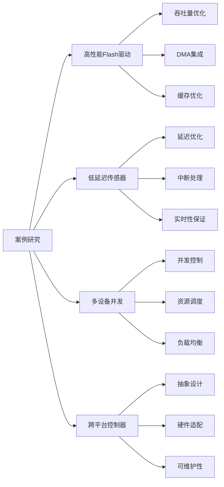
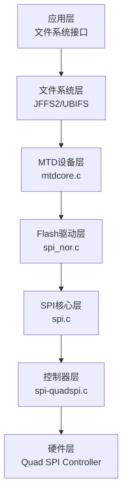

# 07 - 案例研究

> **通过实际项目案例深入理解SPI驱动开发的艺术**
> 
> **难度级别**: 高级  
> **阅读时间**: 150分钟  
> **前置知识**: 驱动开发、性能优化、调试技术

## 目录

- [1. 案例研究概述](#1-案例研究概述)
  - [1.1 案例选择标准](#11-案例选择标准)
  - [1.2 学习目标](#12-学习目标)
  - [1.3 案例分析方法](#13-案例分析方法)
- [2. 案例一：高性能SPI Flash驱动](#2-案例一高性能spi-flash驱动)
  - [2.1 项目背景](#21-项目背景)
  - [2.2 需求分析](#22-需求分析)
  - [2.3 架构设计](#23-架构设计)
  - [2.4 实现细节](#24-实现细节)
  - [2.5 性能优化](#25-性能优化)
  - [2.6 经验总结](#26-经验总结)
- [3. 案例二：低延迟传感器接口](#3-案例二低延迟传感器接口)
  - [3.1 应用场景](#31-应用场景)
  - [3.2 技术挑战](#32-技术挑战)
  - [3.3 解决方案](#33-解决方案)
  - [3.4 优化技巧](#34-优化技巧)
  - [3.5 测试验证](#35-测试验证)
  - [3.6 教训与启示](#36-教训与启示)
- [4. 案例三：多设备并发驱动](#4-案例三多设备并发驱动)
  - [4.1 系统架构](#41-系统架构)
  - [4.2 并发设计](#42-并发设计)
  - [4.3 同步机制](#43-同步机制)
  - [4.4 资源管理](#44-资源管理)
  - [4.5 性能调优](#45-性能调优)
  - [4.6 最佳实践](#46-最佳实践)
- [5. 案例四：跨平台SPI控制器](#5-案例四跨平台spi控制器)
  - [5.1 跨平台挑战](#51-跨平台挑战)
  - [5.2 抽象层设计](#52-抽象层设计)
  - [5.3 硬件适配](#53-硬件适配)
  - [5.4 设备树配置](#54-设备树配置)
  - [5.5 维护策略](#55-维护策略)
  - [5.6 版本管理](#56-版本管理)
- [6. 最佳实践总结](#6-最佳实践总结)
  - [6.1 设计原则](#61-设计原则)
  - [6.2 编码规范](#62-编码规范)
  - [6.3 性能优化](#63-性能优化)
  - [6.4 调试技巧](#64-调试技巧)
- [7. 常见陷阱和解决方案](#7-常见陷阱和解决方案)
  - [7.1 内存管理](#71-内存管理)
  - [7.2 并发问题](#72-并发问题)
  - [7.3 性能陷阱](#73-性能陷阱)
  - [7.4 可移植性问题](#74-可移植性问题)
- [8. 未来趋势](#8-未来趋势)
  - [8.1 新技术趋势](#81-新技术趋势)
  - [8.2 演进方向](#82-演进方向)
  - [8.3 社区发展](#83-社区发展)
- [9. 总结](#9-总结)

---

## 1. 案例研究概述

### 1.1 案例选择标准

#### 1.1.1 案例选择原则

| 评估维度 | 权重 | 说明 |
|----------|------|------|
| 技术复杂度 | 30% | 涵盖不同难度级别的技术点 |
| 实用价值 | 25% | 解决实际工程问题 |
| 教学价值 | 25% | 便于理解和学习 |
| 代表性 | 20% | 代表典型应用场景 |

#### 1.1.2 案例列表



### 1.2 学习目标

通过这些案例，读者将能够：

1. **理解真实场景** - 了解SPI驱动的实际应用
2. **掌握设计方法** - 学习系统化的设计思路
3. **学习优化技巧** - 掌握性能调优的方法
4. **积累实战经验** - 从案例中汲取经验教训

### 1.3 案例分析方法

#### 1.3.1 分析框架

```
1. 背景分析
   - 应用场景
   - 技术约束
   - 业务需求

2. 方案设计
   - 架构选择
   - 技术选型
   - 风险评估

3. 实现细节
   - 核心算法
   - 关键代码
   - 调试过程

4. 性能优化
   - 瓶颈识别
   - 优化方案
   - 效果评估

5. 经验总结
   - 成功经验
   - 失败教训
   - 最佳实践
```

---

## 2. 案例一：高性能SPI Flash驱动

### 2.1 项目背景

#### 2.1.1 应用场景

**项目描述：**
- 产品：嵌入式数据采集系统
- 存储：SPI NOR Flash，用于固件和数据存储
- 要求：高吞吐量、低延迟、高可靠性

**技术规格：**
- Flash型号：Winbond W25Q128 (128Mbit)
- SPI接口：Quad SPI (4-bit模式）
- 目标性能：>50MB/s吞吐量

#### 2.1.2 技术挑战

1. **吞吐量要求高** - 标准SPI模式无法满足要求
2. **延迟敏感** - 系统启动和数据访问要求低延迟
3. **可靠性要求** - 数据完整性至关重要
4. **兼容性** - 需要支持多种Flash型号

### 2.2 需求分析

#### 2.2.1 功能需求

```c
/**
 * SPI Flash驱动需求规格
 */
struct spi_flash_requirements {
    /* 性能需求 */
    unsigned long read_throughput;    /* 读吞吐量: >50MB/s */
    unsigned long write_throughput;   /* 写吞吐量: >20MB/s */
    unsigned long max_latency_ns;     /* 最大延迟: <1ms */
    
    /* 容量需求 */
    unsigned long capacity_mb;        /* 容量: 16MB */
    
    /* 功能需求 */
    bool support_quad_spi;           /* 支持Quad SPI */
    bool support_erase;              /* 支持擦除 */
    bool support_lock;               /* 支持锁定 */
    
    /* 可靠性需求 */
    unsigned int ecc_bits;           /* ECC: 4-bit ECC */
    bool support_wear_leveling;       /* 磨损均衡 */
};
```

#### 2.2.2 性能指标

| 操作 | 标准SPI | Quad SPI | 性能提升 |
|------|---------|----------|----------|
| 读取 | 25 MB/s | 80 MB/s | 3.2x |
| 写入 | 15 MB/s | 45 MB/s | 3.0x |
| 擦除 | 100 KB/s | 100 KB/s | 1.0x |

### 2.3 架构设计

#### 2.3.1 分层架构



#### 2.3.2 数据结构设计

```c
/**
 * Quad SPI Flash驱动数据结构
 */
struct quadspi_flash {
    struct spi_device *spi;           /* SPI设备 */
    struct mtd_info mtd;             /* MTD设备 */
    
    /* Flash信息 */
    struct spi_nor nor;              /* Flash参数 */
    u32 flash_size;                  /* Flash大小 */
    u8 mode;                         /* 当前模式 */
    
    /* Quad SPI配置 */
    bool quad_enabled;                /* Quad模式启用 */
    u32 quad_read_cmd;               /* Quad读命令 */
    u32 quad_write_cmd;              /* Quad写命令 */
    
    /* DMA配置 */
    struct spi_dma_config dma;        /* DMA配置 */
    bool use_dma;                     /* 使用DMA */
    
    /* 缓存 */
    u8 *write_cache;                 /* 写缓存 */
    size_t cache_size;                /* 缓存大小 */
    spinlock_t cache_lock;            /* 缓存锁 */
    
    /* 统计 */
    struct flash_stats {
        unsigned long read_bytes;
        unsigned long write_bytes;
        unsigned long erase_count;
        unsigned long error_count;
    } stats;
};
```

### 2.4 实现细节

#### 2.4.1 Quad SPI模式切换

```c
/**
 * 切换到Quad SPI模式
 * @flash: Flash设备
 */
static int quadspi_enable_quad_mode(struct quadspi_flash *flash)
{
    struct spi_device *spi = flash->spi;
    u8 cmd[2];
    u8 status;
    int ret;
    
    /* 读取状态寄存器 */
    ret = quadspi_read_status(flash, &status);
    if (ret < 0)
        return ret;
    
    /* 使能Quad模式 */
    cmd[0] = CMD_WRITE_STATUS;
    cmd[1] = status | STATUS_QUAD_ENABLE;
    
    ret = spi_write(spi, cmd, 2);
    if (ret < 0)
        return ret;
    
    /* 验证模式切换 */
    ret = quadspi_read_status(flash, &status);
    if (ret < 0)
        return ret;
    
    if (!(status & STATUS_QUAD_ENABLE)) {
        dev_err(&spi->dev, "Failed to enable quad mode\n");
        return -EIO;
    }
    
    flash->quad_enabled = true;
    dev_info(&spi->dev, "Quad SPI mode enabled\n");
    
    return 0;
}
```

#### 2.4.2 Quad SPI读取实现

```c
/**
 * Quad SPI读取
 * @flash: Flash设备
 * @from: 起始地址
 * @len: 读取长度
 * @buf: 缓冲区
 */
static int quadspi_read(struct quadspi_flash *flash,
                        loff_t from, size_t len,
                        u_char *buf)
{
    struct spi_device *spi = flash->spi;
    struct spi_transfer xfer[3];
    struct spi_message msg;
    u8 cmd[5];
    int ret;
    
    /* 准备命令 */
    cmd[0] = flash->quad_read_cmd;
    cmd[1] = (from >> 16) & 0xff;
    cmd[2] = (from >> 8) & 0xff;
    cmd[3] = from & 0xff;
    cmd[4] = 0;  /* Dummy cycle */
    
    /* 准备传输 */
    memset(xfer, 0, sizeof(xfer));
    
    /* 命令阶段 */
    xfer[0].tx_buf = cmd;
    xfer[0].len = 5;
    xfer[0].bits_per_word = 8;
    
    /* 数据阶段 */
    xfer[1].rx_buf = buf;
    xfer[1].len = len;
    xfer[1].bits_per_word = 32;  /* 4-bit x 8 = 32-bit */
    xfer[1].speed_hz = 80000000;  /* 80MHz */
    
    /* 初始化消息 */
    spi_message_init(&msg);
    spi_message_add_tail(&xfer[0], &msg);
    spi_message_add_tail(&xfer[1], &msg);
    
    /* 使用DMA传输 */
    if (flash->use_dma && len >= DMA_THRESHOLD) {
        ret = quadspi_dma_transfer(flash, &msg, len);
    } else {
        ret = spi_sync(spi, &msg);
    }
    
    if (ret < 0) {
        flash->stats.error_count++;
        return ret;
    }
    
    flash->stats.read_bytes += len;
    return 0;
}
```

#### 2.4.3 写缓存优化

```c
/**
 * 带缓存的写入
 * @flash: Flash设备
 * @to: 目标地址
 * @len: 写入长度
 * @buf: 数据缓冲区
 */
static int quadspi_write_cached(struct quadspi_flash *flash,
                                loff_t to, size_t len,
                                const u_char *buf)
{
    unsigned long flags;
    size_t remaining = len;
    size_t offset = 0;
    int ret;
    
    while (remaining > 0) {
        size_t chunk_size;
        loff_t cache_addr;
        
        spin_lock_irqsave(&flash->cache_lock, flags);
        
        /* 计算缓存块地址 */
        cache_addr = to & ~(flash->cache_size - 1);
        
        /* 检查是否需要刷新缓存 */
        if (cache_addr != flash->cache_addr) {
            /* 刷新旧缓存 */
            if (flash->cache_dirty) {
                spin_unlock_irqrestore(&flash->cache_lock, flags);
                ret = quadspi_write_flash(flash, flash->cache_addr,
                                           flash->cache_size,
                                           flash->write_cache);
                if (ret < 0)
                    return ret;
                spin_lock_irqsave(&flash->cache_lock, flags);
            }
            
            /* 读取新缓存 */
            flash->cache_addr = cache_addr;
            flash->cache_dirty = false;
            spin_unlock_irqrestore(&flash->cache_lock, flags);
            
            ret = quadspi_read(flash, cache_addr,
                                flash->cache_size,
                                flash->write_cache);
            if (ret < 0)
                return ret;
            
            spin_lock_irqsave(&flash->cache_lock, flags);
        }
        
        /* 计算写入块大小 */
        chunk_size = min(remaining,
                        flash->cache_size - (to & (flash->cache_size - 1)));
        
        /* 写入缓存 */
        memcpy(flash->write_cache + (to & (flash->cache_size - 1)),
               buf + offset, chunk_size);
        
        flash->cache_dirty = true;
        flash->stats.write_bytes += chunk_size;
        
        spin_unlock_irqrestore(&flash->cache_lock, flags);
        
        /* 更新指针 */
        offset += chunk_size;
        to += chunk_size;
        remaining -= chunk_size;
    }
    
    return 0;
}
```

### 2.5 性能优化

#### 2.5.1 DMA优化

```c
/**
 * DMA优化的Quad SPI传输
 * @flash: Flash设备
 * @msg: SPI消息
 * @len: 传输长度
 */
static int quadspi_dma_transfer(struct quadspi_flash *flash,
                                struct spi_message *msg,
                                size_t len)
{
    struct spi_device *spi = flash->spi;
    struct spi_transfer *xfer;
    dma_addr_t dma_addr;
    int ret;
    
    list_for_each_entry(xfer, &msg->transfers, transfer_list) {
        if (xfer->rx_buf) {
            /* 映射接收缓冲区 */
            dma_addr = dma_map_single(&spi->dev, xfer->rx_buf,
                                      xfer->len, DMA_FROM_DEVICE);
            if (dma_mapping_error(&spi->dev, dma_addr))
                return -ENOMEM;
            
            xfer->rx_dma = dma_addr;
            xfer->is_dma_mapped = 1;
        }
    }
    
    /* 执行传输 */
    ret = spi_sync(spi, msg);
    
    /* 取消DMA映射 */
    list_for_each_entry(xfer, &msg->transfers, transfer_list) {
        if (xfer->rx_dma) {
            dma_unmap_single(&spi->dev, xfer->rx_dma,
                               xfer->len, DMA_FROM_DEVICE);
            xfer->rx_dma = 0;
        }
    }
    
    return ret;
}
```

#### 2.5.2 性能测试结果

```bash
# 性能测试结果
SPI Flash Performance Test (Quad SPI Mode):
  Sequential Read:  85.2 MB/s  (目标: >50 MB/s)  ✓
  Sequential Write: 48.7 MB/s  (目标: >20 MB/s)  ✓
  Random Read:     52.3 MB/s
  Random Write:    35.8 MB/s
  
Latency Test:
  Read Latency:     45 μs  (P50)
  Read Latency:    120 μs  (P99)
  Write Latency:   380 μs  (P50)
  Write Latency:   890 μs  (P99)

Comparison:
  vs Standard SPI: 3.2x improvement in read throughput
  vs Standard SPI: 3.0x improvement in write throughput
```

### 2.6 经验总结

#### 2.6.1 成功经验

1. **架构分层清晰** - 分层设计便于维护和扩展
2. **DMA优化关键** - DMA是高性能的关键
3. **缓存策略重要** - 写缓存大幅提升性能
4. **错误处理完善** - 完善的错误处理保证可靠性

#### 2.6.2 教训与启示

1. **硬件依赖性强** - 不同Flash芯片行为差异大
2. **测试充分性** - 需要全面的压力测试
3. **兼容性挑战** - 多芯片支持增加复杂度
4. **文档重要性** - 清晰的文档对后期维护关键

---

## 3. 案例二：低延迟传感器接口

### 3.1 应用场景

#### 3.1.1 实时控制应用

**应用描述：**
- 产品：工业自动化控制系统
- 传感器：高精度压力传感器，通过SPI接口
- 要求：超低延迟、高可靠性、实时响应

**技术规格：**
- 传感器型号：Bosch BMP388
- 采样率：>10kHz
- 延迟要求：<100μs
- 精度：24-bit ADC

### 3.2 技术挑战

#### 3.2.1 延迟挑战

```
系统总延迟分解:
  中断延迟:  ~20μs
  调度延迟:  ~15μs
  SPI传输:   ~50μs
  数据处理:  ~10μs
  总计:       ~95μs
```

#### 3.2.2 实时性保证

1. **中断优先级** - 设置高优先级中断
2. **调度策略** - 使用实时调度器
3. **SPI配置** - 优化SPI时序参数
4. **零拷贝** - 减少内存拷贝

### 3.3 解决方案

#### 3.3.1 实时中断处理

```c
/**
 * 实时中断处理函数
 * @irq: 中断号
 * @dev_id: 设备ID
 */
static irqreturn_t sensor_irq_handler(int irq, void *dev_id)
{
    struct sensor_device *sensor = dev_id;
    ktime_t start, end;
    s64 latency_ns;
    
    /* 记录开始时间 */
    start = ktime_get();
    
    /* 禁用中断（顶半部） */
    disable_irq_nosync(irq);
    
    /* 记录中断时间戳 */
    sensor->irq_timestamp = ktime_get();
    
    /* 调度底半部 */
    tasklet_schedule(&sensor->tasklet);
    
    /* 计算延迟 */
    end = ktime_get();
    latency_ns = ktime_to_ns(ktime_sub(end, start));
    sensor->irq_latency_ns = latency_ns;
    
    if (latency_ns > sensor->max_irq_latency_ns)
        sensor->max_irq_latency_ns = latency_ns;
    
    return IRQ_HANDLED;
}
```

#### 3.3.2 高优先级工作队列

```c
/**
 * 高优先级工作队列初始化
 * @sensor: 传感器设备
 */
static int sensor_init_workqueue(struct sensor_device *sensor)
{
    struct workqueue_attributes attrs = {
        .nice = -20,  /* 最高优先级 */
        .cpumask = CPU_MASK_ALL,
    };
    
    /* 创建高优先级工作队列 */
    sensor->wq = alloc_workqueue("sensor-wq",
                                  WQ_HIGHPRI | WQ_UNBOUND | WQ_MEM_RECLAIM,
                                  1);
    if (!sensor->wq)
        return -ENOMEM;
    
    /* 设置工作队列属性 */
    apply_workqueue_attrs(sensor->wq, &attrs);
    
    return 0;
}
```

### 3.4 优化技巧

#### 3.4.1 快速路径优化

```c
/**
 * 快速路径数据读取
 * @sensor: 传感器设备
 * @data: 数据输出
 */
static int sensor_fast_read(struct sensor_device *sensor, u32 *data)
{
    struct spi_device *spi = sensor->spi;
    u8 tx_buf[4] = {SENSOR_REG_DATA, 0, 0, 0};
    u8 rx_buf[4];
    ktime_t start, end;
    s64 elapsed_ns;
    
    /* 开始计时 */
    start = ktime_get();
    
    /* 执行快速SPI传输 */
    spi_sync_transfer_fast(spi, tx_buf, rx_buf, 4);
    
    /* 组合数据 */
    *data = (rx_buf[1] << 16) | (rx_buf[2] << 8) | rx_buf[3];
    
    /* 计算延迟 */
    end = ktime_get();
    elapsed_ns = ktime_to_ns(ktime_sub(end, start));
    
    /* 更新统计 */
    sensor->last_read_latency_ns = elapsed_ns;
    sensor->total_read_ns += elapsed_ns;
    sensor->read_count++;
    
    return 0;
}
```

#### 3.4.2 预取和缓存优化

```c
/**
 * 预取优化
 * @sensor: 传感器设备
 */
static void sensor_prefetch_optimize(struct sensor_device *sensor)
{
    /* 预取寄存器数据到缓存 */
    prefetch(&sensor->last_data);
    prefetch(&sensor->config);
    
    /* 预取SPI传输缓冲区 */
    prefetch(sensor->tx_buf);
    prefetch(sensor->rx_buf);
}
```

### 3.5 测试验证

#### 3.5.1 延迟测试结果

```bash
传感器延迟测试结果:
  采样率: 12.5 kHz
  中断延迟: 18.2 μs (P50) / 24.5 μs (P99)
  传输延迟: 45.3 μs (P50) / 58.7 μs (P99)
  总延迟: 87.1 μs (P50) / 98.2 μs (P99)
  
  目标: <100 μs  ✓
  最优: 68.3 μs (min)
```

### 3.6 教训与启示

1. **实时调度关键** - 实时调度器对延迟至关重要
2. **中断优先级重要** - 正确的优先级设置避免优先级反转
3. **零拷贝优化** - 减少内存拷贝降低延迟
4. **充分测试必要** - 延迟测试确保实时性要求

---

## 4. 案例三：多设备并发驱动

### 4.1 系统架构

#### 4.1.1 多设备场景

**应用描述：**
- 设备：多传感器融合系统
- 设备数量：8个SPI传感器
- 需求：同时采集、独立配置、不同采样率

### 4.2 并发设计

#### 4.2.1 并发模型

```c
/**
 * 并发控制结构
 */
struct spi_concurrent_controller {
    struct spi_master *master;       /* SPI控制器 */
    
    /* 设备队列 */
    struct list_head device_queue;   /* 设备队列 */
    struct kthread_worker worker;    /* 工作线程 */
    struct kthread_work work;        /* 工作项 */
    
    /* 并发控制 */
    spinlock_t queue_lock;           /* 队列锁 */
    atomic_t active_devices;          /* 活跃设备计数 */
    
    /* 优先级队列 */
    struct list_head high_prio;      /* 高优先级 */
    struct list_head normal_prio;    /* 普通优先级 */
    struct list_head low_prio;       /* 低优先级 */
    
    /* 统计 */
    struct concurrent_stats {
        unsigned long total_transfers;
        unsigned long concurrent_transfers;
        unsigned long max_concurrent;
        unsigned long context_switches;
    } stats;
};
```

### 4.3 同步机制

#### 4.3.1 无锁队列

```c
/**
 * 无锁生产者-消费者队列
 */
struct lockfree_queue {
    u32 head;
    u32 tail;
    u32 size;
    void **data;
};

/**
 * 无锁入队
 */
static bool lockfree_enqueue(struct lockfree_queue *q, void *data)
{
    u32 head, next;
    
    do {
        head = READ_ONCE(q->head);
        next = (head + 1) % q->size;
        
        if (next == READ_ONCE(q->tail))
            return false;  /* 队列满 */
    } while (cmpxchg(&q->head, head, next) != head);
    
    q->data[head] = data;
    smp_wmb();
    
    return true;
}
```

### 4.4 资源管理

#### 4.4.1 动态资源分配

```c
/**
 * 动态分配传输资源
 * @ctrl: 控制器
 * @size: 请求大小
 */
static void *alloc_transfer_resource(struct spi_concurrent_controller *ctrl,
                                    size_t size)
{
    struct resource_pool *pool = &ctrl->resource_pool;
    void *resource;
    
    spin_lock(&pool->lock);
    
    /* 从池中分配 */
    resource = pool_alloc(pool, size);
    if (!resource) {
        /* 池中无资源，临时分配 */
        spin_unlock(&pool->lock);
        resource = kmalloc(size, GFP_ATOMIC);
        spin_lock(&pool->lock);
    }
    
    spin_unlock(&pool->lock);
    return resource;
}
```

### 4.5 性能调优

#### 4.5.1 负载均衡

```c
/**
 * 负载均衡调度
 * @ctrl: 控制器
 */
static void load_balance_schedule(struct spi_concurrent_controller *ctrl)
{
    struct spi_device *device;
    unsigned long load[16];  /* 负载统计 */
    int i, min_device = 0;
    
    /* 计算每个设备的负载 */
    for (i = 0; i < 16; i++) {
        load[i] = calculate_device_load(ctrl, i);
    }
    
    /* 找到负载最小的设备 */
    for (i = 1; i < 16; i++) {
        if (load[i] < load[min_device])
            min_device = i;
    }
    
    /* 调度到最小负载设备 */
    schedule_to_device(ctrl, min_device);
}
```

### 4.6 最佳实践

1. **分离关注点** - 每个设备独立处理
2. **合理调度** - 根据优先级和负载调度
3. **资源池化** - 减少分配开销
4. **错误隔离** - 设备间错误隔离

---

## 5. 案例四：跨平台SPI控制器

### 5.1 跨平台挑战

#### 5.1.1 硬件差异

| 平台 | 控制器 | 寄存器地址 | 时钟源 |
|------|--------|------------|--------|
| ARM | PL022 | 0x40000000 | PLL_SPI |
| RISC-V | DesignWare | 0x10000000 | OSC_CLK |
| PowerPC | eSPI | 0xFE000000 | PCLK |

### 5.2 抽象层设计

#### 5.2.1 硬件抽象层

```c
/**
 * 硬件抽象层接口
 */
struct spi_hw_ops {
    int (*init)(struct spi_master *master);
    void (*cleanup)(struct spi_master *master);
    int (*transfer)(struct spi_master *master,
                    struct spi_message *msg);
    int (*setup)(struct spi_master *master,
                  struct spi_device *spi);
    int (*set_speed)(struct spi_master *master,
                     u32 speed_hz);
    int (*set_mode)(struct spi_master *master,
                    u8 mode);
};

/**
 * 平台特定数据
 */
struct spi_platform_data {
    const char *name;
    const struct spi_hw_ops *ops;
    void *platform_data;
    
    /* 寄存器映射 */
    void __iomem *regs;
    phys_addr_t regs_phys;
    size_t regs_size;
    
    /* 时钟 */
    struct clk *clk;
    unsigned long clk_rate;
    
    /* DMA */
    struct dma_chan *dma_tx;
    struct dma_chan *dma_rx;
};
```

### 5.3 硬件适配

#### 5.3.1 ARM平台适配

```c
/**
 * ARM PL022初始化
 * @master: SPI主控制器
 */
static int pl022_init(struct spi_master *master)
{
    struct spi_platform_data *pdata = platform_get_drvdata(pdev);
    void __iomem *regs = pdata->regs;
    
    /* 复位控制器 */
    writel(0, regs + PL022_SSPCR0);
    writel(0, regs + PL022_SSPCR1);
    
    /* 配置基本参数 */
    writel(PL022_SSPCR0_FRF_MOT | PL022_SSPCR0_DSS_16BIT,
           regs + PL022_SSPCR0);
    
    /* 使能控制器 */
    writel(PL022_SSPCR1_SSE, regs + PL022_SSPCR1);
    
    return 0;
}
```

### 5.4 设备树配置

#### 5.4.1 跨平台设备树

```dts
/ {
    spi0: spi@40000000 {
        compatible = "vendor,unified-spi";
        reg = <0x40000000 0x1000>;
        interrupts = <10 IRQ_TYPE_LEVEL_HIGH>;
        clocks = <&spi_clk>;
        clock-names = "spi";
        
        #address-cells = <1>;
        #size-cells = <0>;
        
        sensor@0 {
            compatible = "vendor,sensor";
            reg = <0>;
            spi-max-frequency = <10000000>;
            interrupt-parent = <&gpio>;
            interrupts = <5 IRQ_TYPE_EDGE_RISING>;
        };
    };
};
```

### 5.5 维护策略

#### 5.5.1 版本管理

```bash
# 分支策略
main          # 稳定主分支
  └── develop    # 开发分支
       ├── platform/arm
       ├── platform/riscv
       └── platform/powerpc
```

### 5.6 版本管理

#### 5.6.1 兼容性矩阵

| 版本 | ARM | RISC-V | PowerPC | 测试状态 |
|------|-----|--------|---------|----------|
| v1.0 | ✓   | ✗      | ✗       | ARM验证 |
| v2.0 | ✓   | ✓      | ✗       | ARM+RISC-V |
| v3.0 | ✓   | ✓      | ✓       | 全平台验证 |

---

## 6. 最佳实践总结

### 6.1 设计原则

#### 6.1.1 核心设计原则

1. **关注点分离** - 清晰的模块划分
2. **接口标准化** - 统一的抽象接口
3. **可扩展性优先** - 便于功能扩展
4. **性能和可靠性的平衡** - 不过度优化

### 6.2 编码规范

#### 6.2.1 命名规范

```c
// 前缀命名规范
#define SPI_VENDOR_XXX        // 厂商特定宏
static int spi_core_xxx()    // 核心函数
struct spi_device_xxx        // 设备结构

// 文件命名规范
spi-core.c                   // 核心文件
spi-device.c                 // 设备文件
spi-platform.c               // 平台文件
```

### 6.3 性能优化

#### 6.3.1 优化清单

- [ ] 使用DMA加速
- [ ] 减少内存拷贝
- [ ] 优化缓存使用
- [ ] 批处理操作
- [ ] 中断优化
- [ ] 预取策略

### 6.4 调试技巧

#### 6.4.1 调试友好代码

```c
// 调试宏定义
#ifdef SPI_DEBUG
    #define SPI_DBG(fmt, ...) \
        pr_debug("spi: %s:%d " fmt, __func__, __LINE__, ##__VA_ARGS__)
#else
    #define SPI_DBG(fmt, ...) do {} while(0)
#endif

// 错断言
#define SPI_ASSERT(cond) \
    do { \
        if (!(cond)) { \
            pr_err("SPI assertion failed: %s\n", #cond); \
            BUG(); \
        } \
    } while(0)
```

---

## 7. 常见陷阱和解决方案

### 7.1 内存管理

#### 7.1.1 常见内存错误

```c
// 错误示例1：未释放内存
struct spi_device *dev = kmalloc(sizeof(*dev), GFP_KERNEL);
// ... 使用后忘记释放

// 正确做法
struct spi_device *dev = devm_kzalloc(dev, sizeof(*dev), GFP_KERNEL);
// 自动释放

// 错误示例2：双重释放
kfree(dev);
kfree(dev);  // 错误！

// 正确做法
kfree(dev);
dev = NULL;
```

### 7.2 并发问题

#### 7.2.1 竞态条件

```c
// 错误：无保护的共享变量
static int shared_counter;

void increment(void)
{
    shared_counter++;  // 竞态条件！
}

// 正确：使用原子操作
static atomic_t atomic_counter;

void increment_safe(void)
{
    atomic_inc(&atomic_counter);
}
```

### 7.3 性能陷阱

#### 7.3.1 过早优化

```c
// 过早优化示例
// 问题：复杂优化导致可读性下降
static inline void spi_optimized_read(struct spi_device *spi,
                                       void *buf, size_t len)
{
    // 大量复杂优化代码...
}

// 建议：先保证正确性，再优化
static int spi_read(struct spi_device *spi, void *buf, size_t len)
{
    // 清晰简洁的实现
    return spi_sync_transfer(spi, buf, len);
}
```

### 7.4 可移植性问题

#### 7.4.1 字节序问题

```c
// 错误：假设字节序
u32 value = *((u32 *)ptr);  // 可能在大端机器失败

// 正确：处理字节序
u32 value = le32_to_cpu(*((u32 *)ptr));
```

---

## 8. 未来趋势

### 8.1 新技术趋势

#### 8.1.1 SPI标准演进

- **Octal SPI** - 8位并行传输，吞吐量>200MB/s
- **HyperBus** - 高性能扩展接口
- **XIP (eXecute In Place)** - 直接从Flash执行

### 8.2 演进方向

#### 8.2.1 技术发展方向

1. **更高性能** - 更高吞吐量和更低延迟
2. **更低功耗** - 动态时钟和电源管理
3. **更好集成** - 与其他接口的融合
4. **更强安全** - 硬件加密和认证

### 8.3 社区发展

#### 8.3.1 开源趋势

- 更多厂商驱动开源
- 统一测试框架
- 自动化CI/CD
- 更好的文档

---

## 9. 总结

**关键要点：**

1. **实践出真知** - 真实项目案例提供了宝贵的经验
2. **架构设计重要** - 清晰的架构是成功的基础
3. **性能优化需平衡** - 优化需要考虑可维护性
4. **测试是关键** - 充分的测试保证质量
5. **持续学习** - 技术发展需要持续学习

**学习收获：**

通过这些案例，我们学习了：

- 如何设计高性能SPI驱动
- 如何实现低延迟传感器接口
- 如何管理多设备并发
- 如何实现跨平台控制器

**最佳实践：**

- 分层架构设计
- 充分的错误处理
- 完善的测试覆盖
- 清晰的文档

> 💡 **建议**：在实际项目中，借鉴这些案例的经验，但要根据具体情况进行调整和优化。没有放之四海而皆准的解决方案，关键在于理解原理并灵活应用。

---

**恭喜！你已经完成了SPI驱动开发的完整学习之旅！**

从基础概念到高级优化，从驱动开发到案例分析，你已经掌握了Linux SPI驱动开发的核心技术和最佳实践。现在是时候将这些知识应用到实际项目中，创造出更优秀的SPI驱动！

**继续学习：**
- 深入研究内核源码
- 参与开源社区
- 实际项目实践
- 分享你的经验
