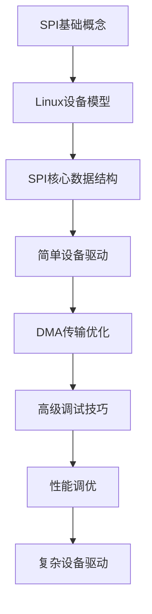

# Linux SPI子系统技术文档

> 由浅入深分析Linux SPI子系统，为嵌入式Linux驱动工程师提供完整的技术指南
> 作者：大菜狗 - 嵌入Linux驱动专家

## 📖 文档导航

### 基础篇
- [00 - SPI基础介绍](./00-introduction.md) - SPI协议基础、Linux SPI框架概述 | 入门级
- [01 - 架构概览](./01-architecture-overview.md) - SPI框架分层架构、组件关系 | 基础级
- [02 - 核心概念](./02-core-concepts.md) - SPI传输模式、设备模型、驱动模型 | 进阶级
- [03 - 数据结构](./03-data-structures.md) - 核心数据结构解析、内存布局 | 高级

### 实践篇
- [04 - 驱动开发](./04-driver-development.md) - 设备驱动、控制器开发实践 | 进阶级
- [05 - 性能优化](./05-performance-optimization.md) - DMA优化、缓存优化、并发控制 | 高级
- [06 - 调试与测试](./06-debugging-and-testing.md) - 调试工具、测试方法、问题分析 | 进阶级
- [07 - 案例研究](./07-case-studies.md) - 实际项目案例分析、最佳实践 | 高级

### 代码示例
每个文档都包含对应的可编译代码示例，位于 `../examples/` 目录：
- `examples/00-basic/` - 基础通信示例
- `examples/01-architecture/` - 架构演示代码
- `examples/02-core/` - 核心概念实现
- `examples/03-data/` - 数据结构操作
- `examples/04-driver/` - 完整驱动示例
- `examples/05-performance/` - 性能优化演示
- `examples/06-debug/` - 调试工具实现

---

## 🎯 快速开始

### 谁应该阅读本文档？

| 读者类型 | 推荐阅读章节 |
|---------|-------------|
| **初学者** | 第一部分 + 第二部分基础章节 |
| **驱动开发者** | 第二部分 + 第三部分 + 相关实战案例 |
| **内核黑客** | 第二部分 + 第四部分高级主题 |
| **架构师** | 第一部分 + 第四部分 + 性能调优 |

### 前置知识要求

- **C语言编程** - 中级水平
- **Linux内核基础** - 了解设备模型
- **硬件知识** - SPI协议基础
- **开发环境** - 内核源码 + 交叉编译工具链

### 学习路径建议



### 快速开始

#### 编译示例代码

```bash
# 编译所有示例代码
cd ../examples
make all

# 编译特定示例
make -C 00-basic
make -C 04-driver

# 清理编译文件
make clean
```

#### 环境要求

- Linux 5.x 内核开发环境
- GCC 7.0+
- Make 4.0+
- Python 3.6+ (用于部分脚本)

### 内核源码获取
```bash
# 获取最新稳定版内核
git clone https://git.kernel.org/pub/scm/linux/kernel/git/stable/linux.git
cd linux
git checkout v5.15

# 获取你的SoC厂商内核
git clone <vendor-kernel-repo>
```

### 开发工具准备
```bash
# 必备工具
sudo apt-get install \
    build-essential \
    libncurses-dev \
    bison flex \
    libssl-dev \
    libelf-dev \
    bc

# 调试工具
sudo apt-get install \
    gdb-multiarch \
    openocd \
    logic-analyzer \
    spi-tools
```

### 交叉编译配置
```bash
export ARCH=arm64
export CROSS_COMPILE=aarch64-linux-gnu-
export KDIR=/path/to/kernel/source
```

---

## 📞 技术支持

- **内核文档**: `Documentation/spi/`
- **邮件列表**: linux-spi@vger.kernel.org
- **IRC频道**: #spi on irc.libera.chat
- **Bug追踪**: https://bugzilla.kernel.org

---

*本文档遵循GPL-2.0许可证发布，欢迎贡献和反馈！*