# 工单管理系统 - 架构文档

> 版本：v0.1.11 | 更新日期：2026-09-22
>
> 架构文档由 oh-my-mermaid 生成，详细架构图见 `.omm/` 目录，运行 `omm view` 可交互浏览。

## 目录

1. [系统概述](#1-系统概述)
2. [整体架构](#2-整体架构)
3. [技术栈](#3-技术栈)
4. [目录结构](#4-目录结构)
5. [数据模型设计](#5-数据模型设计)
6. [API 接口设计](#6-api-接口设计)
7. [Web 前端架构](#7-web-前端架构)
8. [小程序端架构](#8-小程序端架构)
9. [后端架构](#9-后端架构)
10. [核心业务流程](#10-核心业务流程)
11. [认证与授权](#11-认证与授权)
12. [消息通知系统](#12-消息通知系统)
13. [部署架构](#13-部署架构)

---

## 1. 系统概述

基于 **微信小程序 + Web 端 + Node.js + MongoDB** 的工单管理系统，支持多角色协作处理工单，实现工单创建、分配、跟踪、进度记录和导出等功能。

### 1.1 核心功能

- **工单管理**：创建、编辑、状态流转、批量导出、根因追踪、SLA 超时通知
- **项目管理**：项目创建、成员管理
- **用户管理**：用户 CRUD、角色分配
- **消息通知**：实时消息推送、未读提醒、SLA 超时告警
- **进度日志**：工单处理过程记录、URL 可点击
- **文件上传**：单文件/批量上传、删除
- **费用管理**：工单内嵌费用子文档（维修费+配件费）、报销状态追踪
- **验收确认**：申请人/处理人验收，满意度评分（1-5 星）
- **打卡签到**：GPS 定位打卡，首次响应时间记录
- **统计报表**：按校区/项目分组统计、时间范围筛选
- **系统看板**：数据统计与可视化

### 1.2 用户角色

| 角色 | 说明 | 权限 |
|------|------|------|
| admin | 系统管理员 | 全部权限 |
| manager | 项目经理 | 管理项目、查看所有工单 |
| handler | 处理人员 | 处理工单、添加进度日志 |
| customer | 甲方客户 | 创建工单、查看自己的工单 |

### 1.3 多端功能对照

| 功能 | 小程序 | Web端 | 说明 |
|------|--------|-------|------|
| 登录 | ✅ | ✅ | 已完成 |
| 注册 | ✅ | ✅ | 已完成 |
| 我的工单 | ✅ | ✅ | 核心功能 |
| 创建工单 | ✅ | ✅ | 核心功能 |
| 工单详情 | ✅ | ✅ | 核心功能 |
| 消息中心 | ✅ | ✅ | 核心功能 |
| 个人信息 | ✅ | ✅ | 基础功能 |
| 修改密码 | ✅ | ✅ | 基础功能 |
| 管理后台 | ✅ | ✅ | 管理功能 |
| 用户管理 | ✅ | ✅ | 管理功能 |
| 项目管理 | ✅ | ✅ | 管理功能 |
| 工单管理 | ✅ | ✅ | 管理功能 |
| 操作日志 | ✅ | ✅ | 扩展功能 |
| 系统设置 | ✅ | ✅ | 扩展功能 |
| 系统看板 | ✅ | ✅ | 扩展功能 |
| 文件上传 | ✅ | ✅ | 后端已实现 |

---

## 2. 整体架构

### 2.1 架构图

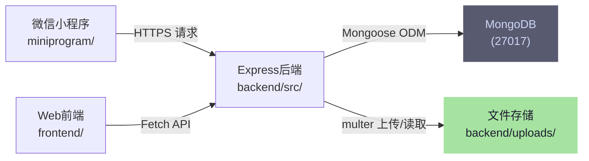

### 2.2 数据流架构

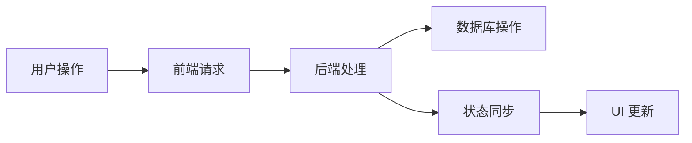

### 2.3 典型请求流程

以创建工单为例，展示从客户端到数据库的完整链路：

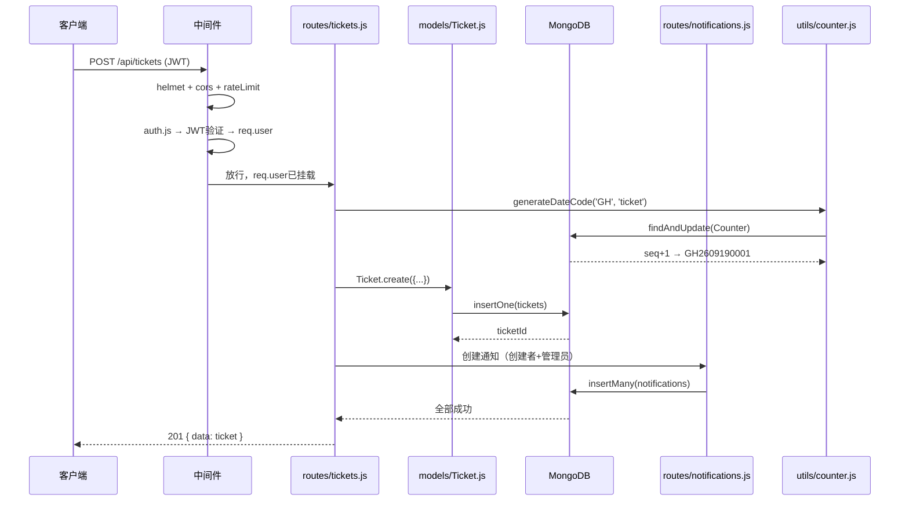

---

## 3. 技术栈

### 3.1 小程序端

| 技术 | 用途 |
|------|------|
| 微信小程序原生框架 | 客户端框架 |
| WXML | 模板语言 |
| WXSS | 样式语言 |
| JavaScript ES6+ | 逻辑处理 |
| wx.request | HTTP 请求 |
| wx.setStorageSync | 本地存储 |

### 3.2 Web 端

| 技术 | 用途 |
|------|------|
| HTML5 | 页面结构 |
| CSS3 | 样式（变量、动画、clip-path、渐变） |
| JavaScript ES6+ | 逻辑处理 |
| Fetch API | HTTP 请求 |
| localStorage | 本地存储 |
| Canvas API | 图形验证码 |
| Rajdhani / Orbitron | 科技感字体 |

### 3.3 后端

| 技术 | 版本 | 用途 |
|------|------|------|
| Node.js | 18+ | 运行时环境 |
| Express.js | 5.x | Web 框架 |
| Mongoose | 9.x | MongoDB ODM |
| MongoDB | 8.0 | 数据库 |
| bcryptjs | 3.x | 密码加密 |
| jsonwebtoken | 9.x | JWT 认证 |
| ExcelJS | 4.x | Excel 导出 |
| Multer | 2.x | 文件上传 |

---

## 4. 目录结构

```
gongdanrizhi/
├── backend/                          # 后端服务
│   ├── src/
│   │   ├── app.js                    # 应用入口（含版本号）
│   │   ├── models/                   # 数据模型
│   │   │   ├── User.js              # 用户模型
│   │   │   ├── Ticket.js            # 工单模型
│   │   │   ├── Project.js           # 项目模型
│   │   │   ├── StatusLog.js         # 状态日志模型
│   │   │   ├── Notification.js      # 通知模型
│   │   │   ├── Counter.js           # 计数器模型
│   │   │   ├── CheckIn.js           # 打卡签到模型
│   │   │   └── UserHistory.js       # 用户历史模型
│   │   ├── routes/                   # 路由定义
│   │   │   ├── auth.js              # 认证路由
│   │   │   ├── users.js             # 用户路由
│   │   │   ├── tickets.js           # 工单路由
│   │   │   ├── projects.js          # 项目路由
│   │   │   ├── notifications.js     # 通知路由
│   │   │   ├── stats.js             # 统计路由
│   │   │   ├── logs.js              # 日志路由
│   │   │   └── upload.js            # 文件上传路由
│   │   ├── middleware/               # 中间件
│   │   │   └── auth.js              # JWT 认证中间件
│   │   ├── utils/                    # 工具函数
│   │   │   └── counter.js           # 编号生成工具
│   │   ├── scripts/                  # 后台脚本
│   │   │   ├── seed.js              # 数据初始化
│   │   │   ├── add-user.js          # 添加用户
│   │   │   ├── add-project.js       # 创建项目
│   │   │   ├── add-ticket.js        # 创建工单
│   │   │   ├── set-admin.js         # 设置管理员
│   │   │   ├── remove-admin.js      # 移除管理员
│   │   │   └── migrate-codes.js     # 编号迁移
│   │   └── uploads/                  # 上传文件目录
│   ├── .env                          # 环境配置
│   └── package.json                  # 依赖配置
│
├── frontend/                         # Web 前端
│   ├── index.html                    # 登录页
│   ├── register.html                 # 注册页
│   ├── home.html                     # 用户主页
│   ├── config.js                     # 全局配置（API地址、版本号）
│   ├── utils.js                      # 公共工具函数
│   ├── login.js                      # 登录逻辑
│   ├── register.js                   # 注册逻辑
│   ├── home.js                       # 主页逻辑
│   ├── assets/                       # 静态资源
│   │   ├── admin.css                 # 管理后台共享样式
│   │   ├── colors.css                # 10种配色CSS变量
│   │   ├── futuristic.css            # 未来科技风格
│   │   ├── theme-init.js             # 主题初始化（防闪烁）
│   │   └── theme-switcher.js         # 主题切换逻辑
│   └── pages/                        # 页面目录
│       ├── ticket/                   # 工单模块
│       │   ├── list.html             # 我的工单列表
│       │   ├── create.html           # 创建工单
│       │   └── detail.html           # 工单详情
│       ├── message/
│       │   └── center.html           # 消息中心
│       ├── profile/
│       │   └── index.html            # 个人中心
│       └── admin/                    # 管理后台
│           ├── home.html             # 管理后台主页
│           ├── dashboard.html        # 系统看板
│           ├── settings.html         # 系统设置
│           ├── logs.html             # 操作日志
│           ├── users/                # 用户管理
│           ├── projects/             # 项目管理
│           └── tickets/              # 工单管理（list/create/detail/stats）
│
├── miniprogram/                      # 微信小程序前端
│   ├── app.js                        # 小程序入口
│   ├── app.json                      # 全局配置
│   ├── app.wxss                      # 全局样式
│   ├── config.js                     # 服务器配置
│   └── pages/                        # 页面目录
│       ├── auth/                     # 认证页面
│       │   ├── login/               # 登录页
│       │   └── register/            # 注册页
│       ├── ticket/                   # 工单页面
│       │   ├── list/                # 我的工单列表
│       │   ├── create/              # 创建工单
│       │   └── detail/              # 工单详情
│       ├── message/
│       │   └── center/              # 消息中心
│       ├── profile/                  # 个人信息
│       └── admin/                    # 管理后台
│           ├── home/                # 管理后台主页
│           ├── tickets/             # 工单管理
│           ├── projects/            # 项目管理
│           ├── users/               # 用户管理
│           ├── settings/            # 系统设置
│           └── logs/                # 操作日志
│
└── docs/                             # 文档目录
    ├── ARCHITECTURE.md              # 架构文档
    ├── BACKEND-GUIDE.md             # 后端代码导读
    ├── DEPLOYMENT.md                # 部署文档（含 MongoDB 安装）
    ├── WEB-FRONTEND-DESIGN.md       # Web 前端设计文档
    ├── WEB-DEVELOPMENT-PLAN.md      # Web 端开发规划
    ├── ADMIN-DEVELOPMENT-PLAN.md    # 管理后台开发规划
    ├── API-TESTING.md               # API 测试指南
    ├── LOGIN-FLOW.md                # 登录流程文档
    ├── system-guide.md              # 系统功能说明
    ├── TODO-LIST.md                 # 待办清单
    └── CHANGELOG.md                 # 版本变更记录
```

---

## 5. 数据模型设计

### 5.1 ER 图

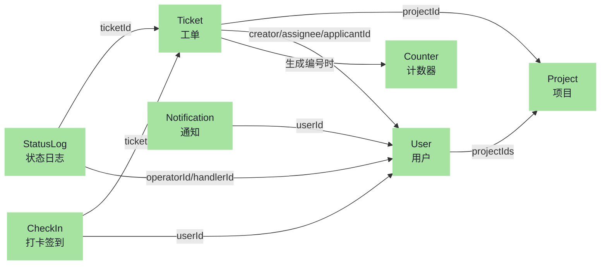

### 5.2 模型详细设计

#### User（用户）

```javascript
{
  _id: ObjectId,           // 用户ID
  name: String,            // 用户姓名
  phone: String,           // 手机号（唯一）
  password: String,        // 密码（bcrypt加密）
  role: String,            // 角色: admin/manager/handler/customer
  openId: String,          // 微信OpenID（可选）
  projectIds: [ObjectId],  // 参与的项目ID列表
  disabled: Boolean,       // 是否禁用
  createdAt: Date,         // 创建时间
  updatedAt: Date          // 更新时间
}
```

**中间件：**
- `pre('save')`：密码加密（bcryptjs）
- `methods.comparePassword`：密码比对

#### Ticket（工单）

```javascript
{
  _id: ObjectId,           // 工单ID
  code: String,            // 工单编号 (GH+YYMMDD+4位流水，如 GH2609190001)
  title: String,           // 工单标题
  description: String,     // 工单描述
  status: String,          // 状态: open/inprogress/pending_approval/resolved/transferred/closed
  priority: String,        // 优先级: P0(15min SLA)/P1(60min SLA)/P2(240min SLA)
                           //       兼容旧值 urgent/high/medium/low
  projectId: ObjectId,     // 所属项目
  creator: ObjectId,       // 创建人
  assignee: ObjectId,      // 处理人
  applicantId: ObjectId,   // 申请人（与创建人分离）
  campus: String,          // 校区
  building: String,        // 楼号
  department: String,      // 科室/部门
  roomNo: String,          // 房间号
  category: String,        // 故障分类（硬件故障/网络/多媒体教室等14类）
  progressPercent: Number, // 完成进度 0-100
  plannedDeadline: Date,   // 计划完成时间（SLA截止）
  firstResponseAt: Date,   // 首次响应时间（打卡时自动记录）
  costs: [{                // 费用明细
    laborCost: Number,     //   维修费
    partsCost: Number,     //   配件费
    description: String,   //   说明
  }],
  reimburseStatus: String, // 报销状态: not_submitted/pending_approval/reimbursed
  acceptedBy: ObjectId,    // 验收人
  acceptedAt: Date,        // 验收时间
  acceptNote: String,      // 验收备注
  satisfaction: Number,    // 满意度 1-5星
  ratedBy: ObjectId,       // 评分人
  ratedAt: Date,           // 评分时间
  rootCause: String,       // 故障根因（resolved时填写）
  knowledgeBaseUrl: String,// 知识库关联URL
  slaNotified: Boolean,    // SLA超时是否已通知（防重复）
  // 费用审批流转（处理人提交费用后 pending_approval，审批单提交后恢复 inprogress）
  costSubmittedAt: Date,       // 费用提交审批时间
  costSubmittedBy: ObjectId,   // 费用提交人（处理人）
  approvalSubmittedAt: Date,   // 审批单提交时间
  approvalFormUrl: String,     // 审批单文件URL
  approvalFormName: String,    // 审批单文件名
  approvalSubmittedBy: ObjectId, // 审批单提交人（创建人/申请人）
  approvalNote: String,        // 审批备注
  attachments: [{          // 附件列表
    url: String, filename: String, size: Number, mimetype: String
  }],
  createdAt: Date,         // 创建时间
  updatedAt: Date,         // 更新时间（timestamps: true）
  lastActivityAt: Date     // 最后活动时间
}
```

#### Project（项目）

```javascript
{
  _id: ObjectId,           // 项目ID
  code: String,            // 项目编号 (P000001)
  name: String,            // 项目名称
  description: String,     // 项目描述
  ownerId: ObjectId,       // 创建人
  memberIds: [ObjectId],   // 项目成员
  createdAt: Date,         // 创建时间
  updatedAt: Date          // 更新时间
}
```

#### StatusLog（状态日志）

```javascript
{
  _id: ObjectId,           // 日志ID
  ticketId: ObjectId,      // 所属工单
  operatorId: ObjectId,    // 操作人
  handlerId: ObjectId,     // 处理人
  action: String,          // 操作类型: Added/Updated/StatusChanged
  status: String,          // 状态
  note: String,            // 进度备注
  rootCause: String,       // 故障根因（status=resolved时填写）
  changes: Object,         // 变更详情
  createdAt: Date          // 创建时间
}
```

#### Notification（通知）

```javascript
{
  _id: ObjectId,           // 通知ID
  userId: ObjectId,        // 接收用户
  type: String,            // 通知类型: ticket/project/system/user/file
  title: String,           // 通知标题
  content: String,         // 通知内容
  relatedId: ObjectId,     // 关联ID
  filePath: String,        // 文件路径（导出通知）
  read: Boolean,           // 是否已读
  createdAt: Date          // 创建时间
}
```

#### Counter（计数器）

```javascript
{
  _id: ObjectId,           // 计数器ID
  name: String,            // 计数器名称 (ticket/project 或 ticket:YYMMDD)
  seq: Number              // 当前序号
}
```

- `generateCode(prefix, type)` — 旧版编号：`prefix + 6位流水号`（如 `T000001`，项目编号用）
- `generateDateCode(prefix, type)` — 新版编号：`prefix + YYMMDD + 4位日流水`（如 `GH2609190001`）
  - counterKey 格式为 `ticket:YYMMDD`，按天独立计数

#### CheckIn（打卡签到）

```javascript
{
  _id: ObjectId,           // 打卡ID
  ticketId: ObjectId,      // 所属工单
  userId: ObjectId,        // 打卡人（处理人）
  location: {              // GPS 坐标
    latitude: Number,
    longitude: Number,
  },
  address: String,         // 逆地理编码地址（可选）
  note: String,            // 打卡备注
  createdAt: Date          // 打卡时间（timestamps: true）
}
```

---

## 6. API 接口设计

### 6.1 接口架构

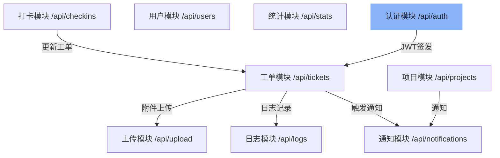

### 6.2 请求/响应格式

**请求头：**
```http
Content-Type: application/json
Authorization: Bearer <jwt_token>
```

**成功响应：**
```json
{
  "data": { ... }
}
```

**错误响应：**
```json
{
  "error": "错误信息"
}
```

### 6.3 文件上传

**支持的文件类型：**
- 图片：JPEG、PNG、GIF、WebP
- 文档：PDF、Word、Excel、纯文本
- 压缩包：ZIP

**限制：**
- 单文件最大 10MB
- 批量上传最多 5 个文件

---

## 7. Web 前端架构

### 7.1 架构原理

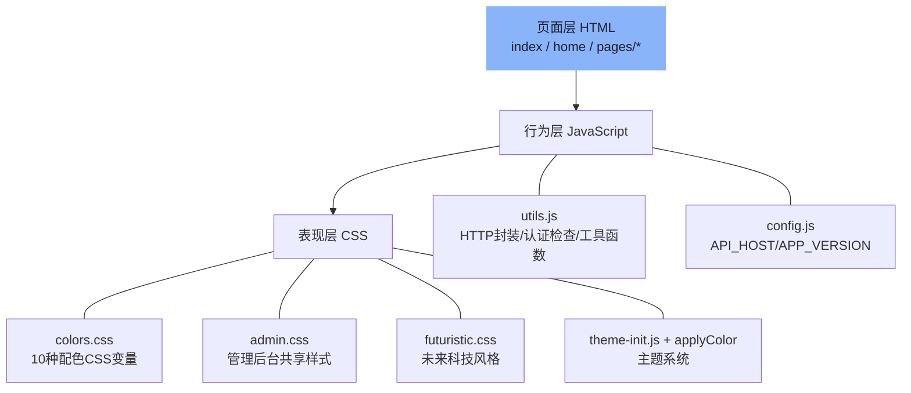

### 7.2 页面导航结构

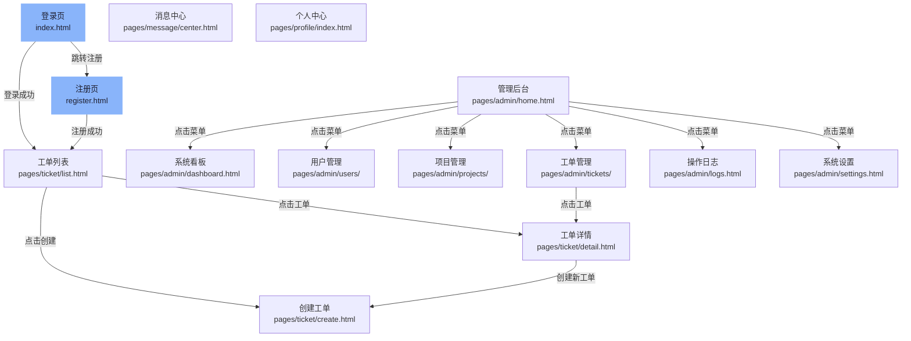

### 7.3 主题配色系统

**架构：**
```
colors.css          → CSS 变量定义（10 种配色）
theme-init.js       → 页面加载前立即应用配色（防闪烁）
applyColor(id)      → 动态注入 <style> 覆盖所有元素颜色
localStorage        → 持久化用户配色选择
```

**10 种配色方案：**

| ID | 名称 | 主色 |
|----|------|------|
| green | 科技绿 | `#00ff88` |
| blue | 赛博蓝 | `#00d4ff` |
| purple | 霓虹紫 | `#bf5af2` |
| red | 警戒红 | `#ff453a` |
| orange | 琥珀橙 | `#ff9f0a` |
| cyan | 青碧 | `#64d2ff` |
| pink | 粉晶 | `#ff6b9d` |
| yellow | 金黄 | `#ffd60a` |
| mint | 薄荷 | `#30d158` |
| silver | 银灰 | `#8e8e93` |

---

## 8. 小程序端架构

### 8.1 页面结构

```
miniprogram/pages/
├── auth/              # 认证模块
│   ├── login/         # 登录页
│   └── register/      # 注册页
├── ticket/            # 工单模块
│   ├── list/          # 工单列表（TabBar）
│   ├── create/        # 创建工单
│   └── detail/        # 工单详情
├── message/           # 消息模块
│   └── center/        # 消息中心（TabBar）
├── profile/           # 个人模块
│   └── profile        # 个人中心（TabBar）
└── admin/             # 管理模块
    ├── home/          # 管理首页（TabBar）
    ├── tickets/       # 工单管理
    ├── projects/      # 项目管理
    ├── users/         # 用户管理
    ├── settings/      # 系统设置
    └── logs/          # 操作日志
```

### 8.2 配置管理

```javascript
// miniprogram/config.js
const API_HOST = 'localhost';
const API_PORT = 12345;
const API_BASE_URL = 'http://' + API_HOST + ':' + API_PORT;
const APP_VERSION = 'v0.1.8';
```

---

## 9. 后端架构

### 9.1 启动流程

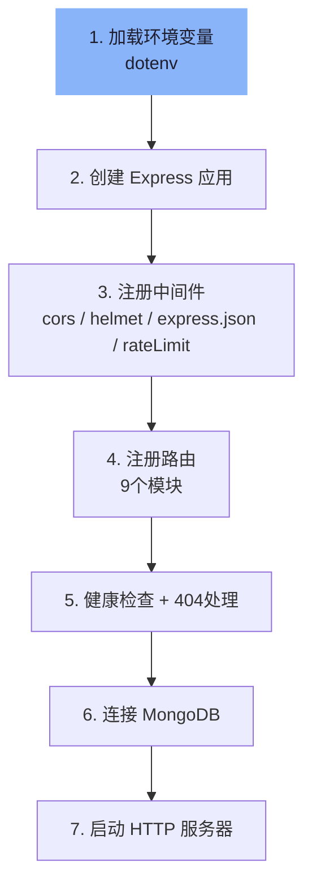

### 9.2 中间件

| 中间件 | 用途 |
|--------|------|
| `cors()` | 跨域支持 |
| `express.json()` | JSON 请求体解析 |
| `express-rate-limit` (全局) | 每分钟100次请求限制 |
| `express-rate-limit` (登录) | 每分钟10次登录限制 |
| `auth.js` | JWT 认证校验 |

---

## 10. 核心业务流程

### 10.1 工单生命周期

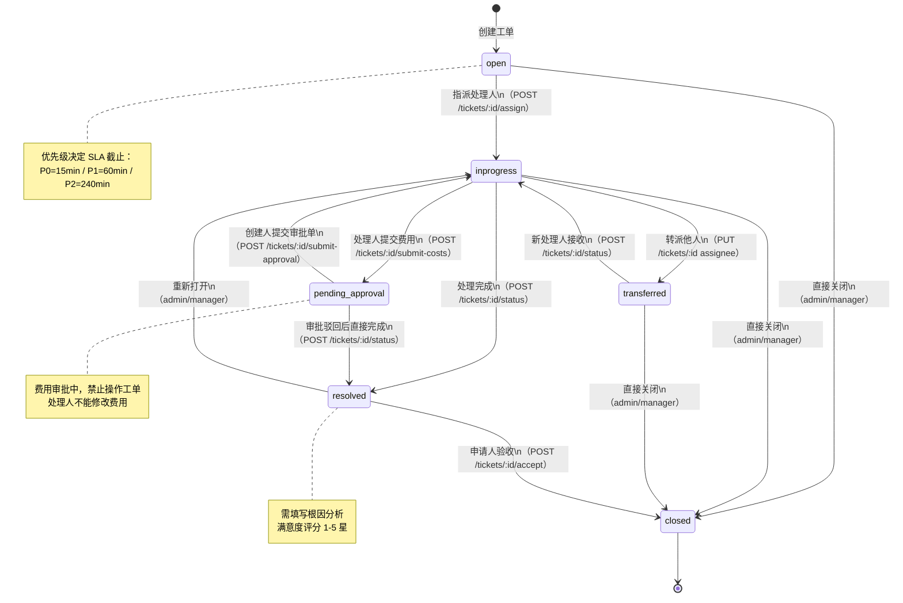

### 10.2 通知触发

| 操作 | 通知对象 | 通知内容 |
|------|---------|---------|
| 创建工单 | 创建者+处理人+管理员 | 新工单创建 |
| 状态变更 | 创建者+处理人 | 状态已更新 |
| 处理人变更 | 新处理人 | 工单已分派 |
| 创建项目 | 所有管理员 | 新项目创建 |
| 项目成员变更 | 被添加/移除成员 | 项目成员变更 |
| 导出日志 | 操作人 | 日志导出成功 |
| 修改密码 | 被修改用户 | 密码已修改 |

---

## 11. 认证与授权

### 11.1 JWT 认证流程

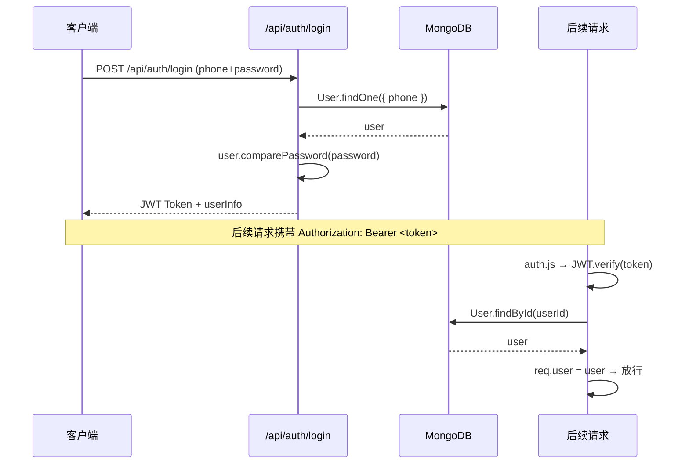

### 11.2 Token 结构

```javascript
{
  userId: ObjectId,   // 用户ID
  role: String,       // 用户角色
  iat: Number,        // 签发时间
  exp: Number         // 过期时间（7天）
}
```

---

## 12. 消息通知系统

通知类型：

| 类型 | 说明 | 用途 |
|------|------|------|
| ticket | 工单通知 | 工单创建、状态变更、分派 |
| project | 项目通知 | 项目创建、成员变更 |
| system | 系统通知 | 系统维护公告 |
| user | 用户通知 | 密码修改、用户操作 |
| file | 文件通知 | 日志导出成功 |

---

## 13. 部署架构

详见 [DEPLOYMENT.md](./DEPLOYMENT.md)

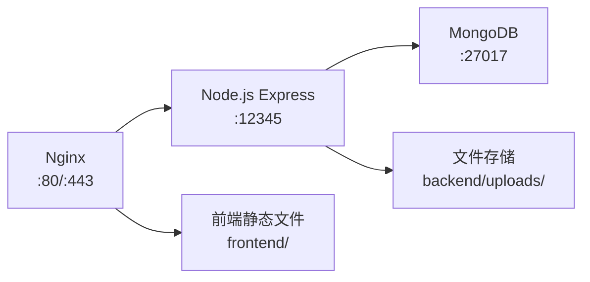

---

**文档版本**：v1.1  
**更新日期**：2026-09-03  
**维护者**：开发团队