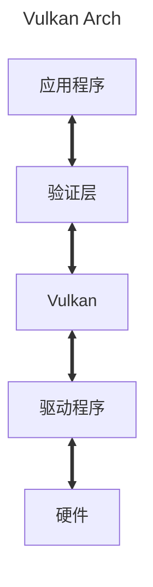

```markmap
# 启用验证层
## 全局启用
### 启用：export VK_INSTANCE_LAYERS=VK_LAYER_LUNARG_api_dump:VK_LAYER_LUNARG_core_validation(冒号分隔多个)
### 禁用：删除VK_INSTASNCE_LAYER环境变量
## 程序内启用
### 启用：创建实例过程插入命令
### 禁用：代码bu'bian'yi
```
在发布应用程序时候需要将验证层禁用


