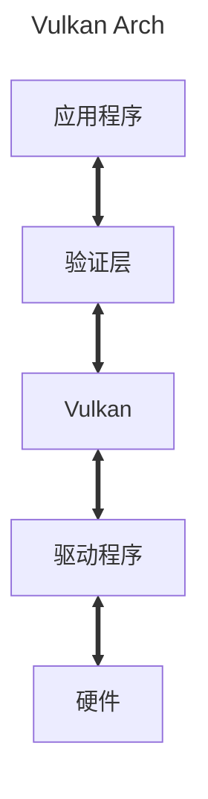

 # 体系结构

# 验证层启用
```markmap
# 启用验证层
## 全局启用
### 启用：export VK_INSTANCE_LAYERS=VK_LAYER_LUNARG_api_dump:VK_LAYER_LUNARG_core_validation(冒号分隔多个)
### 禁用：删除VK_INSTASNCE_LAYER环境变量
## 程序内启用
### 启用：创建实例过程插入命令
### 禁用：代码不编译
```
在发布应用程序时候需要将验证层禁用

# 连接Vulkan Loader
库在linux平台通常命名为：
**libvulkan.so.1**
我们通过：
```cpp
vulkan_library = dlopen("libvulkan.so.1", RTLD_NOW)
```
来进行加载，当成功加载Vulkan Loader后，我们就能够加载Vulkan专有函数，以便获取其他Vulkan API函数地址。
# 加载Vulkan函数
```markmap
# 加载Vulkan函数
## 使用vulkan.h
## 动态加载函数指针
```