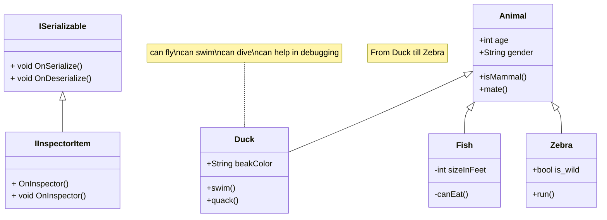

![[ClassDiagram.excalidraw]]

```mermaid
classDiagram
	class ISerializable	{
		+ void OnSerialize()
		+ void OnDeserialize()
	}

	class IInspectorItem {
		+ OnInspector()
	}

	ISerializable <|-- IInspectorItem
    note "From Duck till Zebra"
    Animal <|-- Duck
    note for Duck "can fly\ncan swim\ncan dive\ncan help in debugging"
    Animal <|-- Fish
    Animal <|-- Zebra
    Animal : +int age
    Animal : +String gender
    Animal: +isMammal()
    Animal: +mate()
    class Duck{
        +String beakColor
        +swim()
        +quack()
    }
    class Fish{
        -int sizeInFeet
        -canEat()
    }
    class Zebra{
        +bool is_wild
        +run()
    }
    class IInspectorItem {
		+ void OnInspector()
	}

```
